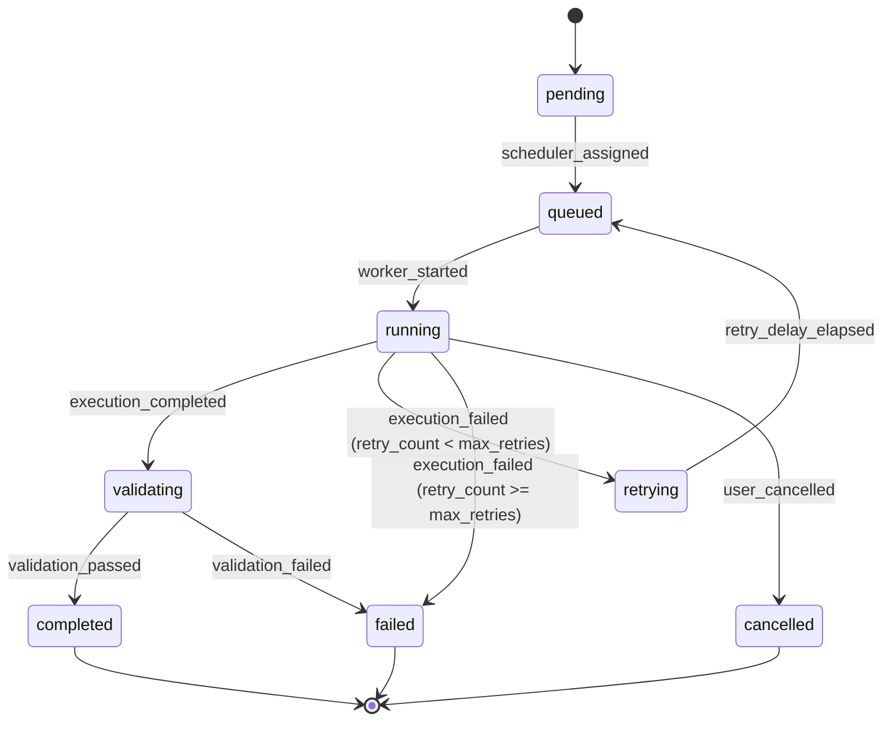
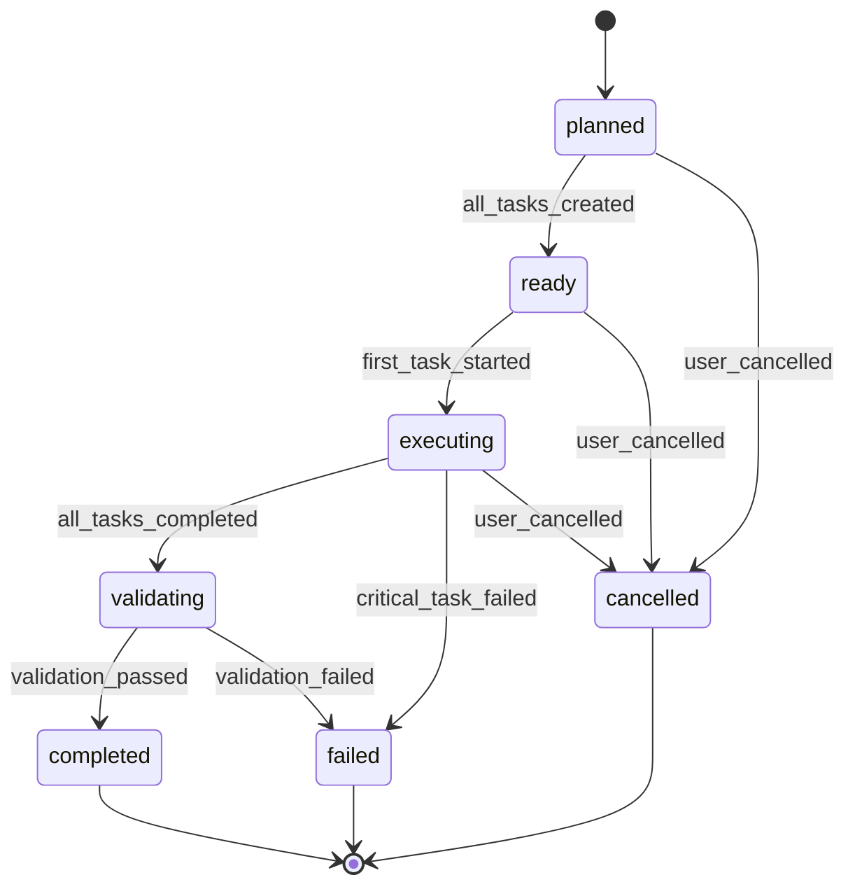
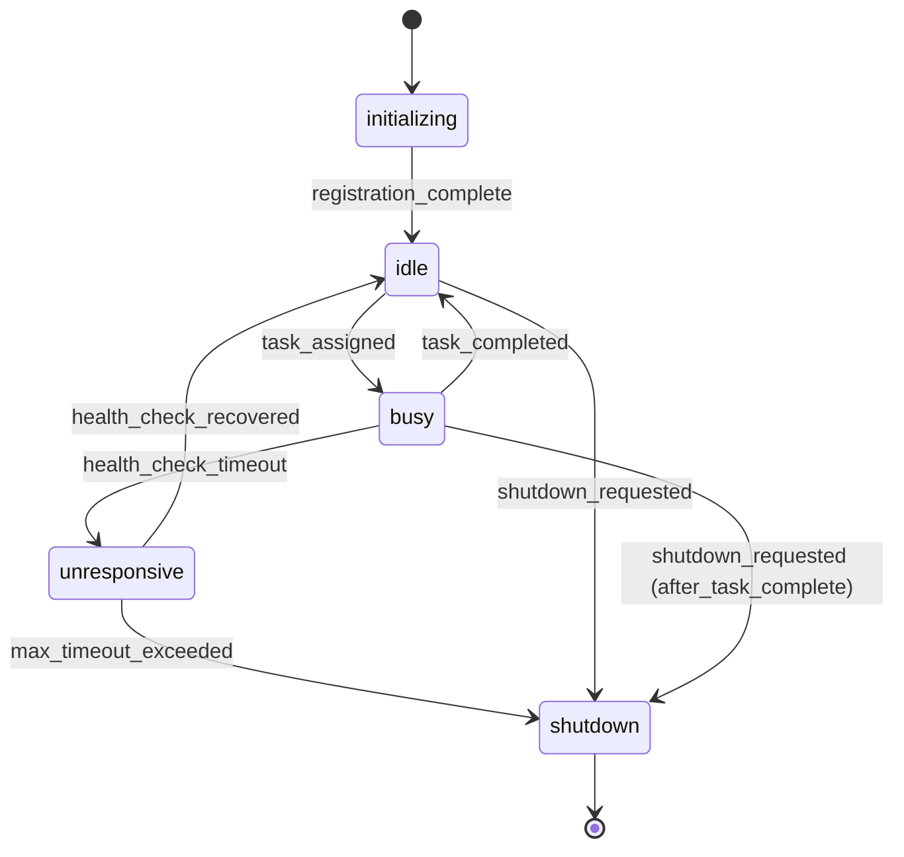

# State Machine Documentation

## Purpose
This document formally defines the state machines governing task, workstream, and worker lifecycles in the orchestration system.

## Task Lifecycle State Machine

### States

| State | Description | Terminal |
|-------|-------------|----------|
| `pending` | Task created, not yet scheduled | No |
| `queued` | Task scheduled, waiting for worker | No |
| `running` | Task executing on worker | No |
| `validating` | Task completed, validation in progress | No |
| `completed` | Task and validation successful | Yes |
| `failed` | Task or validation failed | Yes |
| `retrying` | Task failed, retry scheduled | No |
| `cancelled` | Task cancelled by user | Yes |

### Transitions



### Transition Details

#### pending → queued
- **Trigger**: `scheduler_assigned`
- **Guard**: Task dependencies satisfied
- **Actions**:
  - Assign task to execution stage
  - Update execution plan
  - Emit state transition event

#### queued → running
- **Trigger**: `worker_started`
- **Guard**: Worker with required capabilities available
- **Actions**:
  - Assign worker_id to task
  - Start task timeout timer
  - Set started_at timestamp
  - Emit state transition event

#### running → validating
- **Trigger**: `execution_completed`
- **Guard**: Worker reports exit_code == 0
- **Actions**:
  - Stop timeout timer
  - Run post_execution validation rules
  - Emit state transition event

#### running → retrying
- **Trigger**: `execution_failed`
- **Guard**: `retry_count < max_retries`
- **Actions**:
  - Increment retry_count
  - Schedule retry with exponential backoff
  - Release worker
  - Emit state transition event with severity="warning"

#### running → failed
- **Trigger**: `execution_failed`
- **Guard**: `retry_count >= max_retries`
- **Actions**:
  - Set last_error from worker output
  - Release worker
  - Mark dependent tasks as blocked
  - Emit state transition event with severity="error"

#### validating → completed
- **Trigger**: `validation_passed`
- **Guard**: All post_execution rules pass
- **Actions**:
  - Set completed_at timestamp
  - Unblock dependent tasks
  - Release resources
  - Emit state transition event

#### validating → failed
- **Trigger**: `validation_failed`
- **Guard**: Any post_execution rule fails
- **Actions**:
  - Set last_error with validation details
  - Mark dependent tasks as blocked
  - Emit state transition event with severity="error"

### Invariants

1. **Single Active State**: A task is in exactly one state at any time
2. **Monotonic Progress**: Terminal states cannot transition to non-terminal states
3. **Worker Assignment**: Only `running` tasks have assigned workers
4. **Retry Limit**: `retry_count` never exceeds `max_retries`
5. **Timestamp Ordering**: `created_at` ≤ `started_at` ≤ `completed_at`
6. **Dependency Satisfaction**: `queued` tasks have all dependencies in `completed` state

---

## Workstream Lifecycle State Machine

### States

| State | Description | Terminal |
|-------|-------------|----------|
| `planned` | Workstream defined, tasks not created | No |
| `ready` | All tasks created, ready to execute | No |
| `executing` | At least one task running | No |
| `validating` | All tasks completed, final validation | No |
| `completed` | Workstream successful, merged | Yes |
| `failed` | Workstream failed, preserved | Yes |
| `cancelled` | Workstream cancelled by user | Yes |

### Transitions



### State Derivation from Tasks

Workstream state is derived from task states:

```python
def derive_workstream_state(tasks: List[Task]) -> WorkstreamState:
    if any(t.state == 'running' for t in tasks):
        return 'executing'

    if all(t.state == 'completed' for t in tasks):
        return 'validating'  # Proceed to final validation

    if any(t.state == 'failed' for t in tasks):
        if task_is_critical(t):
            return 'failed'
        # Non-critical task failure, continue execution

    if all(t.state in ['pending', 'queued'] for t in tasks):
        return 'ready'

    return 'executing'  # Mixed states
```

### Transition Details

#### planned → ready
- **Trigger**: `all_tasks_created`
- **Guard**: Task count matches workstream specification
- **Actions**:
  - Generate DAG file
  - Create execution plan
  - Emit workstream event

#### ready → executing
- **Trigger**: `first_task_started`
- **Guard**: At least one task transitioned to `running`
- **Actions**:
  - Start workstream timer
  - Begin metrics collection
  - Emit workstream event

#### executing → validating
- **Trigger**: `all_tasks_completed`
- **Guard**: All tasks in `completed` state, no failures
- **Actions**:
  - Run final workstream validation
  - Prepare merge plan
  - Emit workstream event

#### executing → failed
- **Trigger**: `critical_task_failed`
- **Guard**: Critical task reached `failed` state
- **Actions**:
  - Cancel remaining tasks
  - Preserve workstream state for analysis
  - Emit workstream event with severity="critical"

#### validating → completed
- **Trigger**: `validation_passed`
- **Guard**: Final validation successful
- **Actions**:
  - Merge workstream to main branch
  - Archive state to `.state/archive/`
  - Clean up worktree
  - Emit completion event

### Invariants

1. **Task State Consistency**: Workstream state consistent with task states
2. **Completion Requirement**: Can only reach `completed` if all tasks `completed`
3. **Failure Propagation**: Critical task failure causes workstream failure
4. **Archive Preservation**: Failed workstreams preserved in `.state/archive/`

---

## Worker State Machine

### States

| State | Description | Terminal |
|-------|-------------|----------|
| `initializing` | Worker starting up | No |
| `idle` | Worker ready, no assigned tasks | No |
| `busy` | Worker executing task | No |
| `unresponsive` | Worker not responding to health checks | No |
| `shutdown` | Worker gracefully shutting down | Yes |

### Transitions



### Transition Details

#### initializing → idle
- **Trigger**: `registration_complete`
- **Guard**: Worker capabilities registered with orchestrator
- **Actions**:
  - Add worker to available pool
  - Start health check monitoring
  - Emit worker registration event

#### idle → busy
- **Trigger**: `task_assigned`
- **Guard**: Task requires capabilities worker provides
- **Actions**:
  - Assign task to worker
  - Start task execution
  - Update worker utilization metrics

#### busy → idle
- **Trigger**: `task_completed`
- **Guard**: Task finished (success or failure)
- **Actions**:
  - Release task assignment
  - Return worker to available pool
  - Update completion metrics

#### busy → unresponsive
- **Trigger**: `health_check_timeout`
- **Guard**: Worker missed N consecutive health checks
- **Actions**:
  - Mark assigned task for reassignment
  - Emit worker unresponsive event with severity="error"
  - Begin recovery attempts

#### unresponsive → idle
- **Trigger**: `health_check_recovered`
- **Guard**: Worker responds to health check
- **Actions**:
  - Clear unresponsive status
  - Return worker to available pool
  - Emit recovery event

### Invariants

1. **Capacity Limit**: Worker in `busy` state has task count ≤ max_concurrent_tasks
2. **Health Monitoring**: Only `idle` and `busy` workers send heartbeats
3. **Graceful Shutdown**: Workers in `shutdown` complete current tasks before terminating
4. **Resource Cleanup**: Failed workers release all held resources

---

## Event Schema

All state transitions emit events to `.state/transitions.jsonl`:

```json
{
  "timestamp": "2024-01-15T10:30:00.000Z",
  "event_type": "task_state_transition|workstream_state_transition|worker_state_transition",
  "severity": "info|warning|error|critical",
  "entity_id": "task-ulid-001|ws-ulid-001|worker-001",
  "from_state": "running",
  "to_state": "completed",
  "trigger": "execution_completed",
  "metadata": {
    "duration_seconds": 45,
    "retry_count": 0
  }
}
```

## Validation

State machine compliance can be validated using:

```bash
python scripts/validate/validate_state_transitions.py .state/transitions.jsonl
```

This checks:
- All transitions are valid per state machine definition
- Invariants are maintained
- Event schema is correct
- Timestamps are monotonic

## See Also
- [Overview](./OVERVIEW.md): Execution model architecture
- [Scheduling](./SCHEDULING.md): Task scheduling algorithm
- [Recovery](./RECOVERY.md): Failure recovery procedures
