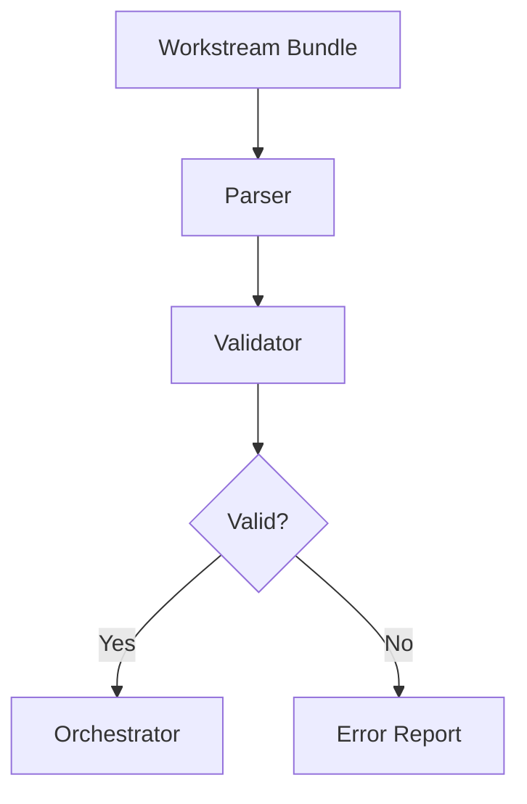
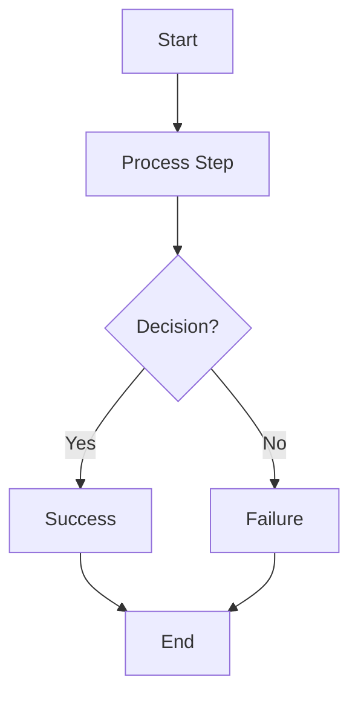
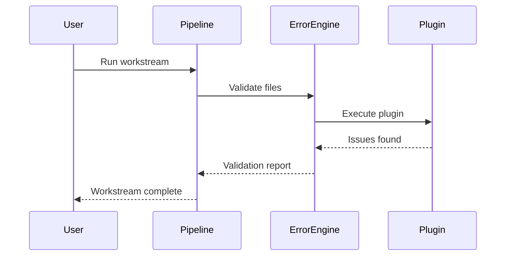
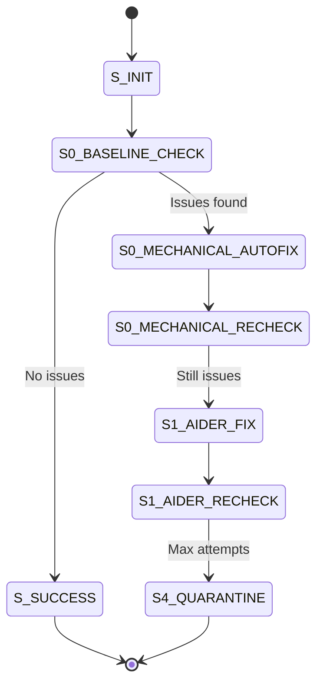
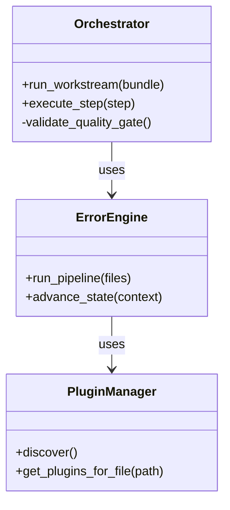
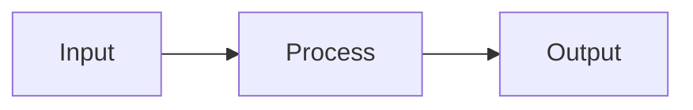

# Assets - Diagrams and Images

**Purpose**: Visual documentation, architecture diagrams, and reference images for the AI Development Pipeline.

## Overview

The `assets/` directory contains Mermaid diagrams, flowcharts, and visual documentation that illustrate system architecture, data flows, and integration patterns.

## Structure

```
assets/
├── diagrams/                        # Mermaid and XML diagrams
│   ├── data-flow-aim-integration.mmd
│   ├── data-flow-database.mmd
│   ├── data-flow-error-detection.mmd
│   ├── data-flow-workstream.mmd
│   ├── directory-structure.mmd
│   ├── integration-overview.mmd
│   ├── module-dependencies.mmd
│   └── new 3.xml
└── .gitkeep
```

## Diagram Catalog

### Data Flow Diagrams

#### AIM Integration Data Flow

**File**: `diagrams/data-flow-aim-integration.mmd`

**Purpose**: Visualizes how AIM+ (AI Manager) integrates with the pipeline for tool registry, health checks, and environment management.

**Key Elements**:
- AIM registry → Tool availability checks
- Pipeline → AIM health monitoring
- Auto-installation workflows
- Environment synchronization

**Usage**:
```bash
# Render with Mermaid CLI
mmdc -i assets/diagrams/data-flow-aim-integration.mmd -o aim-integration.png

# Or view in GitHub (auto-rendered)
```

#### Database Data Flow

**File**: `diagrams/data-flow-database.mmd`

**Purpose**: Shows SQLite state database interactions across pipeline components.

**Key Elements**:
- Workstream CRUD operations
- Worktree lifecycle tracking
- Step execution state
- Bundle loading/validation

#### Error Detection Data Flow

**File**: `diagrams/data-flow-error-detection.mmd`

**Purpose**: Illustrates error detection pipeline from file changes through agent escalation.

**Key Elements**:
- File hash cache → Incremental validation
- Plugin discovery and execution
- State machine transitions
- Agent escalation (Mechanical → Aider → Codex → Claude)

#### Workstream Data Flow

**File**: `diagrams/data-flow-workstream.mmd`

**Purpose**: End-to-end workstream execution flow.

**Key Elements**:
- Bundle parsing
- Step scheduling
- Tool invocation
- Quality gate validation
- Success/failure paths

### Architecture Diagrams

#### Directory Structure

**File**: `diagrams/directory-structure.mmd`

**Purpose**: High-level repository organization.

**Key Elements**:
- Section-based organization (core/, error/, specifications/)
- Deprecated paths (legacy/)
- Configuration and infrastructure

#### Integration Overview

**File**: `diagrams/integration-overview.mmd`

**Purpose**: System integration points and boundaries.

**Key Elements**:
- Core engine ↔ Error engine
- OpenSpec ↔ Workstreams
- AIM ↔ Tool execution
- GUI ↔ Engine
- External tools (Aider, pytest, git)

#### Module Dependencies

**File**: `diagrams/module-dependencies.mmd`

**Purpose**: Python module dependency graph.

**Key Elements**:
- Core imports error (for validation)
- Specifications bridge (OpenSpec conversion)
- Plugin system isolation
- Circular dependency detection

## Diagram Formats

### Mermaid (.mmd)

**Advantages**:
- Text-based (version control friendly)
- Auto-rendered in GitHub, GitLab, VS Code
- Multiple diagram types (flowchart, sequence, class, state, etc.)

**Example**:


**Rendering**:
- **GitHub**: Automatic in README and .md files
- **VS Code**: Mermaid extension
- **CLI**: `mmdc -i diagram.mmd -o diagram.png`

### XML Diagrams

**File**: `diagrams/new 3.xml`

**Format**: Draw.io / diagrams.net XML format

**Usage**:
1. Open https://app.diagrams.net/
2. File → Open → Select XML file
3. Edit and export as PNG/SVG

## Creating New Diagrams

### Mermaid Flowchart

**Template**:


**Save as**: `assets/diagrams/my-diagram.mmd`

### Mermaid Sequence Diagram

**Template**:


### Mermaid State Diagram

**Template** (Error State Machine):


### Mermaid Class Diagram

**Template**:


## Embedding Diagrams in Documentation

### In Markdown Files

**Direct Mermaid**:
````markdown

````

**Image Reference**:
```markdown

```

### In Code Comments

**Python**:
```python
"""
Orchestrator execution flow:

    Workstream Bundle
           ↓
    Parse & Validate
           ↓
    For Each Step:
      - Execute Tool
      - Validate Output
      - Update State
           ↓
    Quality Gate Check
           ↓
    Success / Failure
"""
```

## Diagram Maintenance

### Updating Diagrams

1. **Edit source file** (`.mmd` or `.xml`)
2. **Regenerate images** (if using PNG/SVG exports)
3. **Update references** in documentation
4. **Commit changes** to version control

### Versioning

- Diagrams follow semantic versioning if exported
- File naming: `diagram-name-v1.0.mmd`
- Archive old versions: `diagrams/archive/`

### Validation

**Check rendering**:
```bash
# Mermaid CLI
mmdc -i assets/diagrams/*.mmd

# Or use Mermaid Live Editor
# https://mermaid.live/
```

## Export Formats

### PNG (Raster)

**Use for**: Documentation, presentations

**Command**:
```bash
mmdc -i diagram.mmd -o diagram.png -w 1920 -H 1080
```

### SVG (Vector)

**Use for**: Scalable documentation, web

**Command**:
```bash
mmdc -i diagram.mmd -o diagram.svg
```

### PDF

**Use for**: Print documentation

**Command**:
```bash
mmdc -i diagram.mmd -o diagram.pdf
```

## Tools and Resources

### Diagram Editors

- **Mermaid Live Editor**: https://mermaid.live/
- **Draw.io / diagrams.net**: https://app.diagrams.net/
- **VS Code Mermaid Extension**: Search "Mermaid" in Extensions

### CLI Tools

**Install Mermaid CLI**:
```bash
npm install -g @mermaid-js/mermaid-cli
```

**Usage**:
```bash
# Single file
mmdc -i input.mmd -o output.png

# Batch process
mmdc -i 'diagrams/*.mmd' -o diagrams/
```

### Online Renderers

- **GitHub**: Auto-renders .mmd in markdown
- **GitLab**: Auto-renders .mmd
- **Mermaid Live**: https://mermaid.live/

## Diagram Types Reference

### Supported Mermaid Diagrams

| Type | Use Case | Example |
|------|----------|---------|
| **Flowchart** | Process flows, algorithms | `graph TD` |
| **Sequence** | Component interactions | `sequenceDiagram` |
| **Class** | Object models | `classDiagram` |
| **State** | State machines | `stateDiagram-v2` |
| **ER** | Database schemas | `erDiagram` |
| **Gantt** | Project timelines | `gantt` |
| **Pie** | Statistics | `pie` |
| **Journey** | User flows | `journey` |

### Syntax Examples

**See**: https://mermaid.js.org/intro/

## Best Practices

1. **Keep diagrams focused**: One concept per diagram
2. **Use consistent naming**: Match code/doc naming conventions
3. **Version control**: Commit source files (`.mmd`), not just exports
4. **Update with code**: Keep diagrams synchronized with implementation
5. **Add descriptions**: Include diagram purpose in file header

## Accessibility

**Alt text for images**:
```markdown

```

**Diagram descriptions**: Add text descriptions for screen readers

## Related Sections

- **Docs**: `docs/` - Documentation that references diagrams
- **GUI**: `gui/` - UI design docs with wireframes
- **Meta**: `meta/` - Phase development docs with architecture diagrams

## See Also

- [Mermaid Documentation](https://mermaid.js.org/)
- [Draw.io Documentation](https://www.drawio.com/doc/)
- [Architecture Decision Records](../docs/adr/)
