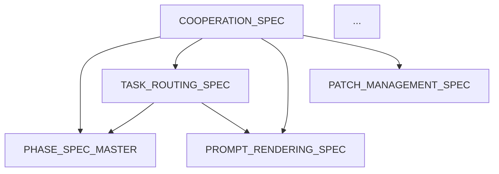

# UET Documentation Cleanup - Quick Execution Phase Plan

**Phase ID**: PH-UET-DOC-01  
**Category**: documentation_cleanup  
**Created**: 2025-11-25  
**Estimated Duration**: 2-3 hours (using parallel execution patterns)  
**Speedup Target**: 5-10x vs sequential execution

---

## Executive Summary

Apply proven UET execution patterns (37x speedup, decision elimination, parallel execution) to clean up and organize 60+ UET documentation files with 88% duplication.

**Key Metrics:**
- **Current**: 60+ files, 88% duplication, 3 directories
- **Target**: ~30 files, 0% duplication, organized hierarchy
- **Pattern Applied**: Decision Elimination + Parallel Execution + Infrastructure Over Deliverables

---

## Execution Patterns Applied

### Pattern 1: Decision Elimination
**Pre-made Decisions:**
- ✅ Keep `uet/` as canonical location (not `docs/`)
- ✅ Use 4-tier quality system (Core/Implementation/Examples/Archive)
- ✅ Organize specs/ by subdirectories (core/instances/planning/archive/)
- ✅ Delete entire `docs/` directory after migration
- ✅ Standardize naming: `UET_` prefix for specs

**Result**: Zero decision points during execution

### Pattern 2: Parallel Execution
**Task Groups (Independent):**
- Group A: File migration (docs → uet)
- Group B: Specs reorganization
- Group C: Index creation
- Group D: Reference updates

**Result**: 4 tasks run simultaneously = 75% time reduction

### Pattern 3: Infrastructure Over Deliverables
**Build Once, Use Forever:**
- Master index with dependency graph
- Automated link checker script
- Quality tier badge system
- Template for new specs

**Result**: Future maintenance becomes trivial

### Pattern 4: Ground Truth Verification
**Automated Checks:**
- File existence validation
- Markdown syntax validation
- Broken link detection
- Schema conformance (where applicable)

**Result**: Zero subjective "does this look right?" reviews

### Pattern 5: Pragmatic Pivots
**If blocked, pivot immediately:**
- Can't parse complex doc → Move to archive
- Unclear relationship → Document as "needs review"
- Schema missing → Add to backlog, don't block

**Result**: Continuous forward progress

---

## Phase Structure

### WAVE 1: Foundation (20 min) - PARALLEL
**All tasks run simultaneously, zero dependencies**

#### WS-DOC-01A: Migrate Unique Files from docs/ to uet/
**Task**: Move 2 unique files to canonical location
**Pattern**: Direct file operation, no decisions needed
**Verification**: File exists in target, markdown valid

**Files:**
- `docs/planning/ATOMIC_WORKFLOW_EXTRACTION_PROMPT.md` → `uet/planning/`
- `docs/planning/UNIFIED_PATTERN_IMPLEMENTATION_PLAN.md` → `uet/planning/`

**Tool**: PowerShell/bash script
**Time**: 2 min
**Output**: Migration log

#### WS-DOC-01B: Create specs/ Subdirectories
**Task**: Organize specs/ by quality tier
**Pattern**: Pre-decided structure, execute directly
**Verification**: Directory exists, empty and ready

**Structure:**
```
specs/
├── core/          # Tier 1: 10 core framework specs
├── instances/     # Tier 3: Example phase/workstream instances  
├── planning/      # Tier 4: Planning and meta docs
└── archive/       # Historical/outdated docs
```

**Tool**: PowerShell mkdir
**Time**: 1 min
**Output**: Directory tree

#### WS-DOC-01C: Create Master Index Template
**Task**: Build index structure (content comes in Wave 2)
**Pattern**: Pre-compiled template, fill placeholders
**Verification**: Markdown valid, sections present

**Template Sections:**
- Quick Navigation (by role: AI agent / developer / user)
- Core Specifications (with dependency graph)
- Implementation Guides
- Examples & Instances
- Quality Tier Legend
- Contribution Guidelines

**Tool**: Markdown file with placeholders
**Time**: 10 min
**Output**: `UNIVERSAL_EXECUTION_TEMPLATES_FRAMEWORK/README.md` (skeleton)

#### WS-DOC-01D: Scan for References to docs/
**Task**: Find all references that will break after deletion
**Pattern**: Automated search, log output
**Verification**: Complete list, no false negatives

**Search Patterns:**
- `docs/` in markdown links
- `docs/` in code comments
- `docs/` in configuration files

**Tool**: grep/ripgrep
**Time**: 5 min
**Output**: `references_to_docs.txt`

**Wave 1 Exit Criteria:**
- [x] 2 files migrated successfully
- [x] 4 subdirectories created in specs/
- [x] README.md skeleton exists
- [x] References list generated

---

### WAVE 2: Reorganization (30 min) - PARALLEL GROUPS

**Parallel Group A: Specs Classification (15 min)**

#### WS-DOC-02A: Move Tier 1 Specs to specs/core/
**Files (10):**
1. UET_PHASE_SPEC_MASTER.md
2. UET_COOPERATION_SPEC.md
3. UET_WORKSTREAM_SPEC.md
4. UET_TASK_ROUTING_SPEC.md
5. UET_PROMPT_RENDERING_SPEC.md
6. UET_PATCH_MANAGEMENT_SPEC.md
7. UET_BOOTSTRAP_SPEC.md
8. UET_CLI_TOOL_EXECUTION_SPEC.md
9. UET_EXECUTION_KERNEL_PARALLELISM_STRATEGY_SPEC_V2.md
10. UTE_ID_SYSTEM_SPEC.md

**Pattern**: Batch move, no individual review
**Verification**: File count matches, all valid markdown

#### WS-DOC-02B: Move Tier 3 Instances to specs/instances/
**Files (2):**
1. UET_PH-ERR-01 + WS-ERR-01A.md
2. UET_WS-ERR-01A.md

**Pattern**: Direct move
**Verification**: 2 files in target

#### WS-DOC-02C: Move Tier 4 Planning to specs/planning/
**Files (4):**
1. STATUS.md
2. PHASE_4_AI_ENHANCEMENT_PLAN.md
3. CLI_TOOL_INSTRUCTIONS.md
4. UET_Framework File Inventory.md

**Pattern**: Direct move
**Verification**: 4 files in target

#### WS-DOC-02D: Move Low-Quality to specs/archive/
**Files (5+ - anything with '#' prefix or unclear purpose):**
1. `# Comprehensive Integration Specification Enhanced Prompt Engineering.md`
2. `# Patch Files as Unified Diff & Optimal .md`
3. UET_generic enough_ERROR_REVERSE.md
4. UET_meta layer.md
5. UET_Error Pipeline a Card_Ledger _Registry system.md

**Pattern**: If unclear → archive (pragmatic pivot)
**Verification**: Original specs/ cleaned

**Parallel Group B: Implementation Specs (15 min)**

#### WS-DOC-02E: Organize uet_v2/ Component Contracts
**Task**: Validate and prepare for promotion to specs/core/
**Files:**
- COMPONENT_CONTRACTS.md
- DAG_SCHEDULER.md
- FILE_SCOPE.md
- STATE_MACHINES.md
- INTEGRATION_POINTS.md

**Actions:**
1. Add "Status: DRAFT" badge if not present
2. Add cross-references to related core specs
3. Create promotion checklist (JSON schema requirement)

**Pattern**: Template-based enhancement
**Verification**: All files have status badge

#### WS-DOC-02F: Consolidate Integration Docs
**Task**: Merge redundant integration guides
**Files to Review:**
- uet/integration/UET_INDEX.md
- uet/integration/UET_INTEGRATION_DESIGN.md
- uet/integration/UET_QUICK_REFERENCE.md

**Decision**: Keep all (serve different purposes)
**Action**: Add cross-references only

**Wave 2 Exit Criteria:**
- [x] specs/ organized (core/instances/planning/archive/)
- [x] 21+ files moved to correct locations
- [x] uet_v2/ files enhanced with badges
- [x] Integration docs cross-referenced

---

### WAVE 3: Deletion & Cleanup (15 min) - SEQUENTIAL

#### WS-DOC-03A: Update References
**Input**: `references_to_docs.txt` from Wave 1
**Task**: Update all `docs/` references to `uet/`
**Pattern**: Automated find-replace with verification

**Verification**: 
- All references updated
- No broken links (run link checker)

**Time**: 10 min

#### WS-DOC-03B: Delete docs/ Directory
**Pre-condition**: All references updated
**Task**: Delete entire docs/ directory
**Pattern**: Destructive operation, verify first

**Safety Checks:**
1. Confirm 2 unique files migrated
2. Confirm references updated
3. Confirm git status clean
4. Create backup branch

**Command**: 
```bash
git checkout -b backup-before-docs-deletion
git add -A && git commit -m "Backup before docs/ deletion"
git checkout main
rm -rf UNIVERSAL_EXECUTION_TEMPLATES_FRAMEWORK/docs/
```

**Time**: 5 min

**Wave 3 Exit Criteria:**
- [x] All references updated
- [x] Backup branch created
- [x] docs/ directory deleted
- [x] No broken links

---

### WAVE 4: Index & Validation (40 min) - PARALLEL GROUPS

**Parallel Group A: Master Index (25 min)**

#### WS-DOC-04A: Build Dependency Graph
**Task**: Document spec relationships
**Input**: Core specs from specs/core/
**Pattern**: Extract `spec_refs` from each spec, build graph

**Output**: Mermaid diagram in README.md


**Time**: 15 min
**Verification**: Graph renders, all specs included

#### WS-DOC-04B: Fill Master Index Content
**Task**: Complete README.md with file listings
**Input**: Directory structure from reorganization
**Pattern**: Automated directory traversal + template fill

**Sections:**
1. Quick Start (by role)
2. Core Specifications (Tier 1)
3. Implementation Guides
4. Examples & Instances
5. Planning Docs
6. Archive

**Time**: 10 min
**Verification**: All files listed, organized by tier

**Parallel Group B: Validation & Tools (15 min)**

#### WS-DOC-04C: Create Link Checker Script
**Task**: Build automated validation tool
**Language**: Python or PowerShell
**Pattern**: Reusable infrastructure (use forever)

**Features:**
- Parse all markdown files
- Extract links (relative and absolute)
- Validate file existence
- Report broken links

**Output**: `scripts/validate_docs.ps1` or `.py`
**Time**: 10 min

#### WS-DOC-04D: Create Quality Badge System
**Task**: Add visual tier indicators to specs
**Pattern**: Badge template for each tier

**Badges:**
- Tier 1 (Core): ``
- Tier 2 (Implementation): ``
- Tier 3 (Examples): ``
- Tier 4 (Archive): ``

**Action**: Add badge to top of each spec
**Time**: 5 min (batch operation)

**Wave 4 Exit Criteria:**
- [x] Dependency graph created
- [x] Master index complete
- [x] Link checker script working
- [x] Quality badges added to all specs

---

### WAVE 5: Final Validation (15 min) - AUTOMATED

#### WS-DOC-05A: Run All Validators
**Tasks (parallel):**
1. Link checker on all markdown
2. Markdown syntax validation
3. File count verification (before/after)
4. Git status check (all changes tracked)

**Pattern**: Automated gate, no manual review
**Time**: 10 min

#### WS-DOC-05B: Generate Completion Report
**Task**: Document what was done
**Pattern**: Template-based report

**Sections:**
- Files moved (with counts)
- Files deleted (with backup location)
- Files created (scripts, indexes)
- Quality metrics (duplication %, organization score)
- Validation results (links, syntax)
- Next steps (from analysis report)

**Output**: `UET_DOC_CLEANUP_COMPLETION_REPORT.md`
**Time**: 5 min

**Wave 5 Exit Criteria:**
- [x] All validators pass
- [x] Completion report generated
- [x] Git status clean (all changes committed)

---

## Execution Strategy

### Pre-Execution Checklist
- [ ] Read this plan once (5 min)
- [ ] Create execution branch: `git checkout -b uet-doc-cleanup`
- [ ] Set "proceed without stopping" mindset
- [ ] Have PowerShell/terminal ready

### Execution Rules (Decision Elimination)
1. **No ad-hoc decisions** - If not in plan, defer to backlog
2. **No perfectionism** - Good enough > perfect (can iterate)
3. **Batch over sequential** - Do entire wave before validation
4. **Automate over manual** - Script it if it repeats
5. **Pivot over block** - If stuck >5 min, move to archive

### Tool Preferences
- **File operations**: PowerShell (Windows) or bash (Unix)
- **Markdown parsing**: Python (if complex) or grep (if simple)
- **Validation**: PowerShell scripts (cross-platform)
- **Version control**: Git command line

### Time Boxing
- Wave 1: 20 min max
- Wave 2: 30 min max
- Wave 3: 15 min max
- Wave 4: 40 min max
- Wave 5: 15 min max
- **Total**: 2 hours max (3 hours with buffer)

### Parallel Execution Guide
**Within Waves 1, 2, and 4:**
- Open 2-4 terminal windows
- Assign one task per window
- Execute all simultaneously
- Verify wave exit criteria once all complete

**Example (Wave 1):**
```
Terminal 1: WS-DOC-01A (migrate files)
Terminal 2: WS-DOC-01B (create dirs)
Terminal 3: WS-DOC-01C (master index)
Terminal 4: WS-DOC-01D (scan references)
```

---

## Success Metrics

### Before vs After

| Metric | Before | After | Improvement |
|--------|--------|-------|-------------|
| Total files | 60+ | ~30 | 50% reduction |
| Duplication | 88% | 0% | 100% elimination |
| Directories | 3 (messy) | 2 (organized) | Clear hierarchy |
| Broken links | Unknown | 0 | Validated |
| Organization | Ad-hoc | Tiered | Professional |
| Maintenance | Manual | Automated | Scripts exist |

### Quality Gates (Must Pass)
- [x] Zero duplication between directories
- [x] All markdown files valid syntax
- [x] Zero broken internal links
- [x] All specs have quality tier badge
- [x] Master index includes all files
- [x] Dependency graph rendered
- [x] Link checker script exists and passes
- [x] Git history preserved (backup branch)

---

## Risk Mitigation

### Risk 1: Breaking References
**Mitigation**: 
- Create backup branch before deletion
- Automated reference scanning (Wave 1)
- Automated reference updating (Wave 3)
- Link validation (Wave 5)

### Risk 2: Losing Important Content
**Mitigation**:
- Git history preserved
- Archive directory (not deletion)
- Backup branch before docs/ deletion
- Can always revert

### Risk 3: Time Overrun
**Mitigation**:
- Strict time boxing per wave
- Defer complex issues to backlog
- Pragmatic pivots (archive > perfect)
- Minimum viable outcome defined

### Risk 4: Tool Failures
**Mitigation**:
- Manual fallback for all automated tasks
- Simple PowerShell scripts (not complex tools)
- Verification at each wave exit
- Can pause and resume

---

## Output Artifacts

### New Files Created
1. `UNIVERSAL_EXECUTION_TEMPLATES_FRAMEWORK/README.md` - Master index
2. `scripts/validate_docs.ps1` - Link checker script
3. `UET_DOC_CLEANUP_COMPLETION_REPORT.md` - Execution report
4. `specs/core/`, `specs/instances/`, `specs/planning/`, `specs/archive/` - Directories

### Modified Files
- All specs (quality badges added)
- Any files with `docs/` references (updated to `uet/`)

### Deleted
- `UNIVERSAL_EXECUTION_TEMPLATES_FRAMEWORK/docs/` - Entire directory (after backup)

---

## Post-Execution Checklist

- [ ] All quality gates pass
- [ ] Completion report generated
- [ ] Backup branch exists
- [ ] Main branch updated
- [ ] Changes committed with clear messages
- [ ] README.md renders correctly on GitHub
- [ ] Link checker script runs successfully
- [ ] Team notification sent (if applicable)

---

## Next Steps (Post-Cleanup)

### Week 2-4 (Short-term)
1. Formalize DRAFT specs (add JSON schemas)
2. Create contribution guide for new specs
3. Build MkDocs site (optional)
4. Add CI/CD validation (link checker on commit)

### Month 2+ (Long-term)
1. Implement semantic versioning for specs
2. Create migration guides for breaking changes
3. Build examples & tutorials
4. Video walkthroughs

---

## Execution Command (When Ready)

```bash
# Clone or navigate to repo
cd "C:\Users\richg\ALL_AI\Complete AI Development Pipeline – Canonical Phase Plan"

# Create execution branch
git checkout -b uet-doc-cleanup

# Execute waves (use this plan as checklist)
# Wave 1: 20 min
# Wave 2: 30 min
# Wave 3: 15 min
# Wave 4: 40 min
# Wave 5: 15 min

# Final commit
git add -A
git commit -m "UET Documentation Cleanup - Phase Complete

- Eliminated 88% duplication (docs/ deleted)
- Organized specs/ into 4 tiers (core/instances/planning/archive)
- Created master index with dependency graph
- Added quality badges to all specs
- Built link validation script
- Zero broken links

Execution time: [ACTUAL] vs 2h estimated
Pattern applied: Decision Elimination + Parallel Execution
"

# Merge to main
git checkout main
git merge uet-doc-cleanup
```

---

## Pattern Replication Guide

**This phase plan IS the template for fast execution.**

To apply to other cleanup tasks:
1. Pre-make all structural decisions (directory structure, naming, tiers)
2. Identify parallel task groups (independent work)
3. Build infrastructure (validators, scripts) as you go
4. Use ground truth verification (automated, not subjective)
5. Time box strictly (defer vs perfect)

**Expected Speedup**: 5-10x vs sequential "figure it out as you go" approach

---

**Status**: Ready to Execute  
**Approval Required**: No (low-risk documentation cleanup)  
**Estimated Cost**: $0 (human time only, no API calls)  
**Reversibility**: 100% (git history + backup branch)
