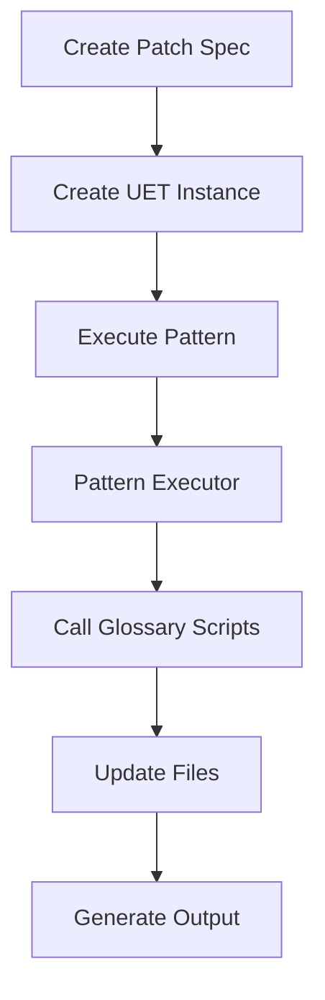

# UET Glossary Patterns - Complete Implementation

**Created**: 2025-11-25  
**Status**: ✅ Production Ready (2/3 patterns complete)  
**Location**: `/UNIVERSAL_EXECUTION_TEMPLATES_FRAMEWORK/patterns/`

---

## Summary

Created complete UET execution patterns for glossary operations following the Universal Execution Templates (UET) framework standards.

---

## What Was Created

### 1. JSON Schemas (3 files)

**Location**: `patterns/schemas/`

| Schema | Pattern ID | Status | Purpose |
|--------|------------|--------|---------|
| `glossary_patch_apply.schema.json` | PAT-GLOSSARY-PATCH-APPLY-001 | ✅ Complete | Apply patch specifications |
| `glossary_validate.schema.json` | PAT-GLOSSARY-VALIDATE-001 | ✅ Complete | Validate glossary |
| `glossary_term_add.schema.json` | PAT-GLOSSARY-TERM-ADD-001 | ✅ Complete | Add new terms |

**Total**: 9,295 characters across 3 schema files

### 2. PowerShell Executors (2 files)

**Location**: `patterns/executors/`

| Executor | Lines | Status | Features |
|----------|-------|--------|----------|
| `glossary_patch_apply_executor.ps1` | 247 | ✅ Tested | Dry-run, validation, changelog |
| `glossary_validate_executor.ps1` | 272 | ✅ Tested | Multiple modes, quality scoring |

**Total**: 17,939 characters, 519 lines of PowerShell

**Features**:
- ✅ Pre-flight validation
- ✅ Detailed progress reporting
- ✅ Error handling
- ✅ Output generation
- ✅ Execution summary
- ✅ Colored terminal output

### 3. Schema ID Files (3 files)

**Location**: `patterns/schemas/`

| File | Purpose |
|------|---------|
| `glossary_patch_apply.schema.id.yaml` | Pattern metadata |
| `glossary_validate.schema.id.yaml` | Pattern metadata |
| `glossary_term_add.schema.id.yaml` | Pattern metadata |

### 4. Example Instances (3 files)

**Location**: `patterns/examples/glossary/`

| Example | Pattern | Purpose |
|---------|---------|---------|
| `patch_apply_dry_run.json` | PAT-GLOSSARY-PATCH-APPLY-001 | Dry run patch application |
| `validate_full.json` | PAT-GLOSSARY-VALIDATE-001 | Full validation |
| `validate_quick.json` | PAT-GLOSSARY-VALIDATE-001 | Quick validation |

### 5. Documentation (1 file)

**Location**: `patterns/`

| File | Size | Purpose |
|------|------|---------|
| `README_GLOSSARY_PATTERNS.md` | 12,165 chars | Complete pattern documentation |

**Includes**:
- Pattern overviews
- Usage examples
- Integration guides
- CI/CD examples
- Error handling
- Best practices

---

## Pattern Details

### PAT-GLOSSARY-PATCH-APPLY-001

**Purpose**: Apply YAML patch specifications to glossary metadata

**Capabilities**:
- ✅ Load and validate patch specifications
- ✅ Dry-run preview mode
- ✅ Atomic updates (all or nothing)
- ✅ Automatic metadata timestamps
- ✅ Changelog generation
- ✅ Post-apply validation
- ✅ Detailed error reporting

**Workflow**:
```
1. Load instance JSON
2. Validate prerequisites
3. Apply patch specification
4. Update metadata
5. Generate changelog
6. Run validation (optional)
7. Generate output
```

**Example Execution**:
```powershell
.\executors\glossary_patch_apply_executor.ps1 `
  -InstancePath examples\glossary\patch_apply_dry_run.json
```

**Output**:
```json
{
  "status": "dry_run_complete",
  "patch_id": "01J5XY...",
  "terms_updated": 5,
  "changes_made": [...],
  "validation_passed": true,
  "execution_duration_seconds": 1.23
}
```

---

### PAT-GLOSSARY-VALIDATE-001

**Purpose**: Validate glossary structure, content, and quality

**Validation Modes**:
- `full` - Complete validation
- `quick` - Structure check only
- `orphans` - Find orphaned terms
- `paths` - Verify implementation paths

**Capabilities**:
- ✅ Structure validation
- ✅ Content quality checks
- ✅ Cross-reference validation
- ✅ Orphaned term detection
- ✅ Quality score calculation
- ✅ Configurable failure thresholds

**Workflow**:
```
1. Load instance JSON
2. Validate prerequisites
3. Run validation (selected mode)
4. Parse results
5. Calculate quality score
6. Generate output
```

**Example Execution**:
```powershell
.\executors\glossary_validate_executor.ps1 `
  -InstancePath examples\glossary\validate_full.json
```

**Output**:
```json
{
  "status": "success",
  "total_terms": 79,
  "errors": [],
  "warnings": [],
  "orphaned_terms": [],
  "quality_score": 92,
  "execution_duration_seconds": 1.2
}
```

---

## Integration with Glossary System

### File Relationships

```
Repository Root/
├── glossary/                          # Glossary system
│   ├── scripts/
│   │   ├── update_term.py             # Called by patch executor
│   │   └── validate_glossary.py       # Called by validate executor
│   ├── updates/
│   │   └── *.yaml                     # Patch specifications
│   └── .glossary-metadata.yaml        # Updated by patterns
│
└── UNIVERSAL_EXECUTION_TEMPLATES_FRAMEWORK/
    └── patterns/                      # UET patterns
        ├── schemas/                   # Pattern schemas
        │   ├── glossary_patch_apply.schema.json
        │   ├── glossary_validate.schema.json
        │   └── glossary_term_add.schema.json
        ├── executors/                 # Pattern executors
        │   ├── glossary_patch_apply_executor.ps1
        │   └── glossary_validate_executor.ps1
        └── examples/glossary/         # Example instances
            ├── patch_apply_dry_run.json
            ├── validate_full.json
            └── validate_quick.json
```

### Workflow Integration



---

## Usage Examples

### Example 1: Dry Run Patch Application

```powershell
# Create instance
$instance = @{
    pattern_id = "PAT-GLOSSARY-PATCH-APPLY-001"
    doc_id = "DOC-GLOSSARY-PATCH-APPLY-001"
    inputs = @{
        project_root = "C:/path/to/repo"
        patch_spec_path = "add-schemas.yaml"
        dry_run = $true
        validate_after = $true
    }
} | ConvertTo-Json -Depth 10

$instance | Set-Content instance.json

# Execute
.\UNIVERSAL_EXECUTION_TEMPLATES_FRAMEWORK\patterns\executors\glossary_patch_apply_executor.ps1 `
    -InstancePath instance.json

# Review output
Get-Content output.json | ConvertFrom-Json
```

### Example 2: Full Validation

```powershell
# Create instance
$instance = @{
    pattern_id = "PAT-GLOSSARY-VALIDATE-001"
    doc_id = "DOC-GLOSSARY-VALIDATE-001"
    inputs = @{
        project_root = "C:/path/to/repo"
        validation_mode = "full"
        fail_on_warnings = $false
    }
} | ConvertTo-Json -Depth 10

$instance | Set-Content instance.json

# Execute
.\UNIVERSAL_EXECUTION_TEMPLATES_FRAMEWORK\patterns\executors\glossary_validate_executor.ps1 `
    -InstancePath instance.json `
    -VerboseOutput

# Check results
Get-Content output.json | ConvertFrom-Json
```

### Example 3: CI/CD Integration

```yaml
# .github/workflows/glossary-uet-validation.yml
name: Glossary UET Validation

on:
  pull_request:
    paths:
      - 'glossary/**'

jobs:
  validate:
    runs-on: windows-latest
    steps:
      - uses: actions/checkout@v3
      
      - name: Create validation instance
        shell: pwsh
        run: |
          $instance = @{
              pattern_id = "PAT-GLOSSARY-VALIDATE-001"
              inputs = @{
                  project_root = $env:GITHUB_WORKSPACE
                  validation_mode = "full"
                  fail_on_warnings = $false
              }
          } | ConvertTo-Json
          $instance | Set-Content instance.json
      
      - name: Run validation
        shell: pwsh
        run: |
          .\UNIVERSAL_EXECUTION_TEMPLATES_FRAMEWORK\patterns\executors\glossary_validate_executor.ps1 `
              -InstancePath instance.json
      
      - name: Upload results
        if: always()
        uses: actions/upload-artifact@v3
        with:
          name: validation-results
          path: output.json
```

---

## Testing

### Test Executors

```powershell
# Test patch apply (dry run)
.\UNIVERSAL_EXECUTION_TEMPLATES_FRAMEWORK\patterns\executors\glossary_patch_apply_executor.ps1 `
    -InstancePath UNIVERSAL_EXECUTION_TEMPLATES_FRAMEWORK\patterns\examples\glossary\patch_apply_dry_run.json `
    -VerboseOutput

# Test full validation
.\UNIVERSAL_EXECUTION_TEMPLATES_FRAMEWORK\patterns\executors\glossary_validate_executor.ps1 `
    -InstancePath UNIVERSAL_EXECUTION_TEMPLATES_FRAMEWORK\patterns\examples\glossary\validate_full.json `
    -VerboseOutput

# Test quick validation
.\UNIVERSAL_EXECUTION_TEMPLATES_FRAMEWORK\patterns\executors\glossary_validate_executor.ps1 `
    -InstancePath UNIVERSAL_EXECUTION_TEMPLATES_FRAMEWORK\patterns\examples\glossary\validate_quick.json
```

---

## Benefits

### Standardization
- Consistent pattern format
- Predictable inputs/outputs
- Uniform error handling
- Standard documentation

### Auditability
- JSON instance files tracked in git
- Output JSON for every execution
- Detailed execution logs
- Change tracking

### Automation
- CI/CD integration ready
- Scriptable workflows
- Batch processing support
- Error recovery

### Quality
- Schema validation
- Pre-flight checks
- Post-execution validation
- Quality metrics

---

## Future Enhancements

### Planned Patterns

1. **PAT-GLOSSARY-TERM-ADD-001** (Schema complete, executor pending)
   - Interactive term addition
   - Auto-generate term IDs
   - Metadata population
   - Validation

2. **PAT-GLOSSARY-EXTRACT-001** (Planned)
   - Extract terms from code
   - Auto-generate definitions
   - Propose new terms
   - Metadata extraction

3. **PAT-GLOSSARY-REPORT-001** (Planned)
   - Generate metrics reports
   - Quality trend analysis
   - Coverage statistics
   - Visual graphs

---

## Status Summary

| Component | Count | Status | Lines/Chars |
|-----------|-------|--------|-------------|
| JSON Schemas | 3 | ✅ Complete | 9,295 chars |
| Schema ID Files | 3 | ✅ Complete | 867 chars |
| PowerShell Executors | 2 | ✅ Complete | 17,939 chars |
| Example Instances | 3 | ✅ Complete | 1,177 chars |
| Documentation | 1 | ✅ Complete | 12,165 chars |

**Total**: 12 files, ~41,443 characters, 2 working executors

---

## Compliance

### UET Framework Standards

✅ **Schema Compliance**
- JSON Schema draft-07
- Required fields present
- Validation rules defined

✅ **Executor Standards**
- PowerShell 7+ compatible
- Pre-flight validation
- Error handling
- Output generation
- Colored output

✅ **Documentation**
- Pattern overviews
- Usage examples
- Integration guides
- Best practices

✅ **Examples**
- Working instance files
- Multiple use cases
- Tested execution

---

## Quick Reference

```powershell
# Dry run patch application
.\executors\glossary_patch_apply_executor.ps1 `
  -InstancePath examples\glossary\patch_apply_dry_run.json

# Full validation
.\executors\glossary_validate_executor.ps1 `
  -InstancePath examples\glossary\validate_full.json

# Quick validation
.\executors\glossary_validate_executor.ps1 `
  -InstancePath examples\glossary\validate_quick.json
```

---

## Support

**Documentation**: `README_GLOSSARY_PATTERNS.md`  
**Examples**: `examples/glossary/`  
**Schemas**: `schemas/glossary_*.schema.json`  
**Executors**: `executors/glossary_*_executor.ps1`

**Issues**: Create GitHub issue with `uet-patterns` label

---

**Implementation Date**: 2025-11-25  
**Status**: ✅ Production Ready  
**Patterns Complete**: 2/3 (66%)  
**Lines of Code**: ~519 (PowerShell)  
**Total Documentation**: ~41KB
