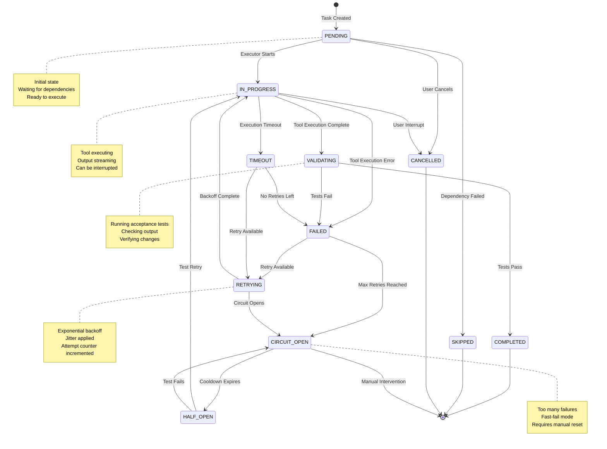
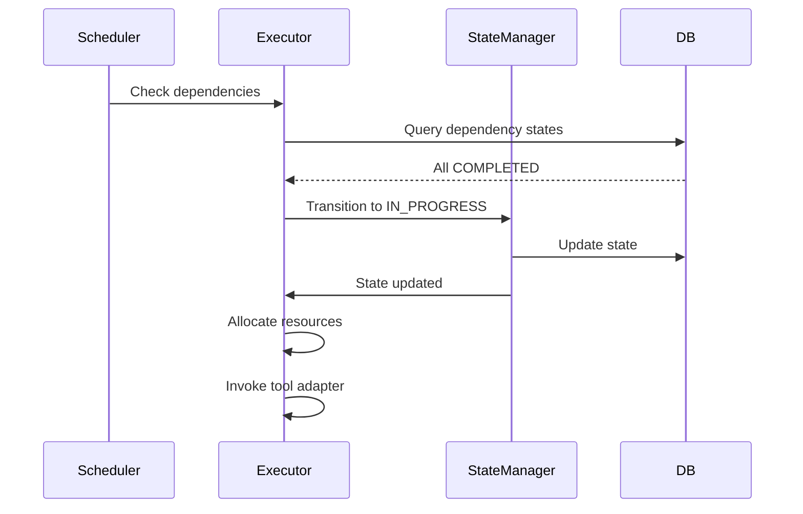
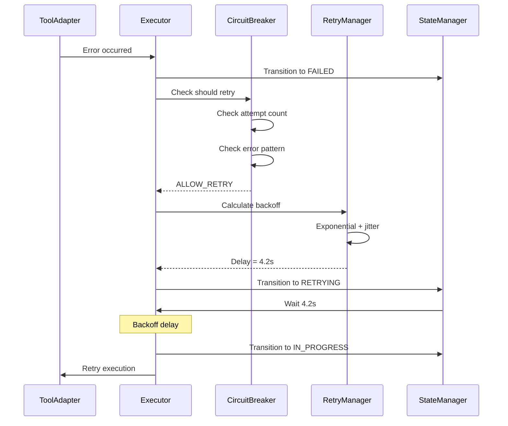
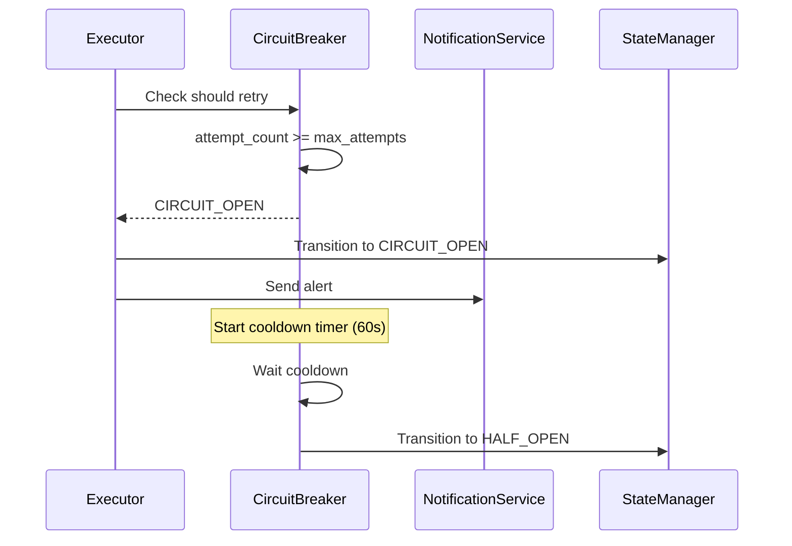
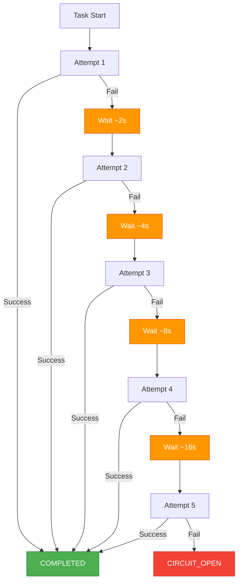

# Task Lifecycle

**Purpose**: Detailed state machine diagram showing the complete lifecycle of a workstream task from creation to completion.

---

## Task State Machine



---

## State Descriptions

### PENDING
**Entry Conditions**:
- Task created from workstream definition
- Dependencies not yet satisfied
- Executor not yet available

**Characteristics**:
- No resources allocated
- Can be cancelled without cleanup
- Dependency resolution in progress

**Exit Conditions**:
- All dependencies complete → IN_PROGRESS
- Any dependency fails → SKIPPED
- User cancels → CANCELLED

**Duration**: Variable (depends on dependencies)

---

### IN_PROGRESS
**Entry Conditions**:
- Dependencies satisfied
- Executor available
- Resources allocated

**Characteristics**:
- Tool adapter invoked
- Output streaming to logs
- Resources locked
- Can be interrupted (Ctrl+C)

**Exit Conditions**:
- Tool execution completes → VALIDATING
- Tool returns error → FAILED
- Execution exceeds timeout → TIMEOUT
- User interrupts → CANCELLED

**Duration**: Configurable timeout (default: 300s)

**Metrics Tracked**:
- Execution duration
- Tool invocation count
- Output size
- Resource usage

---

### VALIDATING
**Entry Conditions**:
- Tool execution completed successfully
- Output captured
- Ready for acceptance tests

**Characteristics**:
- Running acceptance test commands
- Checking file changes
- Verifying expected output
- No retries (validation is deterministic)

**Exit Conditions**:
- All tests pass → COMPLETED
- Any test fails → FAILED

**Duration**: Sum of all test timeouts (default: 30s each)

**Acceptance Test Types**:
- File existence checks
- Import validation (Python/JS)
- Unit test execution
- Lint checks
- Custom validation scripts

---

### COMPLETED
**Entry Conditions**:
- Validation passed
- All acceptance tests successful
- Output meets expectations

**Characteristics**:
- Final success state
- Resources released
- Results persisted to DB
- Checkpoint saved (if enabled)

**Exit Conditions**:
- None (terminal state)

**Metrics Recorded**:
- Total duration
- Retry count
- Output artifacts
- Test results

---

### FAILED
**Entry Conditions**:
- Tool execution error
- Validation failure
- Acceptance tests failed
- Timeout occurred

**Characteristics**:
- Error details captured
- Diagnostics collected
- Circuit breaker consulted
- Retry decision made

**Exit Conditions**:
- Retries available & circuit closed → RETRYING
- Max retries exceeded → CIRCUIT_OPEN
- Error marked as permanent → CIRCUIT_OPEN

**Error Categories**:
- **Transient**: Network issues, temporary unavailability → RETRY
- **Permanent**: Syntax errors, missing dependencies → FAIL
- **Unknown**: Unexpected errors → RETRY (with limit)

---

### RETRYING
**Entry Conditions**:
- Failure occurred
- Retry count < max_attempts
- Circuit breaker allows retry

**Characteristics**:
- Exponential backoff calculation
- Jitter applied (±25%)
- Attempt counter incremented
- Previous error logged

**Exit Conditions**:
- Backoff complete → IN_PROGRESS
- Circuit opens during wait → CIRCUIT_OPEN

**Backoff Formula**:
```
delay = base_delay * (2 ^ attempt) * (1 + random(-0.25, 0.25))
```

**Example Delays**:
- Attempt 1: ~2s
- Attempt 2: ~4s
- Attempt 3: ~8s
- Attempt 4: ~16s
- Attempt 5: ~32s

---

### CIRCUIT_OPEN
**Entry Conditions**:
- Max retries exhausted
- Same error repeated > threshold
- Permanent error detected

**Characteristics**:
- Fast-fail mode active
- No automatic retries
- Cooldown period started
- Alerts/notifications sent

**Exit Conditions**:
- Cooldown expires → HALF_OPEN
- Manual intervention/reset → PENDING
- Workstream cancelled → CANCELLED

**Cooldown Period**: Configurable (default: 60s)

**Purpose**:
- Prevent cascading failures
- Reduce load on failing services
- Allow time for recovery
- Trigger human intervention

---

### HALF_OPEN
**Entry Conditions**:
- Circuit cooldown expired
- System may have recovered

**Characteristics**:
- Test retry allowed
- Single attempt only
- Success → circuit closes
- Failure → circuit reopens

**Exit Conditions**:
- Test succeeds → IN_PROGRESS (circuit closes)
- Test fails → CIRCUIT_OPEN

**Purpose**:
- Probe for recovery
- Automatic healing
- Minimize manual intervention

---

### TIMEOUT
**Entry Conditions**:
- Task execution exceeds configured timeout
- Tool hasn't returned

**Characteristics**:
- Process/tool terminated
- Partial output captured
- Cleanup performed
- Retry decision made

**Exit Conditions**:
- Retries available → RETRYING
- No retries → FAILED

**Timeout Values**:
- Default: 300s (5 min)
- Per-tool override available
- Per-step override available

---

### SKIPPED
**Entry Conditions**:
- Dependency task failed
- Step marked optional and skipped
- Conditional not met

**Characteristics**:
- No execution attempted
- No resources used
- Logged as skipped
- May affect downstream tasks

**Exit Conditions**:
- None (terminal state)

---

### CANCELLED
**Entry Conditions**:
- User interrupt (Ctrl+C)
- Explicit cancel request
- Parent workstream cancelled

**Characteristics**:
- Graceful shutdown attempted
- Resources cleaned up
- Partial state saved
- Can resume if checkpoint enabled

**Exit Conditions**:
- None (terminal state)

**Cleanup Actions**:
- Kill tool processes
- Rollback partial changes (optional)
- Save checkpoint
- Release resources

---

## State Transition Details

### Transition: PENDING → IN_PROGRESS



---

### Transition: IN_PROGRESS → FAILED → RETRYING



---

### Transition: FAILED → CIRCUIT_OPEN



---

## Parallel Task Execution

```mermaid
gantt
    title Parallel Task Execution Example
    dateFormat  HH:mm:ss
    axisFormat %H:%M:%S

    section Task 1
    PENDING           :t1p, 00:00:00, 5s
    IN_PROGRESS       :t1i, after t1p, 30s
    VALIDATING        :t1v, after t1i, 5s
    COMPLETED         :t1c, after t1v, 1s

    section Task 2 (parallel)
    PENDING           :t2p, 00:00:00, 5s
    IN_PROGRESS       :t2i, after t2p, 25s
    VALIDATING        :t2v, after t2i, 5s
    COMPLETED         :t2c, after t2v, 1s

    section Task 3 (depends on 1&2)
    PENDING           :t3p, 00:00:00, 36s
    IN_PROGRESS       :t3i, after t2c, 20s
    VALIDATING        :t3v, after t3i, 5s
    COMPLETED         :t3c, after t3v, 1s
```



---

## Retry Behavior Visualization



---

## Database State Tracking

```sql
-- Task state table structure
CREATE TABLE task_states (
    task_id TEXT PRIMARY KEY,
    workstream_id TEXT NOT NULL,
    state TEXT NOT NULL,
    previous_state TEXT,
    attempt_count INTEGER DEFAULT 0,

    -- Timestamps
    created_at TIMESTAMP DEFAULT CURRENT_TIMESTAMP,
    started_at TIMESTAMP,
    completed_at TIMESTAMP,
    failed_at TIMESTAMP,

    -- Error tracking
    last_error TEXT,
    error_count INTEGER DEFAULT 0,
    circuit_state TEXT DEFAULT 'CLOSED',

    -- Metrics
    execution_duration_ms INTEGER,
    validation_duration_ms INTEGER,
    total_duration_ms INTEGER,

    -- Output
    output_size_bytes INTEGER,
    exit_code INTEGER,

    FOREIGN KEY (workstream_id) REFERENCES workstreams(id)
);

-- State transition log
CREATE TABLE state_transitions (
    id INTEGER PRIMARY KEY AUTOINCREMENT,
    task_id TEXT NOT NULL,
    from_state TEXT NOT NULL,
    to_state TEXT NOT NULL,
    timestamp TIMESTAMP DEFAULT CURRENT_TIMESTAMP,
    reason TEXT,
    metadata JSON,

    FOREIGN KEY (task_id) REFERENCES task_states(task_id)
);
```

---

## State Metrics

| State | Avg Duration | Success Rate | Common Next State |
|-------|-------------|--------------|-------------------|
| PENDING | 2-10s | 95% | IN_PROGRESS |
| IN_PROGRESS | 60-300s | 85% | VALIDATING |
| VALIDATING | 5-30s | 90% | COMPLETED |
| RETRYING | 2-32s | 70% | IN_PROGRESS |
| CIRCUIT_OPEN | 60s+ | 40% | HALF_OPEN |
| HALF_OPEN | <5s | 50% | IN_PROGRESS or CIRCUIT_OPEN |
| COMPLETED | 0s | 100% | N/A (terminal) |
| FAILED | 0s | 0% | N/A (terminal) |

---

## Configuration Options

```yaml
# Task lifecycle configuration
task_lifecycle:
  # Timeouts
  default_timeout: 300  # 5 minutes
  validation_timeout: 30  # 30 seconds per test

  # Retry configuration
  max_attempts: 5
  base_retry_delay: 2  # seconds
  max_retry_delay: 60  # seconds
  jitter_percentage: 25  # ±25%

  # Circuit breaker
  circuit_breaker:
    enabled: true
    max_error_repeats: 2
    cooldown_period: 60  # seconds

  # State persistence
  checkpoint:
    enabled: true
    save_on_states: [COMPLETED, FAILED, CIRCUIT_OPEN]

  # Cleanup
  cleanup_on_cancel: true
  save_partial_output: true
```

---

## Related Documentation

- [System Architecture](./SYSTEM_ARCHITECTURE.md) - Overall system design
- [Error Escalation](./ERROR_ESCALATION.md) - Error handling flow
- [Circuit Breaker Pattern](../patterns/CIRCUIT_BREAKER.md) - Detailed circuit breaker docs

---

**Last Updated**: 2025-11-22
**Maintainer**: Architecture Team
**Implementation**: `core/engine/executor.py`, `core/state/state_manager.py`
