# End-to-End Pipeline Visual Diagram (Horizontal Layout)

> **Complete System Overview**  
> This diagram shows the entire AI development pipeline from input to output in a horizontal flow, including all major components, state machines, and data flows.

---

## 📊 Complete Pipeline Flow

```mermaid
%%{init: {'theme':'base', 'themeVariables': {'fontSize':'13px', 'fontFamily':'Arial'}}}%%
graph LR
    %% ============================================================================
    %% STAGE 1: INPUT SOURCES
    %% ============================================================================
    subgraph INPUT["🚪 STAGE 1: INPUT SOURCES"]
        direction TB
        USER["👤 User/Developer"]
        WS_JSON["📦 Workstream Bundle<br/><small>workstreams/*.json</small>"]
        PM_EPIC["📋 PM Epic<br/><small>pm/epic-*.yaml</small>"]
        MANUAL_SPEC["📝 Manual Spec<br/><small>specifications/*.yaml</small>"]
    end

    %% ============================================================================
    %% STAGE 2: VALIDATION & LOADING
    %% ============================================================================
    subgraph VALIDATION["✅ STAGE 2: VALIDATION"]
        direction TB
        SCHEMA_VAL["🔍 Schema Validation<br/><small>schema/validation</small>"]
        LOAD_DB["💾 Load to Database<br/><small>core.state.crud</small>"]
        CONFIG_LOAD["⚙️ Configuration Loader<br/><small>config cascade</small>"]
    end

    %% ============================================================================
    %% STAGE 3: PLANNING & DECOMPOSITION
    %% ============================================================================
    subgraph PLANNING["📋 STAGE 3: PLANNING"]
        direction TB
        PLANNER["🧠 Core Planner<br/><small>core.planner</small>"]
        DECOMPOSE["🔨 Task Decomposition<br/><small>Break into units</small>"]
        DEP_GRAPH["🔗 Dependency Graph<br/><small>Build DAG</small>"]
        BUNDLE["📦 Bundle Creation<br/><small>core.state.bundles</small>"]
    end

    %% ============================================================================
    %% STAGE 4: SCHEDULING
    %% ============================================================================
    subgraph SCHEDULING["⏱️ STAGE 4: SCHEDULING"]
        direction TB
        SCHEDULER["📅 Task Scheduler<br/><small>core.engine.scheduler</small>"]
        DEP_RESOLVE["🔀 Dependency Resolution<br/><small>Topological sort</small>"]
        QUEUE_MGR["📥 Queue Manager<br/><small>engine.queue</small>"]
        PRIORITY["⭐ Priority Assignment<br/><small>Critical path</small>"]
    end

    %% ============================================================================
    %% STAGE 5: EXECUTION ENGINE
    %% ============================================================================
    subgraph EXECUTION["⚙️ STAGE 5: EXECUTION"]
        direction TB
        ORCHESTRATOR["🎯 Orchestrator<br/><small>engine.orchestrator</small>"]
        WORKTREE["🌳 Git Worktree<br/><small>core.state.worktree</small>"]
        
        subgraph PHASES["Execution Phases"]
            EDIT["✏️ EDIT Phase<br/><small>Code Gen</small>"]
            STATIC["🔍 STATIC Phase<br/><small>Linting</small>"]
            RUNTIME["▶️ RUNTIME Phase<br/><small>Testing</small>"]
        end
        
        EXECUTOR["⚡ Executor<br/><small>core.engine.executor</small>"]
        
        subgraph ADAPTERS["Tool Adapters"]
            AIDER["🤖 Aider<br/><small>AI coding</small>"]
            CLAUDE["🧠 Claude<br/><small>AI analysis</small>"]
            COPILOT["✨ Copilot<br/><small>Completion</small>"]
        end
        
        WORKER_POOL["👷 Worker Pool<br/><small>Dynamic scaling</small>"]
    end

    %% ============================================================================
    %% STAGE 6: ERROR DETECTION
    %% ============================================================================
    subgraph ERROR_DETECT["🔍 STAGE 6: ERROR DETECTION"]
        direction TB
        ERROR_ENGINE["⚡ Error Engine<br/><small>error.engine</small>"]
        
        subgraph PLUGINS["Detection Plugins"]
            PYTHON_LINT["🐍 Python Ruff<br/><small>mypy, pylint</small>"]
            JS_LINT["📜 ESLint<br/><small>TypeScript</small>"]
            SEC_SCAN["🔒 Security<br/><small>Bandit, snyk</small>"]
            TEST_RUN["🧪 Pytest<br/><small>Test runner</small>"]
        end
        
        CLASSIFIER["🏷️ Error Classifier<br/><small>Auto/Manual</small>"]
    end

    %% ============================================================================
    %% STAGE 7: RECOVERY & RESILIENCE
    %% ============================================================================
    subgraph RECOVERY["🔄 STAGE 7: RECOVERY"]
        direction TB
        CB_MGR["🔌 Circuit Breaker<br/><small>Per-tool protection</small>"]
        RETRY["🔁 Retry Handler<br/><small>Exponential backoff</small>"]
        AUTO_FIX["🔧 Auto-Fix Engine<br/><small>error.plugins.fix()</small>"]
        ROLLBACK["↩️ Rollback Manager<br/><small>Patch revert</small>"]
    end

    %% ============================================================================
    %% STAGE 8: STATE & PERSISTENCE
    %% ============================================================================
    subgraph STATE_LAYER["💾 STAGE 8: STATE MANAGEMENT"]
        direction TB
        
        subgraph STATE_MACHINES["State Machines"]
            RUN_SM["▶️ Run SM<br/><small>5 states</small>"]
            WS_SM["📦 Workstream SM<br/><small>9 states</small>"]
            TASK_SM["✅ Task SM<br/><small>9 states</small>"]
            ORCH_WORKER_SM["👷 Orch Worker SM<br/><small>5 states</small>"]
            UET_WORKER_SM["🔧 UET Worker SM<br/><small>5 states</small>"]
            PATCH_SM["📝 Patch SM<br/><small>10 states</small>"]
            GATE_SM["🚦 Test Gate SM<br/><small>5 states</small>"]
            CB_SM["🔌 CB SM<br/><small>3 states</small>"]
        end
        
        STATE_DB["🗄️ State Database<br/><small>SQLite/PostgreSQL</small>"]
    end

    %% ============================================================================
    %% STAGE 9: OUTPUT & MONITORING
    %% ============================================================================
    subgraph OUTPUT["📤 STAGE 9: OUTPUT & MONITORING"]
        direction TB
        
        subgraph OUTPUTS["Outputs"]
            MODULES["📦 Modules<br/><small>Generated code</small>"]
            LOGS["📋 Logs<br/><small>Event JSONL</small>"]
            STATE_FILE["💾 State Files<br/><small>Runtime data</small>"]
            ARCHIVE["📁 Archive<br/><small>Completed work</small>"]
        end
        
        subgraph MONITORING["Monitoring"]
            METRICS["📊 Metrics<br/><small>Prometheus</small>"]
            HEALTH["❤️ Health Check<br/><small>/health endpoint</small>"]
            DASHBOARD["📈 Dashboard<br/><small>gui/display</small>"]
        end
    end

    %% ============================================================================
    %% MAIN FLOW CONNECTIONS
    %% ============================================================================
    
    %% Stage 1 → Stage 2
    USER --> WS_JSON
    USER --> PM_EPIC
    USER --> MANUAL_SPEC
    WS_JSON --> SCHEMA_VAL
    PM_EPIC --> SCHEMA_VAL
    MANUAL_SPEC --> SCHEMA_VAL
    
    %% Stage 2 → Stage 3
    SCHEMA_VAL --> LOAD_DB
    SCHEMA_VAL --> CONFIG_LOAD
    LOAD_DB --> PLANNER
    CONFIG_LOAD --> PLANNER
    
    %% Stage 3 → Stage 4
    PLANNER --> DECOMPOSE
    DECOMPOSE --> DEP_GRAPH
    DEP_GRAPH --> BUNDLE
    BUNDLE --> SCHEDULER
    
    %% Stage 4 → Stage 5
    SCHEDULER --> DEP_RESOLVE
    DEP_RESOLVE --> QUEUE_MGR
    QUEUE_MGR --> PRIORITY
    PRIORITY --> ORCHESTRATOR
    
    %% Stage 5 Internal Flow
    ORCHESTRATOR --> WORKTREE
    WORKTREE --> EDIT
    EDIT --> STATIC
    STATIC --> RUNTIME
    EDIT --> EXECUTOR
    STATIC --> EXECUTOR
    RUNTIME --> EXECUTOR
    EXECUTOR --> AIDER
    EXECUTOR --> CLAUDE
    EXECUTOR --> COPILOT
    EXECUTOR --> WORKER_POOL
    
    %% Stage 5 → Stage 6
    EXECUTOR --> ERROR_ENGINE
    AIDER --> ERROR_ENGINE
    CLAUDE --> ERROR_ENGINE
    COPILOT --> ERROR_ENGINE
    
    %% Stage 6 Internal Flow
    ERROR_ENGINE --> PYTHON_LINT
    ERROR_ENGINE --> JS_LINT
    ERROR_ENGINE --> SEC_SCAN
    ERROR_ENGINE --> TEST_RUN
    PYTHON_LINT --> CLASSIFIER
    JS_LINT --> CLASSIFIER
    SEC_SCAN --> CLASSIFIER
    TEST_RUN --> CLASSIFIER
    
    %% Stage 6 → Stage 7
    CLASSIFIER -->|"Errors Found"| CB_MGR
    CB_MGR --> RETRY
    CB_MGR --> AUTO_FIX
    RETRY --> EXECUTOR
    AUTO_FIX --> EXECUTOR
    CLASSIFIER -->|"Critical Failure"| ROLLBACK
    ROLLBACK --> STATE_DB
    
    %% Stage 7 → Stage 8
    EXECUTOR --> RUN_SM
    EXECUTOR --> WS_SM
    EXECUTOR --> TASK_SM
    EXECUTOR --> ORCH_WORKER_SM
    EXECUTOR --> UET_WORKER_SM
    AUTO_FIX --> PATCH_SM
    RUNTIME --> GATE_SM
    CB_MGR --> CB_SM
    RUN_SM --> STATE_DB
    WS_SM --> STATE_DB
    TASK_SM --> STATE_DB
    ORCH_WORKER_SM --> STATE_DB
    UET_WORKER_SM --> STATE_DB
    PATCH_SM --> STATE_DB
    GATE_SM --> STATE_DB
    CB_SM --> STATE_DB
    
    %% Stage 8 → Stage 9
    STATE_DB --> MODULES
    STATE_DB --> LOGS
    STATE_DB --> STATE_FILE
    STATE_DB --> ARCHIVE
    STATE_DB --> METRICS
    STATE_DB --> HEALTH
    LOGS --> DASHBOARD
    METRICS --> DASHBOARD
    HEALTH --> DASHBOARD
    
    %% Feedback Loops
    DASHBOARD -.->|"Manual Override"| ORCHESTRATOR
    HEALTH -.->|"Circuit Open"| CB_MGR
    METRICS -.->|"Scale Workers"| WORKER_POOL
    
    %% ============================================================================
    %% STYLING
    %% ============================================================================
    
    classDef inputStyle fill:#E8D5F2,stroke:#8E44AD,stroke-width:3px,color:#000
    classDef validationStyle fill:#AED6F1,stroke:#3498DB,stroke-width:3px,color:#000
    classDef planningStyle fill:#A9DFBF,stroke:#27AE60,stroke-width:3px,color:#000
    classDef schedulingStyle fill:#FAD7A0,stroke:#F39C12,stroke-width:3px,color:#000
    classDef executionStyle fill:#F9E79F,stroke:#F1C40F,stroke-width:3px,color:#000
    classDef errorStyle fill:#F5B7B1,stroke:#E74C3C,stroke-width:3px,color:#000
    classDef recoveryStyle fill:#D7BDE2,stroke:#9B59B6,stroke-width:3px,color:#000
    classDef stateStyle fill:#AEB6BF,stroke:#566573,stroke-width:3px,color:#000
    classDef outputStyle fill:#A9CCE3,stroke:#2980B9,stroke-width:3px,color:#000
    
    class INPUT,USER,WS_JSON,PM_EPIC,MANUAL_SPEC inputStyle
    class VALIDATION,SCHEMA_VAL,LOAD_DB,CONFIG_LOAD validationStyle
    class PLANNING,PLANNER,DECOMPOSE,DEP_GRAPH,BUNDLE planningStyle
    class SCHEDULING,SCHEDULER,DEP_RESOLVE,QUEUE_MGR,PRIORITY schedulingStyle
    class EXECUTION,ORCHESTRATOR,WORKTREE,PHASES,EDIT,STATIC,RUNTIME,EXECUTOR,ADAPTERS,AIDER,CLAUDE,COPILOT,WORKER_POOL executionStyle
    class ERROR_DETECT,ERROR_ENGINE,PLUGINS,PYTHON_LINT,JS_LINT,SEC_SCAN,TEST_RUN,CLASSIFIER errorStyle
    class RECOVERY,CB_MGR,RETRY,AUTO_FIX,ROLLBACK recoveryStyle
    class STATE_LAYER,STATE_MACHINES,RUN_SM,WS_SM,TASK_SM,ORCH_WORKER_SM,UET_WORKER_SM,PATCH_SM,GATE_SM,CB_SM,STATE_DB stateStyle
    class OUTPUT,OUTPUTS,MODULES,LOGS,STATE_FILE,ARCHIVE,MONITORING,METRICS,HEALTH,DASHBOARD outputStyle
```



---

## 📖 Stage Descriptions

### 🚪 Stage 1: Input Sources
**Purpose**: Accept and consolidate input from multiple sources

- **User/Developer**: Primary actor initiating pipeline
- **Workstream Bundles**: JSON specifications for work packages
- **PM Epics**: Project management integration
- **Manual Specs**: Direct YAML specifications

**Key Files**: `workstreams/*.json`, `specifications/*.yaml`, `pm/*.yaml`

---

### ✅ Stage 2: Validation
**Purpose**: Validate inputs against schemas and load configuration

- **Schema Validation**: Ensures all inputs conform to defined schemas
- **Database Loading**: Persists validated data to state database
- **Configuration Loading**: Loads tool profiles, circuit breaker settings, router config

**Key Components**: `schema/validation`, `core.state.crud`, `config/`

**Success Criteria**: All schemas pass, data loaded to DB

---

### 📋 Stage 3: Planning
**Purpose**: Decompose work into executable tasks with dependencies

- **Core Planner**: Analyzes workstream and generates execution plan
- **Task Decomposition**: Breaks workstream into atomic tasks
- **Dependency Graph**: Builds directed acyclic graph (DAG) of task dependencies
- **Bundle Creation**: Packages tasks with metadata

**Key Components**: `core.planner`, `core.state.bundles`

**Output**: Task DAG ready for scheduling

---

### ⏱️ Stage 4: Scheduling
**Purpose**: Order tasks and manage execution queue

- **Task Scheduler**: Orchestrates task timing and worker assignment
- **Dependency Resolution**: Topological sort to determine execution order
- **Queue Manager**: Manages task queue with priority
- **Priority Assignment**: Identifies critical path tasks

**Key Components**: `core.engine.scheduler`, `engine.queue`

**Output**: Prioritized task queue

---

### ⚙️ Stage 5: Execution
**Purpose**: Execute tasks using appropriate tools and workers

- **Orchestrator**: Coordinates overall execution flow
- **Git Worktree**: Creates isolated workspace for each task
- **Execution Phases**:
  - **EDIT**: Code generation/modification
  - **STATIC**: Linting and static analysis
  - **RUNTIME**: Testing and validation
- **Executor**: Invokes tools via adapters
- **Tool Adapters**: Normalize interfaces to Aider, Claude, Copilot
- **Worker Pool**: Dynamic pool of workers for parallel execution

**Key Components**: `engine.orchestrator`, `engine.executor`, `engine.adapters/`

**Success Criteria**: Task execution completes with artifacts

---

### 🔍 Stage 6: Error Detection
**Purpose**: Detect issues in code, tests, and security

- **Error Engine**: Aggregates errors from all plugins
- **Detection Plugins**:
  - **Python Linters**: Ruff, mypy, pylint
  - **JavaScript Linters**: ESLint, TypeScript compiler
  - **Security Scanners**: Bandit, Snyk
  - **Test Runners**: Pytest, unittest
- **Error Classifier**: Categorizes errors as auto-fixable, suggest-fixable, or manual

**Key Components**: `error.engine`, `error.plugins/`

**Output**: Classified error reports

---

### 🔄 Stage 7: Recovery & Resilience
**Purpose**: Handle failures and recover gracefully

- **Circuit Breaker Manager**: Protects tools from cascading failures
- **Retry Handler**: Implements exponential backoff retry logic
- **Auto-Fix Engine**: Automatically applies fixes for known issues
- **Rollback Manager**: Reverts changes when necessary

**Key Components**: `core.engine.circuit_breakers`, `core.engine.recovery`, `error.plugins.*.fix()`

**Success Criteria**: Errors resolved or escalated appropriately

---

### 💾 Stage 8: State Management
**Purpose**: Track all state transitions and persist data

- **State Machines** (8 total):
  - **Run**: Pipeline execution state (5 states)
  - **Workstream**: Work package state (9 states)
  - **Task**: Individual task state (9 states)
  - **Orchestration Worker**: Orchestration worker lifecycle (5 states)
  - **UET Worker**: UET execution worker lifecycle (5 states)
  - **Patch Ledger**: Code patch state (10 states)
  - **Test Gate**: Test validation (5 states)
  - **Circuit Breaker**: Tool protection (3 states)
- **State Database**: SQLite (dev) or PostgreSQL (prod)

**Key Components**: `phase2_implementation/`, `phase3_implementation/`, `core.state/`

**Guarantees**: ACID transactions, audit trail, state consistency

---

### 📤 Stage 9: Output & Monitoring
**Purpose**: Deliver results and provide observability

- **Outputs**:
  - **Modules**: Generated/modified code artifacts
  - **Logs**: Event log (JSONL format)
  - **State Files**: Runtime state snapshots
  - **Archive**: Historical completed work
- **Monitoring**:
  - **Metrics**: Prometheus-compatible metrics
  - **Health Checks**: Component health status
  - **Dashboard**: GUI visualization

**Key Components**: `modules/`, `logs/`, `archive/`, `gui/dashboard`

**Interfaces**: `/health`, `/metrics`, `/api/*` endpoints

---

## 🔗 Key Integration Points

### Configuration Cascade (Priority: High → Low)
1. **CLI Arguments** (highest priority)
2. **Workstream Config** (`workstreams/*.json`)
3. **Tool Profiles** (`config/tool_profiles.json`)
4. **Module Defaults** (`config/*.yaml`)
5. **Schema Defaults** (`schema/*.json`)

### State Persistence Flow
```
State Machine Transition → Event Emission → DAO Update → Database Write → Audit Log
```

### Error Recovery Decision Tree
```
Error Detected → Classify → Auto-fixable? → Yes → Apply Fix → Retry
                         ↓
                         No → Suggest-fixable? → Yes → Log for Review
                         ↓
                         No → Circuit Breaker? → Yes → Open Circuit → Block Tool
                         ↓
                         No → Rollback → Fail Task
```

---

## 📊 Pipeline Metrics

### Performance Targets
- **Validation**: < 1 second per workstream
- **Planning**: < 5 seconds per 100 tasks
- **Scheduling**: < 2 seconds per 1000 tasks
- **Execution**: Variable (tool-dependent)
- **Error Detection**: < 10 seconds per task
- **State Update**: < 100ms per transition

### Capacity Limits
- **Max Concurrent Workers**: 50 (configurable)
- **Max Tasks per Workstream**: 10,000
- **Max Workstreams per Run**: 100
- **Max Retry Attempts**: 3 (configurable)
- **Circuit Breaker Threshold**: 5 failures in 60s

---

## 🎯 Success Criteria

### Pipeline Execution Success
✅ All validation passes  
✅ All tasks scheduled  
✅ All critical tasks complete  
✅ No unresolved errors  
✅ All state machines in valid terminal states  
✅ Artifacts generated  
✅ Monitoring data collected  

### Failure Conditions
❌ Schema validation fails  
❌ Critical task fails after max retries  
❌ Circuit breaker remains open  
❌ Rollback fails  
❌ State machine enters invalid state  

---

## 🔍 Traceability

### From Input to Output
Every artifact can be traced back to:
- **Source Workstream**: `workstream_id`
- **Task**: `task_id`
- **Worker**: `worker_id`
- **Tool**: `tool_name` + `adapter_version`
- **Timestamp**: All transitions logged with ISO 8601 timestamps
- **State History**: Full audit trail in `state_transitions` table

### Audit Trail
```sql
SELECT * FROM state_transitions 
WHERE entity_type = 'task' 
  AND entity_id = 'task-123'
ORDER BY timestamp ASC;
```

---

## 🚀 Deployment Configurations

### Development
- **Database**: SQLite (`.state/pipeline.db`)
- **Workers**: 2-4 local processes
- **Monitoring**: File-based logging
- **Tools**: Local Aider, API keys for Claude/Copilot

### Staging
- **Database**: PostgreSQL (dedicated instance)
- **Workers**: 5-10 Kubernetes pods
- **Monitoring**: Loki + Prometheus
- **Tools**: Managed API endpoints

### Production
- **Database**: PostgreSQL with replication
- **Workers**: 10-50 auto-scaling pods
- **Monitoring**: Full observability stack (Prometheus + Grafana + Loki)
- **Tools**: High-availability API endpoints, circuit breakers enabled

---

## 📚 Related Documentation

- **State Machines**: `doc_ssot_state_machines.md`
- **Implementation Summary**: `COMPLETE_IMPLEMENTATION_SUMMARY.md`
- **System Diagrams**: `VISUAL_DIAGRAMS/SYSTEM_VISUAL_DIAGRAMS.md`
- **Integration Overview**: `VISUAL_DIAGRAMS/integration-overview.mmd`
- **Database Schema**: `phase3_implementation/README.md`

---

## 🎨 Color Legend

| Color | Stage | Purpose |
|-------|-------|---------|
| 🟣 Purple | Input | User-facing entry points |
| 🔵 Blue | Validation | Schema/config validation |
| 🟢 Green | Planning | Task planning & decomposition |
| 🟠 Orange | Scheduling | Queue & priority management |
| 🟡 Yellow | Execution | Core execution engine |
| 🔴 Red | Error Detection | Error scanning & detection |
| 🟣 Purple | Recovery | Error recovery & resilience |
| ⚫ Gray | State | State machines & persistence |
| 🔵 Light Blue | Output | Results & monitoring |

---

## ✅ Diagram Usage

### For Onboarding
New team members can follow the horizontal flow to understand the complete pipeline journey from user input to final output.

### For Debugging
1. Identify which stage is failing
2. Check state machine status for that stage
3. Review logs and metrics for that component
4. Apply recovery procedures

### For Architecture Review
Use this diagram to:
- Identify bottlenecks
- Plan optimizations
- Design new features
- Assess impact of changes

---

**Version**: 1.0  
**Last Updated**: 2025-12-17  
**Maintained By**: Pipeline Architecture Team  
**Status**: ✅ Active Documentation
