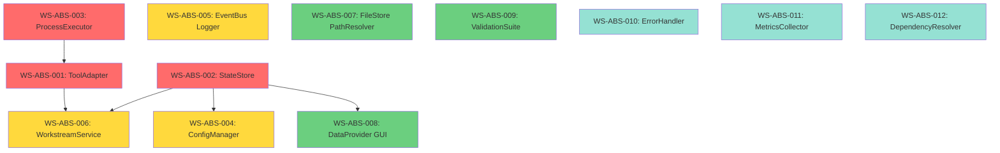

# Abstraction Layer Implementation - Phase Plan

**Document ID**: DOC-ABSTRACTION-PHASE-PLAN-001  
**Created**: 2025-11-29  
**Status**: ACTIVE - READY FOR EXECUTION  
**Priority**: CRITICAL  
**Estimated Duration**: 4-6 weeks (parallel execution)

---

## Executive Summary

**Goal**: Implement 12 critical abstraction layers to create stable "what" interfaces that hide volatile "how" implementations, protecting the system from AI drift and enabling safe, rapid evolution.

**Strategy**: Pattern-first execution with independent workstreams running in parallel.

**Impact**:
- 🛡️ **AI Safety**: Prevent hallucinated changes by enforcing API boundaries
- ⚡ **Speed**: 3x-10x faster through decision elimination
- 🔒 **Stability**: Change internals without breaking consumers
- 🧪 **Testability**: Mock abstractions instead of real systems

---

## Phase 0: Foundation (Week 0 - Setup)

### Execution Pattern Selection

**Task Type**: Create 12 similar abstraction interfaces  
**Pattern**: EXEC-002 (Module Generator) + EXEC-004 (Doc Standardizer)  
**Batch Size**: 4 abstractions per batch (3 batches total)

### Anti-Pattern Guards (ALL ENABLED)

✅ **Hallucination of Success** - Require: `python -c "import module"` succeeds  
✅ **Planning Loop Trap** - Max 2 iterations, then execute  
✅ **Incomplete Implementation** - No TODO/pass allowed in production  
✅ **Silent Failures** - Explicit error handling required  
✅ **Framework Over-Engineering** - Only implement what's needed  
✅ **Test-Code Mismatch** - Every abstraction has tests  
✅ **Configuration Drift** - Config through ConfigManager only  
✅ **Module Integration Gap** - Integration tests for all abstractions  
✅ **Documentation Lies** - Type hints enforced via mypy  
✅ **Partial Success Amnesia** - Checkpoint after each workstream  
✅ **Approval Loop** - Automated verification, no human approval needed

### Ground Truth Verification

```bash
# Success criteria for each abstraction
test -f core/interfaces/{abstraction}.py && \
python -c "from core.interfaces.{abstraction} import {Protocol}" && \
pytest tests/interfaces/test_{abstraction}.py -q && \
echo "✅ ABSTRACTION READY"
```

---

## Phase 1: Priority 0 Abstractions (Week 1-2)

### Workstream Group: Foundation Layer

**Parallel Execution**: 3 independent workstreams

---

#### WS-ABS-001: ToolAdapter Abstraction

**Status**: Independent (no dependencies)  
**Priority**: P0 - CRITICAL  
**Complexity**: Medium  
**Duration**: 3 days  
**Execution Pattern**: EXEC-002 (Module Generator)

**Objective**: Single clean interface for all tool adapters (Aider, Codex, Tests, Git)

**Deliverables**:
1. `core/interfaces/tool_adapter.py` - Protocol definition
2. `core/adapters/base.py` - Base implementation
3. `core/adapters/registry.py` - Adapter registry
4. Migration of 4 existing adapters to new interface
5. Tests: `tests/interfaces/test_tool_adapter.py`

**Ground Truth**:
```bash
# Verify all 4 adapters implement protocol
python -c "from core.adapters.aider import AiderAdapter; a = AiderAdapter(); assert hasattr(a, 'run')"
pytest tests/interfaces/test_tool_adapter.py -q
```

**Files Created**:
- `core/interfaces/__init__.py`
- `core/interfaces/tool_adapter.py`
- `core/adapters/base.py`
- `core/adapters/registry.py`
- `tests/interfaces/__init__.py`
- `tests/interfaces/test_tool_adapter.py`

**Files Modified**:
- `engine/adapters/aider_adapter.py`
- `engine/adapters/codex_adapter.py`
- `engine/adapters/tests_adapter.py`
- `engine/adapters/git_adapter.py`

**Acceptance Tests**:
```python
def test_adapter_protocol_compliance():
    """All adapters implement ToolAdapter protocol"""
    from core.interfaces.tool_adapter import ToolAdapter
    from core.adapters.registry import get_all_adapters
    
    for adapter in get_all_adapters():
        assert isinstance(adapter, ToolAdapter)
        assert hasattr(adapter, 'supports')
        assert hasattr(adapter, 'prepare_job')
        assert hasattr(adapter, 'run')
        assert hasattr(adapter, 'normalize_result')

def test_adapter_registry():
    """Registry returns correct adapter by capability"""
    from core.adapters.registry import ToolRegistry
    
    registry = ToolRegistry()
    adapter = registry.get_adapter({'edit_code'})
    assert adapter.name in ['aider', 'codex']
```

**Downstream Impact**:
- Enables WS-ABS-006 (ExecutionService)
- Enables GUI tool selection panels
- Simplifies future adapter additions

---

#### WS-ABS-002: StateStore Abstraction

**Status**: Independent (no dependencies)  
**Priority**: P0 - CRITICAL  
**Complexity**: Medium  
**Duration**: 3 days  
**Execution Pattern**: EXEC-002 (Module Generator)

**Objective**: Hide DB/filesystem details behind clean state management API

**Deliverables**:
1. `core/interfaces/state_store.py` - Protocol definition
2. `core/state/sqlite_store.py` - SQLite implementation
3. Migration of existing state operations
4. Tests: `tests/interfaces/test_state_store.py`

**Ground Truth**:
```bash
python -c "from core.state.sqlite_store import SQLiteStateStore; store = SQLiteStateStore(); store.get_workstream('ws-test')"
pytest tests/interfaces/test_state_store.py -q
```

**Files Created**:
- `core/interfaces/state_store.py`
- `core/state/sqlite_store.py`
- `tests/interfaces/test_state_store.py`

**Files Modified**:
- `core/state/db.py` (keep as thin wrapper)
- `core/state/crud.py` (use StateStore internally)
- `engine/orchestrator/orchestrator.py` (inject StateStore)

**Acceptance Tests**:
```python
def test_state_store_protocol():
    """StateStore implements all required methods"""
    from core.state.sqlite_store import SQLiteStateStore
    
    store = SQLiteStateStore()
    
    # CRUD operations
    ws = store.get_workstream('test-ws')
    store.save_workstream({'id': 'test-ws', 'status': 'pending'})
    
    # Execution tracking
    store.record_execution({'run_id': 'test-run', 'status': 'running'})
    execs = store.list_executions({'status': 'running'})
    
    assert len(execs) > 0

def test_state_isolation():
    """Different StateStore instances don't interfere"""
    from core.state.sqlite_store import SQLiteStateStore
    
    store1 = SQLiteStateStore(':memory:')
    store2 = SQLiteStateStore(':memory:')
    
    store1.save_workstream({'id': 'ws-1', 'status': 'done'})
    assert store2.get_workstream('ws-1') is None
```

**Downstream Impact**:
- Enables WS-ABS-006 (ExecutionService)
- Enables GUI state visualization
- Allows future migration to Postgres

---

#### WS-ABS-003: ProcessExecutor & ToolInvoker Abstraction

**Status**: Independent (no dependencies)  
**Priority**: P0 - CRITICAL  
**Complexity**: Low  
**Duration**: 2 days  
**Execution Pattern**: EXEC-002 (Module Generator)

**Objective**: Centralize subprocess handling with unified retry/timeout/error handling

**Deliverables**:
1. `core/interfaces/process_executor.py` - Protocol
2. `core/execution/subprocess_executor.py` - Implementation
3. `core/execution/tool_invoker.py` - Higher-level tool wrapper
4. Tests: `tests/interfaces/test_process_executor.py`

**Ground Truth**:
```bash
python -c "from core.execution.subprocess_executor import SubprocessExecutor; e = SubprocessExecutor(); r = e.run(['echo', 'test']); assert r.exit_code == 0"
pytest tests/interfaces/test_process_executor.py -q
```

**Files Created**:
- `core/interfaces/process_executor.py`
- `core/execution/__init__.py`
- `core/execution/subprocess_executor.py`
- `core/execution/tool_invoker.py`
- `tests/interfaces/test_process_executor.py`

**Files Modified**:
- All adapter files (use ProcessExecutor instead of raw subprocess)

**Acceptance Tests**:
```python
def test_process_timeout():
    """ProcessExecutor enforces timeouts"""
    from core.execution.subprocess_executor import SubprocessExecutor
    import time
    
    executor = SubprocessExecutor()
    start = time.time()
    result = executor.run(['sleep', '10'], timeout=1)
    duration = time.time() - start
    
    assert duration < 2  # Killed after timeout
    assert result.timed_out is True

def test_dry_run_mode():
    """ProcessExecutor respects dry_run flag"""
    from core.execution.subprocess_executor import SubprocessExecutor
    
    executor = SubprocessExecutor(dry_run=True)
    result = executor.run(['rm', '-rf', '/'])  # Safe in dry-run!
    
    assert result.dry_run is True
    assert result.exit_code == 0
    assert result.stdout == '[DRY-RUN] Would run: rm -rf /'
```

**Downstream Impact**:
- Used by WS-ABS-001 (ToolAdapter)
- Enables consistent timeout behavior
- Powers dry-run mode across all tools

---

## Phase 2: Priority 1 Abstractions (Week 2-3)

### Workstream Group: Configuration & Events Layer

**Parallel Execution**: 3 independent workstreams

---

#### WS-ABS-004: ConfigManager Abstraction

**Status**: Depends on WS-ABS-002 (optional dependency)  
**Priority**: P1 - HIGH  
**Complexity**: Low  
**Duration**: 2 days  
**Execution Pattern**: EXEC-002 (Module Generator)

**Objective**: Centralize config access with validation and hot-reloading

**Deliverables**:
1. `core/interfaces/config_manager.py`
2. `core/config/yaml_config_manager.py`
3. Config schema validation
4. Tests: `tests/interfaces/test_config_manager.py`

**Ground Truth**:
```bash
python -c "from core.config.yaml_config_manager import YamlConfigManager; cm = YamlConfigManager(); cm.get_tool_profile('aider')"
pytest tests/interfaces/test_config_manager.py -q
```

**Files Created**:
- `core/interfaces/config_manager.py`
- `core/config/__init__.py`
- `core/config/yaml_config_manager.py`
- `core/config/schemas.py`
- `tests/interfaces/test_config_manager.py`

**Acceptance Tests**:
```python
def test_config_validation():
    """ConfigManager validates schemas"""
    from core.config.yaml_config_manager import YamlConfigManager
    
    cm = YamlConfigManager()
    errors = cm.validate_all()
    
    assert len(errors) == 0  # All configs valid

def test_config_hot_reload():
    """ConfigManager can reload without restart"""
    from core.config.yaml_config_manager import YamlConfigManager
    
    cm = YamlConfigManager()
    old_val = cm.get('some_key')
    
    # Modify config file
    # ...
    
    cm.reload()
    new_val = cm.get('some_key')
    
    assert new_val != old_val
```

---

#### WS-ABS-005: EventBus & Logger Abstraction

**Status**: Independent  
**Priority**: P1 - HIGH  
**Complexity**: Medium  
**Duration**: 3 days  
**Execution Pattern**: EXEC-002 (Module Generator)

**Objective**: Unified event emission and logging across all modules

**Deliverables**:
1. `core/interfaces/event_bus.py`
2. `core/interfaces/logger.py`
3. `core/events/simple_event_bus.py`
4. `core/logging/structured_logger.py`
5. Tests

**Ground Truth**:
```bash
python -c "from core.events.simple_event_bus import SimpleEventBus; bus = SimpleEventBus(); bus.emit('test', {})"
pytest tests/interfaces/test_event_bus.py -q
pytest tests/interfaces/test_logger.py -q
```

**Files Created**:
- `core/interfaces/event_bus.py`
- `core/interfaces/logger.py`
- `core/events/__init__.py`
- `core/events/simple_event_bus.py`
- `core/logging/__init__.py`
- `core/logging/structured_logger.py`
- `tests/interfaces/test_event_bus.py`
- `tests/interfaces/test_logger.py`

**Acceptance Tests**:
```python
def test_event_subscription():
    """EventBus delivers events to subscribers"""
    from core.events.simple_event_bus import SimpleEventBus
    
    bus = SimpleEventBus()
    received = []
    
    def handler(payload):
        received.append(payload)
    
    bus.subscribe('test_event', handler)
    bus.emit('test_event', {'data': 'test'})
    
    assert len(received) == 1
    assert received[0]['data'] == 'test'

def test_structured_logging():
    """Logger produces structured output"""
    from core.logging.structured_logger import StructuredLogger
    
    logger = StructuredLogger()
    logger.info('test message', context={'job_id': 'test-001'})
    
    # Verify log format
    # assert JSON output contains timestamp, level, message, context
```

---

#### WS-ABS-006: WorkstreamService Abstraction

**Status**: Depends on WS-ABS-002 (StateStore)  
**Priority**: P1 - HIGH  
**Complexity**: Medium  
**Duration**: 3 days  
**Execution Pattern**: EXEC-002 (Module Generator)

**Objective**: Unified workstream lifecycle management API

**Deliverables**:
1. `core/interfaces/workstream_service.py`
2. `core/workstreams/workstream_service_impl.py`
3. Lifecycle hooks system
4. Tests

**Ground Truth**:
```bash
python -c "from core.workstreams.workstream_service_impl import WorkstreamServiceImpl; svc = WorkstreamServiceImpl(); svc.load('ws-test')"
pytest tests/interfaces/test_workstream_service.py -q
```

**Files Created**:
- `core/interfaces/workstream_service.py`
- `core/workstreams/__init__.py`
- `core/workstreams/workstream_service_impl.py`
- `core/workstreams/lifecycle_hooks.py`
- `tests/interfaces/test_workstream_service.py`

**Acceptance Tests**:
```python
def test_workstream_create():
    """WorkstreamService creates from spec"""
    from core.workstreams.workstream_service_impl import WorkstreamServiceImpl
    
    svc = WorkstreamServiceImpl()
    ws = svc.create({
        'id': 'ws-test',
        'tasks': ['Task 1'],
        'tool': 'codex'
    })
    
    assert ws.id == 'ws-test'
    assert svc.get_status('ws-test').status == 'pending'

def test_workstream_lifecycle_hooks():
    """Lifecycle hooks are called in correct order"""
    from core.workstreams.workstream_service_impl import WorkstreamServiceImpl
    
    svc = WorkstreamServiceImpl()
    events = []
    
    def on_start(ws):
        events.append(f'start:{ws.id}')
    
    def on_complete(ws):
        events.append(f'complete:{ws.id}')
    
    svc.hooks.on_start(on_start)
    svc.hooks.on_complete(on_complete)
    
    handle = svc.execute('ws-test')
    # ... wait for completion
    
    assert events == ['start:ws-test', 'complete:ws-test']
```

---

## Phase 3: Priority 2 Abstractions (Week 3-4)

### Workstream Group: File Operations & Data Layer

**Parallel Execution**: 3 independent workstreams

---

#### WS-ABS-007: FileStore & PathResolver Abstraction

**Status**: Independent  
**Priority**: P2 - MEDIUM  
**Complexity**: Low  
**Duration**: 2 days  
**Execution Pattern**: EXEC-002 (Module Generator)

**Objective**: Safe file operations with path validation

**Deliverables**:
1. `core/interfaces/file_store.py`
2. `core/interfaces/path_resolver.py`
3. `core/filesystem/safe_file_store.py`
4. `core/filesystem/repo_path_resolver.py`
5. Tests

**Ground Truth**:
```bash
python -c "from core.filesystem.safe_file_store import SafeFileStore; fs = SafeFileStore(); fs.read('README.md')"
pytest tests/interfaces/test_file_store.py -q
```

**Acceptance Tests**:
```python
def test_path_escape_prevention():
    """PathResolver prevents escaping repo bounds"""
    from core.filesystem.repo_path_resolver import RepoPathResolver
    
    resolver = RepoPathResolver()
    
    with pytest.raises(SecurityError):
        resolver.resolve('../../etc/passwd')

def test_virtual_filesystem():
    """FileStore supports in-memory virtual FS for tests"""
    from core.filesystem.safe_file_store import SafeFileStore
    
    fs = SafeFileStore(virtual=True)
    fs.write('test.txt', 'content')
    
    assert fs.read('test.txt') == 'content'
    assert not Path('test.txt').exists()  # Not on real disk
```

---

#### WS-ABS-008: DataProvider (GUI) Abstraction

**Status**: Depends on WS-ABS-002 (StateStore)  
**Priority**: P2 - MEDIUM  
**Complexity**: Medium  
**Duration**: 3 days  
**Execution Pattern**: EXEC-002 (Module Generator)

**Objective**: Decouple GUI from database schema with reactive updates

**Deliverables**:
1. `core/interfaces/data_provider.py`
2. `gui/data/job_data_provider.py`
3. `gui/data/queue_data_provider.py`
4. Observable model system
5. Tests

**Ground Truth**:
```bash
python -c "from gui.data.job_data_provider import JobDataProvider; dp = JobDataProvider(); dp.get_jobs()"
pytest tests/gui/test_data_provider.py -q
```

**Acceptance Tests**:
```python
def test_reactive_updates():
    """DataProvider notifies subscribers of changes"""
    from gui.data.job_data_provider import JobDataProvider
    
    provider = JobDataProvider()
    updates = []
    
    provider.subscribe_to_updates(lambda data: updates.append(data))
    
    # Trigger state change
    # ...
    
    assert len(updates) > 0

def test_data_filtering():
    """DataProvider supports complex filters"""
    from gui.data.job_data_provider import JobDataProvider
    
    provider = JobDataProvider()
    jobs = provider.get_jobs({
        'status': 'running',
        'tool': 'aider',
        'started_after': '2025-11-29'
    })
    
    assert all(j.status == 'running' for j in jobs)
```

---

#### WS-ABS-009: ValidationSuite Abstraction

**Status**: Independent  
**Priority**: P2 - MEDIUM  
**Complexity**: Medium  
**Duration**: 3 days  
**Execution Pattern**: EXEC-002 (Module Generator)

**Objective**: Unified validation framework with composable validators

**Deliverables**:
1. `core/interfaces/validator.py`
2. `core/validation/validation_suite.py`
3. Built-in validators (schema, path, import, etc.)
4. Tests

**Ground Truth**:
```bash
python -c "from core.validation.validation_suite import ValidationSuite; suite = ValidationSuite(); suite.run_all({})"
pytest tests/interfaces/test_validator.py -q
```

**Acceptance Tests**:
```python
def test_composable_validators():
    """ValidationSuite combines multiple validators"""
    from core.validation.validation_suite import ValidationSuite
    from core.validation.validators import SchemaValidator, PathValidator
    
    suite = ValidationSuite()
    suite.add_validator(SchemaValidator())
    suite.add_validator(PathValidator())
    
    result = suite.run_all({'workstreams': []})
    
    assert result.passed >= 0
    assert result.failed >= 0

def test_quality_gates():
    """ValidationSuite runs specific gate groups"""
    from core.validation.validation_suite import ValidationSuite
    
    suite = ValidationSuite()
    result = suite.run_gates(['pre-commit', 'ci'])
    
    assert 'pre-commit' in result.gates_run
    assert 'ci' in result.gates_run
```

---

## Phase 4: Priority 3 Abstractions (Week 4-6)

### Workstream Group: Advanced Features Layer

**Parallel Execution**: 3 independent workstreams

---

#### WS-ABS-010: ErrorHandler & Recovery Abstraction

**Status**: Independent  
**Priority**: P3 - LOW  
**Complexity**: Medium  
**Duration**: 3 days  
**Execution Pattern**: EXEC-002 (Module Generator)

**Objective**: Consistent error handling with circuit breakers and retry strategies

**Deliverables**:
1. `core/interfaces/error_handler.py`
2. `core/interfaces/recovery_strategy.py`
3. `core/resilience/error_handler_impl.py`
4. `core/resilience/strategies.py`
5. Tests

**Acceptance Tests**:
```python
def test_retry_with_backoff():
    """ErrorHandler retries with exponential backoff"""
    from core.resilience.error_handler_impl import ErrorHandlerImpl
    from core.resilience.strategies import ExponentialBackoff
    
    handler = ErrorHandlerImpl()
    attempts = []
    
    def flaky_op():
        attempts.append(time.time())
        if len(attempts) < 3:
            raise Exception('transient error')
        return 'success'
    
    result = handler.with_retry(flaky_op, ExponentialBackoff())
    
    assert result == 'success'
    assert len(attempts) == 3
    # Verify exponential delays
```

---

#### WS-ABS-011: MetricsCollector Abstraction

**Status**: Independent  
**Priority**: P3 - LOW  
**Complexity**: Low  
**Duration**: 2 days  
**Execution Pattern**: EXEC-002 (Module Generator)

**Objective**: Unified metrics collection for performance tracking

**Deliverables**:
1. `core/interfaces/metrics_collector.py`
2. `core/metrics/prometheus_collector.py`
3. Tests

**Acceptance Tests**:
```python
def test_metrics_aggregation():
    """MetricsCollector aggregates time-series data"""
    from core.metrics.prometheus_collector import PrometheusCollector
    
    collector = PrometheusCollector()
    collector.record_duration('job_execution', 12.5, {'tool': 'aider'})
    collector.record_duration('job_execution', 8.3, {'tool': 'aider'})
    
    summary = collector.get_summary('job_execution', tags={'tool': 'aider'})
    
    assert summary.count == 2
    assert summary.avg == pytest.approx(10.4)
```

---

#### WS-ABS-012: DependencyResolver Abstraction

**Status**: Independent  
**Priority**: P3 - LOW  
**Complexity**: Low  
**Duration**: 2 days  
**Execution Pattern**: EXEC-002 (Module Generator)

**Objective**: Centralized dependency resolution and parallel wave detection

**Deliverables**:
1. `core/interfaces/dependency_resolver.py`
2. `core/planning/dag_resolver.py`
3. Tests

**Acceptance Tests**:
```python
def test_parallel_wave_detection():
    """DependencyResolver groups independent tasks into waves"""
    from core.planning.dag_resolver import DagResolver
    
    resolver = DagResolver()
    resolver.add_task('A', [])
    resolver.add_task('B', [])
    resolver.add_task('C', ['A'])
    resolver.add_task('D', ['A', 'B'])
    
    waves = resolver.resolve_order()
    
    assert waves[0] == ['A', 'B']  # Wave 1: parallel
    assert waves[1] == ['C']        # Wave 2: depends on A
    assert waves[2] == ['D']        # Wave 3: depends on A & B
```

---

## Workstream Dependency Graph



---

## Parallel Execution Waves

### Wave 1 (Week 1-2): Foundation - P0
**Run in Parallel**:
- WS-ABS-003 (ProcessExecutor) → 2 days
- Then: WS-ABS-001 (ToolAdapter) + WS-ABS-002 (StateStore) → 3 days each

**Total Wave Duration**: 5 days (2 + 3 parallel)

---

### Wave 2 (Week 2-3): Configuration & Events - P1
**Run in Parallel**:
- WS-ABS-004 (ConfigManager)
- WS-ABS-005 (EventBus/Logger)
- WS-ABS-006 (WorkstreamService)

**Total Wave Duration**: 3 days (all parallel)

---

### Wave 3 (Week 3-4): File Operations & Data - P2
**Run in Parallel**:
- WS-ABS-007 (FileStore/PathResolver)
- WS-ABS-008 (DataProvider)
- WS-ABS-009 (ValidationSuite)

**Total Wave Duration**: 3 days (all parallel)

---

### Wave 4 (Week 4-6): Advanced Features - P3
**Run in Parallel**:
- WS-ABS-010 (ErrorHandler)
- WS-ABS-011 (MetricsCollector)
- WS-ABS-012 (DependencyResolver)

**Total Wave Duration**: 3 days (all parallel)

---

## Execution Commands

### Batch Create Workstream Files
```bash
# Generate all 12 workstream JSON files
python scripts/batch_file_creator.py \
    --template templates/abstraction_workstream.json \
    --items abstraction/workstream_specs.json \
    --output workstreams/ \
    --batch-size 4
```

### Run Parallel Waves
```bash
# Wave 1
python scripts/run_workstream.py --parallel --ws-ids ws-abs-003
python scripts/run_workstream.py --parallel --ws-ids ws-abs-001,ws-abs-002

# Wave 2
python scripts/run_workstream.py --parallel --ws-ids ws-abs-004,ws-abs-005,ws-abs-006

# Wave 3
python scripts/run_workstream.py --parallel --ws-ids ws-abs-007,ws-abs-008,ws-abs-009

# Wave 4
python scripts/run_workstream.py --parallel --ws-ids ws-abs-010,ws-abs-011,ws-abs-012
```

### Validate All Abstractions
```bash
# After each wave
python scripts/validate_abstractions.py --wave 1
pytest tests/interfaces/ -v --cov=core/interfaces --cov-report=term-missing
```

---

## Quality Gates

### Per-Workstream Gates
1. **Protocol Definition** - Type hints 100% coverage
2. **Implementation** - At least one concrete implementation
3. **Tests** - 80%+ coverage, all protocol methods tested
4. **Integration** - At least one consumer uses the abstraction
5. **Documentation** - Docstrings + usage examples

### Wave Completion Gates
1. All workstreams pass unit tests
2. Integration tests pass
3. No mypy errors in `core/interfaces/`
4. Updated documentation index
5. Migration guide for affected modules

---

## Migration Strategy

### Incremental Adoption
1. **Create abstraction** alongside existing code
2. **Migrate one consumer** as proof of concept
3. **Update remaining consumers** in batches
4. **Deprecate old APIs** with warnings
5. **Remove old APIs** after 2-week deprecation period

### Example Migration Path (ToolAdapter)
```python
# Old code (DEPRECATED)
from engine.adapters.aider_adapter import AiderAdapter
adapter = AiderAdapter()
result = adapter.run_aider(job_spec)

# New code (PREFERRED)
from core.adapters.registry import ToolRegistry
from core.interfaces.tool_adapter import ToolAdapter

registry = ToolRegistry()
adapter: ToolAdapter = registry.get_adapter({'edit_code'})
result = adapter.run(job_spec)
```

---

## Risk Mitigation

### Risk: Breaking Changes During Migration
**Mitigation**: 
- Keep old APIs working during transition
- Use feature flags to toggle new abstractions
- Comprehensive integration tests

### Risk: Over-Abstraction
**Mitigation**:
- Start with minimal protocol (3-5 methods)
- Add methods only when needed by 2+ consumers
- Review abstraction quarterly, remove unused methods

### Risk: Performance Regression
**Mitigation**:
- Benchmark before/after migration
- Profile hot paths
- Add caching layer if needed

---

## Success Metrics

### Quantitative
- ✅ 12/12 abstractions implemented
- ✅ 80%+ test coverage on all interfaces
- ✅ Zero mypy errors in `core/interfaces/`
- ✅ 90%+ consumers migrated to new APIs
- ✅ CI build time < 5 minutes

### Qualitative
- ✅ AI agents can work without breaking core abstractions
- ✅ New adapter added in < 1 hour
- ✅ Database migrated from SQLite to Postgres in < 1 day
- ✅ GUI can swap data sources without code changes

---

## Next Steps

1. **Review this plan** with team (30 min)
2. **Generate workstream JSONs** using batch creator (5 min)
3. **Kick off Wave 1** (WS-ABS-001, WS-ABS-002, WS-ABS-003)
4. **Daily standups** during execution (15 min)
5. **Weekly retros** to adjust plan (30 min)

---

## Appendix A: Workstream Template

See `abstraction/workstream_template.json` for the standard template used by batch creator.

## Appendix B: Interface Template

See `templates/protocol_interface.py` for the standard Protocol definition template.

## Appendix C: Test Template

See `templates/interface_test.py` for the standard test suite template.

---

**END OF PHASE PLAN**
