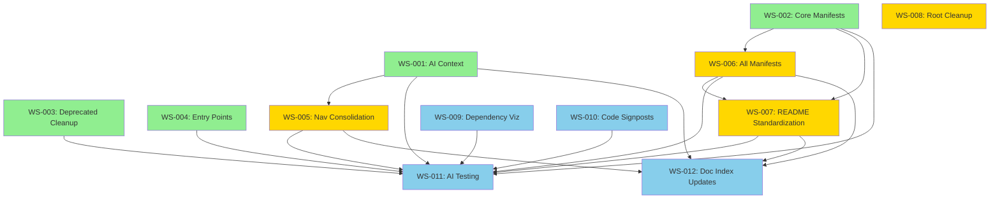

# AI Navigation Enhancement v2 - Detailed Phase Plan

**Phase ID**: PH-AI-NAV-002  
**Created**: 2025-11-23  
**Status**: DRAFT  
**Estimated Duration**: 3 weeks (15 working days)  
**Total Effort**: 40-50 hours

---

## Executive Summary

Optimize the repository for AI tool navigation and comprehension by:
1. Creating focused AI context documents
2. Consolidating fragmented navigation documentation
3. Adding machine-readable module manifests
4. Cleaning up deprecated code signals
5. Standardizing documentation hierarchy

**Key Principle**: Make it trivial for AI tools to understand "what, where, why, how" in under 30 seconds.

---

## Success Criteria

### Quantitative
- ✅ AI context load time: <5 seconds to understand repo purpose
- ✅ Navigation hops reduced: 3 docs max to find any code
- ✅ Module clarity: 100% of modules have manifests
- ✅ Deprecated code: 0% confusion (clear signals)
- ✅ Root clutter: <40 items (currently 78)

### Qualitative
- ✅ New AI tool can generate accurate code in first session
- ✅ Navigation docs don't contradict each other
- ✅ Entry points clearly documented
- ✅ Common questions answered in context files

---

## Independent Workstreams

### **Phase 1: Foundation (Week 1)**

✅ **WS-001: Root AI Context & Quick Reference** (2-3h, INDEPENDENT)
✅ **WS-002: Module Manifests - Core Modules** (4-5h, INDEPENDENT)
✅ **WS-003: Deprecated Code Cleanup** (2-3h, INDEPENDENT)
✅ **WS-004: Entry Points Documentation** (2-3h, INDEPENDENT)

**All Phase 1 workstreams can run in parallel**

### **Phase 2: Consolidation (Week 2)**

⚠️ **WS-005: Navigation Document Consolidation** (3-4h, depends on WS-001)
✅ **WS-006: Module Manifests - All Remaining** (6-8h, INDEPENDENT after WS-002)
⚠️ **WS-007: README Hierarchy Standardization** (4-5h, depends on WS-002, WS-006)
✅ **WS-008: Root Directory Reorganization** (3-4h, INDEPENDENT)

**WS-005, WS-006, WS-008 can run in parallel**
**WS-007 requires WS-006 completion**

### **Phase 3: Enhancement (Week 3)**

✅ **WS-009: Dependency Visualization** (2-3h, INDEPENDENT)
✅ **WS-010: Code Signpost Comments** (5-6h, INDEPENDENT)
⚠️ **WS-011: AI Navigation Testing** (3-4h, depends on ALL previous)
⚠️ **WS-012: Documentation Index Updates** (2-3h, depends on ALL previous)

**WS-009, WS-010 can run in parallel**
**WS-011, WS-012 are sequential final steps**

---

## Workstream Details

[See full plan in WORKSTREAMS.md for complete specifications]

### Key Deliverables Summary

**Phase 1**:
- `.ai-context.md` - 30-second repo understanding
- `NAVIGATION.md` - Unified navigation hub
- `.ai-module-manifest` files (6 core modules)
- `legacy/DEPRECATED.md` - Clear deprecation notice
- `ENTRY_POINTS.md` - All CLI/API entry points

**Phase 2**:
- Navigation doc consolidation (reduce from 6+ to 1 primary)
- `.ai-module-manifest` files (11 more modules, 17 total)
- Standardized READMEs (all modules)
- Root cleanup (<40 items)

**Phase 3**:
- Mermaid dependency diagrams
- Strategic code comments (20-30 signposts)
- AI navigation test suite
- Updated documentation indexes

---

## Dependency Graph

---

## Effort Summary

| Phase | Workstreams | Min Hours | Max Hours | Parallel Execution |
|-------|-------------|-----------|-----------|-------------------|
| Phase 1 | WS-001 to WS-004 | 12 | 15 | ✅ All 4 parallel |
| Phase 2 | WS-005 to WS-008 | 15 | 18 | ⚠️ 3 of 4 parallel |
| Phase 3 | WS-009 to WS-012 | 13 | 17 | ⚠️ First 2 parallel |
| **Total** | **12 workstreams** | **40** | **50** | **~60% parallelizable** |

**If fully parallelized with 3 developers**:
- Phase 1: 2-3 days (instead of 5)
- Phase 2: 3-4 days (instead of 7)
- Phase 3: 3-4 days (instead of 6)
- **Total: 8-11 days** (instead of 18)

---

## Next Steps

1. Review this plan
2. Read detailed workstream specs in `WORKSTREAMS.md`
3. Assign workstreams to developers
4. Create tracking issues
5. Begin Phase 1 execution

---

**See**: `WORKSTREAMS.md` for complete specifications of all 12 workstreams
