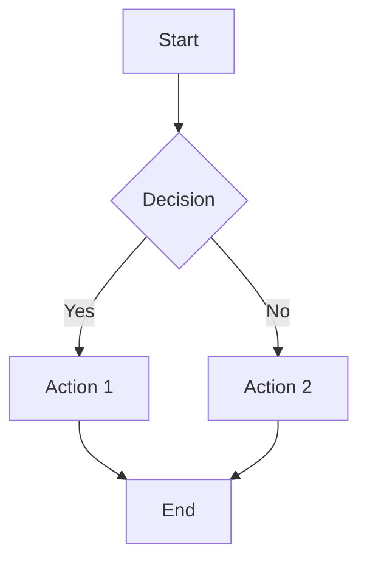

# docs/

**Purpose**: Comprehensive documentation hub - architecture decisions, implementation guides, planning documents, and developer resources.

## Overview

The `docs/` directory is the central documentation repository:
- **Architecture** - System design, ADRs, technical specifications
- **Guides** - User guides, developer guides, best practices
- **Implementation Records** - Phase completions, migration reports
- **Planning** - Project plans, roadmaps, analysis documents
- **References** - API documentation, glossaries, standards

This is the single source of truth for all project documentation.

## Architecture

```
docs/
├── architecture/              # System architecture
│   ├── ARCHITECTURE.md       # High-level architecture
│   ├── SYSTEM_DESIGN.md      # Detailed design
│   ├── DEPENDENCY_GRAPH.md   # Module dependencies
│   └── LAYER_MODEL.md        # Layered architecture
│
├── adr/                      # Architecture Decision Records
│   ├── 0001-use-sqlite.md   # ADR template
│   ├── 0002-dag-scheduler.md
│   ├── 0003-plugin-arch.md
│   └── README.md            # ADR index
│
├── guides/                   # User and developer guides
│   ├── GETTING_STARTED.md   # Quick start
│   ├── DEVELOPER_GUIDE.md   # Developer setup
│   ├── USER_GUIDE.md        # User manual
│   ├── CONTRIBUTING.md      # Contribution guide
│   └── TROUBLESHOOTING.md   # Common issues
│
├── implementation/           # Implementation records
│   ├── PHASE_COMPLETION_REPORTS/
│   ├── MIGRATION_REPORTS/
│   └── INTEGRATION_RECORDS/
│
├── planning/                 # Project planning
│   ├── ROADMAP.md           # Product roadmap
│   ├── SPRINT_PLANS/        # Sprint planning
│   ├── EPIC_TRACKING/       # Epic progress
│   └── BACKLOG.md           # Backlog items
│
├── specs/                    # Technical specifications
│   ├── API_SPEC.md          # API documentation
│   ├── DATABASE_SCHEMA.md   # Database spec
│   ├── WORKFLOW_SPEC.md     # Workflow definitions
│   └── INTEGRATION_SPEC.md  # Integration specs
│
├── reference/                # Reference documentation
│   ├── GLOSSARY.md          # Terms and definitions
│   ├── CLI_REFERENCE.md     # CLI command reference
│   ├── API_REFERENCE.md     # API endpoint reference
│   └── ERROR_CODES.md       # Error code catalog
│
├── diagrams/                 # Visual documentation
│   ├── system_overview.mmd  # Mermaid diagrams
│   ├── data_flow.mmd        
│   ├── deployment.mmd
│   └── README.md            # Diagram index
│
├── templates/                # Document templates
│   ├── ADR_TEMPLATE.md      # ADR template
│   ├── GUIDE_TEMPLATE.md    # Guide template
│   ├── SPEC_TEMPLATE.md     # Spec template
│   └── README_TEMPLATE.md   # README template
│
└── README.md                # This file
```

## Key Sections

### Architecture Decision Records (ADRs)

Track significant architectural decisions.

**Location**: `docs/adr/`  
**Format**: Markdown with MADR template  
**Naming**: `NNNN-short-title.md`

#### ADR Template
```markdown
# [Number]. [Title]

Date: YYYY-MM-DD
Status: [Proposed | Accepted | Deprecated | Superseded]

## Context
What is the issue we're seeing that is motivating this decision?

## Decision
What is the change that we're proposing?

## Consequences
What becomes easier or more difficult to do because of this change?

## Alternatives Considered
What other options did we consider?
```

#### Creating ADR
```bash
# Create new ADR
cd docs/adr/
cp ADR_TEMPLATE.md 0015-new-decision.md

# Edit and commit
git add 0015-new-decision.md
git commit -m "docs: add ADR for [decision]"
```

### Guides

User-facing and developer-facing documentation.

**Location**: `docs/guides/`

#### Getting Started Guide
Quick setup for new users:
```markdown
# Getting Started

## Prerequisites
- Python 3.8+
- Git
- 2GB RAM

## Installation
1. Clone repository
2. Install dependencies
3. Initialize database
4. Run bootstrap

## First Steps
- Create your first workstream
- Execute a simple workflow
- View results
```

#### Developer Guide
Setup for contributors:
```markdown
# Developer Guide

## Development Environment
- IDE setup
- Pre-commit hooks
- Testing environment

## Code Standards
- Style guide
- Import conventions
- Testing requirements

## Workflow
- Branch strategy
- PR process
- Review guidelines
```

### Implementation Records

Track completed work and migrations.

**Location**: `docs/implementation/`

#### Phase Completion Reports
Document phase completions:
- Objectives achieved
- Metrics captured
- Issues encountered
- Lessons learned

#### Migration Reports
Document code/structure migrations:
- What changed
- Migration steps
- Validation results
- Rollback procedures

### Planning Documents

Project planning and tracking.

**Location**: `docs/planning/`

#### Roadmap
```markdown
# Product Roadmap

## Q1 2025
- [ ] Epic 1: User Authentication
- [ ] Epic 2: Advanced Scheduling
- [x] Epic 3: Error Detection

## Q2 2025
- [ ] Epic 4: Cloud Integration
- [ ] Epic 5: Multi-tenancy
```

#### Sprint Plans
Track sprint progress:
- Sprint goals
- Story points
- Velocity
- Retrospective notes

### Technical Specifications

Detailed technical docs.

**Location**: `docs/specs/`

#### API Specification
```markdown
# API Specification

## Endpoints

### POST /api/v1/workstreams
Create new workstream

**Request:**
```json
{
  "phase_id": "PH-001",
  "workstream_id": "WS-001A",
  "steps": [...]
}
```

**Response:**
```json
{
  "run_id": "01H...",
  "status": "created"
}
```
```

### Reference Documentation

Quick lookup references.

**Location**: `docs/reference/`

#### Glossary
```markdown
# Glossary

**Workstream**: A cohesive set of steps that accomplish a goal
**Phase**: A major milestone containing multiple workstreams
**DAG**: Directed Acyclic Graph - dependency structure
**ULID**: Universally Unique Lexicographically Sortable Identifier
```

#### CLI Reference
Complete CLI command documentation:
```bash
# Workstream commands
uet workstream create --phase PH-001 --id WS-001A
uet workstream list --phase PH-001
uet workstream execute --id WS-001A

# Database commands
uet db init --path .worktrees/pipeline_state.db
uet db inspect --path .worktrees/pipeline_state.db
```

## Documentation Standards

### File Naming

- **Markdown files**: `TITLE_IN_CAPS.md`
- **ADRs**: `NNNN-short-title.md`
- **Templates**: `*_TEMPLATE.md`
- **Diagrams**: `snake_case.mmd`

### Frontmatter

Use YAML frontmatter for metadata:

```yaml
---
title: Document Title
date: 2025-11-23
author: team-name
status: draft | published | deprecated
tags:
  - tag1
  - tag2
---
```

### Markdown Style

- **Headings**: ATX style (`#` not underline)
- **Lists**: `-` for unordered, `1.` for ordered
- **Code**: Triple backticks with language
- **Links**: Relative paths from repo root
- **Images**: Store in `docs/diagrams/` or `assets/`

### Code Examples

Always include language for syntax highlighting:

```python
# Good
def example():
    return "hello"
```

```bash
# Good
echo "hello world"
```

## Diagram Standards

Use Mermaid for diagrams:



### Diagram Types

- **System Overview**: Component diagrams
- **Data Flow**: Sequence diagrams
- **State Machines**: State diagrams
- **Dependencies**: Graph diagrams
- **Deployment**: Deployment diagrams

## Documentation Workflow

### Creating New Documentation

1. **Choose appropriate location**
   - Architecture → `docs/architecture/`
   - User guide → `docs/guides/`
   - ADR → `docs/adr/`
   - Planning → `docs/planning/`

2. **Use template if available**
   ```bash
   cp docs/templates/GUIDE_TEMPLATE.md docs/guides/NEW_GUIDE.md
   ```

3. **Write content**
   - Clear, concise
   - Code examples
   - Cross-references

4. **Review and commit**
   ```bash
   git add docs/guides/NEW_GUIDE.md
   git commit -m "docs: add guide for [topic]"
   ```

### Updating Existing Documentation

1. **Check current status** in frontmatter
2. **Make changes** with track changes if major
3. **Update date** in frontmatter
4. **Commit** with descriptive message

### Deprecating Documentation

1. **Update status** to `deprecated`
2. **Add deprecation notice** at top
3. **Link to replacement** document
4. **Keep file** for historical reference

```markdown
> **DEPRECATED**: This document is deprecated as of 2025-11-23.
> See [NEW_GUIDE.md](./NEW_GUIDE.md) instead.
```

## Search and Navigation

### Finding Documentation

```bash
# Search all docs
grep -r "search term" docs/

# Find by tag
grep -r "tags:" docs/ | grep "authentication"

# List all ADRs
ls docs/adr/
```

### Documentation Index

Generate documentation index:

```bash
# Generate index
python scripts/generate_doc_index.py

# Output: docs/INDEX.md with all docs listed
```

## Testing Documentation

### Link Validation

```bash
# Validate all internal links
python scripts/validate_docs.py --check-links

# Fix broken links
python scripts/validate_docs.py --fix-links
```

### Code Example Testing

```bash
# Extract and test code examples
python scripts/test_doc_examples.py docs/guides/

# Ensures all code examples are valid
```

### Diagram Validation

```bash
# Validate mermaid diagrams
python scripts/validate_diagrams.py docs/diagrams/
```

## Documentation Metrics

### Coverage

Track documentation coverage:

```bash
# Check coverage
python scripts/report_doc_coverage.py

# Output:
# Modules documented: 45/50 (90%)
# ADRs for key decisions: 15/15 (100%)
# API endpoints documented: 23/25 (92%)
```

### Quality

Measure documentation quality:

- **Completeness**: All sections present
- **Clarity**: Readability score
- **Examples**: Code examples included
- **Currency**: Updated within 3 months

## Common Documentation Patterns

### Pattern 1: Feature Documentation

For each new feature:

1. **Architecture**: Add ADR if significant
2. **Guide**: Update user/developer guide
3. **API**: Document endpoints/interfaces
4. **Reference**: Add to glossary
5. **Examples**: Add code samples

### Pattern 2: Migration Documentation

For migrations:

1. **Planning**: Document migration plan
2. **Implementation**: Track progress
3. **Validation**: Document testing
4. **Completion**: Write completion report
5. **Reference**: Update affected docs

### Pattern 3: Troubleshooting Documentation

For common issues:

1. **Symptom**: Describe the problem
2. **Cause**: Explain why it happens
3. **Solution**: Step-by-step fix
4. **Prevention**: How to avoid
5. **Related**: Link to related issues

## Integration with Other Systems

### GitHub Integration

- **Issues**: Link docs to issues
- **PRs**: Include doc updates in PRs
- **Wiki**: Sync key docs to wiki (optional)

### IDE Integration

- **Markdown preview**: Works in VS Code, PyCharm
- **Diagram rendering**: Mermaid preview extensions
- **Link navigation**: Jump to definitions

### CI/CD Integration

```yaml
# .github/workflows/docs.yml
- name: Validate documentation
  run: |
    python scripts/validate_docs.py
    python scripts/validate_diagrams.py
    
- name: Build documentation site
  run: mkdocs build
```

## Import Patterns

✅ **Correct:**
```python
# When referencing code in docs
from core.state.db import init_db
from error.engine.error_engine import ErrorEngine
```

❌ **Forbidden:**
```python
# Don't use deprecated paths in examples
from src.pipeline.db import init_db  # Wrong
```

## References

- **Architecture**: `docs/architecture/`
- **ADRs**: `docs/adr/`
- **Guides**: `docs/guides/`
- **Templates**: `docs/templates/`
- **Diagrams**: `docs/diagrams/`
- **Root README**: `../README.md`
- **Contributing**: `docs/guides/CONTRIBUTING.md`

## Quick Links

### For New Users
- [Getting Started](guides/GETTING_STARTED.md)
- [User Guide](guides/USER_GUIDE.md)
- [Troubleshooting](guides/TROUBLESHOOTING.md)

### For Developers
- [Developer Guide](guides/DEVELOPER_GUIDE.md)
- [Contributing](guides/CONTRIBUTING.md)
- [Architecture](architecture/ARCHITECTURE.md)

### For Maintainers
- [ADR Index](adr/README.md)
- [Roadmap](planning/ROADMAP.md)
- [Migration Records](implementation/MIGRATION_REPORTS/)

---

**Documentation Philosophy**: Documentation is code. Keep it accurate, tested, and version-controlled.
