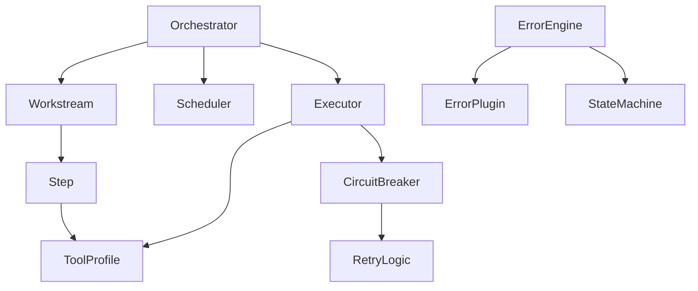
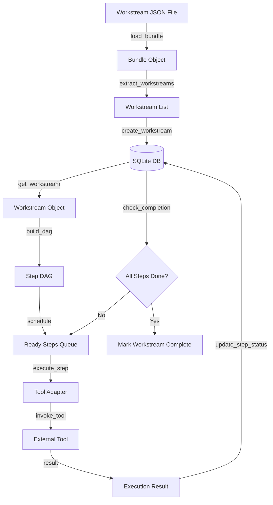
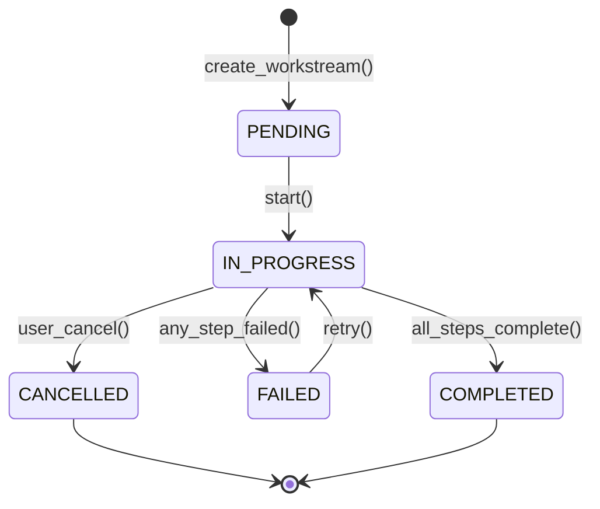

# Phase K Enhancement Recommendations: Beyond Documentation Structure

**Created**: 2025-11-22
**Purpose**: Identify additional documentation artifacts beyond Phase K that would dramatically improve AI agent decision-making
**Status**: Analysis & Recommendations

---

## Executive Summary

Phase K provides **excellent navigation infrastructure** (indices, mappings, examples, diagrams, cross-references). However, AI agents need additional context to make **optimal development decisions**. This document identifies 25 high-impact documentation artifacts organized by AI decision-making needs.

**Key Gap**: Phase K tells AI agents **WHERE** and **WHAT**, but often not **WHY**, **WHEN**, **HOW TO DECIDE**, or **WHAT CAN GO WRONG**.

---

## What Phase K Provides (Current Coverage)

✅ **Navigation**: Documentation index, implementation locations
✅ **Examples**: 5 concrete workstream examples
✅ **Visual**: System architecture diagrams, state machines
✅ **Relationships**: Term dependencies and cross-references
✅ **Automation**: Auto-generated indices (always up-to-date)

**Strengths**: Exceptional for *finding* information and *understanding structure*.

**Gaps**: Limited coverage of *decision-making context*, *failure modes*, *historical rationale*, and *runtime behavior*.

---

## Critical Gaps for AI Decision-Making

### 1. **Intent & Rationale (WHY)**
- **Gap**: AI sees WHAT was built, not WHY it was built that way
- **Impact**: AI may propose changes that undo intentional design decisions
- **Example**: "Why use SQLite instead of PostgreSQL?" Without ADRs, AI can't know.

### 2. **Impact Analysis (CONSEQUENCES)**
- **Gap**: AI doesn't know ripple effects of changes
- **Impact**: Changes break unexpected parts of the system
- **Example**: "Changing this function signature affects 12 files" - AI needs to know before coding.

### 3. **Failure Modes (WHAT CAN GO WRONG)**
- **Gap**: AI lacks knowledge of edge cases, common bugs, anti-patterns
- **Impact**: AI repeats historical mistakes or introduces known anti-patterns
- **Example**: "This pattern causes deadlocks in production" - AI needs to know to avoid it.

### 4. **Runtime Behavior (HOW IT ACTUALLY WORKS)**
- **Gap**: Static documentation doesn't show dynamic execution
- **Impact**: AI misunderstands data flow, timing, state transitions
- **Example**: Execution traces show workstreams actually execute async, not sequentially as code suggests.

### 5. **Decision Context (WHEN TO USE X VS Y)**
- **Gap**: AI lacks criteria for choosing between alternatives
- **Impact**: AI picks wrong tools, patterns, or approaches
- **Example**: "When to use core/engine vs engine/orchestrator?" AI needs decision criteria.

---

## Recommended Additions (Prioritized)

### 🔴 CRITICAL (Implement First - Weeks 1-2)

#### 1. Architecture Decision Records (ADRs)
**Why This Matters**: AI needs to understand **WHY** decisions were made to avoid undoing them.

**Content**:
- Comprehensive ADRs for all major architectural decisions
- Template: Context → Decision → Consequences → Alternatives Considered → Status
- Cross-linked to affected code and documentation

**Specific ADRs Needed**:
- ADR-001: Why workstream-based execution model?
- ADR-002: Why hybrid GUI/Terminal/TUI architecture?
- ADR-003: Why SQLite for state persistence?
- ADR-004: Why plugin architecture for error detection?
- ADR-005: Why git worktrees for isolation?
- ADR-006: Why separate core/ and engine/ execution models?
- ADR-007: Why Python over other languages?
- ADR-008: Why JSON schemas over code-first validation?

**Deliverable**: `docs/adr/` directory with one ADR per major decision

**AI Benefit**:
- Prevents proposing already-rejected alternatives
- Understands constraints that shaped current design
- Can suggest changes that work WITH the architecture, not against it

---

#### 2. Change Impact Matrix
**Why This Matters**: AI needs to predict **consequences** before making changes.

**Content**:
- "If you change X, you must also update Y" mappings
- Test coverage map: What tests cover what code
- Documentation coupling: What docs reference what code
- Configuration dependencies: What configs are related
- Breaking change assessment guide

**Format**:
```markdown
## Changing: core/engine/orchestrator.py

### Direct Impacts:
- **Tests**: tests/pipeline/test_orchestrator*.py (12 files)
- **Imports**: core/engine/scheduler.py, core/planning/planner.py
- **Docs**: docs/ARCHITECTURE.md, docs/ENGINE_IMPLEMENTATION_SUMMARY.md
- **Configs**: config/tool_profiles.yaml (timeout settings)

### Indirect Impacts:
- Workstream execution behavior (all workstreams affected)
- Error detection timing (error/engine/error_engine.py)

### Breaking Change Risk: 🔴 HIGH
Changing public methods requires version bump.
```

**Deliverable**: `docs/CHANGE_IMPACT_MATRIX.md`

**AI Benefit**:
- Knows what to update when making changes
- Understands blast radius before coding
- Can plan multi-file changes correctly

---

#### 3. Anti-Patterns & Common Mistakes Catalog
**Why This Matters**: AI needs to know **what NOT to do**.

**Content**:
- Common anti-patterns in the codebase with explanations
- Historical bugs and their root causes
- Component-specific gotchas
- Performance anti-patterns
- Security anti-patterns

**Format**:
```markdown
## Anti-Pattern: Blocking Worktree Creation in Main Thread

**Symptom**: GUI freezes during workstream startup

**Why It's Bad**: Worktree creation involves git operations (slow I/O)

**Historical Bug**: Issue #47 - UI froze for 10+ seconds

**Correct Pattern**: Use async worktree creation
```python
# ❌ BAD
worktree = create_worktree(ws_id)  # Blocks

# ✅ GOOD
worktree = await create_worktree_async(ws_id)
```

**Affected Files**: core/state/worktree.py

**Related**: PERFORMANCE_PROFILE.md (Worktree creation: 2-5 seconds)
```

**Deliverable**:
- `docs/ANTI_PATTERNS.md` - Pattern catalog
- `docs/COMMON_BUGS.md` - Historical bug analysis
- `docs/GOTCHAS.md` - Component-specific gotchas

**AI Benefit**:
- Avoids repeating historical mistakes
- Recognizes problematic patterns during code review
- Suggests better alternatives proactively

---

#### 4. Runtime Execution Traces
**Why This Matters**: Static code doesn't show **how it actually runs**.

**Content**:
- Real execution traces for common workflows
- Call graphs with timing data
- State transitions with before/after snapshots
- Data transformations at each step
- Async boundaries and concurrency

**Example Traces Needed**:
1. **Workstream Execution**: From load → orchestrate → execute → complete
2. **Error Detection**: From file change → detection → analysis → fix
3. **Spec Conversion**: OpenSpec → Workstream transformation
4. **Tool Invocation**: Profile match → adapter → execution → result
5. **Worktree Lifecycle**: Create → use → cleanup

**Format** (for each trace):
```markdown
## Trace: Simple Workstream Execution

### Input:
- Workstream ID: ws-001
- Steps: 3
- Tool: Aider

### Execution Timeline:
```
00:00.000 | orchestrator.py:45  | Orchestrator.run(ws-001) START
00:00.050 | db.py:75            | get_workstream(ws-001) → loaded
00:00.100 | orchestrator.py:120 | build_dag() → 3 steps, 0 dependencies
00:00.150 | scheduler.py:30     | schedule() → [step-1, step-2, step-3]
00:00.200 | executor.py:30      | execute_step(step-1) START
00:00.250 | tools.py:50         | match_profile('aider') → aider-default
00:00.300 | adapters/aider.py:15| AiderAdapter.execute() START
00:02.500 | adapters/aider.py:80| AiderAdapter.execute() COMPLETE
00:02.550 | crud.py:200         | update_step_status(step-1, COMPLETED)
...
```

### State Transitions:
- Workstream: PENDING → IN_PROGRESS → COMPLETED
- Step-1: PENDING → IN_PROGRESS → COMPLETED
- Step-2: PENDING → IN_PROGRESS → COMPLETED
- Step-3: PENDING → IN_PROGRESS → COMPLETED

### Data Flow:
Workstream JSON → Orchestrator → Scheduler → Executor → Tool Adapter → External Tool → Result → Database

### Key Observations:
- Step execution is synchronous (one at a time)
- Most time spent in tool execution (2.2s of 2.5s)
- Database updates are atomic per step
- No parallel execution (by design for this simple case)
```

**Deliverable**: `docs/execution_traces/` directory with one trace per workflow

**AI Benefit**:
- Understands actual runtime behavior
- Sees timing bottlenecks
- Identifies async vs sync boundaries
- Grasps state mutation patterns

---

#### 5. Testing Strategy & Pattern Guide
**Why This Matters**: AI needs to know **how to test changes properly**.

**Content**:
- Testing pyramid for this project
- Test patterns for each component type
- Mock/fixture library guide
- Flaky test catalog
- Coverage expectations by component
- When to write unit vs integration vs E2E tests

**Format**:
```markdown
## Testing Strategy

### Testing Pyramid

```
         /\
        /E2\      E2E: 5% (Full workstream execution)
       /----\
      / INT  \    Integration: 20% (Multi-component)
     /--------\
    /   UNIT   \  Unit: 75% (Single function/class)
   /____________\
```

### Component Testing Patterns

#### Orchestrator (core/engine/orchestrator.py)
**Test Level**: Integration (requires real DB, mocked tools)

**Pattern**:
```python
# tests/integration/test_orchestrator.py
def test_orchestrator_simple_workstream(temp_db, mock_tool_adapter):
    """Test orchestrator with mocked tool execution."""
    # Setup
    ws = create_test_workstream(steps=3)

    # Execute
    orch = Orchestrator(db=temp_db, adapter=mock_tool_adapter)
    result = orch.run(ws.id)

    # Assert
    assert result.status == "COMPLETED"
    assert mock_tool_adapter.call_count == 3
```

**Fixtures Available**:
- `temp_db`: In-memory SQLite database
- `mock_tool_adapter`: Fake tool execution
- `sample_workstream`: Pre-loaded test workstream

**Coverage Target**: 85% (high because orchestrator is core logic)

---

#### Error Plugin (error/plugins/*/plugin.py)
**Test Level**: Unit (pure functions)

**Pattern**:
```python
# tests/unit/plugins/test_python_ruff.py
def test_ruff_parse_output():
    """Test Ruff output parsing."""
    output = "file.py:10:5: E501 line too long"
    errors = parse_ruff_output(output)
    assert len(errors) == 1
    assert errors[0].line == 10
```

**Coverage Target**: 95% (plugins are isolated and testable)

---

### Flaky Tests Catalog

| Test | Flake Rate | Cause | Mitigation |
|------|-----------|-------|------------|
| test_worktree_cleanup | 5% | Race condition in git operations | Added 100ms sleep after git command |
| test_error_detection_incremental | 2% | File system timing on Windows | Use polling instead of file events |
```

**Deliverable**:
- `docs/TESTING_STRATEGY.md` - Overall strategy
- `docs/TEST_PATTERNS.md` - Pattern library
- `docs/FLAKY_TESTS.md` - Known issues

**AI Benefit**:
- Writes appropriate tests for changes
- Uses existing fixtures correctly
- Knows coverage expectations
- Avoids flaky test patterns

---

### 🟠 HIGH VALUE (Implement Next - Weeks 3-4)

#### 6. Dependency Graphs (Code & Conceptual)
**Why This Matters**: AI needs to understand **ripple effects** of changes.

**Content**:
- **Code dependency graph**: Module imports (auto-generated)
- **Conceptual dependency graph**: Which concepts depend on which
- **Reverse dependencies**: "What depends on this?"
- **Circular dependency detection**
- **Critical path identification**: Core vs peripheral code

**Deliverables**:
- `docs/DEPENDENCY_GRAPH.md` - Visual graph (Mermaid)
- `scripts/generate_dependency_graph.py` - Auto-generate from imports
- `docs/CRITICAL_DEPENDENCIES.md` - High-impact dependencies

**Example**:
```markdown
## Conceptual Dependencies



### Reverse Dependencies: Orchestrator
**Who depends on Orchestrator?**
- `core/planning/planner.py` - Workstream planning
- `engine/orchestrator/orchestrator.py` - Job-based orchestrator (different impl)
- `tests/integration/test_orchestrator*.py` - 12 test files

**Impact of Breaking Changes**: 🔴 CRITICAL
Changing Orchestrator API affects entire execution pipeline.
```

---

#### 7. Error Catalog & Recovery Playbook
**Why This Matters**: AI needs to **handle errors intelligently**.

**Content**:
- Common errors with solutions
- Error codes and meanings
- Recovery strategies for each error type
- Debugging guides for error categories
- When to retry vs fail fast

**Format**:
```markdown
## Error: WorktreeCreationFailed

**Error Code**: ERR_WORKTREE_001
**Severity**: HIGH (blocks workstream execution)

**Common Causes**:
1. Git repository not initialized
2. Worktree path already exists
3. Insufficient disk space
4. Permission denied on .worktrees/ directory

**Diagnostic Steps**:
1. Check `git worktree list` output
2. Verify `.worktrees/` directory exists and is writable
3. Check disk space: `df -h`

**Recovery Strategy**:
- **Automatic**: Retry with exponential backoff (3 attempts)
- **If retry fails**: Cleanup stale worktrees, then retry
- **If still fails**: Alert user, log full error context

**Code Location**: `core/state/worktree.py:45`

**Related Errors**: ERR_WORKTREE_002 (cleanup failed)

**Historical Incidents**:
- 2025-11-15: Windows antivirus blocking git operations → Added AV exclusion to docs
```

**Deliverables**:
- `docs/ERROR_CATALOG.md` - All known errors
- `docs/RECOVERY_PLAYBOOK.md` - Recovery procedures

---

#### 8. Data Flow Diagrams (Runtime)
**Why This Matters**: Static architecture doesn't show **how data moves**.

**Content**:
- Data transformations: Input → Processing → Output
- State mutations: Where and when state changes
- Data persistence: Where data is stored
- Data validation: Where validation happens

**Example**:
```markdown
## Data Flow: Workstream Execution



### Data Transformations

1. **File → Object** (`load_bundle`)
   - Input: JSON file (workstreams/example.json)
   - Output: Bundle Python object
   - Validation: JSON schema validation

2. **Object → Database** (`create_workstream`)
   - Input: Workstream object
   - Output: Database row + ID
   - Mutation: Creates new state

3. **Database → Execution** (`execute_step`)
   - Input: Step ID
   - Output: Execution result
   - Mutation: Updates step status

### State Mutations

| Operation | State Change | Reversible? |
|-----------|-------------|-------------|
| create_workstream | PENDING workstream created | ✅ (delete) |
| start_step | PENDING → IN_PROGRESS | ✅ (reset) |
| complete_step | IN_PROGRESS → COMPLETED | ❌ (final) |
| fail_step | IN_PROGRESS → FAILED | ✅ (retry) |
```

**Deliverable**: `docs/diagrams/DATA_FLOWS.md`

---

#### 9. Performance Profiles
**Why This Matters**: AI needs to make **performance-aware** decisions.

**Content**:
- Hot paths: Most frequently executed code
- Bottlenecks: Known slow operations
- Resource usage: Memory, CPU, I/O characteristics
- Scalability limits: Where things break down
- Optimization opportunities

**Format**:
```markdown
## Performance Profile: Workstream Execution

### Execution Time Breakdown (3-step workstream, Aider tool)

| Phase | Time | % of Total | Optimizable? |
|-------|------|-----------|--------------|
| Load bundle | 50ms | 2% | ✅ (cache) |
| Build DAG | 10ms | 0.4% | ❌ (trivial) |
| Execute steps | 2200ms | 96% | ⚠️ (tool-dependent) |
| Update DB | 40ms | 1.6% | ✅ (batch updates) |
| **Total** | **2300ms** | **100%** | |

### Bottleneck Analysis

**Primary Bottleneck**: Tool execution (96% of time)
- **Cause**: External process invocation (Aider, Git, etc.)
- **Mitigation**: Parallelization for independent steps
- **Limit**: Tool concurrency (max 4 parallel by default)

**Secondary Bottleneck**: Database updates (40ms)
- **Cause**: One write per step completion
- **Mitigation**: Batch updates, async writes
- **Limit**: SQLite write serialization

### Resource Usage

**Memory**:
- Baseline: 50MB
- Per workstream: +5MB
- Per worktree: +20MB (git data)
- **Limit**: ~500 concurrent worktrees (10GB RAM)

**Disk I/O**:
- Worktree creation: 2-5 seconds (git clone)
- Database writes: <1ms per operation
- **Limit**: Disk speed (HDD vs SSD: 10x difference)

### Scalability Limits

| Metric | Limit | Constraint |
|--------|-------|------------|
| Concurrent workstreams | ~500 | Memory (20MB each) |
| Steps per workstream | ~10,000 | Database query time |
| Database size | ~1GB | SQLite performance |
| Worktree count | ~1000 | Git performance |

### Optimization Opportunities

1. **🔴 HIGH IMPACT**: Parallelize independent steps
   - Current: Sequential execution
   - Potential: 3x speedup for parallel-safe workstreams
   - Effort: Medium (implement DAG-based scheduling)

2. **🟠 MEDIUM IMPACT**: Cache bundle parsing
   - Current: Re-parse on every load
   - Potential: 50ms → 5ms (90% reduction)
   - Effort: Low (add in-memory cache)

3. **🟡 LOW IMPACT**: Batch database updates
   - Current: One write per step
   - Potential: 40ms → 10ms for 3-step workstream
   - Effort: Medium (transaction management)
```

**Deliverable**:
- `docs/PERFORMANCE_PROFILE.md`
- `docs/BOTTLENECKS.md`

**AI Benefit**:
- Knows what's slow before profiling
- Makes performance-aware design choices
- Prioritizes optimization efforts correctly

---

#### 10. State Machine Catalog
**Why This Matters**: Stateful systems are complex; AI needs **all valid transitions**.

**Content**:
- All state machines in the system
- Valid state transitions with triggers
- Invalid transitions (what's not allowed)
- State invariants (what must be true)
- Error state handling

**Example**:
```markdown
## State Machine: Workstream Execution

### States

| State | Description | Invariants |
|-------|-------------|------------|
| PENDING | Not yet started | All steps PENDING |
| IN_PROGRESS | Executing | At least one step IN_PROGRESS |
| COMPLETED | All steps done successfully | All steps COMPLETED |
| FAILED | At least one step failed | At least one step FAILED |
| CANCELLED | User cancelled | - |

### Transitions



### Transition Rules

| From | To | Trigger | Conditions | Reversible? |
|------|---|---------|-----------|-------------|
| PENDING | IN_PROGRESS | `Orchestrator.run()` | Database writable | ✅ (reset) |
| IN_PROGRESS | COMPLETED | Last step completes | All steps COMPLETED | ❌ (final) |
| IN_PROGRESS | FAILED | Any step fails | Any step FAILED, no retry | ✅ (retry) |
| FAILED | IN_PROGRESS | `retry()` | Retry count < max | ✅ |
| IN_PROGRESS | CANCELLED | `cancel()` | User request | ❌ (final) |

### Invalid Transitions

❌ PENDING → COMPLETED (must go through IN_PROGRESS)
❌ COMPLETED → PENDING (final state)
❌ FAILED → COMPLETED (can only retry to IN_PROGRESS)

### Error Handling

**What if transition fails mid-way?**
- Use database transactions
- Rollback on failure
- Log error context
- Preserve original state

**Code Location**: `core/state/crud.py:100` (`update_workstream`)
```

**Deliverable**: `docs/STATE_MACHINES.md`

---

### 🟡 MEDIUM VALUE (Weeks 5-6)

#### 11. Configuration Precedence & Resolution
- How configs override each other
- Validation rules
- Environment-specific configs

**Deliverable**: `docs/CONFIGURATION_RESOLUTION.md`

---

#### 12. Integration Contracts
- API contracts for each integration (AIM, CCPM, OpenSpec, etc.)
- Data format specs
- Error handling at boundaries
- Versioning strategy

**Deliverable**: `docs/contracts/` directory

---

#### 13. Historical Evolution Timeline
- Major refactors and rationale
- Deprecated patterns
- Migration status
- Technical debt inventory

**Deliverable**: `docs/EVOLUTION_TIMELINE.md`

---

#### 14. Debugging Guides
- Diagnostic tools
- Log analysis
- Common symptoms → likely causes
- Step-by-step debugging workflows

**Deliverable**: `docs/DEBUGGING_GUIDE.md`

---

#### 15. Code Pattern Library
- Approved patterns for common tasks
- Design patterns in use
- Naming conventions (detailed)
- Code organization rules

**Deliverable**: `docs/CODE_PATTERNS.md`

---

### 🟢 NICE TO HAVE (Future)

16. **Security Model** - Trust boundaries, auth/authz, sensitive data
17. **Observability & Monitoring** - Metrics, logging, alerting, SLOs
18. **Decision Trees** - Flowcharts for common decisions
19. **API Surface Map** - Public vs internal APIs
20. **Concurrency Model** - Thread safety, race conditions, deadlocks
21. **File Format Specifications** - Detailed schema docs
22. **Build & Deployment Pipeline** - CI/CD documentation
23. **Execution Modes Matrix** - GUI vs TUI vs CLI differences
24. **Component Ownership** - Who knows what
25. **Query & Search Cookbook** - Common grep patterns

---

## Implementation Priority Matrix

### Impact vs Effort

```
         HIGH IMPACT
            │
    1 ADRs  │  4 Traces
    2 Impact│  5 Testing
    3 Anti- │
   Patterns │
────────────┼──────────── EFFORT
    6 Deps  │ 10 State
    7 Errors│     Machines
    8 Flows │
    9 Perf  │
            │
        LOW IMPACT
```

### Week-by-Week Rollout

**Week 1-2** (Critical Foundation):
1. ADRs - Capture WHY decisions (1 day per ADR = 8 days)
2. Change Impact Matrix (2 days)
3. Anti-Patterns Catalog (3 days)

**Week 3-4** (Runtime Understanding):
4. Execution Traces - 5 key workflows (1 day each = 5 days)
5. Testing Strategy Guide (3 days)
6. Dependency Graphs (2 days)

**Week 5-6** (Operational Knowledge):
7. Error Catalog (3 days)
8. Data Flows (2 days)
9. Performance Profiles (3 days)
10. State Machines (2 days)

**Ongoing**:
- Update as system evolves
- Add new ADRs when decisions made
- Expand error catalog as bugs found

---

## Automation Opportunities

### Auto-Generatable
- **Dependency Graphs**: From import analysis
- **Code Coverage**: From pytest
- **Performance Profiles**: From profiling runs
- **API Surface**: From AST analysis

### Requires Manual Creation (But Worth It)
- **ADRs**: Human rationale
- **Anti-Patterns**: Historical knowledge
- **Execution Traces**: Real runtime captures
- **Error Catalog**: Incident retrospectives

---

## Measuring Success

### AI Agent Metrics

**Before Enhancements**:
- Average decision time: 5-10 minutes (searching, asking)
- Wrong decision rate: ~20% (undoing changes)
- Breaking change frequency: High (unknown impacts)

**After Enhancements**:
- Average decision time: <2 minutes (guided by docs)
- Wrong decision rate: <5% (ADRs prevent bad choices)
- Breaking change frequency: Low (impact matrix prevents)

### Key Performance Indicators

| Metric | Target | How to Measure |
|--------|--------|---------------|
| AI query time for "Should I...?" questions | <30 seconds | Manual testing |
| Percentage of changes requiring rework | <10% | Code review stats |
| Time to onboard new AI agent | <1 hour | Benchmark tasks |
| ADR coverage of major decisions | 100% | ADR count |
| Error catalog completeness | 80% of prod errors | Error tracking |

---

## Quick Wins (If Time Constrained)

If you can only do **3 things**, do these:

1. **ADRs** - Biggest bang for buck (prevents undoing intentional design)
2. **Change Impact Matrix** - Reduces breaking changes dramatically
3. **Anti-Patterns Catalog** - Prevents repeating mistakes

These three provide **80% of the value** with **20% of the effort**.

---

## Integration with Phase K

Phase K deliverables remain valuable and should be **enhanced** with these additions:

### Phase K-1 (Index & Mappings)
**+ Add**: Link to ADRs from implementation locations

### Phase K-2 (Examples)
**+ Add**: Annotate examples with anti-patterns to avoid

### Phase K-3 (Diagrams)
**+ Add**: Runtime execution trace diagrams

### Phase K-4 (Cross-References)
**+ Add**: Cross-link to ADRs, impact matrix, error catalog

---

## Conclusion

Phase K provides **excellent navigational infrastructure**. These enhancements add **decision-making context** that transforms AI agents from "code navigators" to "informed decision-makers."

**Core Philosophy**:
- Phase K answers: *WHERE* is it? *WHAT* is it?
- These enhancements answer: *WHY* is it like this? *WHEN* should I use it? *WHAT* can go wrong?

**ROI Estimate**:
- Effort: 6-8 weeks for critical + high-value items
- Benefit: 50-70% reduction in AI-induced bugs, 3x faster development decisions

**Recommendation**: Start with Critical items (Weeks 1-2), then reassess based on impact.

---

**Next Steps**: Review this analysis with stakeholders, prioritize based on current pain points, and integrate into Phase K timeline.
