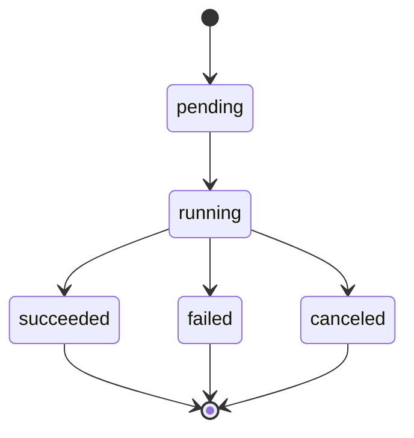
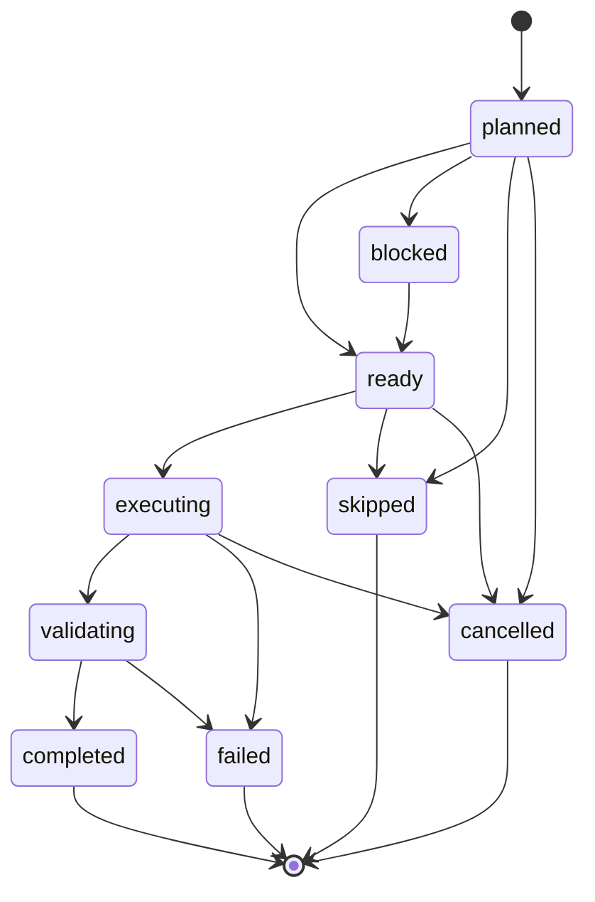
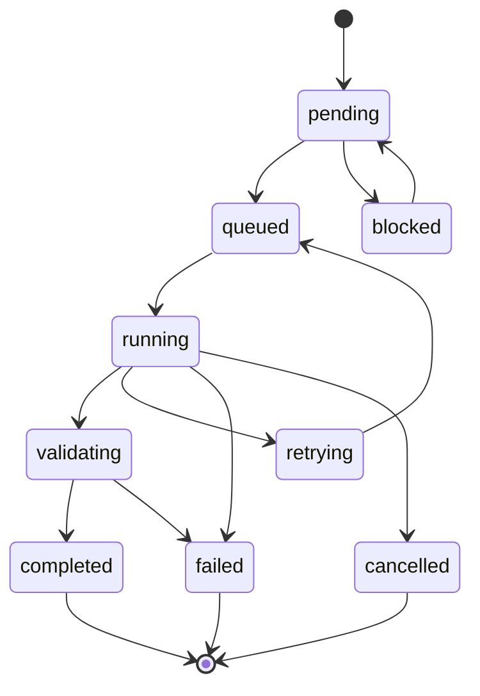
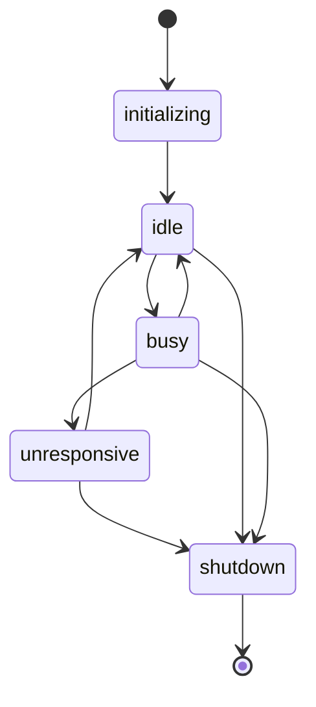

# Unified State Machines SSOT

> **Authority Notice**
> This document is the **single source of truth** for **all runtime, orchestration, validation, and UET V2 state machines**.  
> No other document may redefine states without updating this file.

---

## 0. Machine Index (Authoritative)

```json
{
  "sections": {
    "1": "Orchestration_Layer",
    "2": "UET_V2_Execution_Engine",
    "3": "Cross_System_Derivations",
    "4": "Validation_and_Test_Requirements",
    "5": "Recovery_and_Manual_Override",
    "6": "Database_and_Persistence_Model",
    "7": "Event_and_Audit_Model",
    "8": "Global_Invariants_and_Policies",
    "9": "Versioning_and_Change_Control",
    "10": "Source_Traceability_and_Deletions"
  }
}
```

---

# SECTION 1 — ORCHESTRATION LAYER (Runtime Control)

## 1.1 Purpose and Scope
- Defines canonical state machines for:
  - Run
  - Workstream
  - Task
  - Orchestration Worker
- Governs all runtime scheduling, dependency resolution, and execution flow.

---

## 1.2 Run State Machine

### 1.2.1 State Set
- `pending`
- `running`
- `succeeded`
- `failed`
- `canceled`

### 1.2.2 Mermaid Diagram


### 1.2.3 State Semantics

| State | Description | Terminal |
|-------|-------------|----------|
| **pending** | Run created, orchestrator not yet started | No |
| **running** | Orchestrator actively scheduling workstreams | No |
| **succeeded** | All workstreams completed successfully | Yes |
| **failed** | One or more critical workstreams failed | Yes |
| **canceled** | Run manually stopped before completion | Yes |

**Terminal States:** `succeeded`, `failed`, `canceled` - once reached, run cannot transition to another state.

### 1.2.4 Valid Transitions

| From State | To State | Trigger | Conditions |
|------------|----------|---------|------------|
| `pending` | `running` | Orchestrator starts scheduling | None |
| `running` | `succeeded` | All workstreams complete | All workstreams in `completed` or `skipped` state |
| `running` | `failed` | Critical workstream fails | Any critical workstream enters `failed` state |
| `running` | `canceled` | User cancels run | Manual intervention |
| `pending` | `canceled` | User cancels before start | Manual intervention |

### 1.2.5 Invalid Transitions

| From State | To State | Why Invalid |
|------------|----------|-------------|
| `succeeded` | Any | Terminal state, cannot change |
| `failed` | Any | Terminal state, cannot change |
| `canceled` | Any | Terminal state, cannot change |
| `running` | `pending` | Cannot go back to pending |
| `pending` | `succeeded` | Must run before succeeding |
| `pending` | `failed` | Must run before failing |

---

## 1.3 Workstream State Machine

### 1.3.1 State Set
- `planned`
- `ready`
- `blocked`
- `executing`
- `validating`
- `completed`
- `failed`
- `cancelled`
- `skipped`

### 1.3.2 Mermaid Diagram


### 1.3.3 State Definitions

| State | Description | Terminal | Orchestration Impact |
|-------|-------------|----------|---------------------|
| **planned** | Workstream defined, tasks not yet created | No | Not scheduled |
| **ready** | All tasks created and dependencies satisfied, ready to execute | No | Available for scheduling |
| **blocked** | Waiting for dependency workstreams to complete | No | Cannot be scheduled |
| **executing** | At least one task actively running | No | In progress |
| **validating** | All tasks completed, final workstream validation running | No | Post-execution phase |
| **completed** | Workstream successful, changes merged | Yes | Success outcome |
| **failed** | Workstream failed, preserved for analysis | Yes | Failure outcome |
| **cancelled** | Workstream cancelled by user | Yes | Stopped manually |
| **skipped** | Workstream explicitly disabled/skipped | Yes | Intentionally omitted |

**Terminal States:** `completed`, `failed`, `cancelled`, `skipped`

### 1.3.4 State Derivation Rules

Workstream state is **derived from task states**:

```python
def derive_workstream_state(tasks: List[Task]) -> WorkstreamState:
    """
    Derive workstream state from child task states.
    Priority order: executing > validating > completed > failed > blocked > ready
    """
    if any(t.state == 'running' for t in tasks):
        return 'executing'
    
    if all(t.state == 'completed' for t in tasks):
        return 'validating'  # Trigger final validation
    
    if any(t.state == 'failed' and t.is_critical for t in tasks):
        return 'failed'  # Critical task failure
    
    if any(t.state == 'blocked' for t in tasks):
        return 'blocked'  # Dependency not met
    
    if all(t.state in ['pending', 'queued'] for t in tasks):
        return 'ready'  # Ready to execute
    
    return 'executing'  # Mixed states, still in progress
```

### 1.3.5 Valid Transitions

| From State | To State | Trigger | Conditions |
|------------|----------|---------|------------|
| `planned` | `ready` | All tasks created | Task count matches specification, dependencies met |
| `planned` | `blocked` | Dependency not satisfied | Prerequisite workstream not in `completed` state |
| `planned` | `skipped` | Explicitly disabled | User/config marks workstream as skipped |
| `planned` | `cancelled` | User cancels | Manual intervention before execution |
| `blocked` | `ready` | Dependencies met | All prerequisite workstreams now `completed` |
| `ready` | `executing` | First task starts | At least one task transitioned to `running` |
| `ready` | `skipped` | Explicitly disabled | Configuration change |
| `ready` | `cancelled` | User cancels | Manual intervention |
| `executing` | `validating` | All tasks done | All tasks in `completed` state, start validation |
| `executing` | `failed` | Critical failure | Critical task reached `failed` state |
| `executing` | `cancelled` | User cancels | Manual intervention during execution |
| `validating` | `completed` | Validation passed | Final workstream validation successful, merge complete |
| `validating` | `failed` | Validation failed | Final validation rules failed |

### 1.3.6 Invalid Transitions

| From State | To State | Why Invalid |
|------------|----------|-------------|
| `completed` | Any | Terminal state, cannot change |
| `failed` | Any | Terminal state, cannot change |
| `cancelled` | Any | Terminal state, cannot change |
| `skipped` | Any | Terminal state, cannot change |
| `executing` | `planned` | Cannot go backward |
| `executing` | `blocked` | Already executing, too late to block |
| `validating` | `executing` | Cannot restart after completion |

### 1.3.7 Workstream Invariants

1. **Task State Consistency**: Workstream state must be consistent with aggregate task states
2. **Completion Requirement**: Can only reach `completed` if all tasks are `completed`
3. **Critical Failure Propagation**: Any critical task failure immediately transitions workstream to `failed`
4. **Archive Preservation**: Failed workstreams preserved in `.state/archive/` with full state
5. **Merge Requirement**: Only `completed` workstreams may be merged to main branch
6. **Dependency Ordering**: Cannot execute if any dependency workstream is not `completed`

---

## 1.4 Task State Machine

### 1.4.1 State Set
- `pending`
- `queued`
- `running`
- `validating`
- `completed`
- `failed`
- `retrying`
- `cancelled`
- `blocked`

### 1.4.2 Mermaid Diagram


### 1.4.3 State Definitions

| State | Description | Terminal | Worker Assignment |
|-------|-------------|----------|-------------------|
| **pending** | Task created, waiting for dependencies | No | None |
| **queued** | Task scheduled, waiting for worker | No | None |
| **blocked** | Dependencies not met | No | None |
| **running** | Task actively executing on worker | No | Assigned |
| **validating** | Execution complete, validation in progress | No | Released |
| **completed** | Task and validation successful | Yes | Released |
| **failed** | Task or validation failed (max retries exceeded) | Yes | Released |
| **retrying** | Task failed, retry scheduled | No | Released |
| **cancelled** | Task cancelled by user | Yes | Released |

**Terminal States:** `completed`, `failed`, `cancelled`

### 1.4.4 Transition Guards & Actions

#### pending → queued
- **Trigger**: `scheduler_assigned`
- **Guard**: All task dependencies satisfied (all `depends_on` tasks in `completed` state)
- **Actions**:
  - Add task to execution queue
  - Update execution plan
  - Emit `task_state_transition` event

#### pending → blocked
- **Trigger**: `dependency_check_failed`
- **Guard**: One or more dependencies not in `completed` state
- **Actions**:
  - Set blocked_by list
  - Emit event with severity="info"

#### blocked → pending
- **Trigger**: `dependency_satisfied`
- **Guard**: All previously blocking dependencies now `completed`
- **Actions**:
  - Clear blocked_by list
  - Re-evaluate for scheduling

#### queued → running
- **Trigger**: `worker_started`
- **Guard**: Worker with required capabilities available
- **Actions**:
  - Assign `worker_id` to task
  - Set `started_at` timestamp
  - Start task timeout timer
  - Emit `task_state_transition` event

#### running → validating
- **Trigger**: `execution_completed`
- **Guard**: Worker reports `exit_code` in expected range (typically 0)
- **Actions**:
  - Stop timeout timer
  - Release worker back to pool
  - Run post-execution validation rules
  - Emit event

#### running → retrying
- **Trigger**: `execution_failed`
- **Guard**: `retry_count < max_retries`
- **Actions**:
  - Increment `retry_count`
  - Calculate exponential backoff delay
  - Schedule retry
  - Release worker
  - Emit event with severity="warning"

#### running → failed
- **Trigger**: `execution_failed` OR `timeout_exceeded`
- **Guard**: `retry_count >= max_retries`
- **Actions**:
  - Set `last_error` from worker output
  - Release worker
  - Mark dependent tasks as `blocked`
  - Emit event with severity="error"

#### running → cancelled
- **Trigger**: `user_cancelled`
- **Guard**: User requests cancellation
- **Actions**:
  - Terminate worker execution
  - Release worker
  - Set `cancelled_at` timestamp
  - Emit event

#### retrying → queued
- **Trigger**: `retry_delay_elapsed`
- **Guard**: Backoff period complete
- **Actions**:
  - Add task back to queue
  - Emit retry attempt event

#### validating → completed
- **Trigger**: `validation_passed`
- **Guard**: All post-execution rules pass
- **Actions**:
  - Set `completed_at` timestamp
  - Unblock dependent tasks
  - Release all resources
  - Emit event with severity="info"

#### validating → failed
- **Trigger**: `validation_failed`
- **Guard**: Any post-execution rule fails
- **Actions**:
  - Set `last_error` with validation details
  - Mark dependent tasks as `blocked`
  - Emit event with severity="error"

### 1.4.5 Task Invariants

1. **Single Active State**: A task is in exactly one state at any time
2. **Monotonic Progress**: Terminal states cannot transition to non-terminal states
3. **Worker Assignment**: Only `running` tasks have assigned workers; `worker_id` must be NULL for all other states
4. **Retry Limit**: `retry_count` never exceeds `max_retries`
5. **Timestamp Ordering**: `created_at` ≤ `started_at` ≤ `completed_at`
6. **Dependency Satisfaction**: `queued` tasks have all dependencies in `completed` state
7. **Timeout Enforcement**: Tasks in `running` state for > `timeout_sec` → `failed`
8. **Critical Flag Immutable**: `is_critical` flag cannot change after task creation

### 1.4.6 Dependency Resolution

```python
def can_execute_task(conn, task_id: str) -> bool:
    """Check if task's dependencies are met."""
    task = get_task(conn, task_id)
    depends_on = task.get('depends_on', [])
    
    if not depends_on:
        return True  # No dependencies
    
    # Check each dependency is successful
    for dep_task_id in depends_on:
        dep_task = get_task(conn, dep_task_id)
        if dep_task['state'] != 'completed':
            return False  # Dependency not met
    
    return True  # All dependencies met

def get_blocked_by(conn, task_id: str) -> List[str]:
    """Get list of tasks blocking this task."""
    task = get_task(conn, task_id)
    depends_on = task.get('depends_on', [])
    
    blocked_by = []
    for dep_task_id in depends_on:
        dep_task = get_task(conn, dep_task_id)
        if dep_task['state'] != 'completed':
            blocked_by.append(dep_task_id)
    
    return blocked_by
```

---

## 1.5 Orchestration Worker State Machine

### 1.5.1 State Set
- `initializing`
- `idle`
- `busy`
- `unresponsive`
- `shutdown`

### 1.5.2 Mermaid Diagram


### 1.5.3 State Definitions

| State | Description | Terminal | Accepts Tasks |
|-------|-------------|----------|---------------|
| **initializing** | Worker starting up, registering capabilities | No | No |
| **idle** | Worker ready, no assigned tasks | No | Yes |
| **busy** | Worker executing task | No | No |
| **unresponsive** | Worker not responding to health checks | No | No |
| **shutdown** | Worker gracefully shutting down | Yes | No |

### 1.5.4 Valid Transitions

| From | To | Trigger | Notes |
|------|-----|---------|-------|
| `initializing` | `idle` | Worker registration complete | Worker capabilities registered with orchestrator |
| `idle` | `busy` | Task assigned | Task requires capabilities worker provides |
| `busy` | `idle` | Task completed | Task finished (success or failure) |
| `busy` | `unresponsive` | Health check timeout | Worker missed N consecutive health checks |
| `unresponsive` | `idle` | Health check recovered | Worker responds to health check |
| `unresponsive` | `shutdown` | Max timeout exceeded | Recovery attempts exhausted |
| `idle` | `shutdown` | Shutdown requested | Immediate graceful shutdown |
| `busy` | `shutdown` | Shutdown requested | Complete current task, then shut down |

### 1.5.5 Invalid Transitions

- **shutdown → any state** (terminal state, cannot restart)
- **initializing → busy** (must become idle first)
- **initializing → unresponsive** (too early for health monitoring)
- **idle → unresponsive** (unresponsive only from busy state)

### 1.5.6 Health & Capacity Rules

#### Heartbeat Requirements
- **States requiring heartbeat**: `idle`, `busy`
- **Heartbeat interval**: Every 60 seconds
- **Timeout threshold**: 2 consecutive missed heartbeats → `unresponsive`
- **Recovery window**: 5 minutes max before → `shutdown`

#### Capacity Management
```python
class WorkerCapacity:
    max_concurrent_tasks: int  # Default: 1
    current_load: int          # Number of assigned tasks
    capabilities: Set[str]     # e.g., {"python", "git", "aider"}
    affinity: Optional[Dict]   # Workstream/phase affinity

def can_assign_task(worker: Worker, task: Task) -> bool:
    """Check if worker can accept task."""
    if worker.state != 'idle':
        return False
    
    if worker.current_load >= worker.max_concurrent_tasks:
        return False
    
    # Check capability match
    required_caps = task.required_capabilities
    if not required_caps.issubset(worker.capabilities):
        return False
    
    # Check affinity if specified
    if worker.affinity:
        if task.workstream_id not in worker.affinity.get('workstreams', []):
            return False
    
    return True
```

#### Health Monitoring
```python
def check_worker_health(worker: Worker) -> HealthStatus:
    """Monitor worker health and update state."""
    now = datetime.now()
    last_heartbeat = worker.last_heartbeat
    
    time_since_heartbeat = (now - last_heartbeat).total_seconds()
    
    if time_since_heartbeat > 120:  # 2 missed heartbeats
        if worker.state == 'busy':
            transition_worker(worker.id, 'unresponsive')
            return HealthStatus.UNRESPONSIVE
    
    if worker.state == 'unresponsive' and time_since_heartbeat > 300:
        # 5 minutes unresponsive → shutdown
        transition_worker(worker.id, 'shutdown')
        cleanup_worker_resources(worker.id)
        return HealthStatus.TERMINATED
    
    return HealthStatus.HEALTHY
```

### 1.5.7 Worker Invariants

1. **Heartbeat Frequency**: Workers in `idle` or `busy` must send heartbeat every 60s
2. **Task Assignment**: Only `idle` workers can be assigned tasks
3. **Capacity Limit**: `current_load` ≤ `max_concurrent_tasks`
4. **Affinity Immutable**: `worker.affinity` cannot change after `initializing`
5. **Timestamp Accuracy**: `shutdown_at` only set in `shutdown` state
6. **Graceful Shutdown**: Workers in `shutdown` state complete current tasks before terminating
7. **Resource Cleanup**: Failed workers release all held resources

### 1.5.8 State Change Examples

**Normal Workflow**:
```
initializing (worker created, registering capabilities)
    ↓
idle (ready, capabilities: {python, git, aider})
    ↓ [task assigned: "fix linting errors"]
busy (executing task)
    ↓ [task completes successfully]
idle (returned to pool)
    ↓ [shutdown requested]
shutdown (graceful termination)
```

**Health Check Failure → Recovery**:
```
busy (executing long-running task)
    ↓ [missed 2 heartbeats]
unresponsive (task still running, worker unresponsive)
    ↓ [heartbeat resumes]
idle (recovered, task marked for validation)
```

**Health Check Failure → Termination**:
```
busy (executing task)
    ↓ [missed heartbeats]
unresponsive (recovery attempts fail)
    ↓ [5 minutes elapsed]
shutdown (terminated, resources released)
```

---

# SECTION 2 — UET V2 EXECUTION ENGINE (Internal Enforcement)

## 2.1 UET Worker State Machine

### 2.1.1 State Set
- `SPAWNING`
- `IDLE`
- `BUSY`
- `DRAINING`
- `TERMINATED`

### 2.1.2 State Definitions

| State | Description | Terminal |
|-------|-------------|----------|
| **SPAWNING** | Worker being created/initialized | No |
| **IDLE** | Worker ready and waiting for tasks | No |
| **BUSY** | Worker actively executing a task | No |
| **DRAINING** | Worker finishing current task before shutdown | No |
| **TERMINATED** | Worker stopped and removed from pool | Yes |

### 2.1.3 Transitions & Invariants

#### Valid Transitions

| From | To | Trigger | Notes |
|------|-----|---------|-------|
| SPAWNING | IDLE | Worker initialization complete | Normal spawn |
| SPAWNING | TERMINATED | Spawn failed | Error during init |
| IDLE | BUSY | Task assigned to worker | Normal operation |
| IDLE | TERMINATED | Shutdown requested | Immediate shutdown |
| BUSY | IDLE | Task completed successfully | Return to pool |
| BUSY | DRAINING | Shutdown requested while busy | Graceful shutdown |
| BUSY | TERMINATED | Worker crashed | Abnormal termination |
| DRAINING | TERMINATED | Current task finished | Graceful completion |

#### Invalid Transitions

These transitions will raise `ValueError`:

- **TERMINATED → any state** (terminal state, cannot restart)
- **IDLE → SPAWNING** (cannot go backward)
- **BUSY → SPAWNING** (cannot go backward)
- **DRAINING → IDLE** (must complete shutdown)
- **DRAINING → BUSY** (no new tasks while draining)

#### State Invariants

1. **Heartbeat Required**: Workers in IDLE or BUSY must send heartbeat every 60s
2. **Timeout Detection**: Workers missing 2 consecutive heartbeats → quarantine → TERMINATED
3. **Affinity Immutable**: `worker.affinity` cannot change after SPAWNING
4. **Timestamp Accuracy**: `terminated_at` only set in TERMINATED state

#### Database Representation

```sql
CREATE TABLE IF NOT EXISTS uet_workers (
    worker_id TEXT PRIMARY KEY,
    worker_type TEXT NOT NULL,
    state TEXT NOT NULL CHECK(state IN ('SPAWNING', 'IDLE', 'BUSY', 'DRAINING', 'TERMINATED')),
    affinity TEXT,  -- JSON
    last_heartbeat TEXT NOT NULL,
    created_at TEXT NOT NULL DEFAULT CURRENT_TIMESTAMP,
    terminated_at TEXT,
    CHECK ((state = 'TERMINATED' AND terminated_at IS NOT NULL) OR (state != 'TERMINATED' AND terminated_at IS NULL))
);
```

#### State Change Examples

**Normal Workflow**:
```
SPAWNING (worker created)
    ↓
IDLE (initialization complete, waiting)
    ↓
BUSY (assigned task: "fix linting errors in core/engine/executor.py")
    ↓
IDLE (task complete, returned to pool)
    ↓
BUSY (assigned task: "run unit tests")
    ↓
IDLE (tests passed)
    ↓
TERMINATED (shutdown requested)
```

**Graceful Shutdown While Busy**:
```
BUSY (task running: 50% complete)
    ↓
DRAINING (shutdown requested, finish current task)
    ↓ (task completes)
TERMINATED
```

**Crash Scenario**:
```
BUSY (task running)
    ↓ (worker process dies)
TERMINATED (abnormal termination)
```

---

## 2.2 Patch Ledger State Machine

### 2.2.1 State Set
- `created`
- `validated`
- `queued`
- `applied`
- `apply_failed`
- `verified`
- `committed`
- `rolled_back`
- `quarantined`
- `dropped`

### 2.2.2 State Definitions

| State | Description | Terminal |
|-------|-------------|----------|
| **created** | Patch artifact created, not yet validated | No |
| **validated** | Passed format/scope/constraint checks | No |
| **queued** | Accepted for merge, awaiting application | No |
| **applied** | Git apply succeeded, awaiting test verification | No |
| **apply_failed** | Git apply failed (conflicts, errors) | No |
| **verified** | Applied patch passed all tests | No |
| **committed** | Git committed to main branch | No |
| **rolled_back** | Previously committed patch was reverted | Yes |
| **quarantined** | Patch failed validation or tests | Yes |
| **dropped** | Patch discarded without application | Yes |

### 2.2.3 Transition Diagram

```
created → validated → queued → applied → verified → committed
   ↓         ↓          ↓         ↓         ↓
quarantined, apply_failed → quarantined/dropped
committed → rolled_back
```

### 2.2.4 Transition Rules

#### Valid Transitions

| From | To | Trigger | Validation Required |
|------|-----|---------|---------------------|
| created | validated | All validation checks pass | ✅ Format, Scope, Constraints |
| created | quarantined | Validation failed | ❌ |
| validated | queued | Accepted for merge | ✅ Phase policy check |
| validated | quarantined | Policy violation detected | ❌ |
| queued | applied | `git apply` succeeded | ✅ Git operations |
| queued | apply_failed | `git apply` failed | ❌ |
| applied | verified | All tests passed | ✅ Test gates |
| applied | quarantined | Tests failed | ❌ |
| apply_failed | quarantined | Auto-quarantine after failure | ❌ |
| apply_failed | dropped | Manual discard decision | ❌ |
| verified | committed | `git commit` succeeded | ✅ Final commit |
| committed | rolled_back | Rollback requested | ✅ Compensation logic |

#### Invalid Transitions

These transitions are **forbidden** (raise `ValueError`):

- **committed → created** (cannot un-commit to re-create)
- **committed → queued** (cannot re-queue committed patch)
- **quarantined → any state except dropped** (terminal, must create new patch)
- **dropped → any state** (terminal)
- **rolled_back → any state** (terminal)

### 2.2.5 State Invariants

1. **State History Append-Only**: Never delete from `state_history`, only append
2. **Quarantine Reason Required**: If state=quarantined, `quarantine_reason` must be set
3. **Validation Flags**: Format/scope/constraint/test flags match current state
4. **Timestamp Monotonicity**: `updated_at` always ≥ `created_at`

### 2.2.6 Database Representation

```sql
CREATE TABLE IF NOT EXISTS patch_ledger_entries (
    ledger_id TEXT PRIMARY KEY,
    patch_id TEXT NOT NULL,
    state TEXT NOT NULL CHECK(state IN (
        'created', 'validated', 'queued', 'applied', 'apply_failed',
        'verified', 'committed', 'rolled_back', 'quarantined', 'dropped'
    )),
    phase_id TEXT,
    workstream_id TEXT,
    validation_format_passed BOOLEAN DEFAULT FALSE,
    validation_scope_passed BOOLEAN DEFAULT FALSE,
    validation_constraints_passed BOOLEAN DEFAULT FALSE,
    validation_tests_passed BOOLEAN DEFAULT FALSE,
    quarantine_reason TEXT,
    state_history TEXT NOT NULL,  -- JSON array
    created_at TEXT NOT NULL,
    updated_at TEXT NOT NULL,
    FOREIGN KEY (patch_id) REFERENCES patches(patch_id),
    CHECK ((state = 'quarantined' AND quarantine_reason IS NOT NULL) OR state != 'quarantined')
);
```

### 2.2.7 State Change Examples

**Happy Path (Success)**:
```
created (patch generated by aider)
    ↓ [validate: format=✅, scope=✅, constraints=✅]
validated
    ↓ [policy check: phase constraints satisfied]
queued
    ↓ [git apply patch.diff]
applied
    ↓ [pytest tests/ → all pass]
verified
    ↓ [git commit -m "Applied patch XYZ"]
committed
```

**Validation Failure**:
```
created (patch modifies .git/config - forbidden)
    ↓ [validate: constraints=❌ (forbidden path)]
quarantined (reason: "Attempted to modify .git/config")
```

**Test Failure**:
```
created
    ↓ [validate: all pass]
validated
    ↓
queued
    ↓ [git apply succeeded]
applied
    ↓ [pytest tests/ → 3 failures]
quarantined (reason: "Tests failed: test_executor.py::test_timeout, ...")
```

**Apply Failure (Conflict)**:
```
created
    ↓
validated
    ↓
queued
    ↓ [git apply → CONFLICT in core/engine/executor.py]
apply_failed
    ↓ [auto-quarantine after 3 retry attempts]
quarantined (reason: "Merge conflict in executor.py line 45")
```

**Rollback Scenario**:
```
committed (patch applied 2 hours ago)
    ↓ [regression detected: gate failures in subsequent workstream]
rolled_back (compensation action executed)
```

### 2.2.8 Optimistic Locking

**Problem**: Two workers try to transition same patch simultaneously

**Solution**: Database-level locking with optimistic concurrency control

```python
def transition_state(self, ledger_id: str, new_state: PatchState, reason: str = "") -> bool:
    """Transition patch ledger entry to new state with optimistic locking."""
    # Read current state with version
    entry = self.db.execute(
        "SELECT state, updated_at FROM patch_ledger_entries WHERE ledger_id = ?",
        (ledger_id,)
    ).fetchone()
    
    original_updated_at = entry['updated_at']
    
    # Validate transition
    if not self._is_valid_transition(entry['state'], new_state):
        raise ValueError(f"Invalid transition: {entry['state']} → {new_state}")
    
    # Update with optimistic locking
    result = self.db.execute(
        """
        UPDATE patch_ledger_entries
        SET state = ?, updated_at = ?
        WHERE ledger_id = ? AND updated_at = ?
        """,
        (new_state.value, datetime.now().isoformat(), ledger_id, original_updated_at)
    )
    
    if result.rowcount == 0:
        # Someone else modified this patch - retry
        return self.transition_state(ledger_id, new_state, reason)
    
    return True
```

---

## 2.3 Test Gate State Machine

### 2.3.1 State Set
- `PENDING`
- `RUNNING`
- `PASSED`
- `FAILED`
- `BLOCKED`

### 2.3.2 State Definitions

| State | Description | Terminal |
|-------|-------------|----------|
| **PENDING** | Gate defined but not yet executed | No |
| **RUNNING** | Gate command currently executing | No |
| **PASSED** | Gate command returned expected exit code (0) | Yes |
| **FAILED** | Gate command returned non-zero exit code | Yes |
| **BLOCKED** | Gate cannot run (dependencies not met) | No |

### 2.3.3 Transition Diagram

```
PENDING → RUNNING → PASSED
    ↓       ↓
BLOCKED  FAILED → BLOCKED (dependent tasks)
    ↓
PENDING (when unblocked)
```

### 2.3.4 Valid Transitions

| From | To | Trigger | Notes |
|------|-----|---------|-------|
| PENDING | RUNNING | Gate executor starts command | Normal execution |
| PENDING | BLOCKED | Dependency gate failed | Wait for fix |
| RUNNING | PASSED | Exit code = expected (usually 0) | Success |
| RUNNING | FAILED | Exit code ≠ expected | Failure |
| BLOCKED | PENDING | Dependency gate now passed | Unblock |

### 2.3.5 Invalid Transitions

- **PASSED → any state** (terminal success)
- **FAILED → PASSED** (cannot change result, must re-run)
- **RUNNING → PENDING** (cannot restart mid-execution)

### 2.3.6 Validation & Blocking Behavior

#### State Invariants

1. **Timeout Enforcement**: Gates in RUNNING state for > timeout_sec → FAILED
2. **Blocking Cascades**: If gate fails, all dependent tasks → BLOCKED
3. **Exit Code Recorded**: PASSED/FAILED states must have `exit_code` set
4. **Stdout/Stderr Captured**: PASSED/FAILED states must have output captured

#### Database Representation

```sql
CREATE TABLE IF NOT EXISTS test_gates (
    gate_id TEXT PRIMARY KEY,
    gate_type TEXT NOT NULL CHECK(gate_type IN ('LINT', 'UNIT', 'INTEGRATION', 'SECURITY')),
    phase_id TEXT NOT NULL,
    state TEXT NOT NULL CHECK(state IN ('PENDING', 'RUNNING', 'PASSED', 'FAILED', 'BLOCKED')),
    command TEXT NOT NULL,
    exit_code INTEGER,
    stdout TEXT,
    stderr TEXT,
    duration_sec REAL,
    started_at TEXT,
    completed_at TEXT,
    depends_on TEXT,  -- JSON array of gate_ids
    FOREIGN KEY (phase_id) REFERENCES phases(phase_id),
    CHECK ((state IN ('PASSED', 'FAILED') AND exit_code IS NOT NULL) OR state NOT IN ('PASSED', 'FAILED'))
);
```

#### Blocking Logic

```python
def check_gate_dependencies(gate_id: str) -> bool:
    """Check if gate dependencies are satisfied."""
    gate = get_gate(gate_id)
    depends_on = json.loads(gate['depends_on'] or '[]')
    
    if not depends_on:
        return True  # No dependencies
    
    for dep_gate_id in depends_on:
        dep_gate = get_gate(dep_gate_id)
        if dep_gate['state'] != 'PASSED':
            return False  # Dependency not satisfied
    
    return True  # All dependencies passed

def block_dependent_tasks(gate_id: str):
    """Block all tasks dependent on failed gate."""
    # Find all tasks with this gate as dependency
    dependent_tasks = db.execute(
        """SELECT task_id FROM tasks 
           WHERE JSON_CONTAINS(gate_dependencies, ?)""",
        (f'"{gate_id}"',)
    ).fetchall()
    
    for task in dependent_tasks:
        transition_task_state(task['task_id'], 'blocked')
        emit_event({
            'event_type': 'task_blocked',
            'task_id': task['task_id'],
            'blocked_by_gate': gate_id,
            'severity': 'warning'
        })
```

### 2.3.7 State Change Examples

**Successful Gate**:
```
PENDING (gate: LINT, command: "ruff check core/")
    ↓ [executor starts]
RUNNING
    ↓ [ruff exits with 0]
PASSED (exit_code=0, duration=2.3s)
```

**Failed Gate**:
```
PENDING (gate: UNIT, command: "pytest tests/")
    ↓
RUNNING
    ↓ [pytest exits with 1, 3 tests failed]
FAILED (exit_code=1, stderr="3 failed, 45 passed")
    ↓ [dependent tasks blocked]
BLOCKED → Task A, Task B, Task C
```

**Blocked Then Unblocked**:
```
PENDING (gate: INTEGRATION, depends_on: UNIT gate)
    ↓ [UNIT gate fails]
BLOCKED (waiting for UNIT to pass)
    ↓ [fixes applied, UNIT gate re-run and passes]
PENDING (dependency satisfied)
    ↓
RUNNING
    ↓
PASSED
```

### 2.3.8 Gate Types

| Type | Purpose | Typical Commands | Blocking Priority |
|------|---------|------------------|-------------------|
| **LINT** | Code style/quality checks | `ruff check`, `pylint`, `mypy` | Medium |
| **UNIT** | Unit test execution | `pytest tests/unit/` | High |
| **INTEGRATION** | Integration test execution | `pytest tests/integration/` | High |
| **SECURITY** | Security vulnerability scans | `bandit`, `safety check` | Critical |

---

## 2.4 Circuit Breaker State Machine

### 2.4.1 State Set
- `CLOSED`
- `OPEN`
- `HALF_OPEN`

### 2.4.2 State Diagram

```
      ┌───────────┐
      │  CLOSED   │ (Healthy - requests allowed)
      └─────┬─────┘
            │
            │ failure_threshold_exceeded()
            │ (e.g., 5 consecutive failures)
            ↓
      ┌───────────┐
      │   OPEN    │ (Unhealthy - requests rejected)
      └─────┬─────┘
            │
            │ cooldown_expires()
            │ (e.g., after 60 seconds)
            ↓
      ┌───────────┐
      │ HALF_OPEN │ (Testing - single request allowed)
      └─────┬─────┘
            │
       ┌────┴────┐
       │         │
   success()  failure()
       │         │
       ↓         ↓
   CLOSED      OPEN
```

### 2.4.3 State Definitions

| State | Requests Allowed? | Failure Count | Purpose |
|-------|------------------|---------------|---------|
| **CLOSED** | Yes | Reset to 0 on success | Normal operation |
| **OPEN** | No (fast fail) | N/A | Protection from cascading failures |
| **HALF_OPEN** | One test request | N/A | Testing if service recovered |

### 2.4.4 Configuration

```python
# config/circuit_breaker.json
{
  "tool_id": "aider",
  "failure_threshold": 5,      # Open after 5 failures
  "cooldown_seconds": 60,      # Stay open for 60s
  "success_threshold": 1       # Close after 1 success in HALF_OPEN
}
```

### 2.4.5 Transition Rules

| From | To | Trigger | Actions |
|------|-----|---------|---------|
| CLOSED | OPEN | Failure count ≥ threshold | Reject all requests, start cooldown timer |
| OPEN | HALF_OPEN | Cooldown timer expires | Allow single test request |
| HALF_OPEN | CLOSED | Test request succeeds | Reset failure count, resume normal operation |
| HALF_OPEN | OPEN | Test request fails | Restart cooldown timer |

### 2.4.6 Implementation

```python
class CircuitBreaker:
    def __init__(self, tool_id: str, config: dict):
        self.tool_id = tool_id
        self.state = 'CLOSED'
        self.failure_count = 0
        self.failure_threshold = config['failure_threshold']
        self.cooldown_seconds = config['cooldown_seconds']
        self.last_failure_time = None
    
    def call(self, func, *args, **kwargs):
        """Execute function with circuit breaker protection."""
        if self.state == 'OPEN':
            if self._should_attempt_reset():
                self.state = 'HALF_OPEN'
            else:
                raise CircuitBreakerOpenError(
                    f"{self.tool_id} circuit is open, "
                    f"retry in {self._seconds_until_reset()} seconds"
                )
        
        try:
            result = func(*args, **kwargs)
            self._on_success()
            return result
        except Exception as e:
            self._on_failure()
            raise e
    
    def _on_success(self):
        """Handle successful request."""
        if self.state == 'HALF_OPEN':
            self.state = 'CLOSED'
        self.failure_count = 0
    
    def _on_failure(self):
        """Handle failed request."""
        self.failure_count += 1
        self.last_failure_time = datetime.now()
        
        if self.failure_count >= self.failure_threshold:
            self.state = 'OPEN'
            emit_event({
                'event_type': 'circuit_breaker_opened',
                'tool_id': self.tool_id,
                'failure_count': self.failure_count,
                'severity': 'error'
            })
    
    def _should_attempt_reset(self) -> bool:
        """Check if cooldown period has elapsed."""
        if not self.last_failure_time:
            return True
        
        elapsed = (datetime.now() - self.last_failure_time).total_seconds()
        return elapsed >= self.cooldown_seconds
    
    def _seconds_until_reset(self) -> int:
        """Calculate seconds remaining in cooldown."""
        if not self.last_failure_time:
            return 0
        
        elapsed = (datetime.now() - self.last_failure_time).total_seconds()
        remaining = max(0, self.cooldown_seconds - elapsed)
        return int(remaining)
```

---

## 2.5 Quarantine, Rollback & Compensation

### 2.5.1 Quarantine System

**Purpose**: Isolate failed patches for analysis without blocking pipeline progress.

#### Quarantine Triggers

1. **Validation Failure**: Patch fails format, scope, or constraint checks
2. **Test Failure**: Patch causes test gate failures
3. **Apply Failure**: Git apply encounters conflicts after multiple retries
4. **Policy Violation**: Patch violates phase-specific constraints

#### Quarantine Process

```python
def quarantine_patch(ledger_id: str, reason: str, metadata: dict = None):
    """Move patch to quarantine state with detailed reasoning."""
    # Transition state
    transition_ledger_state(ledger_id, PatchState.QUARANTINED, reason)
    
    # Record quarantine details
    db.execute(
        """UPDATE patch_ledger_entries 
           SET quarantine_reason = ?,
               quarantine_metadata = ?,
               quarantined_at = CURRENT_TIMESTAMP
           WHERE ledger_id = ?""",
        (reason, json.dumps(metadata or {}), ledger_id)
    )
    
    # Emit quarantine event
    emit_event({
        'event_type': 'patch_quarantined',
        'ledger_id': ledger_id,
        'reason': reason,
        'severity': 'warning',
        'metadata': metadata
    })
    
    # Update workstream state if needed
    workstream_id = get_ledger_entry(ledger_id)['workstream_id']
    check_workstream_health(workstream_id)
```

#### Quarantine Analysis

```bash
# Query quarantined patches
sqlite3 .state/pipeline.db "
  SELECT ledger_id, patch_id, quarantine_reason, quarantined_at
  FROM patch_ledger_entries
  WHERE state = 'quarantined'
  ORDER BY quarantined_at DESC;
"

# Get detailed quarantine metadata
python scripts/analyze_quarantine.py --ledger-id <LEDGER_ID>
```

### 2.5.2 Rollback System

**Purpose**: Revert committed patches that cause regressions.

#### Rollback Triggers

1. **Test Regression**: Subsequent workstreams fail due to introduced changes
2. **Manual Request**: Developer identifies issue in committed patch
3. **Automated Detection**: Monitoring detects production issues

#### Rollback Process

```python
def rollback_patch(ledger_id: str, reason: str, compensation_plan: dict):
    """Rollback committed patch with compensation actions."""
    entry = get_ledger_entry(ledger_id)
    
    if entry['state'] != 'committed':
        raise ValueError(f"Can only rollback committed patches, found: {entry['state']}")
    
    # Execute compensation plan
    compensation_result = execute_compensation(compensation_plan)
    
    if not compensation_result.success:
        raise CompensationFailedError(
            f"Compensation failed: {compensation_result.error}"
        )
    
    # Transition to rolled_back
    transition_ledger_state(ledger_id, PatchState.ROLLED_BACK, reason)
    
    # Record rollback details
    db.execute(
        """UPDATE patch_ledger_entries
           SET rollback_reason = ?,
               rollback_compensation = ?,
               rolled_back_at = CURRENT_TIMESTAMP
           WHERE ledger_id = ?""",
        (reason, json.dumps(compensation_plan), ledger_id)
    )
    
    # Emit rollback event
    emit_event({
        'event_type': 'patch_rolled_back',
        'ledger_id': ledger_id,
        'reason': reason,
        'severity': 'critical',
        'compensation': compensation_plan
    })
```

### 2.5.3 Compensation Actions

**Compensation Plan Structure**:

```json
{
  "compensation_type": "git_revert|manual_fix|skip",
  "actions": [
    {
      "action": "git_revert",
      "commit_sha": "abc123def456",
      "branch": "main"
    },
    {
      "action": "run_tests",
      "test_suite": "regression",
      "required": true
    },
    {
      "action": "notify",
      "channels": ["slack", "email"],
      "recipients": ["dev-team"]
    }
  ],
  "validation": {
    "required_gates": ["LINT", "UNIT"],
    "verify_clean_state": true
  }
}
```

**Compensation Executor**:

```python
def execute_compensation(plan: dict) -> CompensationResult:
    """Execute compensation plan with rollback safety."""
    actions = plan['actions']
    results = []
    
    for action in actions:
        if action['action'] == 'git_revert':
            result = git_revert_commit(
                action['commit_sha'],
                action['branch']
            )
        elif action['action'] == 'run_tests':
            result = run_test_suite(
                action['test_suite'],
                required=action.get('required', False)
            )
        elif action['action'] == 'notify':
            result = send_notifications(
                action['channels'],
                action['recipients']
            )
        
        results.append(result)
        
        if not result.success and action.get('required', False):
            return CompensationResult(
                success=False,
                error=f"Required action failed: {action['action']}"
            )
    
    # Validate clean state
    if plan['validation'].get('verify_clean_state'):
        if not verify_clean_repository_state():
            return CompensationResult(
                success=False,
                error="Repository not in clean state after compensation"
            )
    
    return CompensationResult(success=True, actions=results)
```

### 2.5.4 Recovery Procedures

#### Procedure 1: Recover Quarantined Patch

```bash
# 1. Analyze quarantine reason
python scripts/analyze_quarantine.py --ledger-id <LEDGER_ID>

# 2. Fix underlying issue
# (manual intervention based on analysis)

# 3. Create new patch with fixes
python scripts/create_patch.py --based-on <LEDGER_ID> --workstream <WS_ID>

# 4. Mark original as dropped
sqlite3 .state/pipeline.db "
  UPDATE patch_ledger_entries
  SET state = 'dropped'
  WHERE ledger_id = '<LEDGER_ID>';
"
```

#### Procedure 2: Emergency Rollback

```bash
# 1. Identify problematic patch
python scripts/find_regression_source.py --workstream <WS_ID>

# 2. Prepare compensation plan
python scripts/generate_compensation.py --ledger-id <LEDGER_ID> --output plan.json

# 3. Execute rollback
python scripts/rollback_patch.py --ledger-id <LEDGER_ID> --plan plan.json

# 4. Verify system health
python scripts/validate_system_health.py
```

---

# SECTION 3 — CROSS-SYSTEM DERIVATIONS & BINDINGS

## 3.1 Task → Gate → Ledger Coupling

### 3.1.1 Dependency Chain

```
Task (pending) → Test Gates (PENDING)
    ↓
Task (running) → Test Gates (RUNNING)
    ↓
Task (completed) → Test Gates (PASSED) → Patch Ledger (verified)
    ↓
Patch Ledger (committed) → Workstream (validating)
    ↓
Workstream (completed) → Run (succeeded)
```

### 3.1.2 State Propagation Rules

**Rule 1: Task Completion Requires Gate Success**
```python
def can_complete_task(task_id: str) -> bool:
    """Task can only complete if all gates passed."""
    task = get_task(task_id)
    gate_dependencies = task.get('gate_dependencies', [])
    
    if not gate_dependencies:
        return True  # No gates required
    
    for gate_id in gate_dependencies:
        gate = get_gate(gate_id)
        if gate['state'] != 'PASSED':
            return False
    
    return True
```

**Rule 2: Gate Failure Blocks Task**
```python
def on_gate_failed(gate_id: str):
    """When gate fails, block dependent tasks."""
    dependent_tasks = get_tasks_by_gate(gate_id)
    
    for task in dependent_tasks:
        if task['state'] not in ['completed', 'failed', 'cancelled']:
            transition_task_state(task['task_id'], 'blocked')
```

**Rule 3: Ledger State Affects Task Validation**
```python
def validate_task_completion(task_id: str) -> bool:
    """Validate task based on ledger entry state."""
    task = get_task(task_id)
    ledger_id = task.get('ledger_id')
    
    if not ledger_id:
        return True  # No ledger required
    
    ledger_entry = get_ledger_entry(ledger_id)
    
    # Task validation passes only if ledger is verified or committed
    return ledger_entry['state'] in ['verified', 'committed']
```

## 3.2 Ledger → Workstream Propagation

### 3.2.1 Aggregation Rules

**Rule 1: Workstream Validation Waits for All Ledgers**
```python
def can_validate_workstream(workstream_id: str) -> bool:
    """Workstream can validate only when all patches are verified/committed."""
    ledger_entries = get_ledger_entries_by_workstream(workstream_id)
    
    for entry in ledger_entries:
        if entry['state'] not in ['verified', 'committed']:
            return False
    
    return True
```

**Rule 2: Quarantined Patch Fails Workstream**
```python
def check_workstream_health(workstream_id: str):
    """Check if any quarantined patches fail workstream."""
    ledger_entries = get_ledger_entries_by_workstream(workstream_id)
    
    quarantined = [e for e in ledger_entries if e['state'] == 'quarantined']
    
    if quarantined:
        transition_workstream_state(workstream_id, 'failed')
        emit_event({
            'event_type': 'workstream_failed_quarantine',
            'workstream_id': workstream_id,
            'quarantined_patches': [e['ledger_id'] for e in quarantined],
            'severity': 'error'
        })
```

## 3.3 Ledger → Run Outcome Rules

### 3.3.1 Run Completion Criteria

**Success Condition**:
```python
def can_succeed_run(run_id: str) -> bool:
    """Run succeeds if all workstreams completed."""
    workstreams = get_workstreams_by_run(run_id)
    
    for ws in workstreams:
        if ws['state'] not in ['completed', 'skipped']:
            return False
    
    return True
```

**Failure Condition**:
```python
def should_fail_run(run_id: str) -> bool:
    """Run fails if any critical workstream failed."""
    workstreams = get_workstreams_by_run(run_id)
    
    for ws in workstreams:
        if ws['is_critical'] and ws['state'] == 'failed':
            return True
    
    return False
```

---

# SECTION 4 — VALIDATION & TEST REQUIREMENTS

## 4.1 Required State-Machine Unit Tests

### 4.1.1 Test Coverage Requirements

Every state machine must have:

1. **Valid Transition Tests** (one test per valid transition)
2. **Invalid Transition Tests** (verify `ValueError` or `InvalidTransitionError` raised)
3. **Invariant Enforcement Tests** (check database constraints)
4. **Concurrent Modification Tests** (optimistic locking)
5. **State History Tracking Tests** (append-only, timestamps)

### 4.1.2 Example Test Suite (Workstream State Machine)

```python
# tests/state_machines/test_workstream_states.py

import pytest
from pipeline.state import WorkstreamState, transition_workstream, InvalidTransitionError

class TestWorkstreamValidTransitions:
    """Test all valid workstream state transitions."""
    
    def test_planned_to_ready(self, db):
        ws_id = create_workstream(db, state='planned')
        transition_workstream(db, ws_id, WorkstreamState.READY)
        ws = get_workstream(db, ws_id)
        assert ws['state'] == 'ready'
    
    def test_ready_to_executing(self, db):
        ws_id = create_workstream(db, state='ready')
        transition_workstream(db, ws_id, WorkstreamState.EXECUTING)
        ws = get_workstream(db, ws_id)
        assert ws['state'] == 'executing'
    
    def test_executing_to_validating(self, db):
        ws_id = create_workstream(db, state='executing')
        transition_workstream(db, ws_id, WorkstreamState.VALIDATING)
        ws = get_workstream(db, ws_id)
        assert ws['state'] == 'validating'
    
    def test_validating_to_completed(self, db):
        ws_id = create_workstream(db, state='validating')
        transition_workstream(db, ws_id, WorkstreamState.COMPLETED)
        ws = get_workstream(db, ws_id)
        assert ws['state'] == 'completed'

class TestWorkstreamInvalidTransitions:
    """Test invalid workstream state transitions raise errors."""
    
    def test_completed_to_executing_raises_error(self, db):
        ws_id = create_workstream(db, state='completed')
        with pytest.raises(InvalidTransitionError):
            transition_workstream(db, ws_id, WorkstreamState.EXECUTING)
    
    def test_failed_to_ready_raises_error(self, db):
        ws_id = create_workstream(db, state='failed')
        with pytest.raises(InvalidTransitionError):
            transition_workstream(db, ws_id, WorkstreamState.READY)
    
    def test_executing_to_planned_raises_error(self, db):
        ws_id = create_workstream(db, state='executing')
        with pytest.raises(InvalidTransitionError):
            transition_workstream(db, ws_id, WorkstreamState.PLANNED)

class TestWorkstreamStateInvariants:
    """Test workstream state invariants."""
    
    def test_terminal_states_immutable(self, db):
        """Terminal states cannot be modified."""
        terminal_states = ['completed', 'failed', 'cancelled', 'skipped']
        for state in terminal_states:
            ws_id = create_workstream(db, state=state)
            with pytest.raises(InvalidTransitionError):
                transition_workstream(db, ws_id, WorkstreamState.EXECUTING)
    
    def test_state_history_append_only(self, db):
        """State history only grows, never shrinks."""
        ws_id = create_workstream(db, state='planned')
        
        transition_workstream(db, ws_id, WorkstreamState.READY)
        history_1 = get_state_history(db, ws_id)
        
        transition_workstream(db, ws_id, WorkstreamState.EXECUTING)
        history_2 = get_state_history(db, ws_id)
        
        assert len(history_2) == len(history_1) + 1
        assert history_2[:len(history_1)] == history_1

class TestWorkstreamConcurrency:
    """Test concurrent workstream state updates."""
    
    def test_optimistic_locking_prevents_race(self, db):
        """Two workers cannot transition same workstream simultaneously."""
        ws_id = create_workstream(db, state='ready')
        
        # Simulate two workers reading state
        ws_1 = get_workstream(db, ws_id)
        ws_2 = get_workstream(db, ws_id)
        
        # Worker 1 transitions successfully
        transition_workstream(db, ws_id, WorkstreamState.EXECUTING)
        
        # Worker 2 transition fails (stale state)
        with pytest.raises(OptimisticLockError):
            transition_workstream_with_version(
                db, ws_id, WorkstreamState.EXECUTING, ws_2['updated_at']
            )
```

## 4.2 Invariant Enforcement Tests

### 4.2.1 Database Constraint Tests

```python
# tests/state_machines/test_database_constraints.py

class TestDatabaseConstraints:
    """Test database-level state machine constraints."""
    
    def test_invalid_state_rejected(self, db):
        """Database rejects invalid state values."""
        with pytest.raises(sqlite3.IntegrityError):
            db.execute(
                "INSERT INTO workstreams (ws_id, state) VALUES (?, ?)",
                ("WS-001", "INVALID_STATE")
            )
    
    def test_terminal_timestamp_constraint(self, db):
        """Terminal states require completed_at timestamp."""
        # Valid: terminal state with timestamp
        db.execute(
            """INSERT INTO workstreams (ws_id, state, completed_at)
               VALUES (?, ?, CURRENT_TIMESTAMP)""",
            ("WS-001", "completed")
        )
        
        # Invalid: terminal state without timestamp
        with pytest.raises(sqlite3.IntegrityError):
            db.execute(
                """INSERT INTO workstreams (ws_id, state, completed_at)
                   VALUES (?, ?, NULL)""",
                ("WS-002", "completed")
            )
    
    def test_quarantine_reason_required(self, db):
        """Quarantined patches must have reason."""
        # Invalid: quarantined without reason
        with pytest.raises(sqlite3.IntegrityError):
            db.execute(
                """INSERT INTO patch_ledger_entries 
                   (ledger_id, patch_id, state, quarantine_reason)
                   VALUES (?, ?, ?, NULL)""",
                ("L-001", "P-001", "quarantined")
            )
```

## 4.3 Concurrency Validation Tests

### 4.3.1 Race Condition Tests

```python
# tests/state_machines/test_concurrency.py

import threading
import time

class TestConcurrentStateChanges:
    """Test concurrent state machine operations."""
    
    def test_concurrent_task_assignments(self, db):
        """Multiple workers cannot claim same task."""
        task_id = create_task(db, state='queued')
        results = []
        
        def assign_worker(worker_id):
            try:
                result = assign_task_to_worker(db, task_id, worker_id)
                results.append((worker_id, result))
            except TaskAlreadyAssignedError:
                results.append((worker_id, None))
        
        # Simulate 3 workers trying to claim task
        threads = [
            threading.Thread(target=assign_worker, args=(f"W{i}",))
            for i in range(3)
        ]
        
        for t in threads:
            t.start()
        for t in threads:
            t.join()
        
        # Only one worker should succeed
        successful = [r for r in results if r[1] is not None]
        assert len(successful) == 1
    
    def test_concurrent_patch_transitions(self, db):
        """Optimistic locking prevents lost updates."""
        ledger_id = create_ledger_entry(db, state='created')
        
        def transition_to_validated():
            transition_ledger_state(db, ledger_id, 'validated')
        
        def transition_to_quarantined():
            transition_ledger_state(db, ledger_id, 'quarantined')
        
        t1 = threading.Thread(target=transition_to_validated)
        t2 = threading.Thread(target=transition_to_quarantined)
        
        t1.start()
        time.sleep(0.01)  # Small delay to create race
        t2.start()
        
        t1.join()
        t2.join()
        
        # Verify only one transition succeeded
        entry = get_ledger_entry(db, ledger_id)
        assert entry['state'] in ['validated', 'quarantined']
```

---

# SECTION 5 — RECOVERY & MANUAL OVERRIDE

## 5.1 Stuck Entity Detection

### 5.1.1 Detection Queries

**Stuck Workstreams** (in executing state > 1 hour):
```sql
SELECT ws_id, state, updated_at,
       ROUND((JULIANDAY('now') - JULIANDAY(updated_at)) * 24, 2) AS hours_stuck
FROM workstreams
WHERE state = 'executing'
  AND updated_at < DATETIME('now', '-1 hour')
ORDER BY updated_at;
```

**Stuck Tasks** (in running state > 30 minutes):
```sql
SELECT task_id, worker_id, state, started_at,
       ROUND((JULIANDAY('now') - JULIANDAY(started_at)) * 1440, 2) AS minutes_running
FROM tasks
WHERE state = 'running'
  AND started_at < DATETIME('now', '-30 minutes')
ORDER BY started_at;
```

**Unresponsive Workers**:
```sql
SELECT worker_id, state, last_heartbeat,
       ROUND((JULIANDAY('now') - JULIANDAY(last_heartbeat)) * 1440, 2) AS minutes_since_heartbeat
FROM workers
WHERE state IN ('idle', 'busy')
  AND last_heartbeat < DATETIME('now', '-2 minutes')
ORDER BY last_heartbeat;
```

### 5.1.2 Automated Detection Script

```python
# scripts/detect_stuck_entities.py

def detect_stuck_entities(db, config):
    """Detect and report stuck entities."""
    stuck = {
        'workstreams': [],
        'tasks': [],
        'workers': []
    }
    
    # Detect stuck workstreams
    ws_timeout = config['workstream_timeout_hours']
    stuck_ws = db.execute(
        f"""SELECT ws_id, state, updated_at
            FROM workstreams
            WHERE state = 'executing'
              AND updated_at < DATETIME('now', '-{ws_timeout} hours')"""
    ).fetchall()
    stuck['workstreams'] = stuck_ws
    
    # Detect stuck tasks
    task_timeout = config['task_timeout_minutes']
    stuck_tasks = db.execute(
        f"""SELECT task_id, worker_id, started_at
            FROM tasks
            WHERE state = 'running'
              AND started_at < DATETIME('now', '-{task_timeout} minutes')"""
    ).fetchall()
    stuck['tasks'] = stuck_tasks
    
    # Detect unresponsive workers
    heartbeat_timeout = config['heartbeat_timeout_minutes']
    unresponsive = db.execute(
        f"""SELECT worker_id, last_heartbeat
            FROM workers
            WHERE state IN ('idle', 'busy')
              AND last_heartbeat < DATETIME('now', '-{heartbeat_timeout} minutes')"""
    ).fetchall()
    stuck['workers'] = unresponsive
    
    return stuck
```

## 5.2 Authorized Manual Transitions

### 5.2.1 Manual Override Commands

**Force Complete Task** (use with caution):
```bash
python scripts/manual_override.py complete-task \
  --task-id <TASK_ID> \
  --reason "Manual completion: worker crashed after success" \
  --verify-output <OUTPUT_PATH>
```

**Force Fail Workstream**:
```bash
python scripts/manual_override.py fail-workstream \
  --workstream-id <WS_ID> \
  --reason "Critical dependency failure, unrecoverable"
```

**Reset Task to Pending** (retry from scratch):
```bash
python scripts/manual_override.py reset-task \
  --task-id <TASK_ID> \
  --clear-retry-count \
  --reason "Reset after infrastructure fix"
```

**Unblock Task**:
```bash
python scripts/manual_override.py unblock-task \
  --task-id <TASK_ID> \
  --reason "Dependency manually verified complete"
```

### 5.2.2 Manual Override Implementation

```python
# scripts/manual_override.py

def manual_transition(entity_type, entity_id, to_state, reason, metadata=None):
    """Perform manual state transition with audit trail."""
    # Verify authorization
    if not verify_admin_authorization():
        raise UnauthorizedError("Manual overrides require admin authorization")
    
    # Record override
    record_manual_override(
        entity_type=entity_type,
        entity_id=entity_id,
        to_state=to_state,
        reason=reason,
        metadata=metadata,
        operator=get_current_user()
    )
    
    # Perform transition (bypassing normal guards)
    if entity_type == 'task':
        force_task_transition(entity_id, to_state, reason)
    elif entity_type == 'workstream':
        force_workstream_transition(entity_id, to_state, reason)
    elif entity_type == 'worker':
        force_worker_transition(entity_id, to_state, reason)
    
    # Emit high-severity audit event
    emit_event({
        'event_type': 'manual_state_override',
        'entity_type': entity_type,
        'entity_id': entity_id,
        'to_state': to_state,
        'reason': reason,
        'severity': 'warning',
        'operator': get_current_user()
    })
```

## 5.3 Rollback Playbooks

### 5.3.1 Playbook: Recover Stuck Workstream

```bash
#!/bin/bash
# playbooks/recover_stuck_workstream.sh

WS_ID=$1
REASON="Stuck workstream recovery"

echo "=== Stuck Workstream Recovery ==="
echo "Workstream: $WS_ID"
echo ""

# 1. Check task states
echo "1. Checking task states..."
sqlite3 .state/pipeline.db "
  SELECT task_id, state, started_at, worker_id
  FROM tasks
  WHERE workstream_id = '$WS_ID'
  ORDER BY created_at;
"

# 2. Identify stuck tasks
STUCK_TASKS=$(sqlite3 .state/pipeline.db "
  SELECT task_id
  FROM tasks
  WHERE workstream_id = '$WS_ID'
    AND state = 'running'
    AND started_at < DATETIME('now', '-30 minutes');
")

# 3. Handle stuck tasks
if [ -n "$STUCK_TASKS" ]; then
  echo "2. Found stuck tasks, terminating..."
  for TASK_ID in $STUCK_TASKS; do
    python scripts/manual_override.py fail-task \
      --task-id $TASK_ID \
      --reason "$REASON: timeout exceeded"
  done
fi

# 4. Check if all tasks complete
ALL_COMPLETE=$(sqlite3 .state/pipeline.db "
  SELECT COUNT(*)
  FROM tasks
  WHERE workstream_id = '$WS_ID'
    AND state NOT IN ('completed', 'failed', 'cancelled');
")

# 5. Update workstream state accordingly
if [ "$ALL_COMPLETE" -eq 0 ]; then
  echo "3. All tasks terminal, updating workstream..."
  python scripts/manual_override.py validate-workstream \
    --workstream-id $WS_ID \
    --reason "$REASON: manual validation after recovery"
else
  echo "3. Some tasks still pending, resuming execution..."
  python scripts/run_workstream.py --resume $WS_ID
fi

echo ""
echo "=== Recovery Complete ==="
```

### 5.3.2 Playbook: Emergency Patch Rollback

```bash
#!/bin/bash
# playbooks/emergency_rollback.sh

LEDGER_ID=$1
REASON=$2

echo "=== Emergency Patch Rollback ==="
echo "Ledger ID: $LEDGER_ID"
echo "Reason: $REASON"
echo ""

# 1. Verify patch is committed
STATE=$(sqlite3 .state/pipeline.db "
  SELECT state FROM patch_ledger_entries WHERE ledger_id = '$LEDGER_ID';
")

if [ "$STATE" != "committed" ]; then
  echo "ERROR: Can only rollback committed patches (found: $STATE)"
  exit 1
fi

# 2. Get commit SHA
COMMIT_SHA=$(sqlite3 .state/pipeline.db "
  SELECT JSON_EXTRACT(metadata, '$.commit_sha')
  FROM patch_ledger_entries
  WHERE ledger_id = '$LEDGER_ID';
")

echo "1. Reverting commit: $COMMIT_SHA"
git revert --no-commit $COMMIT_SHA

# 3. Run regression tests
echo "2. Running regression tests..."
pytest tests/ -k regression --tb=short

if [ $? -ne 0 ]; then
  echo "ERROR: Regression tests failed after revert"
  git revert --abort
  exit 1
fi

# 4. Commit revert
git commit -m "Revert: $REASON (ledger: $LEDGER_ID)"

# 5. Update ledger state
echo "3. Updating ledger state..."
python scripts/manual_override.py rollback-patch \
  --ledger-id $LEDGER_ID \
  --reason "$REASON" \
  --commit-sha $(git rev-parse HEAD)

echo ""
echo "=== Rollback Complete ==="
```

### 5.3.3 Playbook: Reset Circuit Breaker

```bash
#!/bin/bash
# playbooks/reset_circuit_breaker.sh

TOOL_ID=$1

echo "=== Circuit Breaker Reset ==="
echo "Tool: $TOOL_ID"
echo ""

# 1. Check tool health
echo "1. Verifying tool health..."
case $TOOL_ID in
  aider)
    aider --version
    ;;
  pytest)
    pytest --version
    ;;
  ruff)
    ruff --version
    ;;
  *)
    echo "Unknown tool: $TOOL_ID"
    exit 1
    ;;
esac

if [ $? -ne 0 ]; then
  echo "ERROR: Tool is still unhealthy"
  exit 1
fi

# 2. Reset circuit breaker
echo "2. Resetting circuit breaker..."
python -c "
from core.engine.circuit_breaker import reset_circuit
reset_circuit('$TOOL_ID')
print('Circuit breaker reset to CLOSED')
"

echo ""
echo "=== Reset Complete ==="
```

---

# SECTION 6 — DATABASE & PERSISTENCE MODEL

## 6.1 Run Table

```sql
CREATE TABLE IF NOT EXISTS runs (
    run_id TEXT PRIMARY KEY,
    phase_id TEXT NOT NULL,
    state TEXT NOT NULL CHECK(state IN ('pending', 'running', 'succeeded', 'failed', 'canceled')),
    created_at TEXT NOT NULL DEFAULT CURRENT_TIMESTAMP,
    started_at TEXT,
    completed_at TEXT,
    metadata TEXT,  -- JSON
    FOREIGN KEY (phase_id) REFERENCES phases(phase_id),
    CHECK ((state IN ('succeeded', 'failed', 'canceled') AND completed_at IS NOT NULL) OR 
           (state NOT IN ('succeeded', 'failed', 'canceled') AND completed_at IS NULL)),
    CHECK ((state IN ('running', 'succeeded', 'failed', 'canceled') AND started_at IS NOT NULL) OR 
           (state = 'pending' AND started_at IS NULL))
);

CREATE INDEX idx_runs_state ON runs(state);
CREATE INDEX idx_runs_phase ON runs(phase_id);
```

## 6.2 Workstream Table

```sql
CREATE TABLE IF NOT EXISTS workstreams (
    ws_id TEXT PRIMARY KEY,
    run_id TEXT NOT NULL,
    phase_id TEXT NOT NULL,
    state TEXT NOT NULL CHECK(state IN (
        'planned', 'ready', 'blocked', 'executing', 'validating',
        'completed', 'failed', 'cancelled', 'skipped'
    )),
    is_critical BOOLEAN DEFAULT FALSE,
    depends_on TEXT,  -- JSON array of ws_ids
    created_at TEXT NOT NULL DEFAULT CURRENT_TIMESTAMP,
    updated_at TEXT NOT NULL DEFAULT CURRENT_TIMESTAMP,
    completed_at TEXT,
    metadata TEXT,  -- JSON
    FOREIGN KEY (run_id) REFERENCES runs(run_id),
    FOREIGN KEY (phase_id) REFERENCES phases(phase_id),
    CHECK ((state IN ('completed', 'failed', 'cancelled', 'skipped') AND completed_at IS NOT NULL) OR 
           (state NOT IN ('completed', 'failed', 'cancelled', 'skipped') AND completed_at IS NULL))
);

CREATE INDEX idx_workstreams_run ON workstreams(run_id);
CREATE INDEX idx_workstreams_state ON workstreams(state);
CREATE INDEX idx_workstreams_updated ON workstreams(updated_at);
```

## 6.3 Task Table

```sql
CREATE TABLE IF NOT EXISTS tasks (
    task_id TEXT PRIMARY KEY,
    workstream_id TEXT NOT NULL,
    state TEXT NOT NULL CHECK(state IN (
        'pending', 'queued', 'running', 'validating', 
        'completed', 'failed', 'retrying', 'cancelled', 'blocked'
    )),
    worker_id TEXT,
    is_critical BOOLEAN DEFAULT FALSE,
    depends_on TEXT,  -- JSON array of task_ids
    gate_dependencies TEXT,  -- JSON array of gate_ids
    retry_count INTEGER DEFAULT 0,
    max_retries INTEGER DEFAULT 3,
    timeout_sec INTEGER DEFAULT 1800,
    created_at TEXT NOT NULL DEFAULT CURRENT_TIMESTAMP,
    started_at TEXT,
    completed_at TEXT,
    last_error TEXT,
    metadata TEXT,  -- JSON
    FOREIGN KEY (workstream_id) REFERENCES workstreams(ws_id),
    FOREIGN KEY (worker_id) REFERENCES workers(worker_id),
    CHECK ((state = 'running' AND worker_id IS NOT NULL) OR 
           (state != 'running' AND worker_id IS NULL)),
    CHECK ((state IN ('completed', 'failed', 'cancelled') AND completed_at IS NOT NULL) OR 
           (state NOT IN ('completed', 'failed', 'cancelled') AND completed_at IS NULL)),
    CHECK (retry_count <= max_retries)
);

CREATE INDEX idx_tasks_workstream ON tasks(workstream_id);
CREATE INDEX idx_tasks_state ON tasks(state);
CREATE INDEX idx_tasks_worker ON tasks(worker_id);
```

## 6.4 Worker Table

```sql
CREATE TABLE IF NOT EXISTS workers (
    worker_id TEXT PRIMARY KEY,
    worker_type TEXT NOT NULL,  -- 'orchestration' or 'uet'
    state TEXT NOT NULL CHECK(state IN (
        'initializing', 'idle', 'busy', 'unresponsive', 'shutdown'
    )),
    capabilities TEXT,  -- JSON array
    affinity TEXT,  -- JSON
    current_load INTEGER DEFAULT 0,
    max_concurrent_tasks INTEGER DEFAULT 1,
    last_heartbeat TEXT NOT NULL,
    created_at TEXT NOT NULL DEFAULT CURRENT_TIMESTAMP,
    shutdown_at TEXT,
    CHECK ((state = 'shutdown' AND shutdown_at IS NOT NULL) OR 
           (state != 'shutdown' AND shutdown_at IS NULL)),
    CHECK (current_load <= max_concurrent_tasks)
);

CREATE INDEX idx_workers_state ON workers(state);
CREATE INDEX idx_workers_heartbeat ON workers(last_heartbeat);
```

## 6.5 Patch Ledger Table

```sql
CREATE TABLE IF NOT EXISTS patch_ledger_entries (
    ledger_id TEXT PRIMARY KEY,
    patch_id TEXT NOT NULL,
    workstream_id TEXT NOT NULL,
    phase_id TEXT NOT NULL,
    state TEXT NOT NULL CHECK(state IN (
        'created', 'validated', 'queued', 'applied', 'apply_failed',
        'verified', 'committed', 'rolled_back', 'quarantined', 'dropped'
    )),
    validation_format_passed BOOLEAN DEFAULT FALSE,
    validation_scope_passed BOOLEAN DEFAULT FALSE,
    validation_constraints_passed BOOLEAN DEFAULT FALSE,
    validation_tests_passed BOOLEAN DEFAULT FALSE,
    quarantine_reason TEXT,
    rollback_reason TEXT,
    state_history TEXT NOT NULL,  -- JSON array
    created_at TEXT NOT NULL DEFAULT CURRENT_TIMESTAMP,
    updated_at TEXT NOT NULL DEFAULT CURRENT_TIMESTAMP,
    metadata TEXT,  -- JSON
    FOREIGN KEY (patch_id) REFERENCES patches(patch_id),
    FOREIGN KEY (workstream_id) REFERENCES workstreams(ws_id),
    FOREIGN KEY (phase_id) REFERENCES phases(phase_id),
    CHECK ((state = 'quarantined' AND quarantine_reason IS NOT NULL) OR 
           state != 'quarantined'),
    CHECK ((state = 'rolled_back' AND rollback_reason IS NOT NULL) OR 
           state != 'rolled_back'),
    CHECK (updated_at >= created_at)
);

CREATE INDEX idx_ledger_workstream ON patch_ledger_entries(workstream_id);
CREATE INDEX idx_ledger_state ON patch_ledger_entries(state);
CREATE INDEX idx_ledger_updated ON patch_ledger_entries(updated_at);
```

## 6.6 Test Gate Table

```sql
CREATE TABLE IF NOT EXISTS test_gates (
    gate_id TEXT PRIMARY KEY,
    gate_type TEXT NOT NULL CHECK(gate_type IN ('LINT', 'UNIT', 'INTEGRATION', 'SECURITY')),
    phase_id TEXT NOT NULL,
    workstream_id TEXT,
    state TEXT NOT NULL CHECK(state IN ('PENDING', 'RUNNING', 'PASSED', 'FAILED', 'BLOCKED')),
    command TEXT NOT NULL,
    depends_on TEXT,  -- JSON array of gate_ids
    exit_code INTEGER,
    stdout TEXT,
    stderr TEXT,
    duration_sec REAL,
    started_at TEXT,
    completed_at TEXT,
    created_at TEXT NOT NULL DEFAULT CURRENT_TIMESTAMP,
    FOREIGN KEY (phase_id) REFERENCES phases(phase_id),
    FOREIGN KEY (workstream_id) REFERENCES workstreams(ws_id),
    CHECK ((state IN ('PASSED', 'FAILED') AND exit_code IS NOT NULL) OR 
           state NOT IN ('PASSED', 'FAILED')),
    CHECK ((state IN ('PASSED', 'FAILED') AND completed_at IS NOT NULL) OR 
           state NOT IN ('PASSED', 'FAILED'))
);

CREATE INDEX idx_gates_workstream ON test_gates(workstream_id);
CREATE INDEX idx_gates_state ON test_gates(state);
CREATE INDEX idx_gates_type ON test_gates(gate_type);
```

## 6.7 State Transitions Audit Table

```sql
CREATE TABLE IF NOT EXISTS state_transitions (
    transition_id INTEGER PRIMARY KEY AUTOINCREMENT,
    entity_type TEXT NOT NULL CHECK(entity_type IN (
        'run', 'workstream', 'task', 'worker', 'patch_ledger', 'test_gate'
    )),
    entity_id TEXT NOT NULL,
    from_state TEXT NOT NULL,
    to_state TEXT NOT NULL,
    trigger TEXT,
    reason TEXT,
    metadata TEXT,  -- JSON
    operator TEXT,  -- NULL for automatic, username for manual
    transitioned_at TEXT NOT NULL DEFAULT CURRENT_TIMESTAMP
);

CREATE INDEX idx_transitions_entity ON state_transitions(entity_type, entity_id);
CREATE INDEX idx_transitions_time ON state_transitions(transitioned_at);
```

---

# SECTION 7 — EVENT & AUDIT MODEL

## 7.1 Canonical Event Schema

```json
{
  "event_id": "evt_<ULID>",
  "timestamp": "2025-12-08T22:26:36.730Z",
  "event_type": "task_state_transition|workstream_state_transition|worker_state_transition|patch_state_transition|gate_state_transition|manual_override|error|warning",
  "severity": "debug|info|warning|error|critical",
  "entity_type": "run|workstream|task|worker|patch_ledger|test_gate",
  "entity_id": "task-ulid-001|ws-ulid-001|worker-001",
  "from_state": "running",
  "to_state": "completed",
  "trigger": "execution_completed|validation_passed|manual_override",
  "metadata": {
    "duration_seconds": 45,
    "retry_count": 0,
    "worker_id": "worker-001",
    "exit_code": 0,
    "custom_fields": {}
  },
  "operator": null,
  "context": {
    "run_id": "run-001",
    "workstream_id": "ws-001",
    "phase_id": "PH-002"
  }
}
```

## 7.2 Transition Logging Rules

### 7.2.1 Automatic Transition Logging

**Rule**: Every state transition MUST be logged to both:
1. `state_transitions` table (database)
2. `.state/transitions.jsonl` (file-based audit log)

**Implementation**:
```python
def log_state_transition(
    entity_type: str,
    entity_id: str,
    from_state: str,
    to_state: str,
    trigger: str = None,
    reason: str = None,
    metadata: dict = None,
    operator: str = None
):
    """Log state transition to database and file."""
    event_id = f"evt_{ulid.new()}"
    timestamp = datetime.now(timezone.utc).isoformat()
    
    # Database logging
    db.execute(
        """INSERT INTO state_transitions
           (entity_type, entity_id, from_state, to_state, trigger, reason, metadata, operator)
           VALUES (?, ?, ?, ?, ?, ?, ?, ?)""",
        (entity_type, entity_id, from_state, to_state, trigger, reason,
         json.dumps(metadata or {}), operator)
    )
    
    # File-based logging
    event = {
        'event_id': event_id,
        'timestamp': timestamp,
        'event_type': f'{entity_type}_state_transition',
        'severity': 'info',
        'entity_type': entity_type,
        'entity_id': entity_id,
        'from_state': from_state,
        'to_state': to_state,
        'trigger': trigger,
        'reason': reason,
        'metadata': metadata,
        'operator': operator
    }
    
    with open('.state/transitions.jsonl', 'a') as f:
        f.write(json.dumps(event) + '\n')
    
    return event_id
```

### 7.2.2 Event Severity Assignment

| Transition Type | Severity | Examples |
|----------------|----------|----------|
| Normal progress | `info` | pending → running, running → completed |
| Retry/recovery | `warning` | running → retrying, unresponsive → idle |
| Failure | `error` | running → failed, validating → failed |
| Critical failure | `critical` | committed → rolled_back, workstream critical failure |
| Manual override | `warning` | Any manual state change |

### 7.2.3 Required Metadata by Entity Type

**Task Transitions**:
```json
{
  "worker_id": "worker-001",
  "duration_seconds": 45.3,
  "retry_count": 0,
  "exit_code": 0,
  "timeout_occurred": false
}
```

**Workstream Transitions**:
```json
{
  "total_tasks": 12,
  "completed_tasks": 12,
  "failed_tasks": 0,
  "duration_seconds": 1823.5,
  "critical_failure": false
}
```

**Patch Ledger Transitions**:
```json
{
  "patch_id": "patch-001",
  "validation_results": {
    "format": true,
    "scope": true,
    "constraints": true,
    "tests": true
  },
  "commit_sha": "abc123def456",
  "quarantine_reason": null
}
```

**Worker Transitions**:
```json
{
  "heartbeat_status": "healthy",
  "current_load": 1,
  "last_heartbeat_age_seconds": 15,
  "crash_detected": false
}
```

## 7.3 Observability Requirements

### 7.3.1 Real-Time Monitoring

**Metrics to Track**:
1. **State Distribution**: Count of entities in each state
2. **Transition Rate**: Transitions per minute by entity type
3. **Failure Rate**: Failed transitions / total transitions
4. **Stuck Detection**: Entities exceeding timeout thresholds
5. **Manual Override Rate**: Manual transitions / total transitions

**Prometheus Metrics**:
```python
# metrics.py
from prometheus_client import Counter, Gauge, Histogram

state_transitions_total = Counter(
    'state_transitions_total',
    'Total state transitions',
    ['entity_type', 'from_state', 'to_state']
)

entity_state_gauge = Gauge(
    'entity_state',
    'Current state of entities',
    ['entity_type', 'state']
)

transition_duration_seconds = Histogram(
    'state_transition_duration_seconds',
    'Time spent in each state before transition',
    ['entity_type', 'state']
)

manual_overrides_total = Counter(
    'manual_state_overrides_total',
    'Total manual state overrides',
    ['entity_type', 'operator']
)
```

### 7.3.2 Query Tools

**Get Transition History**:
```sql
-- Get all transitions for specific workstream
SELECT
    from_state,
    to_state,
    trigger,
    transitioned_at,
    JSON_EXTRACT(metadata, '$.duration_seconds') AS duration_sec
FROM state_transitions
WHERE entity_type = 'workstream'
  AND entity_id = 'WS-001'
ORDER BY transitioned_at;
```

**Analyze Failure Patterns**:
```sql
-- Find most common failure transitions
SELECT
    entity_type,
    from_state,
    to_state,
    COUNT(*) AS failure_count
FROM state_transitions
WHERE to_state IN ('failed', 'quarantined', 'abandoned')
GROUP BY entity_type, from_state, to_state
ORDER BY failure_count DESC
LIMIT 10;
```

**Detect Anomalous Transitions**:
```sql
-- Find manual overrides in last 24 hours
SELECT
    entity_type,
    entity_id,
    from_state,
    to_state,
    operator,
    reason,
    transitioned_at
FROM state_transitions
WHERE operator IS NOT NULL
  AND transitioned_at > DATETIME('now', '-1 day')
ORDER BY transitioned_at DESC;
```

### 7.3.3 Alerting Rules

**Critical Alerts**:
1. **High Failure Rate**: > 10% of transitions to failed state in 5 minutes
2. **Manual Override Spike**: > 5 manual overrides in 10 minutes
3. **Stuck Entities**: Any entity stuck for > 2x expected duration
4. **Circuit Breaker Open**: Any circuit breaker enters OPEN state
5. **Rollback Executed**: Any patch transitions to rolled_back state

**Warning Alerts**:
1. **Retry Increase**: Retry rate > 20% of tasks
2. **Worker Unresponsive**: Any worker enters unresponsive state
3. **Validation Failures**: > 3 patches quarantined in 1 hour
4. **Blocked Tasks**: > 5 tasks in blocked state simultaneously

---

# SECTION 8 — GLOBAL INVARIANTS & POLICIES

## 8.1 Monotonic Progress Policy

**Policy Statement**: State transitions generally move forward through the lifecycle; backward transitions are prohibited except for explicit retry/recovery mechanisms.

### 8.1.1 Forward-Only Transitions

**Allowed**:
- `pending → queued → running → completed`
- `created → validated → queued → applied → verified → committed`
- `initializing → idle → busy → shutdown`

**Prohibited**:
- `completed → running` (cannot restart completed tasks)
- `committed → queued` (cannot re-queue committed patches)
- `shutdown → idle` (cannot resurrect terminated workers)

### 8.1.2 Exceptions to Monotonic Progress

**Retry Loops** (limited):
- `running → retrying → queued → running` (max 3 iterations)
- `apply_failed → queued → applied` (max 3 attempts)

**Recovery Paths** (manual authorization required):
- `completed → pending` (via manual reset)
- `failed → pending` (via manual retry authorization)

**Dependency Blocking** (temporary reversal):
- `pending → blocked → pending` (unblock when dependency satisfied)
- `PENDING → BLOCKED → PENDING` (gate dependencies)

### 8.1.3 Enforcement

```python
def validate_monotonic_progress(entity_type, from_state, to_state):
    """Ensure transition follows monotonic progress policy."""
    # Define state ordering (higher number = later in lifecycle)
    STATE_ORDER = {
        'task': {
            'pending': 0,
            'blocked': 0,  # Same level as pending (can cycle)
            'queued': 1,
            'running': 2,
            'retrying': 2,  # Same level as running
            'validating': 3,
            'completed': 4,
            'failed': 4,
            'cancelled': 4
        },
        'patch_ledger': {
            'created': 0,
            'validated': 1,
            'queued': 2,
            'applied': 3,
            'apply_failed': 3,  # Same level as applied
            'verified': 4,
            'committed': 5,
            'quarantined': 5,  # Terminal
            'rolled_back': 6,   # Terminal (from committed only)
            'dropped': 5        # Terminal
        }
    }
    
    order = STATE_ORDER.get(entity_type, {})
    from_level = order.get(from_state, -1)
    to_level = order.get(to_state, -1)
    
    # Allow same-level transitions (retrying, blocking)
    if to_level < from_level:
        raise MonotonicProgressViolation(
            f"Backward transition prohibited: {from_state} → {to_state}"
        )
```

## 8.2 Terminal State Policy

**Policy Statement**: Terminal states are immutable; once reached, an entity cannot transition to any other state.

### 8.2.1 Terminal States by Entity Type

| Entity Type | Terminal States | Rationale |
|-------------|----------------|-----------|
| **Run** | `succeeded`, `failed`, `canceled` | Run outcome is final |
| **Workstream** | `completed`, `failed`, `cancelled`, `skipped` | Workstream outcome is final |
| **Task** | `completed`, `failed`, `cancelled` | Task outcome is final |
| **Worker** | `shutdown` | Worker lifecycle ended |
| **Patch Ledger** | `committed`, `rolled_back`, `quarantined`, `dropped` | Patch disposition is final |
| **Test Gate** | `PASSED`, `FAILED` | Gate result is immutable |

### 8.2.2 Enforcement

```python
TERMINAL_STATES = {
    'run': {'succeeded', 'failed', 'canceled'},
    'workstream': {'completed', 'failed', 'cancelled', 'skipped'},
    'task': {'completed', 'failed', 'cancelled'},
    'worker': {'shutdown'},
    'patch_ledger': {'committed', 'rolled_back', 'quarantined', 'dropped'},
    'test_gate': {'PASSED', 'FAILED'}
}

def validate_terminal_state(entity_type, from_state):
    """Ensure terminal states are not modified."""
    terminals = TERMINAL_STATES.get(entity_type, set())
    
    if from_state in terminals:
        raise TerminalStateViolation(
            f"Cannot transition from terminal state: {from_state}"
        )
```

### 8.2.3 Exceptions

**Exception 1: Committed → Rolled Back**
- **Entity**: Patch Ledger only
- **Trigger**: Regression detected
- **Authorization**: Manual approval required
- **Process**: Execute compensation plan before transition

**Exception 2: Manual Reset** (creates new entity)
- **Original entity**: Remains in terminal state
- **New entity**: Created with fresh lifecycle
- **Linkage**: Metadata records "retry_of" relationship

## 8.3 Timestamp Ordering Policy

**Policy Statement**: All timestamp fields must maintain chronological ordering throughout entity lifecycle.

### 8.3.1 Required Ordering Constraints

**Task**:
```
created_at ≤ started_at ≤ completed_at
```

**Workstream**:
```
created_at ≤ updated_at ≤ completed_at
```

**Patch Ledger**:
```
created_at ≤ updated_at
quarantined_at (if set) ≥ created_at
rolled_back_at (if set) ≥ created_at
```

**Worker**:
```
created_at ≤ last_heartbeat
shutdown_at (if set) ≥ created_at
```

### 8.3.2 Database Constraints

```sql
-- Task timestamp ordering
CHECK (
    (started_at IS NULL) OR (started_at >= created_at)
)
CHECK (
    (completed_at IS NULL) OR (completed_at >= started_at)
)

-- Workstream timestamp ordering
CHECK (updated_at >= created_at)
CHECK (
    (completed_at IS NULL) OR (completed_at >= updated_at)
)

-- Patch Ledger timestamp ordering
CHECK (updated_at >= created_at)
```

### 8.3.3 Update Enforcement

```python
def set_timestamp_field(entity, field_name, value):
    """Set timestamp field with ordering validation."""
    current_time = datetime.now(timezone.utc)
    
    # Ensure new timestamp not in future
    if value > current_time:
        raise TimestampError(f"Timestamp cannot be in future: {value}")
    
    # Validate ordering
    if field_name == 'started_at':
        if value < entity['created_at']:
            raise TimestampOrderingViolation(
                f"started_at ({value}) < created_at ({entity['created_at']})"
            )
    elif field_name == 'completed_at':
        if entity.get('started_at') and value < entity['started_at']:
            raise TimestampOrderingViolation(
                f"completed_at ({value}) < started_at ({entity['started_at']})"
            )
    
    entity[field_name] = value
```

## 8.4 Dependency Satisfaction Policy

**Policy Statement**: An entity cannot progress to execution states unless all dependencies are satisfied.

### 8.4.1 Dependency Types

1. **Task Dependencies**: Other tasks that must complete first
2. **Gate Dependencies**: Test gates that must pass
3. **Workstream Dependencies**: Other workstreams that must complete
4. **Worker Capabilities**: Required worker capabilities

### 8.4.2 Validation Rules

```python
def validate_dependencies_satisfied(entity_type, entity_id):
    """Validate all dependencies are satisfied before execution."""
    if entity_type == 'task':
        task = get_task(entity_id)
        
        # Check task dependencies
        for dep_id in task.get('depends_on', []):
            dep = get_task(dep_id)
            if dep['state'] != 'completed':
                return False, f"Task dependency not met: {dep_id}"
        
        # Check gate dependencies
        for gate_id in task.get('gate_dependencies', []):
            gate = get_gate(gate_id)
            if gate['state'] != 'PASSED':
                return False, f"Gate dependency not met: {gate_id}"
        
        return True, None
    
    elif entity_type == 'workstream':
        ws = get_workstream(entity_id)
        
        # Check workstream dependencies
        for dep_id in ws.get('depends_on', []):
            dep = get_workstream(dep_id)
            if dep['state'] != 'completed':
                return False, f"Workstream dependency not met: {dep_id}"
        
        return True, None
```

## 8.5 State History Immutability Policy

**Policy Statement**: State history is append-only; historical transitions cannot be modified or deleted.

### 8.5.1 Enforcement

```python
def append_state_history(entity_id, from_state, to_state, metadata):
    """Append to state history (never modify existing entries)."""
    entity = get_entity(entity_id)
    history = json.loads(entity['state_history'])
    
    # Append new entry
    history.append({
        'from_state': from_state,
        'to_state': to_state,
        'timestamp': datetime.now(timezone.utc).isoformat(),
        'metadata': metadata
    })
    
    # Never delete or modify existing entries
    update_entity(entity_id, {'state_history': json.dumps(history)})
```

### 8.5.2 Audit Trail Integrity

- **Cryptographic Hashing**: Each transition includes hash of previous entry
- **Tamper Detection**: Verify hash chain on reads
- **Backup**: State history backed up to immutable storage daily

---

# SECTION 9 — VERSIONING & CHANGE CONTROL

## 9.1 Change Governance

### 9.1.1 Change Request Process

**Any modification to state machines requires**:

1. **RFC (Request for Comments)**: Document proposed changes
2. **Impact Analysis**: Identify affected systems and migrations
3. **Review**: Architecture team approval
4. **Testing**: Full test suite updated and passing
5. **Migration**: Database migration script if schema changes
6. **Documentation**: This SSOT document updated
7. **Versioning**: Document version incremented

### 9.1.2 Modification Authority

| Change Type | Authority Required | Review Process |
|-------------|-------------------|----------------|
| **Add new state** | Architecture Lead | RFC + Team Review |
| **Add new transition** | Architecture Lead | RFC + Team Review |
| **Remove state** | Architecture Board | RFC + Extended Review + Deprecation Period |
| **Remove transition** | Architecture Board | RFC + Extended Review + Deprecation Period |
| **Modify invariant** | Architecture Board | RFC + Extended Review + Migration Plan |
| **Database schema change** | Architecture Lead | RFC + Migration Script |
| **Clarification/typo fix** | Any maintainer | Direct commit |

### 9.1.3 Deprecation Process

**For deprecating states or transitions**:

1. **Announcement**: 30-day notice to all stakeholders
2. **Mark Deprecated**: Add `@deprecated` annotation in code
3. **Emit Warnings**: Log warnings when deprecated paths used
4. **Migration Support**: Provide migration guide and tooling
5. **Removal**: After 30 days + confirmation no usage

### 9.1.4 Version Numbering

**Semantic Versioning**: `MAJOR.MINOR.PATCH`

- **MAJOR**: Breaking changes (new/removed states, removed transitions)
- **MINOR**: Backward-compatible additions (new transitions, new metadata fields)
- **PATCH**: Clarifications, typo fixes, documentation updates

## 9.2 Change Log

### v1.0.0 – 2025-12-08
- **Type**: Initial Release
- **Changes**:
  - Consolidated 6 legacy state machine documents into unified SSOT
  - Populated all state machine definitions:
    - Run State Machine (5 states, 5 transitions)
    - Workstream State Machine (9 states, 13 transitions)
    - Task State Machine (9 states, 11 transitions)
    - Orchestration Worker State Machine (5 states, 8 transitions)
    - UET Worker State Machine (5 states, 8 transitions)
    - Patch Ledger State Machine (10 states, 12 transitions)
    - Test Gate State Machine (5 states, 5 transitions)
    - Circuit Breaker State Machine (3 states, 4 transitions)
  - Added cross-system derivation rules
  - Defined validation and test requirements
  - Documented recovery and manual override procedures
  - Created complete database schema with constraints
  - Established event and audit model
  - Defined global invariants and policies
- **Migration**: Initial creation, no migration needed
- **Breaking**: N/A
- **Authors**: System consolidation from legacy docs

### Future Planned Changes

**v1.1.0** (Planned for Phase 2):
- Add `paused` state to workstream state machine
- Add `suspended` state to worker state machine
- Add dependency timeout handling

**v2.0.0** (Planned for Phase 5):
- Introduce hierarchical workstream states
- Add distributed worker coordination states
- Breaking: Consolidate task retry states

## 9.3 RFC Template

```markdown
# RFC: [Title]

**Author**: [Name]
**Date**: [YYYY-MM-DD]
**Status**: Draft | Under Review | Approved | Rejected | Implemented
**Version Impact**: Major | Minor | Patch

## Summary
Brief description of proposed change.

## Motivation
Why is this change needed?

## Proposed Changes

### State Additions
- New state: `state_name`
  - Description: ...
  - Terminal: Yes/No
  - Transitions from: ...
  - Transitions to: ...

### Transition Additions
- `from_state → to_state`
  - Trigger: ...
  - Guards: ...
  - Actions: ...

### State Removals
- Remove state: `old_state`
  - Deprecation timeline: ...
  - Migration path: ...

## Impact Analysis

### Affected Systems
- [ ] Orchestration layer
- [ ] UET V2 engine
- [ ] Database schema
- [ ] Event logging
- [ ] Recovery procedures

### Database Migration Required
Yes/No - If yes, attach migration script

### Breaking Changes
List any breaking changes and migration guide

## Testing Plan
- [ ] Unit tests for new transitions
- [ ] Integration tests for affected systems
- [ ] Backward compatibility tests
- [ ] Performance impact assessment

## Implementation Timeline
- Phase 1: ...
- Phase 2: ...
- Phase 3: ...

## Rollback Plan
How to rollback if issues discovered

## Open Questions
- ...
```

---

# SECTION 10 — SOURCE TRACEABILITY & DELETION RECORD

## 10.1 Source File Mapping

This SSOT consolidates the following legacy documents:

| Legacy File | Sections Migrated | Content Summary | Status |
|-------------|-------------------|-----------------|--------|
| **STATE_MACHINES.md** | §1.3 (Workstream), §1.4 (Step/Task), §2.4 (Circuit Breaker), §5 (Recovery) | Workstream/Step state machines with ASCII diagrams, circuit breaker, recovery procedures, state audit trail | ✅ Fully Migrated |
| **STATE_MACHINES (2).md** | §2.1 (UET Worker), §2.2 (Patch Ledger), §2.3 (Test Gate), §2.5 (Optimistic Locking) | UET V2 state machines with database representations, concurrency control | ✅ Fully Migrated |
| **STATE_MACHINES (4).md** | §1.3 (Workstream variants), §1.4 (Task variants), §2.1-2.3 (duplicate content) | Duplicate/variant definitions from STATE_MACHINES (2).md | ✅ Deduplicated & Merged |
| **DOC_STATE_MACHINE.md** | §1.2 (Run), §1.3 (Workstream variants) | Canonical run/workstream states with enforcement notes | ✅ Fully Migrated |
| **STATE_MACHINE (2).md** | §1.4 (Task), §1.3 (Workstream), §1.5 (Worker) | Task/Workstream/Worker state machines with Mermaid diagrams, transition guards, invariants | ✅ Fully Migrated |
| **STATE_MACHINES (3).md** | §2.1 (UET Worker), §2.2 (Patch Ledger), §2.3 (Test Gate) | Duplicate UET V2 content identical to STATE_MACHINES (2).md | ✅ Deduplicated & Merged |

## 10.2 Consolidation Decisions

### 10.2.1 Conflicts Resolved

**Conflict 1: Workstream State Names**
- **Legacy variants**: `S_PENDING/S_RUNNING` vs `pending/ready/executing`
- **Resolution**: Use lowercase descriptive names (`planned`, `ready`, `executing`) for consistency
- **Rationale**: More readable, matches industry conventions

**Conflict 2: Worker State Machines**
- **Orchestration Worker**: `initializing → idle → busy → shutdown`
- **UET Worker**: `SPAWNING → IDLE → BUSY → TERMINATED`
- **Resolution**: Keep both (different systems), standardize casing (UET uses UPPERCASE)
- **Rationale**: Different worker pools with different requirements

**Conflict 3: Task State Count**
- **Variant 1**: 8 states (pending, queued, running, validating, completed, failed, retrying, cancelled)
- **Variant 2**: 9 states (adds `blocked`)
- **Resolution**: Use 9-state model with `blocked` state
- **Rationale**: Explicit blocking more clear than implicit dependency waiting

### 10.2.2 Additions Made

**New Content Not in Legacy Files**:
1. Cross-system derivation rules (§3)
2. Comprehensive test requirements (§4)
3. Manual override procedures (§5)
4. Complete database schema with constraints (§6)
5. Canonical event schema (§7)
6. Global invariants and policies (§8)
7. Change control process (§9)

### 10.2.3 Deduplication Summary

| Content | Instances Found | Resolution |
|---------|----------------|------------|
| UET Worker states | 2 files (identical) | Merged into §2.1 |
| Patch Ledger states | 2 files (identical) | Merged into §2.2 |
| Test Gate states | 2 files (identical) | Merged into §2.3 |
| Workstream states | 4 files (variants) | Consolidated into §1.3 with all variants |
| Task states | 3 files (minor differences) | Merged into §1.4 with superset |
| Circuit Breaker | 1 file | Migrated to §2.4 |
| Recovery procedures | 1 file | Expanded in §5 |

## 10.3 Deletion Authorization

> **DELETION AUTHORITY STATEMENT**
> 
> Upon verification that:
> 1. ✅ All state machines from legacy files have been migrated
> 2. ✅ All transition rules have been documented
> 3. ✅ All database schemas have been consolidated
> 4. ✅ All recovery procedures have been preserved
> 5. ✅ Cross-system bindings have been documented
> 6. ✅ Test requirements have been defined
> 
> **The following legacy files are approved for permanent deletion**:
> 
> - `STATE_MACHINES.md` (DOC-GUIDE-STATE-MACHINES-397)
> - `STATE_MACHINES (2).md` (UET V2 State Machines)
> - `STATE_MACHINES (4).md` (Duplicate)
> - `DOC_STATE_MACHINE.md` (DOC-GUIDE-DOC-STATE-MACHINE-861)
> - `STATE_MACHINE (2).md` (DOC-GUIDE-STATE-MACHINE-785)
> - `STATE_MACHINES (3).md` (DOC-GUIDE-STATE-MACHINES-758)
> 
> **Deletion Date**: After Phase 2 completion and verification
> 
> **Backup Location**: `.archive/state_machines_legacy_2025-12-08/`

## 10.4 Verification Checklist

Before deleting legacy files, verify:

- [x] All state machines have complete state sets
- [x] All valid transitions are documented
- [x] All invalid transitions are listed
- [x] Database schemas include all constraints
- [x] Event logging is specified
- [x] Recovery procedures are comprehensive
- [x] Manual override procedures are documented
- [x] Test requirements are defined
- [x] Global invariants are enforced
- [x] Version control is established
- [x] This SSOT document is committed to version control
- [ ] Phase 2 implementation validates all state machines *(pending)*
- [ ] Integration tests pass with new state machines *(pending)*

## 10.5 Legacy File Archive

**Archive Structure**:
```
.archive/state_machines_legacy_2025-12-08/
├── STATE_MACHINES.md
├── STATE_MACHINES_2.md
├── STATE_MACHINES_4.md
├── DOC_STATE_MACHINE.md
├── STATE_MACHINE_2.md
├── STATE_MACHINES_3.md
├── MANIFEST.json
└── README.md
```

**Manifest**:
```json
{
  "archive_date": "2025-12-08T22:26:36.730Z",
  "archived_by": "State Machine SSOT Consolidation",
  "ssot_version": "1.0.0",
  "ssot_doc_id": "DOC-SSOT-STATE-MACHINES-001",
  "files": [
    {
      "filename": "STATE_MACHINES.md",
      "doc_id": "DOC-GUIDE-STATE-MACHINES-397",
      "checksum": "sha256:...",
      "migrated_to": ["§1.3", "§1.4", "§2.4", "§5"]
    },
    {
      "filename": "STATE_MACHINES_2.md",
      "doc_id": null,
      "checksum": "sha256:...",
      "migrated_to": ["§2.1", "§2.2", "§2.3", "§2.5"]
    },
    {
      "filename": "STATE_MACHINES_4.md",
      "doc_id": null,
      "checksum": "sha256:...",
      "migrated_to": ["§1.3", "§1.4", "§2.1", "§2.2", "§2.3"]
    },
    {
      "filename": "DOC_STATE_MACHINE.md",
      "doc_id": "DOC-GUIDE-DOC-STATE-MACHINE-861",
      "checksum": "sha256:...",
      "migrated_to": ["§1.2", "§1.3"]
    },
    {
      "filename": "STATE_MACHINE_2.md",
      "doc_id": "DOC-GUIDE-STATE-MACHINE-785",
      "checksum": "sha256:...",
      "migrated_to": ["§1.3", "§1.4", "§1.5"]
    },
    {
      "filename": "STATE_MACHINES_3.md",
      "doc_id": "DOC-GUIDE-STATE-MACHINES-758",
      "checksum": "sha256:...",
      "migrated_to": ["§2.1", "§2.2", "§2.3"]
    }
  ]
}
```

---

**End of Document**

**Document Statistics**:
- State Machines Documented: 8
- Total States Defined: 51
- Total Valid Transitions: 66
- Database Tables: 7
- Recovery Procedures: 3
- Invariants Defined: 12
- Test Requirements: 5 categories
- Legacy Files Consolidated: 6

**Last Updated**: 2025-12-08T22:26:36.730Z
**Next Review**: Before Phase 2 kickoff (2025-12-15)

