# 🎯 Complete AI Pipeline - End-to-End Visual Process Flow

**Document ID**: DOC-VISUAL-E2E-PROCESS-FLOW-001
**Generated**: 2025-12-02 22:45:00 UTC
**Framework**: Universal Execution Templates (UET)

---

## 📊 Complete Process Flow - All 8 Phases

```mermaid
graph TB
    subgraph "PHASE 0: Bootstrap & Initialization"
        A1[👤 User: New Project] --> A2[🔍 core/bootstrap/<br/>orchestrator.py]
        A2 --> A3[📂 profiles/<br/>Select Profile]
        A3 --> A4[🔎 core/bootstrap/<br/>discovery.py]
        A4 --> A5[✅ schema/<br/>Validate]
        A5 --> A6[📄 Generate<br/>PROJECT_PROFILE.yaml<br/>router_config.json]

        style A1 fill:#f0f0f0
        style A2 fill:#fff3cd
        style A3 fill:#e1f5ff
        style A4 fill:#fff3cd
        style A5 fill:#d4edda
        style A6 fill:#f8d7da
    end

    subgraph "PHASE 1: Planning"
        B1[📋 plans/<br/>Phase Plans] --> B2[📐 schema/<br/>Validate]
        B2 --> B3[🎯 pm/<br/>Project Mgmt]
        B3 --> B4[🔄 workstreams/<br/>Workstreams]
        B4 --> B5[📝 templates/<br/>Load Templates]

        style B1 fill:#e1f5ff
        style B2 fill:#d4edda
        style B3 fill:#ffd4e5
        style B4 fill:#e1f5ff
        style B5 fill:#e1f5ff
    end

    subgraph "PHASE 2: Request Building"
        C1[🖥️ CLI/User] --> C2[🏗️ core/engine/<br/>execution_request_builder.py]
        C2 --> C3[✅ schema/<br/>Validate Request]
        C3 --> C4[⚙️ core/engine/<br/>orchestrator.py]
        C4 --> C5[💾 core/state/<br/>Create Run]
        C5 --> C6[🗄️ state/<br/>SQLite DB]

        style C1 fill:#f0f0f0
        style C2 fill:#fff3cd
        style C3 fill:#d4edda
        style C4 fill:#fff3cd
        style C5 fill:#cfe2ff
        style C6 fill:#e1f5ff
    end

    subgraph "PHASE 3: Scheduling"
        D1[📊 core/engine/<br/>scheduler.py] --> D2[🔗 Resolve<br/>Dependencies]
        D2 --> D3[🔄 core/engine/<br/>state_machine.py]
        D3 --> D4[📋 Task Queue<br/>Built]

        style D1 fill:#fff3cd
        style D2 fill:#e1f5ff
        style D3 fill:#fff3cd
        style D4 fill:#f8d7da
    end

    subgraph "PHASE 4: Routing"
        E1[📄 router_config.json] --> E2[🔌 core/adapters/<br/>registry.py]
        E2 --> E3[🎯 capabilities/<br/>Match Tools]
        E3 --> E4[🔧 Select<br/>Adapter]

        style E1 fill:#e1f5ff
        style E2 fill:#fff3cd
        style E3 fill:#d4edda
        style E4 fill:#f8d7da
    end

    subgraph "PHASE 5: Execution"
        F1[🔌 core/adapters/<br/>subprocess_adapter.py] --> F2[🛡️ core/engine/resilience/<br/>circuit_breaker.py]
        F2 --> F3[🔁 retry.py] --> F4[▶️ Execute Tool]
        F4 --> F5{✅ Success?}
        F5 -->|❌ No| F6[⚠️ error/<br/>Detect Error]
        F5 -->|✅ Yes| F7[✔️ Continue]

        style F1 fill:#fff3cd
        style F2 fill:#fff3cd
        style F3 fill:#fff3cd
        style F4 fill:#f0f0f0
        style F5 fill:#f8d7da
        style F6 fill:#ffd4e5
        style F7 fill:#d4edda
    end

    subgraph "PHASE 6: Error Analysis"
        G1[🔍 error/engine/<br/>error_engine.py] --> G2[🧩 error/plugins/]
        G2 --> G3[🐍 python_ruff/]
        G2 --> G4[💻 shell/]
        G2 --> G5[📘 typescript/]
        G3 --> G6[📊 Generate<br/>Error Report]
        G4 --> G6
        G5 --> G6

        style G1 fill:#ffd4e5
        style G2 fill:#ffd4e5
        style G3 fill:#ffd4e5
        style G4 fill:#ffd4e5
        style G5 fill:#ffd4e5
        style G6 fill:#f8d7da
    end

    subgraph "PHASE 7: Monitoring"
        H1[📈 core/engine/monitoring/<br/>progress_tracker.py] --> H2[👁️ run_monitor.py]
        H2 --> H3[💾 core/state/<br/>Update]
        H3 --> H4[🗄️ state/<br/>SQLite DB]
        H4 --> H5[🖥️ gui/]
        H5 --> H6[📟 textual/<br/>TUI]
        H5 --> H7[🎨 rich/<br/>Formatting]

        style H1 fill:#fff3cd
        style H2 fill:#fff3cd
        style H3 fill:#cfe2ff
        style H4 fill:#e1f5ff
        style H5 fill:#e8d4f8
        style H6 fill:#e8d4f8
        style H7 fill:#e8d4f8
    end

    subgraph "PHASE 8: Completion"
        I1[🔄 core/engine/<br/>state_machine.py] --> I2{🏁 All Done?}
        I2 -->|❌ No| I3[➡️ Next Task]
        I2 -->|✅ Yes| I4[✅ Run Complete]
        I3 --> I5[💾 Persist State]
        I5 --> D1

        style I1 fill:#fff3cd
        style I2 fill:#f8d7da
        style I3 fill:#fff3cd
        style I4 fill:#d4edda
        style I5 fill:#cfe2ff
    end

    A6 --> B1
    B5 --> C1
    C6 --> D1
    D4 --> E1
    E4 --> F1
    F6 --> G1
    F7 --> H1
    G6 --> H1
    H4 --> I1

    style I4 fill:#d4edda,stroke:#28a745,stroke-width:4px
```



---

## 🗺️ Folder Usage Map - By Process Phase

### **📍 PHASE 0: Bootstrap & Initialization**

```
┌─────────────────────────────────────────────┐
│ FOLDERS INVOLVED                            │
├─────────────────────────────────────────────┤
│ profiles/          → Input templates        │
│ core/bootstrap/    → Discovery engine       │
│ schema/            → Validation             │
│ config/            → Configuration          │
│ ─────────────────────────────────────────── │
│ OUTPUT:                                     │
│ ✓ PROJECT_PROFILE.yaml                      │
│ ✓ router_config.json                        │
│ ✓ .framework_initialized                    │
└─────────────────────────────────────────────┘
```

**Key Files**:
- `core/bootstrap/orchestrator.py` - Main entry point
- `core/bootstrap/discovery.py` - Project scanner
- `core/bootstrap/selector.py` - Profile selector
- `core/bootstrap/generator.py` - Artifact generator

---

### **📍 PHASE 1: Planning**

```
┌─────────────────────────────────────────────┐
│ FOLDERS INVOLVED                            │
├─────────────────────────────────────────────┤
│ plans/             → Phase plans (YAML/MD)  │
│ workstreams/       → Workstream definitions │
│ schema/            → Plan validation        │
│ pm/                → Project management     │
│ templates/         → Reusable templates     │
│ docs/              → Reference docs         │
└─────────────────────────────────────────────┘
```

**Schemas Used**:
- `schema/phase_spec.v1.json`
- `schema/workstream_spec.v1.json`
- `schema/task_spec.v1.json`

---

### **📍 PHASE 2: Request Building**

```
┌─────────────────────────────────────────────┐
│ FOLDERS INVOLVED                            │
├─────────────────────────────────────────────┤
│ core/engine/       → Request builder        │
│ schema/            → Request validation     │
│ core/state/        → State initialization   │
│ state/             → SQLite persistence     │
└─────────────────────────────────────────────┘
```

**Database Tables Created**:
- `runs` - Run metadata
- `steps` - Task steps
- `step_attempts` - Retry attempts
- `run_events` - Event log

---

### **📍 PHASE 3: Scheduling**

```
┌─────────────────────────────────────────────┐
│ FOLDERS INVOLVED                            │
├─────────────────────────────────────────────┤
│ core/engine/       → Scheduler              │
│ core/engine/       → State machine          │
│ core/state/        → State persistence      │
└─────────────────────────────────────────────┘
```

**Key Components**:
- `scheduler.py` - Dependency resolution, priority queue
- `state_machine.py` - State transitions (PENDING → RUNNING → SUCCESS/FAILED)

---

### **📍 PHASE 4: Routing**

```
┌─────────────────────────────────────────────┐
│ FOLDERS INVOLVED                            │
├─────────────────────────────────────────────┤
│ router_config.json → Routing rules          │
│ core/adapters/     → Adapter registry       │
│ capabilities/      → Tool capabilities      │
│ core/engine/       → Router logic           │
└─────────────────────────────────────────────┘
```

**Routing Process**:
1. Load `router_config.json`
2. Match task capabilities to tools
3. Select appropriate adapter
4. Configure adapter parameters

---

### **📍 PHASE 5: Execution**

```
┌─────────────────────────────────────────────┐
│ FOLDERS INVOLVED                            │
├─────────────────────────────────────────────┤
│ core/adapters/     → Tool adapters          │
│ core/engine/       → Resilience patterns    │
│   resilience/      → Circuit breaker, retry │
│ error/             → Error detection        │
│ tests/             → Test execution         │
└─────────────────────────────────────────────┘
```

**Resilience Patterns**:
- Circuit Breaker: CLOSED → OPEN → HALF_OPEN
- Retry: Exponential backoff with jitter
- Timeout: Configurable per tool

---

### **📍 PHASE 6: Error Analysis**

```
┌─────────────────────────────────────────────┐
│ FOLDERS INVOLVED                            │
├─────────────────────────────────────────────┤
│ error/engine/      → Error detection engine │
│ error/plugins/     → Language-specific      │
│   python_ruff/     → Python errors          │
│   shell/           → Shell script errors    │
│   typescript/      → TypeScript errors      │
│ error/shared/      → Common utilities       │
└─────────────────────────────────────────────┘
```

**Plugin Architecture**:
- Each plugin implements `parse()` for detection
- Optional `fix()` method for auto-repair
- Shared utilities for common patterns

---

### **📍 PHASE 7: Monitoring**

```
┌─────────────────────────────────────────────┐
│ FOLDERS INVOLVED                            │
├─────────────────────────────────────────────┤
│ core/engine/       → Progress tracking      │
│   monitoring/      → Run monitoring         │
│ core/state/        → State updates          │
│ state/             → Persistence            │
│ gui/               → UI display             │
│ textual/           → TUI components         │
│ rich/              → Terminal formatting    │
└─────────────────────────────────────────────┘
```

**Monitoring Features**:
- Real-time progress percentages
- ETA calculation
- Task timing and duration
- Run statistics aggregation

---

### **📍 PHASE 8: Completion**

```
┌─────────────────────────────────────────────┐
│ FOLDERS INVOLVED                            │
├─────────────────────────────────────────────┤
│ core/engine/       → State machine          │
│ core/state/        → Final state persist    │
│ state/             → Complete run record    │
└─────────────────────────────────────────────┘
```

**Final States**:
- `SUCCESS` - All tasks completed
- `FAILED` - Unrecoverable failure
- `PARTIAL` - Some tasks succeeded
- `CANCELLED` - User cancelled

---

## 🏗️ Architecture Layers - Detailed View

```
╔═══════════════════════════════════════════════════════════════╗
║ LAYER 4: ORCHESTRATION (Top Level)                           ║
╠═══════════════════════════════════════════════════════════════╣
║                                                               ║
║  pm/                Project management orchestration          ║
║  plans/             Phase plans and workstreams               ║
║  workstreams/       Workstream definitions                    ║
║  gui/               Graphical/TUI interfaces                  ║
║  openspec/          OpenSpec proposal system                  ║
║                                                               ║
║  Depends on: Domain + State + Foundation                      ║
╚═══════════════════════════════════════════════════════════════╝
                           ↓ depends on
╔═══════════════════════════════════════════════════════════════╗
║ LAYER 3: DOMAIN (Business Logic)                             ║
╠═══════════════════════════════════════════════════════════════╣
║                                                               ║
║  core/engine/       Task orchestration and execution          ║
║  core/bootstrap/    Auto-discovery and configuration          ║
║  core/adapters/     Tool integration layer                    ║
║  error/             Error detection system                    ║
║  aim/               AI agent management                       ║
║  modules/           Dynamic modules                           ║
║  capabilities/      Capability definitions                    ║
║                                                               ║
║  Depends on: State + Foundation                               ║
╚═══════════════════════════════════════════════════════════════╝
                           ↓ depends on
╔═══════════════════════════════════════════════════════════════╗
║ LAYER 2: STATE (Persistence)                                 ║
╠═══════════════════════════════════════════════════════════════╣
║                                                               ║
║  core/state/        State management APIs                     ║
║  state/             SQLite database storage                   ║
║                                                               ║
║  Depends on: Foundation                                       ║
╚═══════════════════════════════════════════════════════════════╝
                           ↓ depends on
╔═══════════════════════════════════════════════════════════════╗
║ LAYER 1: FOUNDATION (Schema & Contracts)                     ║
╠═══════════════════════════════════════════════════════════════╣
║                                                               ║
║  schema/            JSON schemas for all artifacts            ║
║  profiles/          Project type templates                    ║
║  templates/         Reusable templates                        ║
║  config/            Configuration files                       ║
║                                                               ║
║  Depends on: Nothing (foundation layer)                       ║
╚═══════════════════════════════════════════════════════════════╝
```

---

## 🎯 Data Flow - Complete Artifact Lifecycle

```
📋 Phase Plan (plans/phase_plan.yaml)
    ↓
✅ Schema Validation (schema/phase_spec.v1.json)
    ↓
🏗️ Execution Request Builder (core/engine/execution_request_builder.py)
    ↓
📊 Scheduler (core/engine/scheduler.py)
    ↓
🔀 Task Queue (Dependency-ordered)
    ↓
🎯 Router (core/engine/router.py + router_config.json)
    ↓
🔌 Adapter Selection (core/adapters/registry.py)
    ↓
🛡️ Resilience Layer (circuit breaker + retry)
    ↓
▶️ Tool Execution (subprocess_adapter.py)
    ↓
┌───────────┬───────────┐
│ ✅ Success│ ❌ Failure│
└───────────┴───────────┘
      ↓           ↓
   Continue   🔍 Error Detection (error/engine/)
      ↓           ↓
      └───────────┘
            ↓
      📈 Progress Tracking (core/engine/monitoring/)
            ↓
      💾 State Persistence (core/state/ → state/SQLite)
            ↓
      🖥️ UI Display (gui/ + textual/ + rich/)
            ↓
      🔄 State Machine (state transitions)
            ↓
      🏁 Completion
```

---

## 🔄 Execution Pattern Example - README Generation

### **Process Trace**

```
1️⃣ DECISION PHASE (5 min)
   └─ Create folder_metadata.yaml (structural decisions)
   └─ Create templates/README_TEMPLATE.md

2️⃣ EXECUTION PHASE (45 sec)
   └─ scripts/generate_readmes.py
      ├─ Load folder_metadata.yaml ONCE
      ├─ Scan directories (300 found)
      └─ Batch loop (50 batches × 6 folders)
         ├─ Batch 1-50: Generate content
         └─ Ground truth: file_exists() check

3️⃣ VERIFICATION PHASE (immediate)
   └─ 300/300 READMEs created ✅
   └─ 0 failures

FOLDERS USED:
├─ folder_metadata.yaml    (Input: decisions)
├─ templates/              (Input: template)
├─ scripts/                (Engine: generator)
└─ */README.md             (Output: 300 files)
```

---

## 🚦 Critical Path Analysis

### **Fastest Path to Execution**

```
User Request
    ↓ (0.1s)
Execution Request Builder
    ↓ (0.2s)
Schema Validation
    ↓ (0.1s)
Scheduler (Dependency Resolution)
    ↓ (0.5s)
Router (Tool Selection)
    ↓ (0.2s)
Adapter Execution
    ↓ (Variable - depends on tool)
Result
```

**Total Overhead**: ~1.1 seconds (framework)
**Tool Execution**: Variable (depends on task)

---

## 📖 Quick Reference - Folder Roles

| Folder | Primary Role | Used In Phases |
|--------|-------------|----------------|
| `schema/` | Validation contracts | 0, 1, 2, 3, 4 |
| `profiles/` | Project templates | 0 |
| `core/bootstrap/` | Project discovery | 0 |
| `core/engine/` | Task orchestration | 2, 3, 4, 5, 7, 8 |
| `core/adapters/` | Tool integration | 4, 5 |
| `core/state/` | State management | 2, 3, 7, 8 |
| `error/` | Error detection | 5, 6 |
| `state/` | Database storage | 2, 3, 7, 8 |
| `plans/` | Phase definitions | 1 |
| `workstreams/` | Workstream specs | 1 |
| `pm/` | Project management | 1 |
| `templates/` | Reusable templates | 1, 6 |
| `gui/` | User interface | 7 |
| `textual/` | TUI components | 7 |
| `rich/` | Terminal formatting | 7 |
| `aim/` | AI agent mgmt | Cross-cutting |
| `modules/` | Dynamic modules | Cross-cutting |
| `scripts/` | Utility scripts | Cross-cutting |
| `tests/` | Test suites | 5 |

---

## 🎨 Visual Legend

### **Icon Key**
- 👤 User/Human
- 🔍 Discovery/Search
- ⚙️ Engine/Processing
- 📂 Storage/Files
- ✅ Validation
- 🔗 Dependencies
- 🔌 Adapters
- 🛡️ Resilience
- ⚠️ Errors
- 📈 Monitoring
- 🏁 Completion

### **Color Code**
- 🟦 **Blue** - Data/Storage (plans, state, profiles)
- 🟨 **Yellow** - Engines/Logic (core/engine, bootstrap)
- 🟩 **Green** - Validation (schema, capabilities)
- 🟪 **Purple** - UI (gui, textual, rich)
- 🟥 **Red** - Errors/Critical (error/, state transitions)
- 🟧 **Orange** - Support (aim, modules, registry)

---

**Framework**: Universal Execution Templates (UET)
**Total Phases**: 8 (Bootstrap → Planning → Execution → Monitoring → Completion)
**Total Folders**: 30+ active components
**Architecture**: 4-layer (Foundation → State → Domain → Orchestration)
