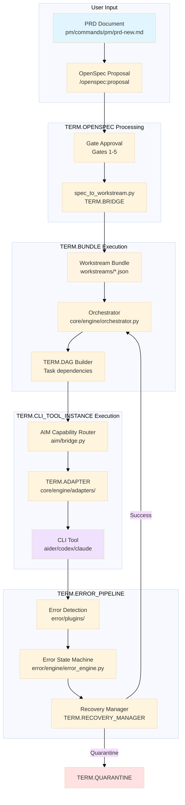
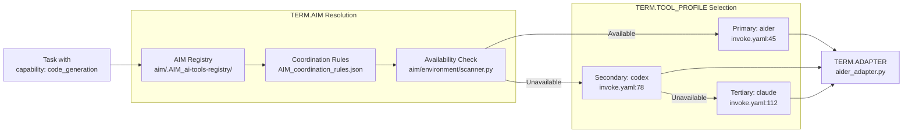
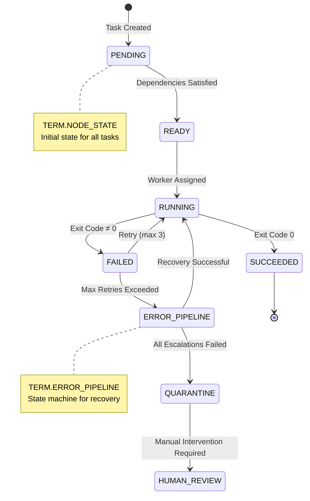
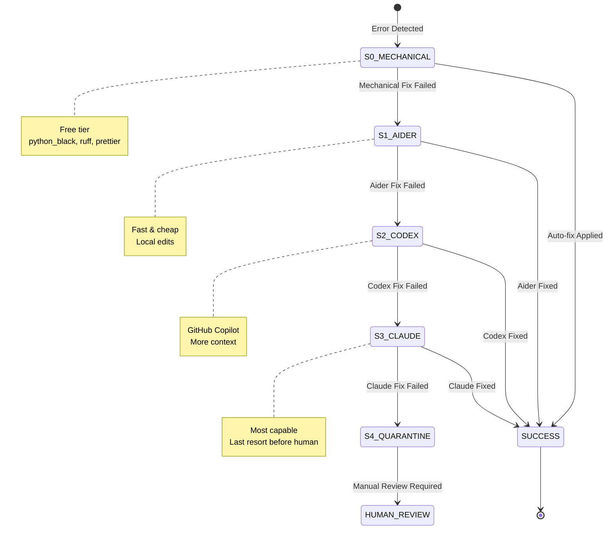
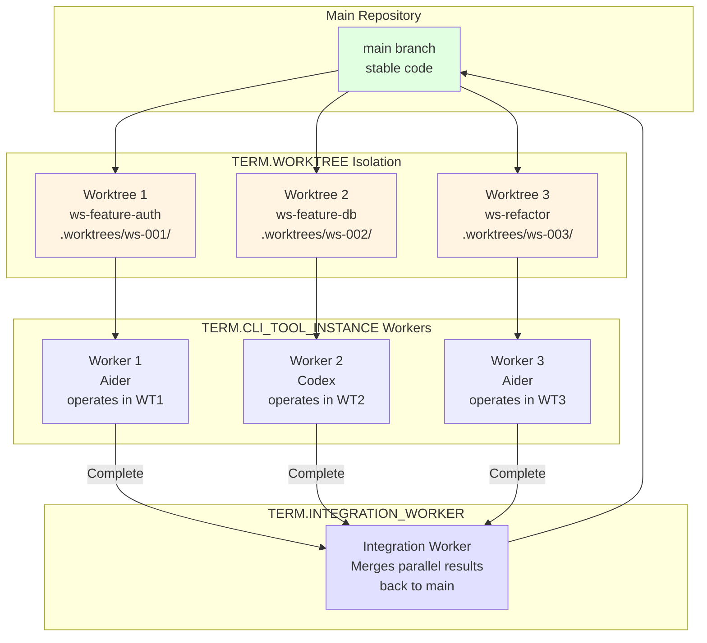

# Phase K: Documentation Enhancement & AI Understanding Improvement

**Phase ID:** PH-K  
**Created:** 2025-11-22  
**Status:** Planning  
**Owner:** Documentation & Knowledge Management  
**Duration:** 2-3 weeks (8-12 days)

---

## Executive Summary

**Goal:** Systematically improve AI agent understanding of the codebase through structured documentation, concrete examples, visual diagrams, and cross-referenced terminology.

**Problem Statement:** 
- AI agents lack comprehensive context about system architecture
- TERMS_SPEC_V1 defines 47 terms but lacks implementation mappings
- Workflows exist but aren't clearly documented end-to-end
- Visual diagrams exist but aren't integrated with terminology
- No central documentation index for navigation

**Success Criteria:**
- ✅ Master documentation index created and maintained
- ✅ All 47 TERMS_SPEC terms linked to implementations
- ✅ 5+ annotated real-world examples added
- ✅ Visual diagrams updated and cross-referenced
- ✅ State transition diagrams added for all state machines
- ✅ AI agents can answer "how does X work?" with file/line references

**Estimated Effort:** 1.5-2 FTE

---

## Phase Breakdown

### Phase K-1: Foundation & Index (Days 1-3)

**Objective:** Create central documentation hub and categorization system

#### Deliverables

##### K-1.1: Master Documentation Index
**File:** `docs/DOCUMENTATION_INDEX.md`

```markdown
# Documentation Index - AI Development Pipeline

> **Purpose:** Central navigation hub for all documentation
> **Last Updated:** Auto-generated daily
> **For AI Agents:** Start here for system understanding

## Quick Navigation

| I need to... | Go to... | Type |
|--------------|----------|------|
| Understand architecture | [ARCHITECTURE.md](ARCHITECTURE.md) | Overview |
| Learn terminology | [TERMS_SPEC_V1.md](../TERMS_SPEC_V1.md) | Reference |
| Execute workstreams | [Workstream Guide](workstream_authoring_guide.md) | How-To |
| Debug errors | [Error Pipeline](../error/README.md) | System |
| Integrate tools | [AIM Integration](AIM_docs/AIM_INTEGRATION_CONTRACT.md) | Contract |

## Documentation Categories

### 1. Architecture & Design (Current State)
- **ARCHITECTURE.md** - System architecture overview
- **HYBRID_WORKFLOW.md** - Execution model (GUI/TUI/Terminal)
- **TERMS_SPEC_V1.md** - Canonical terminology (47 terms)
- **Data Flow Analysis.md** - System data flows
- **ARCHITECTURE_DIAGRAMS.md** - Visual architecture

### 2. Workflows (How Things Work)
- **OpenSpec → Workstream Flow**
  - Start: `docs/Project_Management_docs/openspec_bridge.md`
  - Process: `specifications/bridge/BRIDGE_SUMMARY.md`
  - Execution: `docs/workstream_authoring_guide.md`
  
- **Error Detection & Escalation**
  - Detection: `error/plugins/README.md`
  - State machine: `error/engine/error_engine.py`
  - Recovery: `core/engine/recovery.py`
  
- **Tool Selection & Execution**
  - Capability routing: `aim/bridge.py`
  - Adapter execution: `core/engine/adapters/base.py`
  - Profile loading: `core/engine/tools.py`

### 3. Decision Records (Why Things Are)
- **ADR-0001**: Section-based architecture
- **ADR-0002**: Error plugin architecture
- **ADR-0003**: OpenSpec integration
- **ADR-0004**: Worktree isolation
- **ADR-0005**: Spec tooling consolidation

### 4. Implementation Guides
- **Core Pipeline**: `core/README.md`
- **Error System**: `error/README.md`
- **Engine**: `engine/README.md`
- **Specifications**: `specifications/README.md`
- **AIM Integration**: `aim/DEPLOYMENT_GUIDE.md`

### 5. Migration & Deprecation
- **DEPRECATION_PLAN.md** - Shim removal timeline
- **SPEC_MIGRATION_GUIDE.md** - Spec consolidation
- **CI_PATH_STANDARDS.md** - Import path rules

### 6. Phase Completion Reports
- **Phase E**: Section refactor complete
- **Phase F**: Post-refactor cleanup
- **Phase G**: Invoke adoption
- **Phase H**: Directory consolidation
- **Phase I**: UET integration

## For AI Agents

### Context Loading Priority
1. **HIGH**: TERMS_SPEC_V1.md, ARCHITECTURE.md, AGENTS.md
2. **MEDIUM**: Section READMEs (core/, error/, engine/)
3. **LOW**: Phase completion reports, migration guides

### Finding Information
- **"How do I..."** → Section 2 (Workflows)
- **"What is..."** → TERMS_SPEC_V1.md
- **"Why is..."** → Section 3 (Decision Records)
- **"Where is..."** → Section 4 (Implementation Guides)

### Common Questions Map
| Question | Answer Location |
|----------|-----------------|
| How does workstream execution work? | core/engine/orchestrator.py + HYBRID_WORKFLOW.md |
| What tools are available? | aim/registry/ + invoke.yaml |
| How are errors handled? | error/README.md + error/engine/error_engine.py |
| What do these terms mean? | TERMS_SPEC_V1.md |
| How do I create a workstream? | workstream_authoring_guide.md |
```

**Validation:**
- [ ] All links resolve correctly
- [ ] Every major system has entry in index
- [ ] AI agents can navigate to any topic in ≤2 clicks

---

##### K-1.2: Implementation Location Map
**File:** `docs/IMPLEMENTATION_LOCATIONS.md`

Template for each TERM:
```markdown
## TERM.ADAPTER

**Definition:** Tool-specific execution wrapper that translates tasks to CLI commands

**Implementation:**
- **Base Class**: `core/engine/adapters/base.py:15-78`
  - Abstract interface: `build_command()`, `execute()`, `execute_task()`
  
- **Concrete Implementations**:
  - Aider: `core/engine/adapters/aider_adapter.py:23-156`
  - Codex: `core/engine/adapters/codex_adapter.py:18-134`
  - Git: `core/engine/adapters/git_adapter.py:12-89`
  - Tests: `core/engine/adapters/test_adapter.py:15-102`

**Configuration:**
- Tool profiles: `invoke.yaml:45-78` (per-tool settings)
- Timeouts: `invoke.yaml:80-95` (default: 300s)

**Tests:**
- Unit: `tests/unit/test_adapters.py:25-234`
- Integration: `tests/integration/test_adapter_execution.py:40-189`

**Usage Examples:**
- Simple task: `workstreams/single/ws-feature-simple.json:12-20`
- Complex task: `workstreams/multi/ws-feature-multi.json:45-67`

**Related Terms:** 
- TOOL_PROFILE (configuration)
- CLI_TOOL_INSTANCE (runtime)
- CAPABILITY (routing)

**Cross-References:**
- Called by: `core/engine/orchestrator.py:234` (task execution)
- Uses: `core/engine/tools.py:67` (profile loading)
- Logs to: `.ledger/runs/{run_id}/steps/` (execution records)
```

**Target:** All 47 terms from TERMS_SPEC_V1.md mapped

---

##### K-1.3: Automated Index Generator
**Script:** `scripts/generate_doc_index.py`

```python
#!/usr/bin/env python3
"""
Generate DOCUMENTATION_INDEX.md from repository analysis.

Usage:
  python scripts/generate_doc_index.py [--update]
"""

import yaml
from pathlib import Path
from typing import Dict, List
from datetime import datetime

def scan_documentation() -> Dict:
    """Scan docs/ for categorization"""
    categories = {
        "architecture": [],
        "workflows": [],
        "decisions": [],
        "implementations": [],
        "migrations": [],
        "phase_reports": []
    }
    
    for md in Path("docs/").rglob("*.md"):
        category = categorize_document(md)
        categories[category].append({
            "path": md.relative_to("docs/"),
            "title": extract_title(md),
            "updated": md.stat().st_mtime
        })
    
    return categories

def categorize_document(path: Path) -> str:
    """Categorize document by filename patterns"""
    name = path.name.lower()
    
    if "architecture" in name or "design" in name:
        return "architecture"
    elif "adr-" in name:
        return "decisions"
    elif "phase_" in name and "complete" in name:
        return "phase_reports"
    elif "migration" in name or "deprecation" in name:
        return "migrations"
    elif "guide" in name or "workflow" in name:
        return "workflows"
    else:
        return "implementations"

def generate_index(categories: Dict) -> str:
    """Generate markdown index"""
    template = Path("docs/templates/doc_index_template.md").read_text()
    
    # Fill in categories
    for category, docs in categories.items():
        section = generate_category_section(category, docs)
        template = template.replace(f"{{{{ {category} }}}}", section)
    
    # Add metadata
    template = template.replace("{{ timestamp }}", datetime.now().isoformat())
    
    return template

if __name__ == "__main__":
    categories = scan_documentation()
    index_md = generate_index(categories)
    Path("docs/DOCUMENTATION_INDEX.md").write_text(index_md)
    print("✅ Documentation index updated")
```

**Automation:**
- Run as pre-commit hook
- Include in CI pipeline
- Triggered by changes to docs/

---

### Phase K-2: Concrete Examples & Annotations (Days 4-6)

**Objective:** Add real-world annotated examples for key concepts

#### Deliverables

##### K-2.1: Annotated Workstream Examples
**Location:** `examples/workstreams/annotated/`

Create 5 examples with inline comments:

**Example 1: Simple Code Generation**
```json
// examples/workstreams/annotated/01_simple_code_generation.json
{
  "$schema": "../../schema/workstream.schema.json",
  
  // TERM.WORKSTREAM - Independent execution lane
  "id": "ws-example-auth-handler",
  "phase_plan_id": "phase-api-v2",
  
  // TERM.CAPABILITY - AIM routing (not hardcoded tool)
  // AIM will resolve this to aider/codex/claude based on availability
  "capability": "code_generation",
  
  "capability_payload": {
    "files": ["src/api/auth_handler.py"],
    "prompt": "Implement JWT authentication handler with token validation",
    "timeout_ms": 300000  // 5 minutes
  },
  
  // TERM.FILE_SCOPE - Declares what this workstream touches
  "files_scope": {
    "reads": [
      "src/api/base_handler.py",  // Base class to extend
      "config/auth_config.yaml"    // Configuration reference
    ],
    "writes": [
      "src/api/auth_handler.py"    // File to create/modify
    ]
  },
  
  // TERM.TASK - Smallest schedulable unit
  "tasks": [
    {
      "id": "task-001-implement",
      "kind": "implementation",        // TERM.TASK.kind
      "depends_on": [],                // TERM.DAG - No dependencies
      "parallel_ok": true,             // TERM.PARALLELISM_CHART safe
      "conflict_group": null,          // TERM.CONFLICT_GROUP - No exclusions
      "priority": "foreground",        // Not TERM.BACKGROUND_TASK
      
      // Initial state: TERM.NODE_STATE = PENDING
      // Becomes READY when depends_on satisfied
      // Becomes RUNNING when CLI_TOOL_INSTANCE picks it up
      // Becomes SUCCEEDED/FAILED on completion
      
      "tool_preference": "aider",      // Hint, but AIM makes final decision
      "prompt_file": "prompts/implement_auth.md"
    },
    {
      "id": "task-002-tests",
      "kind": "test",
      "depends_on": ["task-001-implement"],  // DAG: must run after impl
      "parallel_ok": false,                  // Needs impl to complete first
      
      "tool_preference": "codex"
    }
  ],
  
  // TERM.ACCEPTANCE_TEST - Completion criteria
  "acceptance_tests": [
    {
      "type": "pytest",
      "command": "pytest tests/api/test_auth_handler.py -v",
      "expected_exit_code": 0
    },
    {
      "type": "lint",
      "command": "ruff check src/api/auth_handler.py",
      "expected_exit_code": 0
    }
  ],
  
  // TERM.BUNDLE metadata
  "metadata": {
    "author": "system",
    "created": "2025-11-22T15:00:00Z",
    "openspec_change": "OS-142",  // Links to TERM.OPENSPEC proposal
    "phase": "PH-02-IMPLEMENTATION"
  }
}
```

**Example 2: Parallel Workstreams**
```json
// examples/workstreams/annotated/02_parallel_safe_refactor.json
{
  "id": "ws-example-utils-refactor",
  
  // TERM.FILE_SCOPE - Non-overlapping writes = parallel safe
  "files_scope": {
    "writes": [
      "src/utils/string_utils.py"   // Only this workstream touches this
    ]
  },
  
  "tasks": [
    {
      "id": "task-refactor-strings",
      "parallel_ok": true,  // Safe because file_scope doesn't conflict
      "conflict_group": null
    }
  ]
}

// CAN RUN IN PARALLEL with:
{
  "id": "ws-example-db-refactor",
  "files_scope": {
    "writes": ["src/db/connection.py"]  // Different file - no conflict
  }
}

// CANNOT RUN IN PARALLEL with:
{
  "id": "ws-example-utils-tests",
  "files_scope": {
    "writes": ["src/utils/string_utils.py"]  // SAME FILE - conflict!
  }
}
```

**Example 3: Error Pipeline Integration**
```json
// examples/workstreams/annotated/03_error_handling_escalation.json
{
  "id": "ws-example-with-error-handling",
  
  "tasks": [
    {
      "id": "task-implement-api",
      
      // If this task fails:
      // 1. TERM.ERROR_EVENT generated
      // 2. TERM.ERROR_PIPELINE (ERR_EXEC) processes it
      // 3. TERM.SELF_HEAL_POLICY determines action:
      //    - Retry same tool (1-3 attempts)
      //    - Switch to different adapter
      //    - Split task into smaller chunks
      //    - Escalate to stronger agent
      //    - Route to TERM.HUMAN_REVIEW_TASK
      
      "retry_policy": {
        "max_attempts": 3,
        "backoff_seconds": [10, 30, 60]
      },
      
      "escalation_chain": [
        "aider",      // Try fast tool first
        "codex",      // Escalate to more capable
        "claude"      // Final escalation before human
      ]
    }
  ]
}
```

**Example 4: Multi-Phase Workstream**
```json
// examples/workstreams/annotated/04_multi_phase.json
{
  "id": "ws-example-feature-full-cycle",
  "phase_plan_id": "phase-feature-x",
  
  // This workstream spans multiple TERM.PHASEs
  "tasks": [
    {
      "id": "task-001-design",
      "phase_id": "PH-01-SPEC",      // Design phase
      "kind": "design"
    },
    {
      "id": "task-002-implement",
      "phase_id": "PH-02-IMPL",      // Implementation phase
      "kind": "implementation",
      "depends_on": ["task-001-design"]
    },
    {
      "id": "task-003-test",
      "phase_id": "PH-03-TEST",      // Testing phase
      "kind": "test",
      "depends_on": ["task-002-implement"]
    }
  ]
}
```

**Example 5: Advanced Coordination (SAGA pattern)**
```json
// examples/workstreams/annotated/05_saga_distributed_transaction.json
{
  "id": "ws-example-saga-deployment",
  
  // TERM.SAGA - Distributed transaction pattern
  "coordination": {
    "pattern": "saga",
    
    // Each step has compensation action if later steps fail
    "steps": [
      {
        "action": "task-001-db-migration",
        "compensation": "task-rollback-db"  // TERM.COMPENSATION_ACTION
      },
      {
        "action": "task-002-deploy-service",
        "compensation": "task-rollback-service"
      },
      {
        "action": "task-003-update-config",
        "compensation": "task-rollback-config"
      }
    ]
  },
  
  // If task-003 fails, system automatically executes:
  // 1. task-rollback-config
  // 2. task-rollback-service  
  // 3. task-rollback-db
  // In reverse order - leaving system in consistent state
}
```

##### K-2.2: Tool Profile Examples
**File:** `examples/config/tool_profiles_annotated.yaml`

```yaml
# TERM.TOOL_PROFILE - Configuration templates for CLI tools
# Located in invoke.yaml or config/tool_profiles.yaml

tools:
  # Example 1: Simple profile
  aider:
    tool_id: aider
    
    # TERM.ADAPTER uses this template to build commands
    command_template: "aider --yes --model {model} {files}"
    
    timeout_sec: 300  # Default timeout
    
    model: "gpt-4"    # AI model to use
    
    env_vars:
      AIDER_AUTO_COMMITS: "false"  # Prevent auto-commits
    
    # TERM.NODE_STATE success criteria
    success_exit_codes: [0]
  
  # Example 2: Complex profile with multiple models
  codex:
    tool_id: codex
    command_template: "gh copilot suggest -t {type} {prompt_file}"
    timeout_sec: 180
    
    # Different models for different capabilities
    model_mapping:
      code_generation: "gpt-4-turbo"
      refactoring: "gpt-4"
      testing: "gpt-3.5-turbo"  # Cheaper for tests
    
    # TERM.COST_POLICY integration
    cost_estimate_per_call: 0.03  # USD
    
    success_exit_codes: [0]
    retry_on_codes: [124, 125]  # Retry on timeout/network errors
```

---

### Phase K-3: Visual Architecture & State Diagrams (Days 7-9)

**Objective:** Update visual diagrams and create state transition diagrams

#### Deliverables

##### K-3.1: Update Architecture Diagrams
**Update:** `assets/diagrams/*.mmd`

**Diagram 1: Complete Data Flow**


**Diagram 2: Tool Selection Flow (TERM.AIM)**


##### K-3.2: State Machine Diagrams

**Diagram 3: Task State Transitions (TERM.NODE_STATE)**


**Diagram 4: Error Escalation Flow**


**Diagram 5: Worktree Isolation (TERM.WORKTREE)**


##### K-3.3: Diagram Integration Document
**File:** `docs/VISUAL_ARCHITECTURE_GUIDE.md`

```markdown
# Visual Architecture Guide

> **Purpose:** Navigate system architecture through diagrams
> **Links to:** ARCHITECTURE.md, TERMS_SPEC_V1.md
> **Updated:** 2025-11-22

## Quick Reference

| Diagram | Purpose | Terms Covered |
|---------|---------|---------------|
| [Complete Data Flow](#complete-data-flow) | End-to-end process | OPENSPEC, BUNDLE, DAG, ADAPTER |
| [Tool Selection](#tool-selection) | AIM routing | AIM, CAPABILITY, TOOL_PROFILE |
| [Task States](#task-states) | Lifecycle | NODE_STATE, ERROR_PIPELINE |
| [Error Escalation](#error-escalation) | Recovery tiers | ERROR_PIPELINE, QUARANTINE |
| [Worktree Isolation](#worktree-isolation) | Parallelism | WORKTREE, CLI_TOOL_INSTANCE |

## Complete Data Flow

**Diagram:** [assets/diagrams/complete-data-flow.mmd](../assets/diagrams/complete-data-flow.mmd)

**Terms:** OPENSPEC, PHASE_PLAN, BUNDLE, DAG, ADAPTER, ERROR_PIPELINE

**Process:**
1. User creates PRD → OpenSpec proposal
2. Gate approval → spec_to_workstream.py conversion
3. Bundle loaded → Orchestrator builds DAG
4. AIM routes to appropriate tool
5. Adapter executes → Error detection
6. Recovery or Quarantine

**Key Files:**
- OpenSpec: `core/openspec_convert.py:45`
- Orchestrator: `core/engine/orchestrator.py:89`
- AIM: `aim/bridge.py:123`

[View Diagram →](../assets/diagrams/complete-data-flow.mmd)

---

## Tool Selection Flow

**Diagram:** [assets/diagrams/aim-tool-selection.mmd](../assets/diagrams/aim-tool-selection.mmd)

**Terms:** AIM, CAPABILITY, TOOL_PROFILE, ADAPTER

**Process:**
1. Task declares capability (not tool name)
2. AIM registry lookup
3. Availability check
4. Primary → Secondary → Tertiary fallback
5. Adapter instantiated with selected profile

**Example:**
```json
{
  "capability": "code_generation",
  // AIM resolves to: aider (if available) → codex → claude
}
```

[View Diagram →](../assets/diagrams/aim-tool-selection.mmd)

---

[... continue for all diagrams ...]
```

---

### Phase K-4: Cross-References & Relationship Mapping (Days 10-12)

**Objective:** Create term relationship graphs and bi-directional references

#### Deliverables

##### K-4.1: Term Relationship Graph
**File:** `docs/TERM_RELATIONSHIPS.md`

```markdown
# Term Relationships & Dependencies

## Hierarchical Relationships

### Execution Hierarchy
```
PHASE_PLAN (owns)
  ├── PHASE (1:N) - Stage markers
  │   └── GATE (1:N) - Stage completion criteria
  │
  └── WORKSTREAM (1:N) - Independent execution lanes
      ├── FILE_SCOPE (1:1) - Read/write boundaries
      ├── TASK (1:N) - Schedulable units
      │   ├── NODE_STATE (1:1) - Current state
      │   ├── CONFLICT_GROUP (0:1) - Mutual exclusion
      │   └── DAG (relationships) - Dependencies
      │
      └── ACCEPTANCE_TEST (0:N) - Completion criteria
```

### Tool Execution Chain
```
TASK (requires capability)
  ↓
CAPABILITY (routing key)
  ↓
AIM (resolves capability)
  ↓
TOOL_PROFILE (configuration)
  ↓
ADAPTER (execution wrapper)
  ↓
CLI_TOOL_INSTANCE (running process)
  ↓
PROCESS_SPAWNER (subprocess management)
```

### Error Recovery Chain
```
TASK (fails)
  ↓
ERROR_EVENT (generated)
  ↓
ERROR_PIPELINE (processes)
  ↓
SELF_HEAL_POLICY (determines action)
  ├── Retry → TASK (same tool)
  ├── Escalate → AIM (different tool)
  ├── Split → New TASK (smaller scope)
  └── Quarantine → HUMAN_REVIEW_TASK
```

### Isolation & Execution
```
WORKSTREAM (needs isolation)
  ↓
WORKTREE (git isolation)
  ↓
SANDBOX (environment)
  ↓
CLI_TOOL_INSTANCE (worker)
  ├── Foreground TASK (main work)
  └── BACKGROUND_TASK (0:N) (parallel work)
```

## Cross-References by Term

### TERM.BUNDLE
**Owns:** WORKSTREAM, RUN, METADATA  
**Used by:** Orchestrator, Validator  
**Configured in:** `workstreams/*.json`  
**Schema:** `schema/workstream.schema.json`  
**Related:** STEP, LEDGER, MANIFEST

### TERM.WORKSTREAM
**Owned by:** PHASE_PLAN, BUNDLE  
**Contains:** TASK, FILE_SCOPE, ACCEPTANCE_TEST  
**Executed in:** WORKTREE, SANDBOX  
**Routed via:** CAPABILITY → AIM  
**Related:** PHASE, DAG, CONFLICT_GROUP

### TERM.TASK
**Owned by:** WORKSTREAM  
**Has:** NODE_STATE, CONFLICT_GROUP, FILE_SCOPE  
**Executed by:** CLI_TOOL_INSTANCE  
**Generates:** ERROR_EVENT (on failure)  
**Part of:** DAG  
**Related:** STEP, BACKGROUND_TASK

### TERM.AIM
**Resolves:** CAPABILITY → TOOL_PROFILE  
**Uses:** Registry, Coordination Rules  
**Returns:** ADAPTER instance  
**Related:** BRIDGE, MCP_SERVICE

### TERM.ERROR_PIPELINE
**Triggered by:** ERROR_EVENT  
**Uses:** SELF_HEAL_POLICY  
**Can trigger:** COMPENSATION_ACTION, RECOVERY_MANAGER  
**Escalates to:** HUMAN_REVIEW_TASK  
**Terminal states:** SUCCESS, QUARANTINE  
**Related:** PLUGIN, CIRCUIT_BREAKER

## Dependency Matrix

| Term | Depends On | Depended On By |
|------|------------|----------------|
| PHASE_PLAN | - | PHASE, WORKSTREAM |
| WORKSTREAM | PHASE_PLAN | TASK, RUN |
| TASK | WORKSTREAM, DAG | CLI_TOOL_INSTANCE, ERROR_EVENT |
| AIM | CAPABILITY | ADAPTER, TOOL_PROFILE |
| ADAPTER | TOOL_PROFILE | CLI_TOOL_INSTANCE |
| ERROR_PIPELINE | ERROR_EVENT | RECOVERY_MANAGER |

## Interaction Patterns

### Pattern 1: Task Execution
```
TASK (READY) 
→ AIM (resolve capability)
→ ADAPTER (build command)
→ CLI_TOOL_INSTANCE (execute)
→ NODE_STATE (update)
→ LEDGER (record)
```

### Pattern 2: Error Recovery
```
TASK (FAILED)
→ ERROR_EVENT (create)
→ ERROR_PIPELINE (process)
→ SELF_HEAL_POLICY (decide)
→ RECOVERY_MANAGER (execute)
→ TASK (retry/escalate/split)
```

### Pattern 3: Parallel Execution
```
WORKSTREAM_A (FILE_SCOPE: src/api/)
WORKSTREAM_B (FILE_SCOPE: src/db/)
→ PARALLELISM_CHART (analyze)
→ No overlap detected
→ WORKTREE_A + WORKTREE_B (isolated)
→ CLI_TOOL_INSTANCE_A + CLI_TOOL_INSTANCE_B (parallel)
→ INTEGRATION_WORKER (merge)
```
```

##### K-4.2: Bi-directional Reference System
**Enhancement to TERMS_SPEC_V1.md**

Add to each term definition:
```markdown
## TERM.ADAPTER

[... existing definition ...]

**References:**
- **Calls:** `core/engine/tools.py::load_tool_profiles()` - Loads TOOL_PROFILE
- **Calls:** `core/engine/process_spawner.py::spawn()` - Spawns subprocess
- **Called by:** `core/engine/orchestrator.py::execute_task()` - Task execution
- **Used with:** TOOL_PROFILE, CLI_TOOL_INSTANCE, CAPABILITY
- **Configured in:** `invoke.yaml:tools.*`
- **Tests:** `tests/unit/test_adapters.py`, `tests/integration/test_adapter_execution.py`
- **Examples:** `examples/workstreams/annotated/01_simple_code_generation.json:34`

**See Also:**
- [Tool Selection Flow](#tool-selection-flow) - Diagram
- [AIM Integration](docs/AIM_docs/AIM_INTEGRATION_CONTRACT.md) - Contract
- [Process Spawner](core/engine/README.md#process-spawner) - Implementation
```

##### K-4.3: Auto-generated Cross-Reference Index
**Script:** `scripts/generate_cross_references.py`

```python
#!/usr/bin/env python3
"""
Generate cross-reference index by scanning codebase for term usage.

Finds:
- Import statements
- Function calls
- Class usage
- Configuration references
"""

import ast
import re
from pathlib import Path
from typing import Dict, List, Set

# Load terms from TERMS_SPEC_V1.md
TERMS = [
    "PHASE_PLAN", "PHASE", "WORKSTREAM", "TASK", "CLI_TOOL_INSTANCE",
    "ADAPTER", "TOOL_PROFILE", "CAPABILITY", "AIM", "ERROR_PIPELINE",
    # ... all 47 terms
]

def scan_python_files() -> Dict[str, Set[str]]:
    """Scan .py files for term usage"""
    term_usage = {term: set() for term in TERMS}
    
    for py_file in Path(".").rglob("*.py"):
        if "venv" in str(py_file) or "node_modules" in str(py_file):
            continue
        
        try:
            tree = ast.parse(py_file.read_text())
            
            # Find class/function definitions that match terms
            for node in ast.walk(tree):
                if isinstance(node, ast.ClassDef):
                    if any(term.lower() in node.name.lower() for term in TERMS):
                        term_usage[matching_term(node.name)].add(
                            f"{py_file}:{node.lineno}"
                        )
        except:
            pass
    
    return term_usage

def scan_config_files() -> Dict[str, Set[str]]:
    """Scan YAML/JSON for term references"""
    # Scan invoke.yaml, schema/*.json, etc.
    pass

def generate_cross_ref_index(usage: Dict) -> str:
    """Generate markdown cross-reference index"""
    output = "# Cross-Reference Index\n\n"
    output += "Auto-generated term usage locations\n\n"
    
    for term, locations in sorted(usage.items()):
        if not locations:
            continue
        
        output += f"## {term}\n\n"
        for loc in sorted(locations):
            output += f"- `{loc}`\n"
        output += "\n"
    
    return output

if __name__ == "__main__":
    usage = scan_python_files()
    usage.update(scan_config_files())
    
    index = generate_cross_ref_index(usage)
    Path("docs/CROSS_REFERENCE_INDEX.md").write_text(index)
    print("✅ Cross-reference index generated")
```

---

## Success Metrics

### Quantitative
- [ ] Documentation index covers 100% of major systems
- [ ] All 47 TERMS mapped to implementation (line numbers)
- [ ] ≥5 annotated examples created
- [ ] ≥5 visual diagrams updated/created
- [ ] Cross-reference index auto-generates successfully
- [ ] AI agents can answer "where is X implemented?" in <10s

### Qualitative
- [ ] AI agents can navigate from term → implementation in ≤2 steps
- [ ] New contributors can find relevant docs in <5 minutes
- [ ] Visual diagrams accurately reflect current architecture
- [ ] Examples run successfully without modification

---

## Dependencies

### Prerequisites
- [x] TERMS_SPEC_V1.md complete (v1.1, 47 terms)
- [x] Section-based refactor complete (Phase E)
- [x] Import path standards enforced (WS-21)

### Concurrent Work
- Phase K can run in parallel with feature development
- Documentation updates can happen incrementally

### Blockers
- None (documentation enhancement is independent)

---

## Risks & Mitigation

| Risk | Impact | Likelihood | Mitigation |
|------|--------|------------|------------|
| Docs become stale quickly | High | Medium | Auto-generation scripts + CI checks |
| Examples don't run | Medium | Low | Include in test suite |
| Diagrams out of sync | Medium | Medium | Link diagrams to code (not screenshots) |
| Too much overhead to maintain | High | Medium | Focus on auto-generation, not manual updates |

---

## Rollout Plan

### Week 1 (Days 1-3): Foundation
- Create DOCUMENTATION_INDEX.md manually
- Build auto-generator script
- Test with subset of docs

### Week 2 (Days 4-6): Examples
- Create 5 annotated examples
- Validate examples execute correctly
- Add to test suite

### Week 3 (Days 7-9): Visuals
- Update architecture diagrams
- Create state machine diagrams
- Integrate with documentation index

### Week 4 (Days 10-12): Cross-references
- Build term relationship graph
- Add bi-directional references
- Auto-generate cross-reference index
- Final validation & polish

---

## Maintenance

### Daily (Automated)
- Auto-generate documentation index
- Update cross-reference index
- Validate diagram links

### Weekly
- Review for stale content
- Update examples if schemas change
- Check diagram accuracy

### Monthly
- Full documentation audit
- Add new terms to TERMS_SPEC
- Update relationship graphs

### On Major Changes
- Refactor → Update architecture diagrams
- New feature → Add example
- API change → Update implementation locations

---

## Appendix A: File Structure

```
docs/
├── DOCUMENTATION_INDEX.md          # K-1.1 (master index)
├── IMPLEMENTATION_LOCATIONS.md     # K-1.2 (term → code mapping)
├── VISUAL_ARCHITECTURE_GUIDE.md    # K-3.3 (diagram hub)
├── TERM_RELATIONSHIPS.md           # K-4.1 (relationship graph)
└── CROSS_REFERENCE_INDEX.md        # K-4.2 (auto-generated)

examples/
├── workstreams/
│   └── annotated/
│       ├── 01_simple_code_generation.json      # K-2.1
│       ├── 02_parallel_safe_refactor.json      # K-2.1
│       ├── 03_error_handling_escalation.json   # K-2.1
│       ├── 04_multi_phase.json                 # K-2.1
│       └── 05_saga_distributed_transaction.json # K-2.1
└── config/
    └── tool_profiles_annotated.yaml            # K-2.2

assets/diagrams/
├── complete-data-flow.mmd          # K-3.1 (updated)
├── aim-tool-selection.mmd          # K-3.1 (new)
├── task-state-machine.mmd          # K-3.2 (new)
├── error-escalation-flow.mmd       # K-3.2 (new)
└── worktree-isolation.mmd          # K-3.2 (new)

scripts/
├── generate_doc_index.py           # K-1.3 (automation)
└── generate_cross_references.py    # K-4.3 (automation)
```

---

## Appendix B: AI Agent Integration

### Context Loading Script
```python
# scripts/load_context_for_ai.py
"""
Helper script for AI agents to load optimal context.

Usage:
  python scripts/load_context_for_ai.py --topic "error handling"
  python scripts/load_context_for_ai.py --term "ADAPTER"
  python scripts/load_context_for_ai.py --workflow "openspec"
"""

def load_context(topic: str = None, term: str = None, workflow: str = None):
    """Load relevant documentation for AI context"""
    
    context = []
    
    if term:
        # Load term definition + implementation locations + examples
        context.append(f"TERMS_SPEC_V1.md#term-{term.lower()}")
        context.append(f"IMPLEMENTATION_LOCATIONS.md#{term}")
        context.append(find_examples_using_term(term))
    
    if workflow:
        # Load workflow documentation
        context.append(f"DOCUMENTATION_INDEX.md#workflows")
        context.append(find_workflow_docs(workflow))
    
    if topic:
        # Search index for topic
        context.append(search_documentation_index(topic))
    
    return "\n\n".join(load_files(context))
```

### Pre-prompt Template
```markdown
# AI Agent Context Loading Template

Before answering questions about the codebase, load:

1. **Core Understanding** (always):
   - TERMS_SPEC_V1.md (terminology)
   - DOCUMENTATION_INDEX.md (navigation)
   - AGENTS.md (coding standards)

2. **Specific Topic** (conditional):
   - If question about "how X works" → VISUAL_ARCHITECTURE_GUIDE.md
   - If question about "where is X" → IMPLEMENTATION_LOCATIONS.md
   - If question about "what is X" → TERMS_SPEC_V1.md
   - If question about "why X" → docs/adr/*.md

3. **Examples** (when helpful):
   - examples/workstreams/annotated/*.json
   - examples/config/tool_profiles_annotated.yaml

4. **Code Reference** (for implementation questions):
   - Use IMPLEMENTATION_LOCATIONS.md to find exact file:line
   - Include cross-references from CROSS_REFERENCE_INDEX.md
```

---

**END OF PHASE K PLAN**

**Version:** 1.0  
**Status:** Ready for Review  
**Next Steps:** 
1. Review with team
2. Assign workstreams (K-1, K-2, K-3, K-4)
3. Create tracking issue
4. Begin execution
