# Error Escalation

**Purpose**: Visualization of error detection, analysis, and escalation flow through the plugin architecture.

---

## Error Detection & Escalation Flow

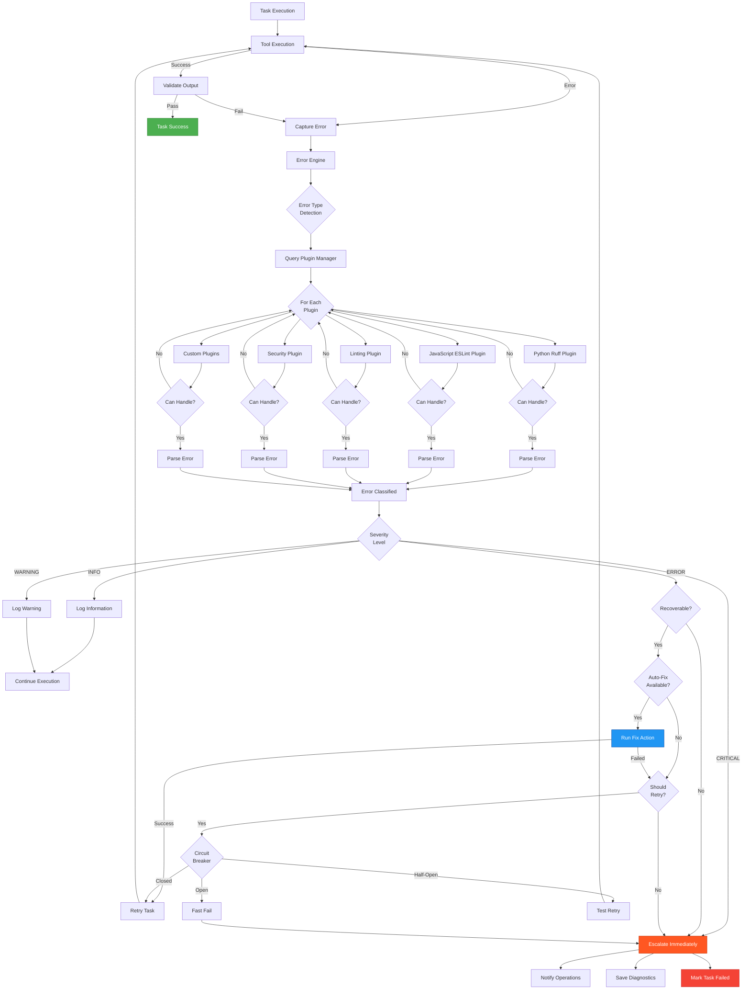

---

## Error State Machine

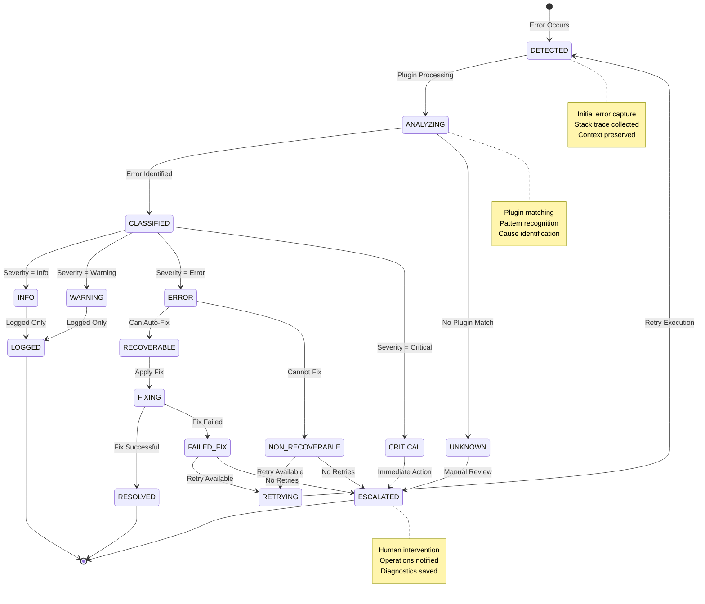

---

## Plugin Architecture

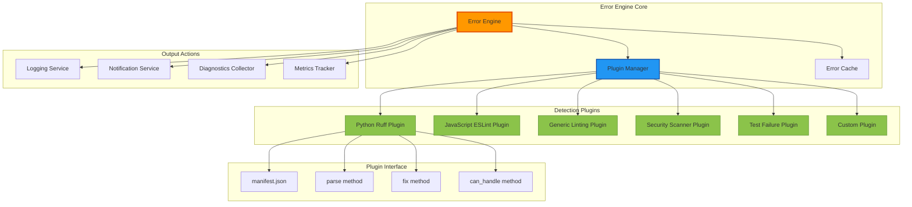

---

## Plugin Interaction Sequence

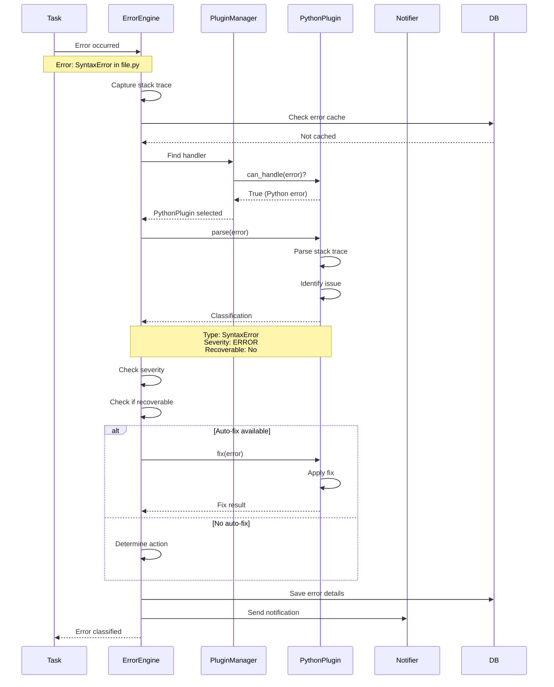

---

## Error Severity Levels

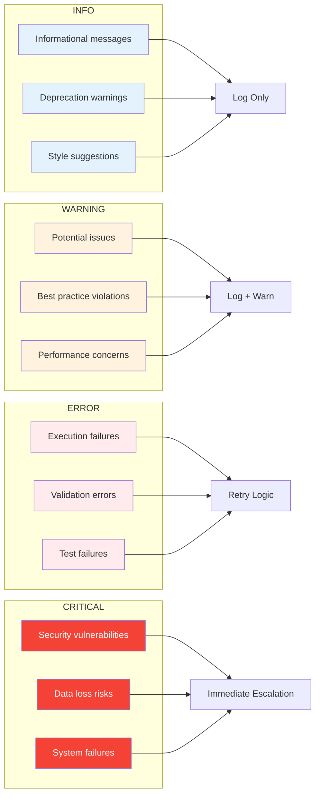

---

## Plugin Discovery & Loading

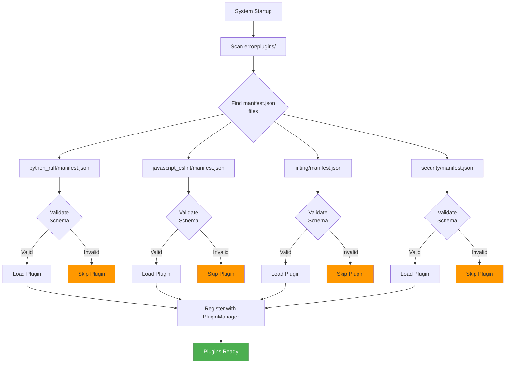

---

## Error Cache & Deduplication

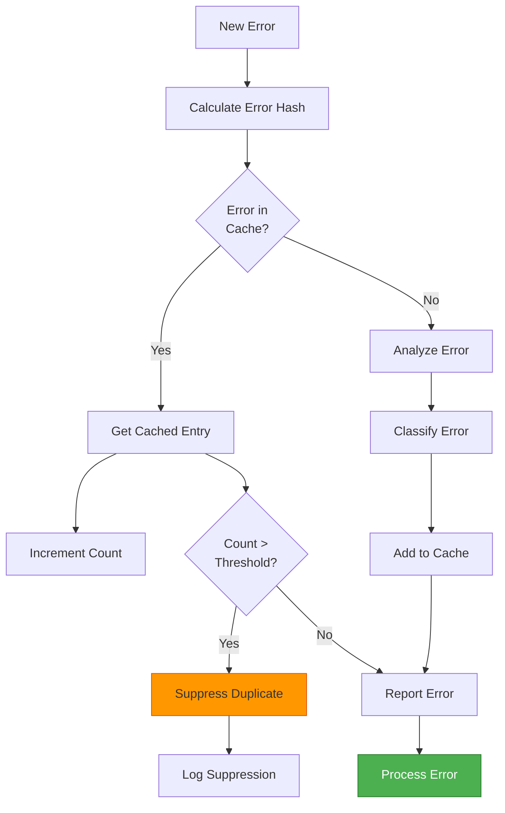

**Error Hash Calculation**:
```python
error_hash = sha256(
    error_type +
    error_message +
    file_path +
    line_number
).hexdigest()[:16]
```

---

## Notification Escalation Levels

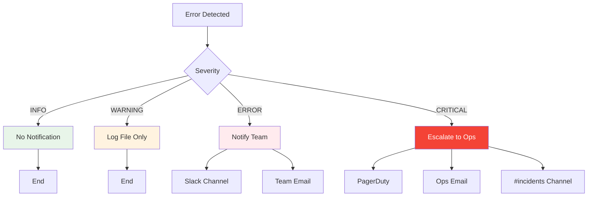

---

## Diagnostic Collection

When errors are escalated, the following diagnostics are collected:

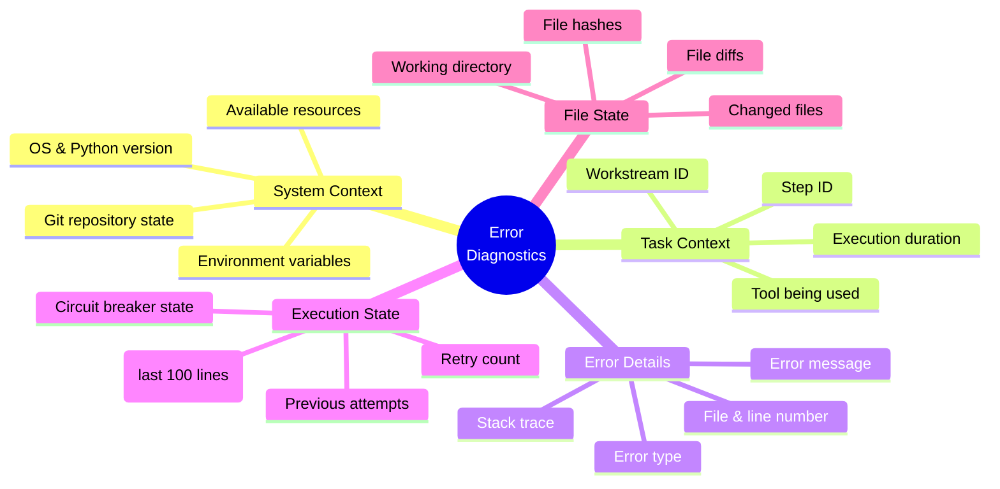

---

## Plugin Manifest Structure

```json
{
  "name": "python_ruff",
  "version": "1.0.0",
  "description": "Python error detection using Ruff",
  
  "capabilities": {
    "languages": ["python"],
    "error_types": ["syntax", "runtime", "linting"],
    "auto_fix": true
  },
  
  "priority": 10,
  
  "patterns": [
    "*.py",
    "SyntaxError",
    "IndentationError",
    "NameError"
  ],
  
  "entry_point": "plugin.py",
  "class_name": "RuffPlugin",
  
  "config": {
    "ruff_path": "ruff",
    "auto_fix_enabled": true,
    "severity_mapping": {
      "E": "ERROR",
      "W": "WARNING",
      "I": "INFO"
    }
  }
}
```

---

## Auto-Fix Flow

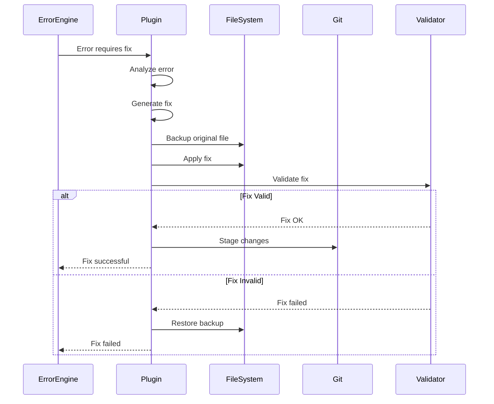

---

## Error Metrics Tracked

| Metric | Purpose | Alert Threshold |
|--------|---------|----------------|
| **Error Rate** | Errors per hour | >10/hour |
| **Repeat Errors** | Same error recurring | >3 times |
| **Plugin Match Rate** | % errors matched by plugins | <80% |
| **Auto-Fix Success** | % fixes that work | <50% |
| **Escalation Rate** | % errors escalated | >20% |
| **Response Time** | Time to classify error | >5s |

---

## Integration with Core Engine

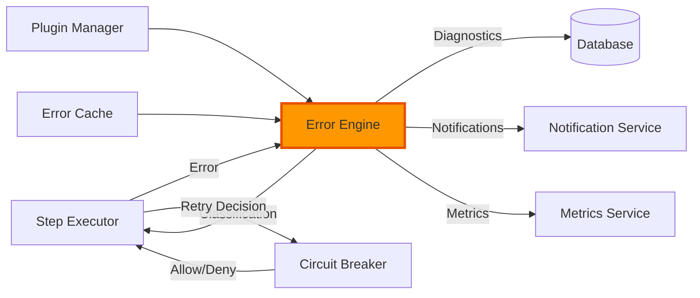

---

## Configuration Example

```yaml
error_detection:
  # Plugin settings
  plugins:
    enabled: true
    directory: "error/plugins"
    auto_load: true
    
  # Error cache
  cache:
    enabled: true
    max_size: 1000
    ttl_seconds: 3600
    deduplicate: true
    
  # Severity thresholds
  severity:
    auto_fix_levels: [WARNING, ERROR]
    escalate_levels: [CRITICAL]
    suppress_levels: [INFO]
    
  # Notifications
  notifications:
    slack:
      enabled: true
      channel: "#pipeline-alerts"
      severity_threshold: ERROR
    
    email:
      enabled: true
      recipients: ["team@example.com"]
      severity_threshold: CRITICAL
      
    pagerduty:
      enabled: true
      severity_threshold: CRITICAL
      
  # Diagnostics
  diagnostics:
    collect_on_escalation: true
    save_logs: true
    max_log_lines: 100
    include_file_diffs: true
```

---

## Related Documentation

- [Task Lifecycle](./TASK_LIFECYCLE.md) - Task state machine
- [System Architecture](./SYSTEM_ARCHITECTURE.md) - Overall architecture
- [Plugin Development Guide](../development/PLUGIN_DEVELOPMENT.md) - Creating custom plugins

---

**Last Updated**: 2025-11-22  
**Maintainer**: Architecture Team  
**Implementation**: `error/engine/error_engine.py`, `error/plugins/`
