# Specification Integration

**Purpose**: Visualization of the OpenSpec to Workstream conversion flow, specification resolution, and change proposal workflow.

---

## OpenSpec → Workstream Conversion Flow

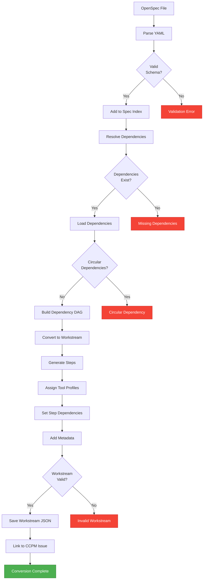

---

## Specification Architecture

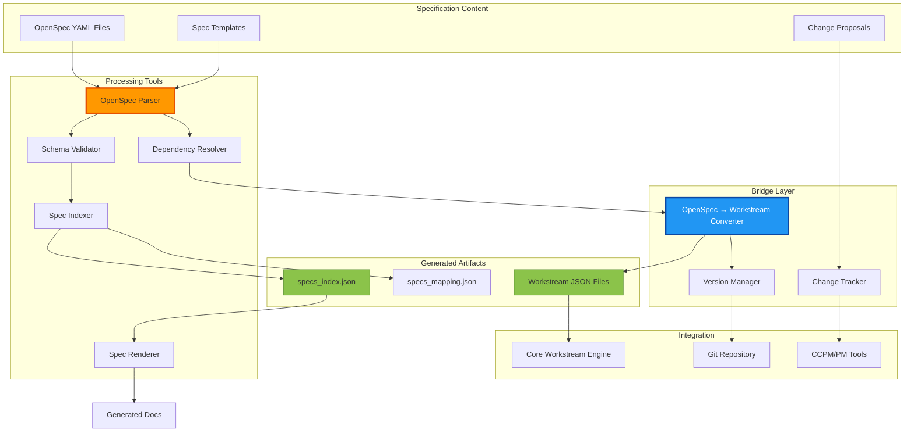

---

## Spec Resolution Sequence

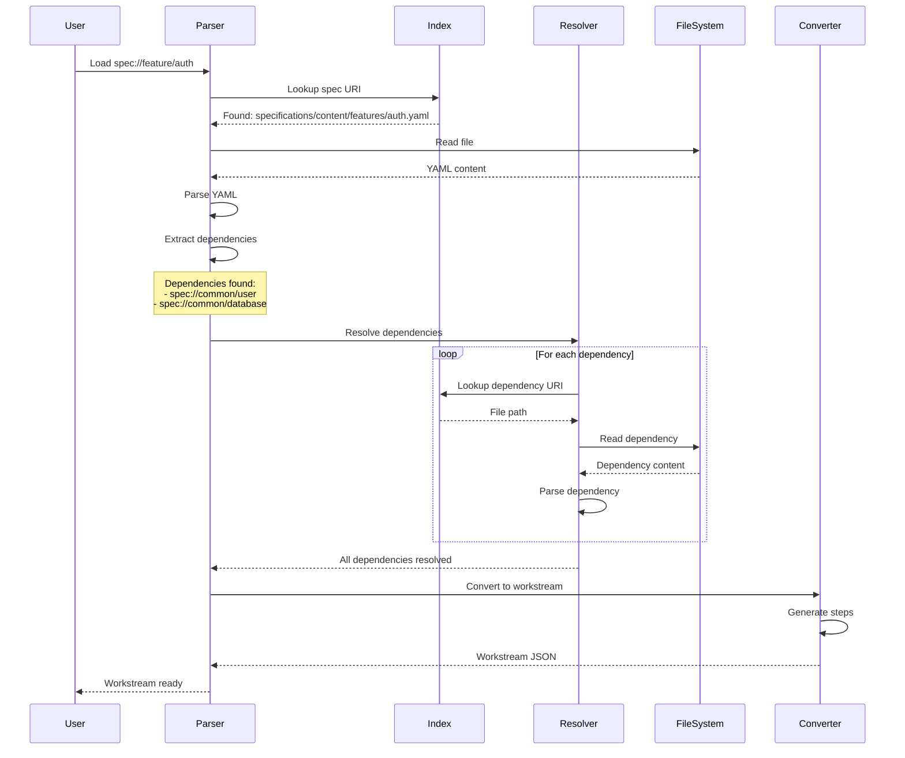

---

## Dependency Resolution (DAG)

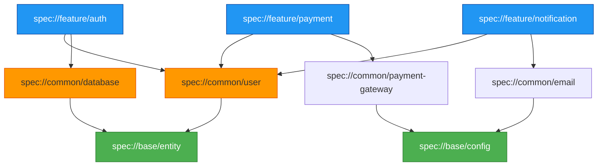

---

## Change Proposal Workflow

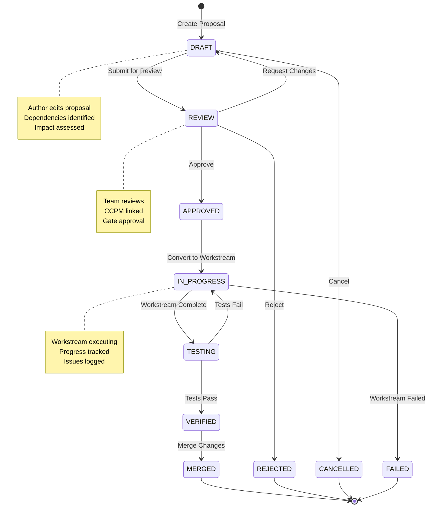

---

## Specification Index Structure

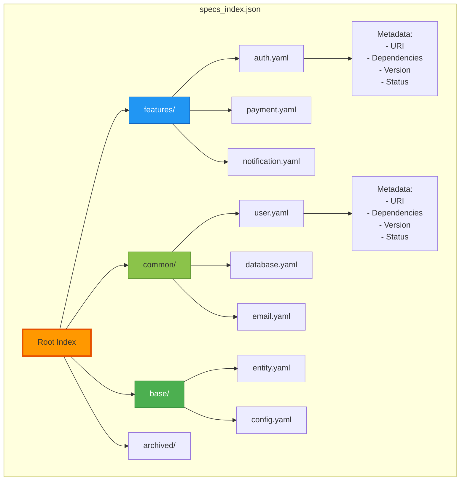

---

## Spec URI Resolution

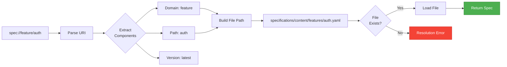

**URI Format**: `spec://<domain>/<path>[:<version>]`

**Examples**:
- `spec://feature/auth` → `specifications/content/features/auth.yaml`
- `spec://common/user:v2` → `specifications/content/common/user.v2.yaml`
- `spec://base/entity` → `specifications/content/base/entity.yaml`

---

## Workstream Generation from Spec

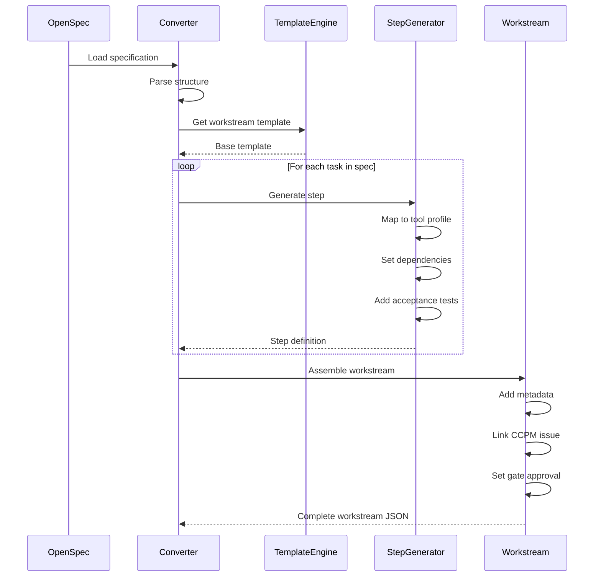

---

## Spec Version Management

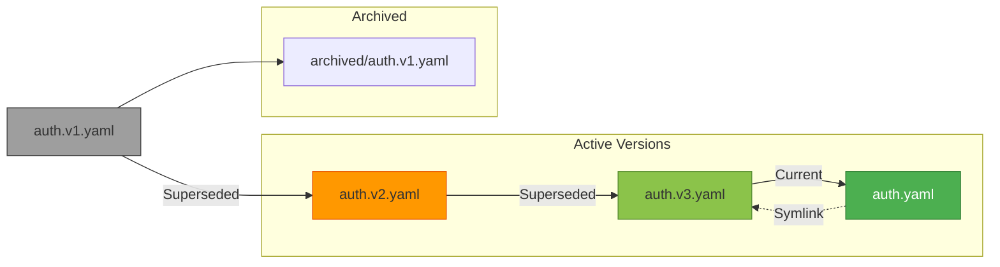

---

## Spec Inheritance & Templates

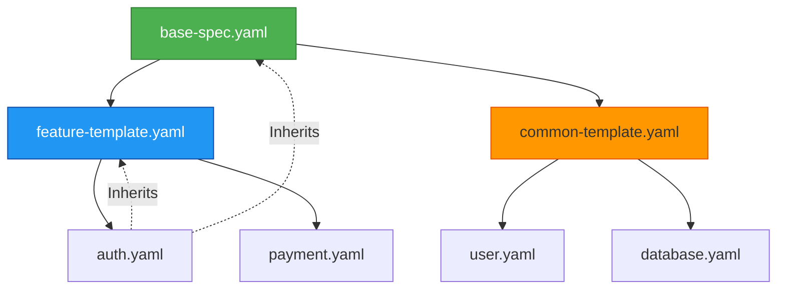

**Inheritance Chain**:
```yaml
# auth.yaml inherits from feature-template.yaml
extends: spec://templates/feature

# feature-template.yaml inherits from base
extends: spec://templates/base

# Effective configuration is merged:
# base → feature-template → auth
```

---

## Change Impact Analysis

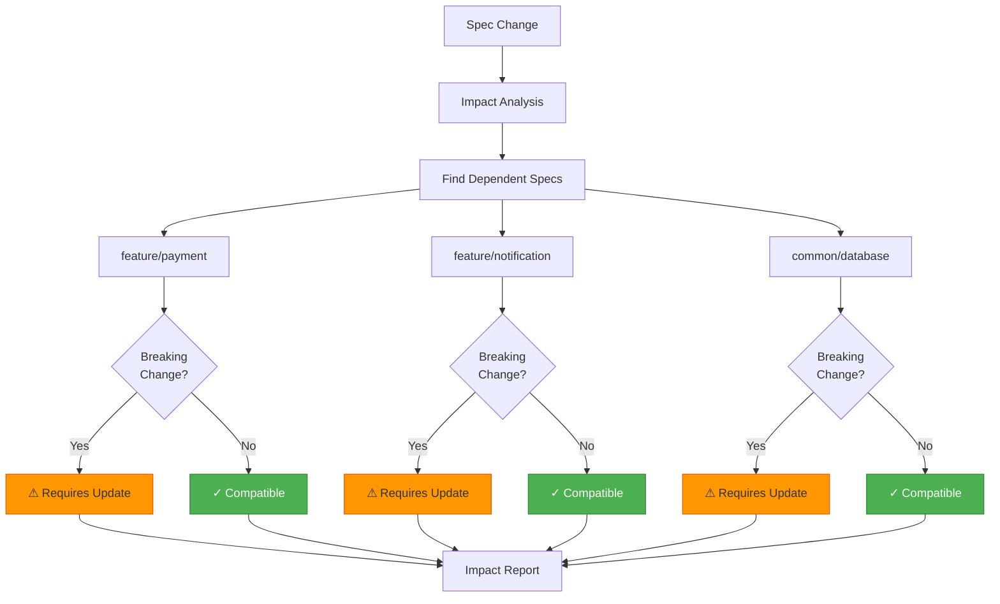

---

## Spec Validation Pipeline

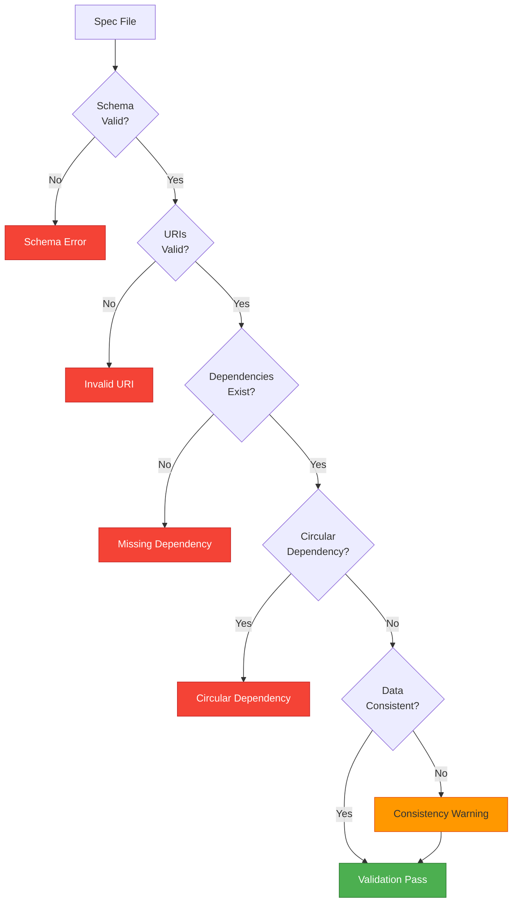

---

## CCPM Integration

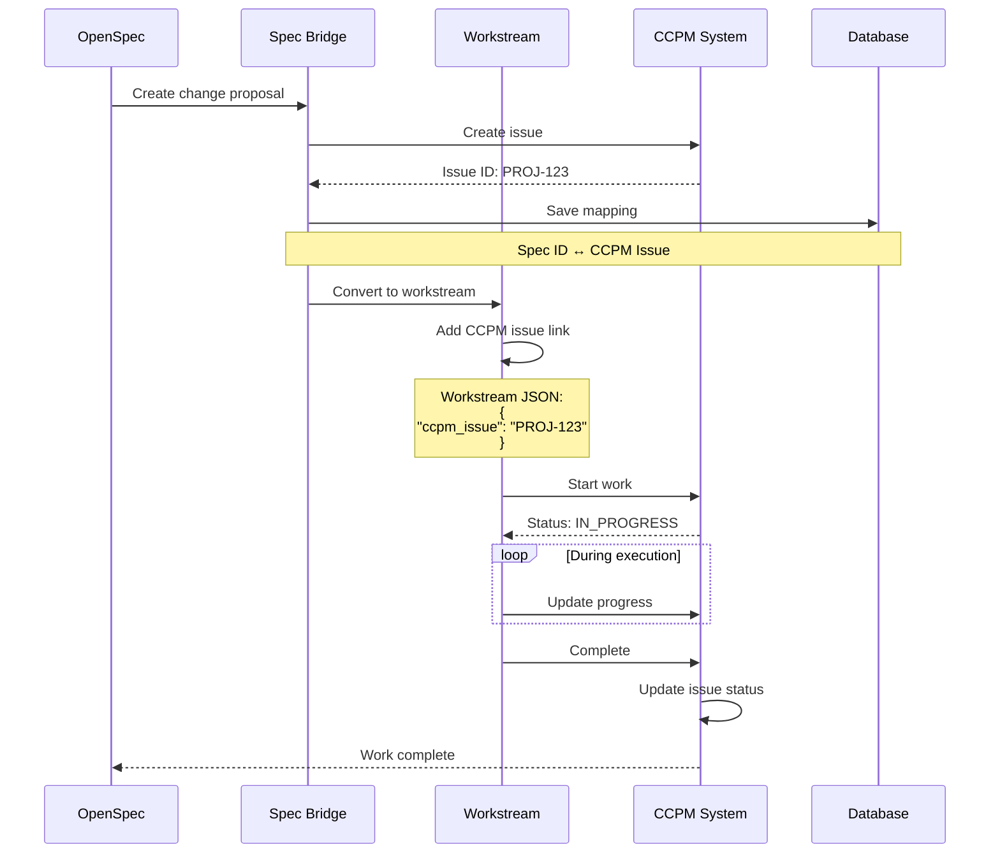

---

## Specification Metrics

| Metric | Purpose | Typical Value |
|--------|---------|---------------|
| **Total Specs** | Number of specifications | 50-200 |
| **Dependency Depth** | Max dependency chain length | 3-5 levels |
| **Conversion Time** | Spec → Workstream time | <2s |
| **Resolution Success** | % URIs resolved successfully | >99% |
| **Change Frequency** | Specs changed per week | 5-10 |
| **Breaking Changes** | % changes that break dependents | <5% |

---

## Directory Structure

```
specifications/
├── content/              # Specification YAML files
│   ├── features/        # Feature specifications
│   │   ├── auth.yaml
│   │   ├── payment.yaml
│   │   └── notification.yaml
│   ├── common/          # Common/shared specs
│   │   ├── user.yaml
│   │   ├── database.yaml
│   │   └── email.yaml
│   ├── base/            # Base templates
│   │   ├── entity.yaml
│   │   └── config.yaml
│   └── archived/        # Archived versions
│       └── auth.v1.yaml
│
├── changes/             # Change proposals
│   ├── CP-001-add-2fa.yaml
│   └── CP-002-payment-refactor.yaml
│
├── tools/               # Processing tools
│   ├── indexer/         # Spec indexing
│   ├── resolver/        # Dependency resolution
│   ├── guard/           # Validation
│   ├── patcher/         # Spec updates
│   └── renderer/        # Documentation generation
│
└── bridge/              # OpenSpec ↔ Workstream bridge
    ├── converter.py
    ├── change_tracker.py
    └── version_manager.py
```

---

## Configuration Example

```yaml
# Specification configuration
specifications:
  # Content location
  content_dir: "specifications/content"
  changes_dir: "specifications/changes"
  
  # Index settings
  index:
    auto_generate: true
    output_file: "specifications/specs_index.json"
    include_archived: false
    
  # Resolution
  resolution:
    cache_enabled: true
    cache_ttl: 3600
    max_depth: 10
    
  # Conversion
  conversion:
    default_tool_profile: "aider-python"
    auto_generate_tests: true
    validate_workstream: true
    
  # Version management
  versioning:
    enabled: true
    format: "v{major}.{minor}"
    auto_archive: true
    
  # CCPM integration
  ccpm:
    enabled: true
    auto_create_issues: true
    sync_status: true
    base_url: "https://ccpm.example.com"
```

---

## Related Documentation

- [System Architecture](./SYSTEM_ARCHITECTURE.md) - Overall system design
- [OpenSpec Format](../../openspec/README.md) - Specification format details
- [Workstream Schema](../../schema/workstream.schema.json) - Workstream JSON schema

---

**Last Updated**: 2025-11-22  
**Maintainer**: Architecture Team  
**Implementation**: `specifications/tools/`, `specifications/bridge/`
