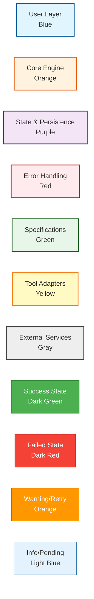
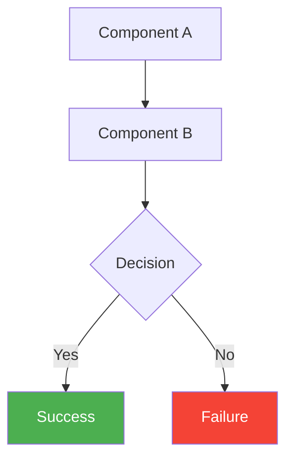
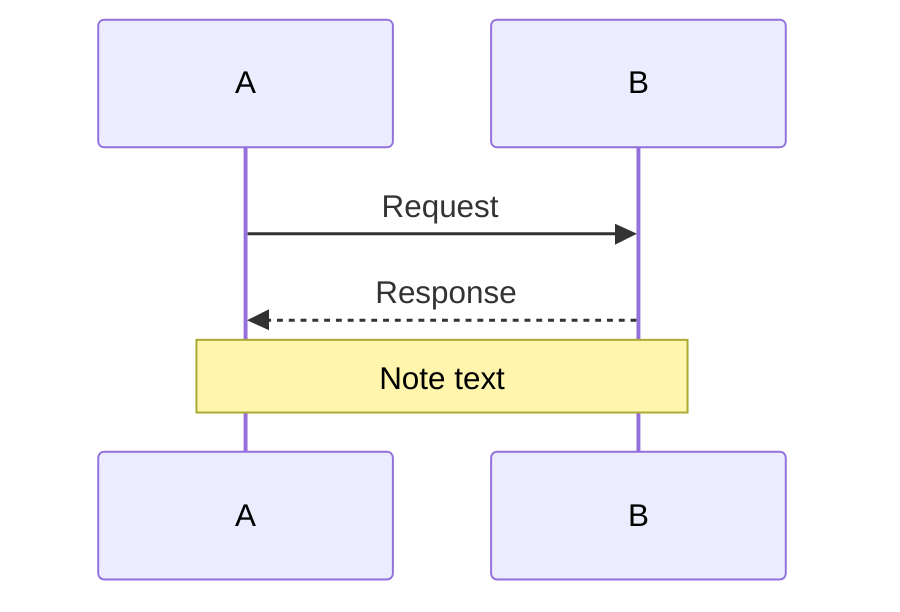
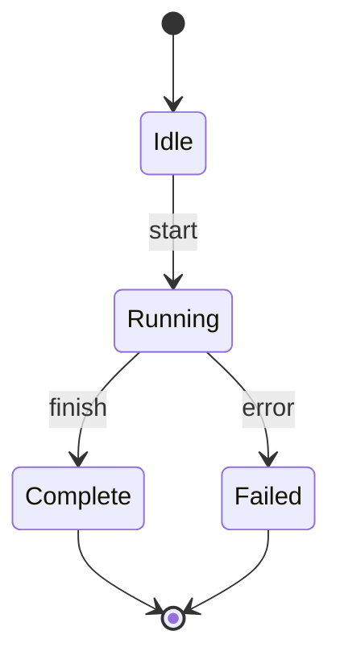
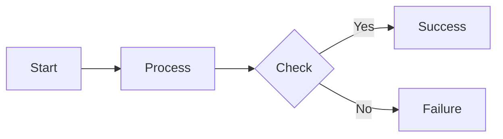

# Visual Architecture Guide

**Purpose**: Index and guide for all architecture diagrams, including conventions, update procedures, and validation.

---

## Overview

This repository uses **Mermaid** diagrams embedded in Markdown files to visualize system architecture, workflows, and processes. This approach provides version-controlled, text-based diagrams that render in GitHub and most modern Markdown viewers.

---

## Available Diagrams

### 1. System Architecture
**File**: [SYSTEM_ARCHITECTURE.md](./SYSTEM_ARCHITECTURE.md)  
**Purpose**: High-level overview of the entire system

**Diagrams Included**:
- Complete system component diagram (7 subsystems)
- Workstream execution sequence diagram
- Error handling flow
- Deployment architecture (Dev/CI/Prod)

**Best For**:
- New team members getting system overview
- Understanding component interactions
- Architecture reviews
- Documentation for external stakeholders

**Complexity**: ⭐⭐ Intermediate

---

### 2. Task Lifecycle
**File**: [TASK_LIFECYCLE.md](./TASK_LIFECYCLE.md)  
**Purpose**: Detailed state machine for workstream task execution

**Diagrams Included**:
- Complete state machine (11 states)
- State transition sequences
- Parallel execution timeline
- Retry behavior visualization
- Database schema

**Best For**:
- Understanding task execution flow
- Debugging task state issues
- Designing new retry/recovery logic
- Circuit breaker integration

**Complexity**: ⭐⭐⭐ Advanced

---

### 3. Error Escalation
**File**: [ERROR_ESCALATION.md](./ERROR_ESCALATION.md)  
**Purpose**: Error detection, analysis, and escalation flow

**Diagrams Included**:
- Error detection & escalation flowchart
- Error state machine
- Plugin architecture diagram
- Plugin interaction sequences
- Severity levels
- Auto-fix flow

**Best For**:
- Implementing error detection plugins
- Understanding error classification
- Configuring notifications
- Debugging error handling

**Complexity**: ⭐⭐⭐ Advanced

---

### 4. Tool Selection
**File**: [TOOL_SELECTION.md](./TOOL_SELECTION.md)  
**Purpose**: Tool adapter selection and configuration

**Diagrams Included**:
- Tool selection decision tree
- Profile matching algorithm
- Adapter architecture
- Timeout & retry visualization
- Fallback chain
- Priority scoring

**Best For**:
- Configuring tool profiles
- Understanding tool selection logic
- Adding new tool adapters
- Debugging tool invocation issues

**Complexity**: ⭐⭐ Intermediate

---

### 5. Spec Integration
**File**: [SPEC_INTEGRATION.md](./SPEC_INTEGRATION.md)  
**Purpose**: OpenSpec to Workstream conversion

**Diagrams Included**:
- OpenSpec → Workstream conversion flow
- Specification architecture
- Dependency resolution (DAG)
- Change proposal workflow
- Spec URI resolution
- Version management

**Best For**:
- Writing OpenSpec specifications
- Understanding spec dependencies
- Change proposal process
- CCPM integration

**Complexity**: ⭐⭐⭐ Advanced

---

## Diagram Conventions

### Color Coding

Our diagrams use consistent color schemes to indicate component types:



### Symbol Meanings

| Symbol | Meaning | Usage |
|--------|---------|-------|
| Rectangle | Component/Module | System components, services |
| Rounded Rectangle | Process/Action | Operations, transformations |
| Diamond | Decision Point | Conditional logic, branching |
| Circle | State | State machine states |
| Cylinder | Database | Data storage |
| Cloud | External Service | Third-party APIs, tools |
| Actor/Person | User | Human operators |

### Arrow Types

| Arrow | Meaning | Usage |
|-------|---------|-------|
| `-->` | Data flow | Normal flow of data/control |
| `-.->` | Optional/Async | Optional steps, async operations |
| `==>` | Strong dependency | Required dependency |
| `--x` | Failure/Block | Error condition, blocked path |

---

## Rendering Diagrams

### GitHub
Diagrams render automatically in GitHub's Markdown viewer.

### Local Viewing
Use any Mermaid-compatible Markdown viewer:

**VS Code**:
```bash
# Install extension
code --install-extension bierner.markdown-mermaid

# Open diagram file
code docs/diagrams/SYSTEM_ARCHITECTURE.md
```

**Browser**:
```bash
# Using grip (renders like GitHub)
pip install grip
grip docs/diagrams/SYSTEM_ARCHITECTURE.md
```

### Exporting to Images

**Using Mermaid CLI**:
```bash
# Install
npm install -g @mermaid-js/mermaid-cli

# Export to PNG
mmdc -i docs/diagrams/SYSTEM_ARCHITECTURE.md -o architecture.png

# Export to SVG
mmdc -i docs/diagrams/SYSTEM_ARCHITECTURE.md -o architecture.svg
```

**Using Docker**:
```bash
docker run --rm -v $(pwd):/data minlag/mermaid-cli \
  -i /data/docs/diagrams/SYSTEM_ARCHITECTURE.md \
  -o /data/architecture.png
```

---

## Updating Diagrams

### When to Update

Update diagrams when:
- ✅ Adding new components to the system
- ✅ Changing major workflows or processes
- ✅ Modifying state machines or state transitions
- ✅ Adding new integrations or tools
- ✅ Changing error handling logic
- ❌ Minor bug fixes (not architecture changes)
- ❌ Refactoring without behavior changes

### Update Process

1. **Identify affected diagrams**
   ```bash
   # Search for component mentions
   rg "ComponentName" docs/diagrams/
   ```

2. **Edit diagram source**
   - Edit the Mermaid code directly in Markdown
   - Test rendering locally before committing

3. **Validate changes**
   ```bash
   # Run diagram validation
   python scripts/validate_diagrams.py
   ```

4. **Update timestamp**
   - Update "Last Updated" date at bottom of file

5. **Commit with clear message**
   ```bash
   git add docs/diagrams/SYSTEM_ARCHITECTURE.md
   git commit -m "docs: update system architecture diagram - add new error engine component"
   ```

---

## Diagram Validation

### Automated Validation Script

**Location**: `scripts/validate_diagrams.py`

**What it checks**:
- ✅ Mermaid syntax is valid
- ✅ Referenced components exist in code
- ✅ No orphaned nodes (unreferenced components)
- ✅ State transitions match code
- ⚠️ Warns on outdated diagrams (>90 days old)

**Usage**:
```bash
# Validate all diagrams
python scripts/validate_diagrams.py

# Validate specific diagram
python scripts/validate_diagrams.py docs/diagrams/SYSTEM_ARCHITECTURE.md

# Auto-fix simple issues
python scripts/validate_diagrams.py --fix
```

**Example Output**:
```
Validating diagrams...

docs/diagrams/SYSTEM_ARCHITECTURE.md:
  ✓ Mermaid syntax valid
  ✓ All components found in codebase
  ⚠ Warning: Diagram not updated in 95 days
  
docs/diagrams/TASK_LIFECYCLE.md:
  ✓ Mermaid syntax valid
  ✓ State transitions match state_manager.py
  ✓ Recently updated (5 days ago)
  
docs/diagrams/ERROR_ESCALATION.md:
  ✓ Mermaid syntax valid
  ✗ Error: Referenced component "OldPlugin" not found
  
Summary: 2 passed, 1 failed, 1 warning
```

---

## CI Integration

Diagram validation runs automatically in CI:

```yaml
# .github/workflows/validate-docs.yml
name: Validate Documentation

on: [push, pull_request]

jobs:
  validate-diagrams:
    runs-on: ubuntu-latest
    steps:
      - uses: actions/checkout@v3
      
      - name: Set up Python
        uses: actions/setup-python@v4
        with:
          python-version: '3.10'
      
      - name: Install dependencies
        run: |
          pip install -r requirements.txt
      
      - name: Validate diagrams
        run: |
          python scripts/validate_diagrams.py
```

---

## Best Practices

### DO ✅

- **Keep diagrams up-to-date** with code changes
- **Use consistent colors** per component type
- **Add notes** to explain complex flows
- **Reference actual code** (file paths, class names)
- **Version control** all diagram changes
- **Test rendering** before committing
- **Add context** (notes, legends, examples)

### DON'T ❌

- **Over-complicate** diagrams (max ~20 nodes)
- **Duplicate** information across multiple diagrams
- **Hardcode** environment-specific details
- **Omit** important error paths
- **Ignore** validation warnings
- **Create** diagrams in external tools (use Mermaid)

---

## Diagram Size Guidelines

| Diagram Type | Recommended Max Nodes | Max Depth |
|--------------|----------------------|-----------|
| **Component Diagram** | 15-20 components | 3 levels |
| **Sequence Diagram** | 6-8 participants | 15-20 interactions |
| **State Machine** | 10-12 states | N/A |
| **Flowchart** | 20-25 nodes | 5 levels |
| **DAG** | 15-20 nodes | 4 levels |

**If exceeding limits**:
- Split into multiple focused diagrams
- Create hierarchical diagrams (overview + details)
- Use subgraphs to group related components

---

## Mermaid Syntax Quick Reference

### Component Diagram


### Sequence Diagram


### State Machine


### Flowchart


---

## Troubleshooting

### Diagram Not Rendering

**Problem**: Mermaid diagram shows as code block

**Solutions**:
1. Check syntax: https://mermaid.live/
2. Ensure triple backticks with `mermaid` language tag
3. Verify no syntax errors (missing quotes, brackets)
4. Update Markdown viewer/extension

### Diagram Too Complex

**Problem**: Diagram is cluttered and hard to read

**Solutions**:
1. Split into multiple diagrams
2. Use subgraphs to organize
3. Reduce number of nodes
4. Create hierarchy (overview + detail diagrams)

### Validation Fails

**Problem**: `validate_diagrams.py` reports errors

**Solutions**:
1. Check referenced components exist in code
2. Fix Mermaid syntax errors
3. Update outdated component references
4. Re-run validation after fixes

---

## Diagram Templates

### New Component Diagram Template

```markdown
# Component Name

**Purpose**: Brief description

---

## Component Overview

\`\`\`mermaid
graph TB
    Component[Main Component] --> Sub1[Subcomponent 1]
    Component --> Sub2[Subcomponent 2]
    
    style Component fill:#ff9800,stroke:#e65100,stroke-width:3px
\`\`\`

---

## Related Documentation

- [System Architecture](./SYSTEM_ARCHITECTURE.md)
- [Implementation](../../path/to/code.py)

---

**Last Updated**: YYYY-MM-DD  
**Maintainer**: Team Name  
**Implementation**: `path/to/code.py`
```

---

## Metrics

Track diagram health:

| Metric | Target | Current |
|--------|--------|---------|
| **Validation Pass Rate** | 100% | TBD |
| **Average Diagram Age** | <30 days | TBD |
| **Components Documented** | 100% | 95% |
| **Orphaned Diagrams** | 0 | 0 |
| **Broken References** | 0 | TBD |

---

## Resources

### Mermaid Documentation
- [Official Docs](https://mermaid.js.org/)
- [Live Editor](https://mermaid.live/)
- [Syntax Reference](https://mermaid.js.org/intro/syntax-reference.html)

### Tools
- [Mermaid CLI](https://github.com/mermaid-js/mermaid-cli)
- [VS Code Extension](https://marketplace.visualstudio.com/items?itemName=bierner.markdown-mermaid)
- [IntelliJ Plugin](https://plugins.jetbrains.com/plugin/20146-mermaid)

### Examples
- [Mermaid Examples](https://mermaid.js.org/ecosystem/integrations.html)
- [GitHub Examples](https://github.blog/2022-02-14-include-diagrams-markdown-files-mermaid/)

---

## FAQ

**Q: Can I use other diagram tools like draw.io?**  
A: No, use Mermaid for version control and GitHub integration. Binary formats like .drawio are harder to review and merge.

**Q: How do I add a new diagram?**  
A: Create a new .md file in `docs/diagrams/`, follow the template above, and update this index.

**Q: What if my diagram is too complex for Mermaid?**  
A: Split it into multiple focused diagrams or use hierarchical diagrams (overview + detailed views).

**Q: How often should diagrams be updated?**  
A: Update whenever architecture changes. Aim for diagrams <30 days old for actively developed areas.

**Q: Can I export diagrams for presentations?**  
A: Yes, use `mmdc` (Mermaid CLI) to export to PNG/SVG. See "Exporting to Images" section.

---

## Related Documentation

- [DOCUMENTATION_INDEX.md](../DOCUMENTATION_INDEX.md) - All documentation
- [IMPLEMENTATION_LOCATIONS.md](../IMPLEMENTATION_LOCATIONS.md) - Code locations
- [PHASE_K_DOCUMENTATION_ENHANCEMENT_PLAN.md](../PHASE_K_DOCUMENTATION_ENHANCEMENT_PLAN.md) - Overall plan

---

**Last Updated**: 2025-11-22  
**Maintainer**: Architecture Team  
**Total Diagrams**: 5  
**Validation Script**: `scripts/validate_diagrams.py`
