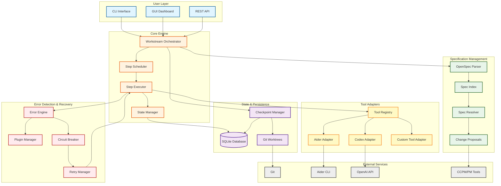
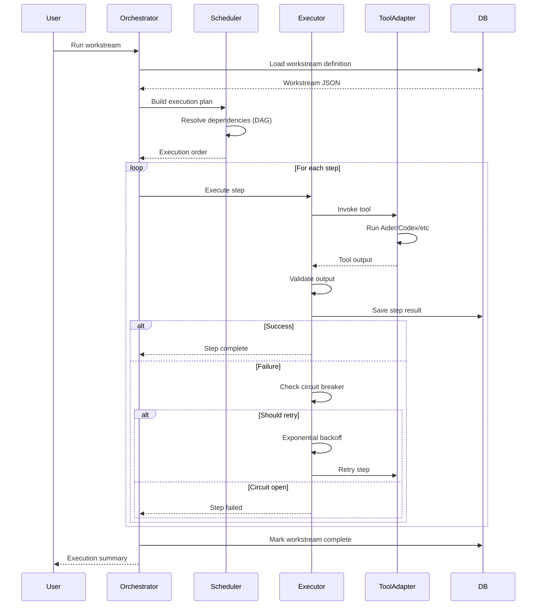
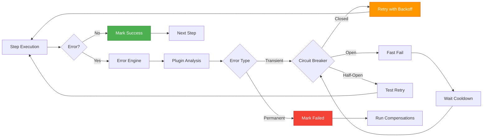
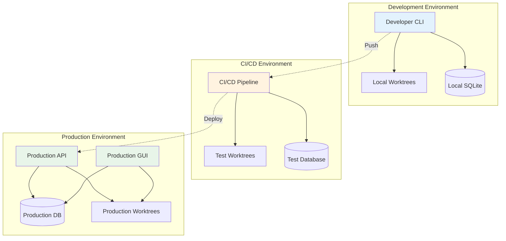

# System Architecture

**Purpose**: High-level overview of the Complete AI Development Pipeline system architecture, showing all major components and their interactions.

---

## System Overview



---

## Component Descriptions

### User Layer (Blue)

**CLI Interface**
- Command-line interface for running workstreams
- Primary entry point for developers
- Supports interactive and batch modes

**GUI Dashboard**
- Web-based visual interface
- Real-time progress monitoring
- Workstream visualization and control

**REST API**
- Programmatic access to pipeline
- Integration with external tools
- Webhook support for events

---

###Core Engine (Orange)

**Workstream Orchestrator**
- Central coordinator for workstream execution
- Loads and validates workstream definitions
- Manages overall workflow lifecycle

**Step Scheduler**
- Dependency resolution (DAG)
- Parallel execution planning
- Worker pool management
- Resource allocation

**Step Executor**
- Executes individual workstream steps
- Tool adapter invocation
- Output capture and validation
- Acceptance test execution

**State Manager**
- Tracks execution state
- Persists progress to database
- Handles state transitions
- Recovery from failures

---

### State & Persistence (Purple)

**SQLite Database**
- Central state storage
- Workstream metadata
- Execution history
- Configuration cache

**Checkpoint Manager**
- Saves intermediate state
- Enables resume capability
- Manages checkpoint lifecycle
- Validation on restore

**Git Worktrees**
- Isolated execution environments
- Branch per workstream
- Safe experimentation
- Easy rollback

---

### Error Detection & Recovery (Red)

**Error Engine**
- Monitors step execution
- Detects error patterns
- Triggers recovery actions
- Diagnostic collection

**Plugin Manager**
- Loads error detection plugins
- Routes errors to appropriate plugins
- Manages plugin lifecycle
- Extensibility framework

**Circuit Breaker**
- Prevents cascading failures
- Three states: CLOSED, OPEN, HALF_OPEN
- Configurable thresholds
- Automatic recovery

**Retry Manager**
- Exponential backoff
- Jitter for distributed systems
- Per-step retry limits
- Success/failure tracking

---

### Specification Management (Green)

**OpenSpec Parser**
- Parses OpenSpec YAML files
- Converts to internal format
- Validation and linting
- Version compatibility

**Spec Index**
- Fast specification lookup
- Change tracking
- Dependency mapping
- Auto-generated from specs

**Spec Resolver**
- URI-based spec references
- Dependency resolution
- Circular dependency detection
- Version conflict handling

**Change Proposals**
- Tracks spec modifications
- Links to workstreams
- CCPM integration
- Approval workflows

---

### Tool Adapters (Yellow)

**Tool Registry**
- Manages available tools
- Profile matching
- Capability discovery
- Fallback selection

**Aider Adapter**
- Invokes Aider CLI
- Streams output
- Handles interruptions
- Git integration

**Codex Adapter**
- OpenAI Codex API integration
- Prompt management
- Rate limiting
- Response parsing

**Custom Tool Adapter**
- Extensibility point
- User-defined tools
- Standard interface
- Error handling

---

### External Services (Gray)

**Git**
- Version control
- Worktree management
- Commit history
- Branch operations

**Aider CLI**
- AI pair programming
- Code generation
- File editing
- Test creation

**OpenAI API**
- GPT-4/GPT-3.5 access
- Codex endpoints
- Rate limiting
- API key management

**CCPM/PM Tools**
- Project management integration
- Issue tracking
- Time estimates
- Dependency chains

---

## Data Flow: Workstream Execution



---

## Error Handling Flow



---

## Deployment Architecture



---

## Technology Stack

| Layer | Technology | Purpose |
|-------|-----------|---------|
| **Database** | SQLite | State persistence, execution history |
| **Language** | Python 3.10+ | Core implementation |
| **CLI** | Click/Argparse | Command-line interface |
| **GUI** | Flask/FastAPI | Web dashboard |
| **Visualization** | Mermaid | Architecture diagrams |
| **Version Control** | Git | Worktrees, versioning |
| **AI Tools** | Aider, OpenAI Codex | Code generation |
| **Validation** | Pydantic, JSON Schema | Data validation |
| **Testing** | Pytest | Unit/integration tests |
| **CI/CD** | GitHub Actions | Automation |

---

## Directory Structure Mapping

```
Repository Root
│
├─ core/                    → Core Engine (Orange)
│  ├─ state/               → State & Persistence (Purple)
│  ├─ engine/              → Orchestrator, Scheduler, Executor
│  └─ planning/            → Workstream planning
│
├─ error/                   → Error Detection & Recovery (Red)
│  ├─ engine/              → Error Engine, State Machine
│  └─ plugins/             → Detection plugins
│
├─ specifications/          → Specification Management (Green)
│  ├─ content/             → OpenSpec files
│  ├─ tools/               → Indexer, resolver, etc.
│  └─ bridge/              → OpenSpec → Workstream
│
├─ aim/                     → Tool Adapters (Yellow)
├─ aider/                   → Aider integration
│
├─ workstreams/             → Workstream definitions
├─ schema/                  → JSON schemas
├─ config/                  → Tool profiles, configs
│
└─ scripts/                 → Automation scripts
```

---

## Key Design Principles

### 1. **Separation of Concerns**
- Core engine independent of tools
- Error detection decoupled from execution
- Specifications separate from execution

### 2. **Extensibility**
- Plugin architecture for error detection
- Adapter pattern for tools
- Custom tool support

### 3. **Resilience**
- Circuit breaker pattern
- Retry with exponential backoff
- Checkpoint/resume capability

### 4. **Observability**
- Comprehensive logging
- State machine tracking
- Execution history

### 5. **Isolation**
- Git worktrees per workstream
- Process-level isolation for tools
- Database transaction safety

---

## Related Documentation

- [Task Lifecycle](./TASK_LIFECYCLE.md) - Detailed state machine
- [Error Escalation](./ERROR_ESCALATION.md) - Error handling flow
- [Tool Selection](./TOOL_SELECTION.md) - Tool adapter architecture
- [Spec Integration](./SPEC_INTEGRATION.md) - OpenSpec workflow

---

**Last Updated**: 2025-11-22  
**Maintainer**: Architecture Team  
**Auto-Validation**: `python scripts/validate_diagrams.py`
