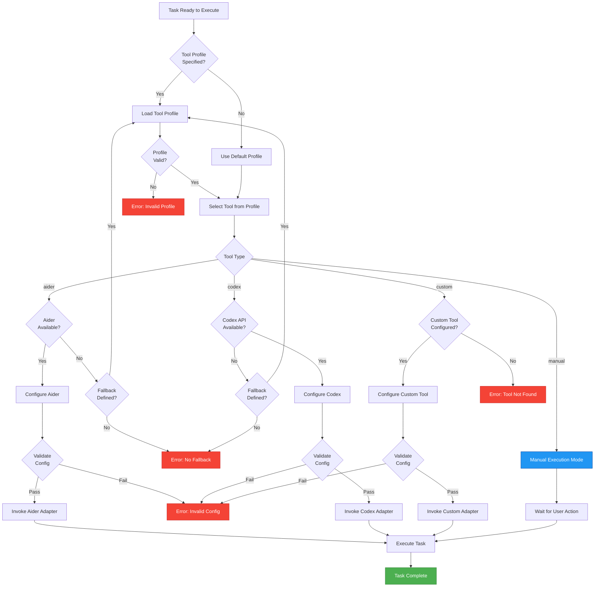
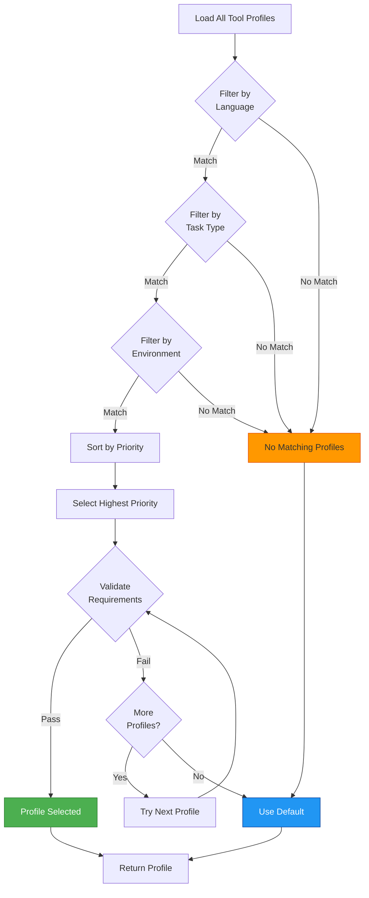
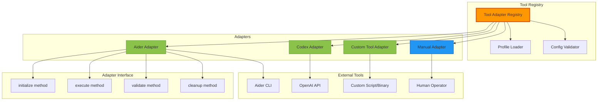
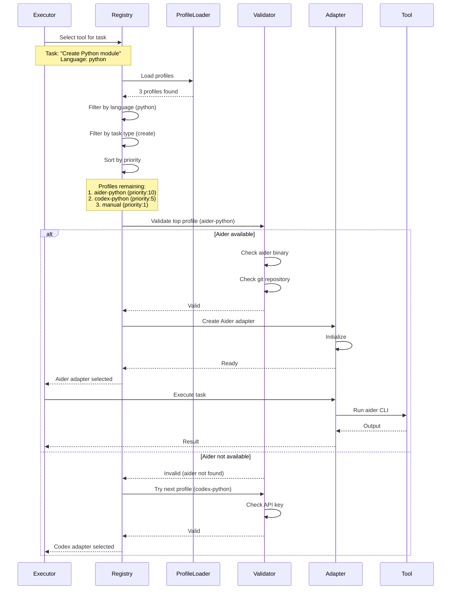
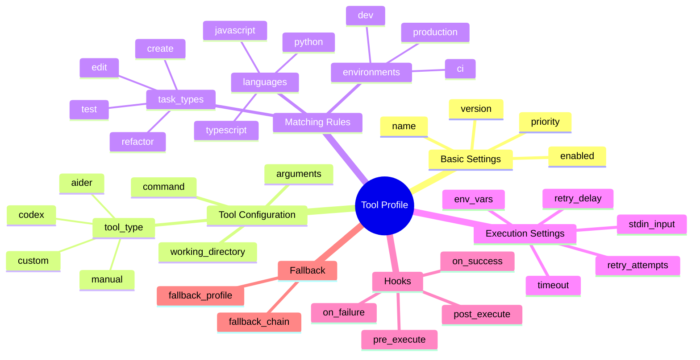
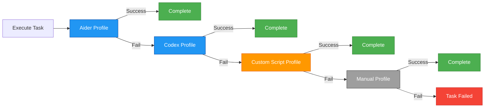
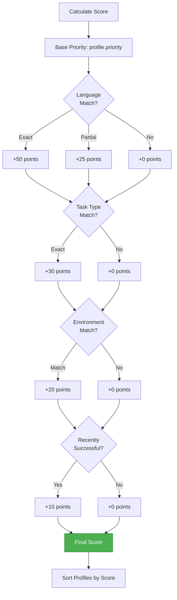
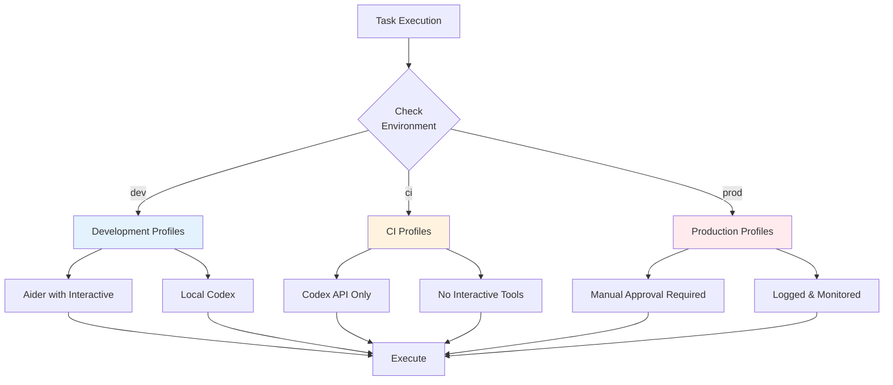
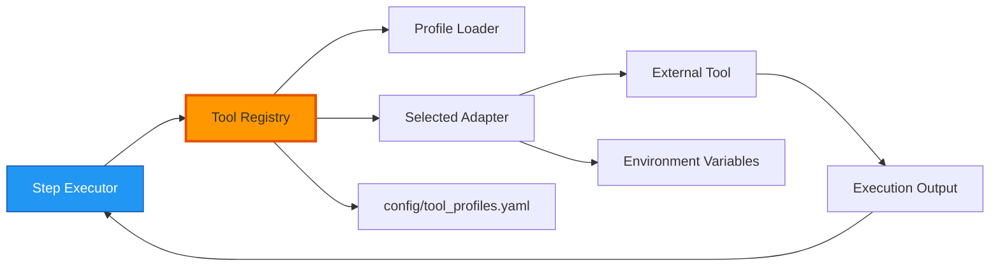

# Tool Selection

**Purpose**: Decision tree and flow for selecting the appropriate tool adapter based on task requirements and tool profiles.

---

## Tool Selection Decision Tree



---

## Tool Profile Matching Algorithm



---

## Tool Adapter Architecture



---

## Tool Selection Sequence



---

## Profile Configuration Options



---

## Timeout & Retry Configuration

```mermaid
gantt
    title Tool Execution with Retries
    dateFormat  HH:mm:ss
    axisFormat %H:%M:%S
    
    section Attempt 1
    Execution (timeout 5min)  :a1, 00:00:00, 300s
    Timeout Reached           :milestone, after a1, 0s
    
    section Retry 1
    Backoff Delay (2s)        :b1, after a1, 2s
    Execution (timeout 5min)  :a2, after b1, 120s
    Failure Detected          :milestone, after a2, 0s
    
    section Retry 2
    Backoff Delay (4s)        :b2, after a2, 4s
    Execution (timeout 5min)  :a3, after b2, 60s
    Success                   :milestone, after a3, 0s
```



---

## Fallback Chain Example



---

## Tool Profile Priority Scoring



**Example Scoring**:
```
Profile: aider-python
- Base priority: 10
- Language match (python): +50
- Task type match (create): +30
- Environment match (dev): +20
- Recently successful: +10
= Total: 120 points

Profile: codex-python
- Base priority: 5
- Language match (python): +50
- Task type match (none): +0
- Environment match (dev): +20
- Recently successful: +0
= Total: 75 points

Winner: aider-python (120 > 75)
```

---

## Environment-Specific Selection



---

## Tool Adapter Interface

All adapters must implement this interface:

```python
class ToolAdapter(ABC):
    """Base class for all tool adapters."""
    
    @abstractmethod
    def initialize(self, config: Dict) -> None:
        """Initialize the adapter with configuration."""
        pass
    
    @abstractmethod
    def validate(self) -> bool:
        """Validate tool is available and configured correctly."""
        pass
    
    @abstractmethod
    def execute(self, task: Task) -> ExecutionResult:
        """Execute the task using the tool."""
        pass
    
    @abstractmethod
    def cleanup(self) -> None:
        """Clean up resources after execution."""
        pass
    
    @property
    @abstractmethod
    def capabilities(self) -> List[str]:
        """Return list of tool capabilities."""
        pass
```

---

## Configuration Example

```yaml
# Tool profiles configuration
tool_profiles:
  # Aider profile for Python development
  - name: aider-python
    enabled: true
    priority: 10
    
    tool:
      type: aider
      command: aider
      args:
        - "--yes"
        - "--no-pretty"
    
    matching:
      languages: [python]
      task_types: [create, edit, refactor]
      environments: [dev, ci]
    
    execution:
      timeout: 300
      retry_attempts: 3
      retry_delay: 2
      env_vars:
        AIDER_MODEL: "gpt-4-turbo"
    
    hooks:
      pre_execute: "scripts/pre_aider.sh"
      post_execute: "scripts/post_aider.sh"
    
    fallback: codex-python

  # Codex profile
  - name: codex-python
    enabled: true
    priority: 5
    
    tool:
      type: codex
      api_endpoint: "https://api.openai.com/v1"
    
    matching:
      languages: [python, javascript, typescript]
      task_types: [create, edit]
      environments: [dev, ci, prod]
    
    execution:
      timeout: 60
      retry_attempts: 5
      retry_delay: 1
      env_vars:
        OPENAI_API_KEY: "${OPENAI_API_KEY}"
    
    fallback: manual
    
  # Manual fallback
  - name: manual
    enabled: true
    priority: 1
    
    tool:
      type: manual
    
    matching:
      languages: ["*"]  # Matches all
      task_types: ["*"]
      environments: ["*"]
```

---

## Tool Selection Metrics

| Metric | Purpose | Threshold |
|--------|---------|-----------|
| **Selection Time** | Time to select adapter | <100ms |
| **Success Rate** | % tasks successfully executed | >90% |
| **Fallback Rate** | % using fallback | <10% |
| **Timeout Rate** | % tasks timing out | <5% |
| **Profile Match Rate** | % tasks with profile match | >95% |

---

## Integration with Core Engine



---

## Related Documentation

- [System Architecture](./SYSTEM_ARCHITECTURE.md) - Overall architecture
- [Task Lifecycle](./TASK_LIFECYCLE.md) - Task execution flow
- [Tool Profile Configuration](../examples/tool_profile_annotated.yaml) - Detailed config reference

---

**Last Updated**: 2025-11-22  
**Maintainer**: Architecture Team  
**Implementation**: `aim/tool_registry.py`, `aim/adapters/`
