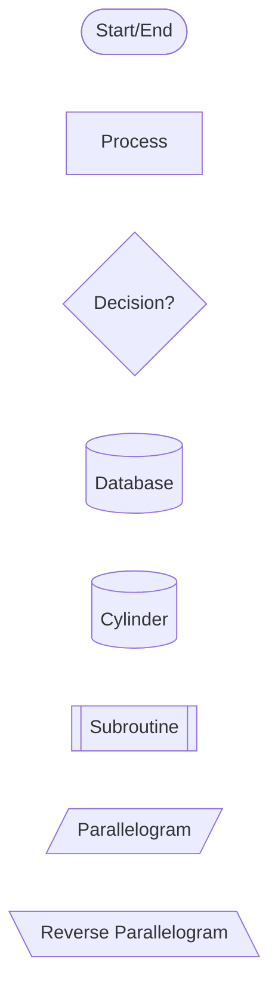
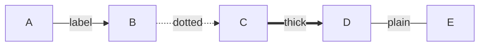
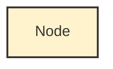

# 📊 Flowchart Symbols Reference Guide

**Document ID**: DOC-REF-FLOWCHART-SYMBOLS-001
**Status**: Canonical Reference
**Scope**: All visual process diagrams in this repository

---

## 🎯 Purpose

This document defines the **standard flowchart symbols** used across all pipeline documentation, process diagrams, and visual specifications in this repository.

**When to use this**: When creating or interpreting flowcharts in `docs/`, `plans/`, or any visual process documentation.

---

## 📐 Standard Flowchart Symbols

### **1. Flow Control Symbols**

#### **Start/End Symbol** (Terminal)
```
   ╭─────────╮
   │  START  │
   ╰─────────╯
```
- **Shape**: Oval / Rounded Rectangle
- **Usage**: Marks the beginning or end of a process
- **Examples**: "User Request", "Process Complete", "Exit"
- **Mermaid**: `([Start])` or `([End])`

---

#### **Process/Action Symbol**
```
   ┌─────────────┐
   │   Process   │
   └─────────────┘
```
- **Shape**: Rectangle
- **Usage**: Single step or action in the process
- **Examples**: "Validate Schema", "Execute Task", "Generate Report"
- **Mermaid**: `[Process Name]`

---

#### **Decision Symbol**
```
       ╱╲
      ╱  ╲
     ╱ ?? ╲
     ╲    ╱
      ╲  ╱
       ╲╱
```
- **Shape**: Diamond
- **Usage**: Conditional branch (Yes/No, True/False)
- **Examples**: "Valid?", "Success?", "Has Dependencies?"
- **Mermaid**: `{Decision?}`
- **Branches**: Typically 2+ exit paths with labels

---

#### **Connector Symbol**
```
      ●
```
- **Shape**: Small Circle
- **Usage**: Connect flowchart sections across pages or areas
- **Label**: Usually numbered (1, 2, 3) or lettered (A, B, C)
- **Mermaid**: Use subgraphs or explicit node references

---

### **2. Data Symbols**

#### **Document Symbol**
```
   ┌─────────────┐
   │  Document   │
   └─────┬───┬───┘
         └───┘
```
- **Shape**: Rectangle with wavy bottom
- **Usage**: Single document or report
- **Examples**: "Phase Plan.yaml", "Error Report", "README.md"
- **Mermaid**: `[(Document)]` (or use icon in label)

---

#### **Multiple Documents**
```
   ┌─────────────┐
   │┌─────────┐  │
   ││Documents│  │
   │└─────┬───┴──┘
   └──────┴──────
```
- **Shape**: Stacked documents with wavy bottoms
- **Usage**: Multiple files or batch documents
- **Examples**: "All README files", "Test Reports", "Generated Artifacts"

---

#### **Database Symbol**
```
    ╭─────────╮
   (  Database )
    ╰─────────╯
```
- **Shape**: Cylinder
- **Usage**: Database storage or persistent data
- **Examples**: "SQLite DB", "state/runs.db", "Cache"
- **Mermaid**: `[(Database)]` or `[("Database")]`

---

#### **Data Storage**
```
   ╱────────────╲
  │   Storage    │
   ╲────────────╱
```
- **Shape**: Parallelogram (slanted rectangle)
- **Usage**: General data storage, not necessarily database
- **Examples**: "File System", "Cache Folder", "Temp Storage"

---

#### **Internal Storage**
```
   ┌─┬───────────┐
   │ │ Internal  │
   │ │ Storage   │
   └─┴───────────┘
```
- **Shape**: Rectangle with left vertical line
- **Usage**: RAM, internal memory, temporary cache
- **Examples**: "In-Memory State", "Cache Buffer"

---

### **3. Input/Output Symbols**

#### **Input/Output Symbol**
```
    ╱────────────╲
   │   I/O Data   │
    ╲────────────╱
```
- **Shape**: Parallelogram
- **Usage**: Data input or output operation
- **Examples**: "Read Config", "Write Log", "User Input"

---

#### **Manual Input**
```
   ╱──────────────┐
  │  User Input   │
  └───────────────┘
```
- **Shape**: Rectangle with slanted top
- **Usage**: Data entered manually by human
- **Examples**: "CLI Input", "User Selection", "Manual Override"

---

#### **Display Symbol**
```
   ┌───────────╲
   │  Display   ╲
   │  Output     │
   └─────────────┘
```
- **Shape**: Rectangle with curved right side
- **Usage**: Output displayed to user (screen, GUI)
- **Examples**: "Show Progress", "TUI Display", "Error Message"

---

### **4. Process Flow Symbols**

#### **Predefined Process (Subroutine)**
```
   ║─────────────║
   ║ Subroutine  ║
   ║─────────────║
```
- **Shape**: Rectangle with double vertical lines on sides
- **Usage**: Call to another process or module
- **Examples**: "Call Error Engine", "Run Validation", "Execute Plugin"

---

#### **Preparation Symbol**
```
   ╱────────────╲
  ╱  Prepare    ╱
  ╲────────────╱
```
- **Shape**: Hexagon (or elongated hexagon)
- **Usage**: Setup step before main process
- **Examples**: "Initialize DB", "Load Config", "Setup Environment"

---

#### **Manual Operation**
```
   ╲────────────╱
    ╲  Manual  ╱
     ╲  Task  ╱
      ╲──────╱
```
- **Shape**: Trapezoid (bottom wider)
- **Usage**: Step requiring manual human action
- **Examples**: "Manual Review", "Approval Step", "Human Verification"

---

#### **Loop Limit**
```
   ┌──────┬──────┐
   │ Loop │ Max  │
   └──────┴──────┘
```
- **Shape**: Rectangle with internal horizontal division
- **Usage**: Define loop boundaries or iteration limits
- **Examples**: "Retry 3 times", "For each task", "While queue not empty"

---

#### **Delay Symbol**
```
      ╱╲
     │  │
      ╲╱
```
- **Shape**: Hourglass or D-shape
- **Usage**: Waiting period or scheduled delay
- **Examples**: "Wait 5s", "Exponential Backoff", "Sleep"

---

### **5. Logical Operators**

#### **Or Symbol**
```
       ╱╲
      ╱  ╲
     │ OR │
      ╲  ╱
       ╲╱
```
- **Shape**: Circle with OR inside
- **Usage**: Multiple paths converge (any one can trigger)
- **Examples**: "Error OR Timeout", "Manual OR Auto"

---

#### **Summoning Junction (AND)**
```
       ═══
      ║   ║
      ║AND║
      ║   ║
       ═══
```
- **Shape**: Circle with AND inside
- **Usage**: All inputs required before proceeding
- **Examples**: "All tests pass", "Both validations succeed"

---

#### **Merge**
```
      ─┬─
       │
      ─┴─
```
- **Shape**: Triangle pointing down
- **Usage**: Multiple flows converge to single path
- **Examples**: "Collect results", "Aggregate outputs"

---

### **6. Advanced Symbols**

#### **Collate Symbol**
```
      ▼
     ─┼─
      ▲
```
- **Shape**: Two triangles (hourglass)
- **Usage**: Organize or sort data
- **Examples**: "Sort by priority", "Group by type"

---

#### **Sort Symbol**
```
      ▼
     ═╪═
      │
```
- **Shape**: Triangle over rectangle
- **Usage**: Sort operation
- **Examples**: "Order by timestamp", "Priority queue"

---

#### **Off-Page Connector**
```
    ╱─────╲
   │   2   │
    ╲─────╱
```
- **Shape**: Pentagon (home plate shape)
- **Usage**: Flow continues on another page/diagram
- **Label**: Number or letter matching target

---

## 🎨 Color Conventions (Repository Standard)

Based on `E2E_PROCESS_VISUAL_DIAGRAM.md`:

| Color | Hex | Usage | Examples |
|-------|-----|-------|----------|
| 🟦 Blue | `#e1f5ff` | Data/Storage | Plans, state, profiles, databases |
| 🟨 Yellow | `#fff3cd` | Engines/Logic | core/engine, bootstrap, adapters |
| 🟩 Green | `#d4edda` | Validation | Schema checks, success states |
| 🟪 Purple | `#e8d4f8` | UI/Display | GUI, textual, rich formatting |
| 🟥 Red | `#f8d7da` | Critical/Output | Errors, state transitions, artifacts |
| 🟧 Orange | `#ffd4e5` | Support/Plugins | AIM, error plugins, PM |
| ⬜ Gray | `#f0f0f0` | External | User, manual steps, external systems |

---

## 📝 Mermaid Syntax Quick Reference

### **Basic Shapes**


### **Connections**


### **Styling**


---

## ✅ Usage Guidelines

### **When Creating Flowcharts**

1. **Use standard symbols** from this document
2. **Label all decision branches** (Yes/No, Success/Fail)
3. **Apply color conventions** consistently
4. **Keep flow direction** top-to-bottom or left-to-right
5. **Use connectors** for complex diagrams spanning multiple areas
6. **Add legend** if using custom symbols or colors

### **Symbol Selection Priority**

1. **Process steps** → Rectangle
2. **Decisions** → Diamond
3. **Data/files** → Document or Database cylinder
4. **User interaction** → Manual Input or Display
5. **Subroutines** → Double-lined Rectangle
6. **Start/End** → Oval

### **Common Mistakes to Avoid**

❌ Using rectangles for decisions (use diamonds)
❌ Unlabeled decision branches
❌ Inconsistent flow direction
❌ Missing start/end terminals
❌ Overusing complex symbols when simple ones suffice

---

## 🔗 Related Documentation

- **E2E_PROCESS_VISUAL_DIAGRAM.md** - Complete pipeline process flow using these symbols
- **docs/adr/** - Architecture decisions with flowchart diagrams
- **plans/** - Phase plans with process visualizations

---

## 📌 Version History

| Version | Date | Changes |
|---------|------|---------|
| 1.0 | 2025-12-05 | Initial reference document created from Screenshot 2025-12-04 234313.png |

---

**Status**: ✅ Canonical Reference - Single Source of Truth
**Maintained By**: Documentation Team
**Review Cycle**: Update when new symbol standards are introduced
