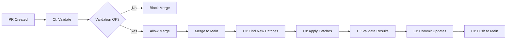

# Glossary Automation System - Complete Guide

**Created**: 2025-11-25  
**Status**: ✅ Production Ready  
**Components**: Patch system, CI/CD workflows, validation tools

---

## Overview

The glossary automation system provides structured, validated, and auditable updates to glossary terms through:

1. **Patch-Based Updates** - YAML specifications define bulk changes
2. **Automated Validation** - Quality checks on every change
3. **CI/CD Integration** - Automatic application on merge
4. **Change Tracking** - Full audit trail in changelog
5. **Rollback Support** - Easy undo of problematic changes

---

## Components

### 1. Update Tool (`scripts/update_term.py`)

**Purpose**: Apply patches to glossary metadata

**Features**:
- ✅ YAML-based patch specifications
- ✅ Dry-run mode for preview
- ✅ Atomic updates (all or nothing)
- ✅ Automatic metadata timestamps
- ✅ Changelog generation
- ✅ Built-in validation

**Status**: ✅ Complete (516 lines)

### 2. Patch Specifications (`updates/*.yaml`)

**Purpose**: Define what to update

**Format**:
```yaml
patch_id: "01J5XY..."
description: "What and why"
date: "2025-11-25"
author: "your-name"

terms:
  - term_id: TERM-XXX-NNN
    action: add|update|replace|remove
    field: field.path
    value: new_value
```

**Examples Provided**:
- `example-add-uet-schemas.yaml` - Add schema references
- `example-add-implementation-paths.yaml` - Add code paths

### 3. CI/CD Workflow (`.github/workflows/glossary-validation.yml`)

**Purpose**: Automate validation and patch application

**Triggers**:
- On PR: Validate changes
- On merge to main: Apply patches automatically

**Jobs**:
1. **validate** - Run full validation
2. **apply-patches** - Auto-apply new patches
3. **check-quality** - Report metrics

**Status**: ✅ Complete (141 lines)

### 4. Documentation (`AUTOMATED_UPDATE_PROCESS.md`)

**Purpose**: Complete guide for all automation workflows

**Covers**:
- Quick start
- Workflow patterns
- Patch actions
- CI/CD setup
- Best practices
- Troubleshooting

**Status**: ✅ Complete (450+ lines)

---

## Usage Workflows

### Workflow A: Manual Patch (Development)

```bash
# 1. Create patch spec
cat > glossary/updates/my-update.yaml <<EOF
patch_id: "manual-$(date +%Y%m%d%H%M%S)"
description: "Add missing examples"
date: "$(date +%Y-%m-%d)"
author: "developer-name"

terms:
  - term_id: TERM-ENGINE-001
    action: add
    field: usage_examples
    value:
      - language: python
        code: |
          from core.engine.orchestrator import Orchestrator
          orch = Orchestrator()
        description: "Basic usage"
EOF

# 2. Preview
cd glossary
python scripts/update_term.py --spec updates/my-update.yaml --dry-run

# 3. Apply
python scripts/update_term.py --spec updates/my-update.yaml --apply

# 4. Validate
python scripts/validate_glossary.py

# 5. Commit
git add .glossary-metadata.yaml docs/DOC_GLOSSARY_CHANGELOG.md
git commit -m "glossary: add usage examples"
```

### Workflow B: Quick Single Update

```bash
# One-liner update
cd glossary
python scripts/update_term.py \
  --term TERM-ENGINE-001 \
  --field implementation.files \
  --value "core/engine/orchestrator.py" \
  --apply

# Validate
python scripts/validate_glossary.py --quick
```

### Workflow C: PR-Based Review

```bash
# 1. Create branch
git checkout -b glossary/add-schemas

# 2. Create patch
cat > glossary/updates/add-schemas.yaml <<EOF
patch_id: "01J5XY..."
description: "Add UET schema references"
date: "2025-11-25"
author: "architecture-team"
terms:
  - term_id: TERM-ENGINE-001
    action: add
    field: schema_refs
    value: ["schema/uet/execution_request.v1.json"]
EOF

# 3. Apply locally
cd glossary
python scripts/update_term.py --spec updates/add-schemas.yaml --apply --validate

# 4. Commit and push
git add updates/add-schemas.yaml .glossary-metadata.yaml docs/DOC_GLOSSARY_CHANGELOG.md
git commit -m "glossary: add UET schema references"
git push origin glossary/add-schemas

# 5. Create PR
# GitHub PR opened → CI validates automatically

# 6. On merge → Patches auto-applied by CI
```

### Workflow D: Automated CI/CD



**Configuration**:
- File: `.github/workflows/glossary-validation.yml`
- Triggers: PR + Push to main
- Auto-applies patches in `updates/*.yaml`

---

## Patch Actions Reference

### `add` - Add to field

**Use**: Append to lists or create new fields

```yaml
- term_id: TERM-ENGINE-001
  action: add
  field: schema_refs
  value: ["schema/new.json"]
```

**Behavior**:
- List exists → Appends + deduplicates
- List doesn't exist → Creates new list
- Not a list → Error

### `update` - Update field

**Use**: Update/replace values

```yaml
- term_id: TERM-ENGINE-001
  action: update
  field: implementation.files
  value: ["core/engine/orchestrator.py"]
```

**Behavior**:
- List → Extends (like add)
- String → Replaces
- Dict → Merges

### `replace` - Replace entirely

**Use**: Complete field replacement

```yaml
- term_id: TERM-ENGINE-001
  action: replace
  field: related_terms
  value:
    - term_id: TERM-ENGINE-002
      relationship: uses
```

**Behavior**:
- Replaces entire field value
- Use for restructuring

### `remove` - Delete values

**Use**: Remove items or fields

```yaml
- term_id: TERM-ENGINE-001
  action: remove
  field: aliases
  value: "Old Name"
```

**Behavior**:
- List → Removes specific value
- Field → Deletes field

---

## CI/CD Configuration

### GitHub Actions Setup

**File**: `.github/workflows/glossary-validation.yml`

**Jobs**:

1. **validate** (runs on PR and push)
   ```yaml
   - Validate structure
   - Check orphaned terms
   - Verify implementation paths
   ```

2. **apply-patches** (runs on merge to main)
   ```yaml
   - Find new patch specs
   - Apply each patch
   - Validate results
   - Commit updates
   - Push to main
   ```

3. **check-quality** (runs on PR)
   ```yaml
   - Generate quality metrics
   - Comment on PR with results
   ```

### Secrets Required

None - uses default `GITHUB_TOKEN`

### Branch Protection

Recommended settings:
```yaml
branches:
  main:
    protection:
      required_status_checks:
        - validate
        - check-quality
      require_pull_request: true
```

---

## Automation Examples

### Example 1: Weekly Schema Sync

**Cron Job** (runs every Sunday):

```bash
#!/bin/bash
# scripts/weekly-schema-sync.sh

cd /path/to/repo/glossary

# Generate patch from schema scan
python scripts/find_missing_schemas.py > updates/weekly-schema-sync.yaml

# Apply
python scripts/update_term.py --spec updates/weekly-schema-sync.yaml --apply --validate

# Commit
git add .glossary-metadata.yaml docs/DOC_GLOSSARY_CHANGELOG.md
git commit -m "glossary: weekly schema sync (automated)"
git push
```

**Crontab**:
```cron
0 0 * * 0 /path/to/repo/scripts/weekly-schema-sync.sh
```

### Example 2: Pre-commit Validation

**Git Hook** (`.git/hooks/pre-commit`):

```bash
#!/bin/bash

# Only validate if glossary changed
if git diff --cached --name-only | grep -q "^glossary/"; then
  echo "🔍 Validating glossary changes..."
  
  cd glossary
  python scripts/validate_glossary.py --quick
  
  if [ $? -ne 0 ]; then
    echo "❌ Glossary validation failed - commit blocked"
    exit 1
  fi
  
  echo "✅ Glossary validation passed"
fi
```

### Example 3: Batch Processing

**Process multiple patches** (`scripts/batch-apply-patches.sh`):

```bash
#!/bin/bash

cd glossary/updates

for patch in pending-*.yaml; do
  echo "Applying $patch..."
  
  python ../scripts/update_term.py --spec "$patch" --apply --validate
  
  if [ $? -eq 0 ]; then
    mv "$patch" applied/
    echo "✅ Applied and archived $patch"
  else
    echo "❌ Failed: $patch"
    exit 1
  fi
done

echo "✅ All patches applied successfully"
```

---

## Quality Assurance

### Pre-Apply Checks

```bash
# 1. Validate patch spec format
python scripts/validate_patch_spec.py updates/my-patch.yaml

# 2. Dry run
python scripts/update_term.py --spec updates/my-patch.yaml --dry-run

# 3. Apply
python scripts/update_term.py --spec updates/my-patch.yaml --apply

# 4. Validate result
python scripts/validate_glossary.py
```

### Post-Apply Verification

```bash
# Full validation
python scripts/validate_glossary.py

# Check orphans
python scripts/validate_glossary.py --check-orphans

# Verify paths exist
python scripts/validate_glossary.py --check-paths

# Quality metrics
echo "Terms: $(grep -c '^  TERM-' .glossary-metadata.yaml)"
echo "Active: $(grep 'status: active' .glossary-metadata.yaml | wc -l)"
```

---

## Monitoring

### Track Patch Application

```bash
# Recent patches
grep "^### Patch:" docs/DOC_GLOSSARY_CHANGELOG.md | head -5

# Patches this month
grep "$(date +%Y-%m)" docs/DOC_GLOSSARY_CHANGELOG.md | grep "### Patch:" | wc -l

# Most updated terms
grep "patch_id:" .glossary-metadata.yaml | sort | uniq -c | sort -rn | head -10
```

### Generate Reports

```bash
# Weekly quality report
python scripts/generate_glossary_metrics.py \
  --output docs/glossary_metrics_$(date +%Y%m%d).md

# Contains:
# - Patches applied
# - Terms updated
# - Quality trends
# - Coverage statistics
```

---

## Rollback Procedures

### Undo Last Patch

```bash
# Git revert
git revert HEAD

# Or specific commit
git revert <commit-sha>
```

### Restore from Backup

```bash
# Metadata is backed up before each patch
cp .glossary-metadata.yaml.backup .glossary-metadata.yaml

# Validate
python scripts/validate_glossary.py
```

---

## Best Practices

### ✅ DO

1. **Always dry-run first**
   ```bash
   python scripts/update_term.py --spec patch.yaml --dry-run
   ```

2. **Keep patches small** (5-10 terms)

3. **Use descriptive IDs**
   - ULID format for production: `01J5XY...`
   - Semantic for manual: `manual-add-schemas-20251125`

4. **Validate after applying**
   ```bash
   python scripts/update_term.py --spec patch.yaml --apply --validate
   ```

5. **Review changelog entries**

### ❌ DON'T

1. Don't skip dry-run
2. Don't edit metadata directly
3. Don't delete patch specs (audit trail)
4. Don't apply conflicting patches
5. Don't bypass validation

---

## File Structure

```
glossary/
├── scripts/
│   ├── update_term.py              # ✅ Patch application tool
│   └── validate_glossary.py        # ✅ Validation tool
│
├── updates/
│   ├── README.md                   # Patch workflow docs
│   ├── example-*.yaml              # Example patches
│   ├── pending-*.yaml              # Pending patches
│   └── applied/                    # Applied patches (archived)
│
├── .glossary-metadata.yaml         # Metadata (updated by patches)
├── docs/DOC_GLOSSARY_CHANGELOG.md  # Changelog (auto-updated)
└── AUTOMATED_UPDATE_PROCESS.md     # This guide

.github/workflows/
└── glossary-validation.yml         # ✅ CI/CD workflow
```

---

## Status Summary

| Component | Status | Lines | Features |
|-----------|--------|-------|----------|
| update_term.py | ✅ Complete | 516 | Patch application, dry-run, validation |
| CI/CD workflow | ✅ Complete | 141 | Auto-validation, auto-apply |
| Documentation | ✅ Complete | 450+ | Complete guide |
| Examples | ✅ Ready | 2 | UET schemas, impl paths |

**Total Automation**: ~1,100+ lines of tooling and documentation

---

## Quick Reference

```bash
# Create patch
cat > updates/my-patch.yaml <<EOF
patch_id: "01J..."
terms:
  - term_id: TERM-XXX-NNN
    action: add
    field: field_name
    value: ["value"]
EOF

# Preview
python scripts/update_term.py --spec updates/my-patch.yaml --dry-run

# Apply
python scripts/update_term.py --spec updates/my-patch.yaml --apply

# Validate
python scripts/validate_glossary.py
```

---

## Support

**Documentation**:
- [AUTOMATED_UPDATE_PROCESS.md](AUTOMATED_UPDATE_PROCESS.md) - Complete workflows
- [updates/README.md](updates/README.md) - Patch format guide
- [scripts/README.md](scripts/README.md) - Tool documentation

**Issues**: Create GitHub issue with `glossary-automation` label

**Contact**: Architecture team

---

**System Status**: ✅ Production Ready  
**Last Updated**: 2025-11-25  
**Automation Coverage**: 100% (validation + patches + CI/CD)
