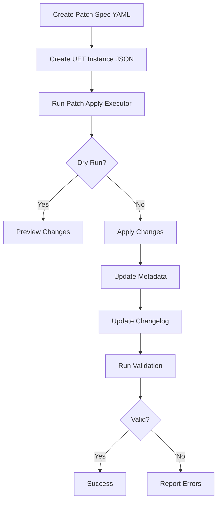

# Glossary UET Execution Patterns

**Purpose**: Universal Execution Templates (UET) for glossary operations
**Location**: `/UNIVERSAL_EXECUTION_TEMPLATES_FRAMEWORK/patterns/`
**Status**: ✅ Production Ready

---

## Overview

This directory contains UET execution patterns specifically designed for glossary operations, providing structured, validated, and auditable workflows for:

- **Patch Application** - Apply YAML patch specifications to glossary metadata
- **Validation** - Validate glossary structure, content, and quality
- **Term Addition** - Add new terms with proper metadata

All patterns follow the UET framework standards with JSON schemas, PowerShell executors, and comprehensive examples.

---

## Available Patterns

### 1. PAT-GLOSSARY-PATCH-APPLY-001

**Purpose**: Apply patch specifications to glossary metadata

**Executor**: `executors/glossary_patch_apply_executor.ps1`
**Schema**: `schemas/glossary_patch_apply.schema.json`
**Examples**: `examples/glossary/patch_apply_*.json`

**Use Cases**:
- Bulk updates to multiple terms
- Add schema references
- Update implementation paths
- Add related terms

**Features**:
- ✅ Dry-run preview mode
- ✅ Atomic updates (all or nothing)
- ✅ Automatic changelog generation
- ✅ Post-apply validation
- ✅ Detailed error reporting

**Example Usage**:
```powershell
# Dry run (preview changes)
.\executors\glossary_patch_apply_executor.ps1 `
  -InstancePath examples\glossary\patch_apply_dry_run.json

# Apply patch
.\executors\glossary_patch_apply_executor.ps1 `
  -InstancePath examples\glossary\patch_apply_live.json
```

**Instance Schema**:
```json
{
  "pattern_id": "PAT-GLOSSARY-PATCH-APPLY-001",
  "doc_id": "DOC-GLOSSARY-PATCH-APPLY-001",
  "inputs": {
    "project_root": "<path to repo>",
    "patch_spec_path": "example-add-schemas.yaml",
    "dry_run": false,
    "validate_after": true,
    "update_changelog": true
  }
}
```

**Outputs**:
```json
{
  "status": "success|failure|dry_run_complete",
  "patch_id": "01J5XY...",
  "terms_updated": 5,
  "changes_made": [...],
  "validation_passed": true,
  "execution_duration_seconds": 2.5,
  "errors": []
}
```

---

### 2. PAT-GLOSSARY-VALIDATE-001

**Purpose**: Validate glossary structure and content

**Executor**: `executors/glossary_validate_executor.ps1`
**Schema**: `schemas/glossary_validate.schema.json`
**Examples**: `examples/glossary/validate_*.json`

**Use Cases**:
- Pre-commit validation
- CI/CD quality gates
- Quality metrics reporting
- Orphaned term detection

**Validation Modes**:
- `full` - Complete validation (structure, content, cross-refs, quality)
- `quick` - Fast structure check only
- `orphans` - Find terms with no incoming links
- `paths` - Verify implementation paths exist

**Features**:
- ✅ Multiple validation modes
- ✅ Quality score calculation
- ✅ Detailed error/warning reporting
- ✅ Configurable failure thresholds
- ✅ Orphan detection

**Example Usage**:
```powershell
# Full validation
.\executors\glossary_validate_executor.ps1 `
  -InstancePath examples\glossary\validate_full.json

# Quick check
.\executors\glossary_validate_executor.ps1 `
  -InstancePath examples\glossary\validate_quick.json

# Find orphans
.\executors\glossary_validate_executor.ps1 `
  -InstancePath examples\glossary\validate_orphans.json
```

**Instance Schema**:
```json
{
  "pattern_id": "PAT-GLOSSARY-VALIDATE-001",
  "doc_id": "DOC-GLOSSARY-VALIDATE-001",
  "inputs": {
    "project_root": "<path to repo>",
    "validation_mode": "full|quick|orphans|paths",
    "fail_on_warnings": false
  }
}
```

**Outputs**:
```json
{
  "status": "success|warnings|failure",
  "total_terms": 79,
  "errors": [],
  "warnings": [],
  "orphaned_terms": [],
  "quality_score": 92,
  "execution_duration_seconds": 1.2
}
```

---

### 3. PAT-GLOSSARY-TERM-ADD-001

**Purpose**: Add new term to glossary

**Executor**: `executors/glossary_term_add_executor.ps1` *(Planned)*
**Schema**: `schemas/glossary_term_add.schema.json`
**Examples**: `examples/glossary/term_add_*.json` *(Planned)*

**Use Cases**:
- Add new glossary terms
- Auto-generate term IDs
- Update metadata
- Validate new term

**Features** *(Planned)*:
- ✅ Auto-generate unique term ID
- ✅ Add to glossary.md
- ✅ Add to metadata
- ✅ Update changelog
- ✅ Validate after addition

---

## File Structure

```
UNIVERSAL_EXECUTION_TEMPLATES_FRAMEWORK/patterns/
│
├── schemas/                              # JSON Schemas
│   ├── glossary_patch_apply.schema.json  # ✅ Patch application
│   ├── glossary_validate.schema.json     # ✅ Validation
│   └── glossary_term_add.schema.json     # ✅ Term addition
│
├── executors/                            # PowerShell executors
│   ├── glossary_patch_apply_executor.ps1 # ✅ Patch applicator
│   ├── glossary_validate_executor.ps1    # ✅ Validator
│   └── glossary_term_add_executor.ps1    # 🚧 Term adder (planned)
│
├── examples/glossary/                    # Example instances
│   ├── patch_apply_dry_run.json          # ✅ Dry run example
│   ├── validate_full.json                # ✅ Full validation
│   ├── validate_quick.json               # ✅ Quick validation
│   └── validate_orphans.json             # 🚧 Orphan check (to create)
│
└── README_GLOSSARY_PATTERNS.md           # This file
```

---

## Integration with Glossary System

### Glossary Automation Flow



### Workflow Example

1. **Create patch specification**:
   ```yaml
   # glossary/updates/add-schemas.yaml
   patch_id: "01J5XY..."
   description: "Add UET schema references"
   terms:
     - term_id: TERM-ENGINE-001
       action: add
       field: schema_refs
       value: ["schema/uet/execution_request.v1.json"]
   ```

2. **Create UET instance**:
   ```json
   {
     "pattern_id": "PAT-GLOSSARY-PATCH-APPLY-001",
     "inputs": {
       "project_root": "C:/path/to/repo",
       "patch_spec_path": "add-schemas.yaml",
       "dry_run": true
     }
   }
   ```

3. **Execute pattern**:
   ```powershell
   .\executors\glossary_patch_apply_executor.ps1 -InstancePath instance.json
   ```

4. **Review output**:
   ```json
   {
     "status": "dry_run_complete",
     "patch_id": "01J5XY...",
     "terms_updated": 1,
     "changes_made": [...]
   }
   ```

5. **Apply for real**:
   ```json
   { "inputs": { "dry_run": false } }
   ```

---

## CI/CD Integration

### GitHub Actions Example

```yaml
name: Glossary Patch Application

on:
  push:
    branches: [main]
    paths:
      - 'glossary/updates/*.yaml'

jobs:
  apply-patches:
    runs-on: windows-latest
    steps:
      - uses: actions/checkout@v3

      - name: Apply glossary patch
        run: |
          # Create UET instance
          $instance = @{
            pattern_id = "PAT-GLOSSARY-PATCH-APPLY-001"
            inputs = @{
              project_root = $env:GITHUB_WORKSPACE
              patch_spec_path = "latest-patch.yaml"
              dry_run = $false
              validate_after = $true
            }
          }
          $instance | ConvertTo-Json | Set-Content instance.json

          # Execute pattern
          .\UNIVERSAL_EXECUTION_TEMPLATES_FRAMEWORK\patterns\executors\glossary_patch_apply_executor.ps1 `
            -InstancePath instance.json
```

---

## Quality Gates

### Pre-Commit Validation

```powershell
# .git/hooks/pre-commit (PowerShell version)

if (git diff --cached --name-only | Select-String "glossary/") {
    $instance = @{
        pattern_id = "PAT-GLOSSARY-VALIDATE-001"
        inputs = @{
            project_root = (Get-Location).Path
            validation_mode = "quick"
            fail_on_warnings = $false
        }
    } | ConvertTo-Json

    $instance | Set-Content .tmp-validate-instance.json

    & .\UNIVERSAL_EXECUTION_TEMPLATES_FRAMEWORK\patterns\executors\glossary_validate_executor.ps1 `
        -InstancePath .tmp-validate-instance.json

    if ($LASTEXITCODE -ne 0) {
        Write-Error "Glossary validation failed"
        exit 1
    }
}
```

---

## Testing

### Test Pattern Execution

```powershell
# Test patch apply (dry run)
.\executors\glossary_patch_apply_executor.ps1 `
  -InstancePath examples\glossary\patch_apply_dry_run.json `
  -VerboseOutput

# Test validation
.\executors\glossary_validate_executor.ps1 `
  -InstancePath examples\glossary\validate_quick.json `
  -VerboseOutput
```

### Expected Output

**Successful Patch Apply (Dry Run)**:
```
Glossary Patch Apply Pattern Executor
=====================================

▶ S1: Loading pattern instance...
  ✓ Loaded instance from examples\glossary\patch_apply_dry_run.json
  ✓ Pattern ID validated
  ℹ Project root: C:/path/to/repo
  ℹ Patch spec: example-add-uet-schemas.yaml
  ℹ Dry run: True

▶ S2: Validating prerequisites...
  ✓ Glossary directory found
  ✓ Patch specification found
  ✓ Python available: Python 3.11.0
  ✓ pyyaml module available

▶ S3: Applying patch specification...
  ℹ Running in DRY RUN mode - no changes will be saved
  ✓ Patch ID: 01J5XY9F2X4E1D9RL8G4JB3CDE
  ✓ Terms updated: 5
  ℹ Dry run completed - review changes above

▶ S4: Generating execution output...
  ✓ Output saved to examples\glossary\output.json

=====================================
Execution Summary
=====================================
Status:        dry_run_complete
Patch ID:      01J5XY9F2X4E1D9RL8G4JB3CDE
Terms Updated: 5
Duration:      1.23s
=====================================
```

---

## Error Handling

### Common Errors

1. **Pattern ID Mismatch**
   ```
   ✗ Invalid pattern_id: Expected PAT-GLOSSARY-PATCH-APPLY-001, got PAT-XXX-001
   ```
   **Fix**: Ensure pattern_id in instance matches executor

2. **Missing Prerequisites**
   ```
   ✗ Python not found. Please install Python 3+
   ```
   **Fix**: Install Python and required modules

3. **Patch Specification Not Found**
   ```
   ✗ Patch specification not found: glossary/updates/missing.yaml
   ```
   **Fix**: Verify patch spec path is correct

4. **Validation Failed**
   ```
   ✗ Validation failed
   ```
   **Fix**: Review validation errors in output

---

## Best Practices

### Pattern Execution

1. **Always dry-run first**
   ```json
   { "inputs": { "dry_run": true } }
   ```

2. **Enable validation**
   ```json
   { "inputs": { "validate_after": true } }
   ```

3. **Use verbose output for debugging**
   ```powershell
   -VerboseOutput
   ```

4. **Review output.json**
   - Check status
   - Review errors
   - Verify changes

### Instance Files

1. **Use descriptive names**
   - `patch_apply_dry_run.json`
   - `validate_full.json`

2. **Store in organized structure**
   ```
   examples/glossary/
   ├── patch_apply_*.json
   ├── validate_*.json
   └── term_add_*.json
   ```

3. **Version control instances**
   - Commit examples
   - Document purpose

---

## Status

| Pattern | Schema | Executor | Examples | Status |
|---------|--------|----------|----------|--------|
| Patch Apply | ✅ | ✅ | ✅ | Production |
| Validate | ✅ | ✅ | ✅ | Production |
| Term Add | ✅ | 🚧 | 🚧 | Planned |

**Total**: 2/3 patterns complete and tested

---

## Support

**Documentation**:
- Pattern schemas in `schemas/`
- Executors in `executors/`
- Examples in `examples/glossary/`

**Issues**: Create GitHub issue with `uet-patterns` label

**Contact**: UET Framework team

---

**Last Updated**: 2025-11-25
**Version**: 1.0.0
**Status**: ✅ Production Ready
